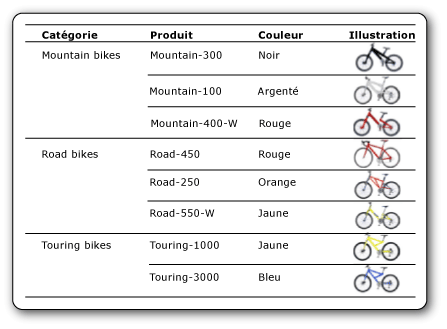

# Images [Générateur de rapports et SSRS]
  Une image est un élément de rapport qui contient une référence à une image qui est incorporée dans le rapport, stockée dans une base de données, stockée sur le serveur de rapports ou stockée à un autre emplacement sur le Web. Une image peut se répéter avec des lignes de données. Vous pouvez également utiliser une image en guise d'arrière-plan pour certains éléments de rapport.  
  
 Le stockage de logos sur un serveur est une bonne idée, car cela vous permet d'utiliser le même logo dans de nombreux rapports.  
  
> [!NOTE]  
>  [!INCLUDE[ssRBRDDup](../../includes/ssrbrddup-md.md)]  
  
##   Comparaison entre les images externes, les images incorporées et les images liées aux données  
 Si vous utilisez une image stockée sur le serveur ou une autre image externe dans un rapport, l'élément image contient un chemin d'accès pointant vers une image située sur le serveur de rapports ou à un emplacement sur le Web. Si vous utilisez une image incorporée, les données de l'image sont stockées dans la définition de rapport et elles n'existent pas sous la forme d'un fichier distinct.  
  
 Il convient d'utiliser des images stockées sur le serveur pour insérer des logos et des images statiques partagées par plusieurs rapports ou pages Web. En revanche, il est préférable de recourir à des images incorporées pour vous assurer qu'elles sont disponibles en permanence pour le rapport. Cependant, elles ne peuvent pas être partagées. Les définitions de rapports comportant des images externes sont plus petites que les définitions avec des images incorporées.  
  
 Les images liées aux données peuvent également être affichées à partir de données binaires stockées dans une base de données. Par exemple, les images qui jouxtent les noms de produits dans une liste de produits sont des images de base de données. Dans l'image suivante, les images des bicyclettes sont stockées dans une base de données et récupérées dans le rapport pour illustrer chaque produit.  
  
   
  
  
##   Images en tant que parties de rapport  
 Vous pouvez enregistrer des images hors d'un rapport en tant que parties de rapport. [!INCLUDE[ssRBrptparts](../../includes/ssrbrptparts-md.md)]  
  
  
##   Incorporation d'images  
 Vous pouvez incorporer des images dans un rapport de sorte que toutes les données de l'image soient stockées dans la définition de rapport. Lorsque vous incorporez une image, un encodage MIME lui est appliqué et elle est stockée sous la forme de texte dans la définition de rapport. L'incorporation garantit que l'image est toujours disponible pour le rapport, mais elle accroît la taille de la définition de rapport.  
  
 Pour plus d’informations sur l’incorporation d’une image, consultez [Incorporer une image dans un rapport &#40;Générateur de rapports et SSRS&#41;](../../reporting-services/report-design/embed-an-image-in-a-report-report-builder-and-ssrs.md).  
  
  
##   Images externes  
 Dans un rapport, vous pouvez inclure une image stockée, en spécifiant une URL pointant vers celle-ci. Lorsque vous utilisez une image externe dans un rapport, la source de l'image est définie à **External** et la valeur de l'image correspond à l'adresse URL ou au chemin d'accès de l'image.  
  
 Pour plus d’informations, consultez [Spécification de chemins d’accès à des éléments externes &#40;Générateur de rapports et SSRS&#41;](../../reporting-services/report-design/specifying-paths-to-external-items-report-builder-and-ssrs.md).  
  
 Lorsque le rapport est exécuté dans le Générateur de rapports ou dans le Concepteur de rapports, l'aperçu utilise les informations d'identification de l'utilisateur pour afficher l'image. Lorsque le rapport est exécuté sur le serveur de rapports, l'image dans le rapport peut ne pas s'afficher si les informations d'identification du serveur ne sont pas suffisantes pour accéder à l'image. Dans ce cas, contactez votre administrateur système.  
  
 Pour plus d’informations sur l’ajout d’une image externe à un rapport, consultez [Ajouter une image externe &#40;Générateur de rapports et SSRS&#41;](../../reporting-services/report-design/add-an-external-image-report-builder-and-ssrs.md).  
  
  
##   Images d'arrière-plan  
 Vous pouvez utiliser une image comme arrière-plan dans le corps du rapport ou dans un rectangle, une zone de texte, une liste, une matrice ou une table. Une image d'arrière-plan et une image possèdent des propriétés semblables. Vous pouvez également indiquer la manière dont l'image est reproduite pour occuper tout l'arrière-plan de l'élément.  
  
> [!NOTE]  
>  Certaines extensions de rendu, par exemple l'extension de rendu HTML, effectuent le rendu de l'image d'arrière-plan destinée au corps du rapport dans le corps, et dans l'en-tête et le pied de page. Vous pouvez définir une image d'arrière-plan différente pour l'en-tête et le pied de page, mais si aucune image n'est spécifiée, le rapport utilise celle du corps. D'autres extensions de rendu, comme Image, n'effectuent pas le rendu de l'image d'arrière-plan du corps dans l'en-tête et le pied de page.  
  
 Pour plus d’informations sur l’ajout d’une image d’arrière-plan, consultez [Ajouter une image d’arrière-plan &#40;Générateur de rapports et SSRS&#41;](../../reporting-services/report-design/add-a-background-image-report-builder-and-ssrs.md).  
  
  
##   Images liées aux données  
 Vous pouvez ajouter à votre rapport des images stockées dans une base de données. Pour cela, vous utilisez le même élément de rapport de type image que celui des images statiques, mais avec un ensemble de propriétés indiquant que l'image se trouve dans une base de données. Pour obtenir des instructions sur l’utilisation d’images liées à des données, consultez [Ajouter une image liée à des données &#40;Générateur de rapports et SSRS&#41;](../../reporting-services/report-design/add-a-data-bound-image-report-builder-and-ssrs.md).  
  
  
##   Rubriques de procédures  
 [Ajouter une image externe &#40;Générateur de rapports et SSRS&#41;](../../reporting-services/report-design/add-an-external-image-report-builder-and-ssrs.md)  
  
 [Incorporer une image dans un rapport &#40;Générateur de rapports et SSRS&#41;](../../reporting-services/report-design/embed-an-image-in-a-report-report-builder-and-ssrs.md)  
  
 [Ajouter une image d’arrière-plan &#40;Générateur de rapports et SSRS&#41;](../../reporting-services/report-design/add-a-background-image-report-builder-and-ssrs.md)  
  
 [Ajouter une image liée à des données &#40;Générateur de rapports et SSRS&#41;](../../reporting-services/report-design/add-a-data-bound-image-report-builder-and-ssrs.md)  
  
  
##  Voir aussi  
 [Exportation vers un fichier image &#40;Générateur de rapports et SSRS&#41;](../../reporting-services/report-builder/exporting-to-an-image-file-report-builder-and-ssrs.md)   
 [Comportements de rendu &#40;Générateur de rapports et SSRS&#41;](../../reporting-services/report-design/rendering-behaviors-report-builder-and-ssrs.md)  
  
  
