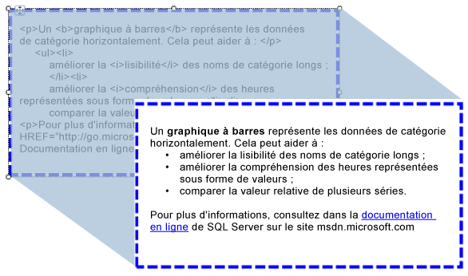

# Importation de données HTML dans un rapport (Générateur de rapports et SSRS)
  Vous pouvez utiliser une zone de texte pour insérer dans un rapport du texte au format HTML récupéré à partir de l'un des champs de votre dataset. Ce texte au format HTML peut être issu de toute expression simple ou complexe capable de transformer correctement des données au format HTML. Le texte ainsi mis en forme peut être converti dans tous les formats de sortie pris en charge, y compris au format PDF.  
  
   
  
 Cette illustration montre le texte au format HTML en mode création de rapport, ainsi que le rendu de ce même texte lors de l'exécution du rapport.  
  
> [!NOTE]  
>  Lorsque vous importez du texte qui contient des balises HTML, les données de ce texte doivent toujours être analysées en premier par la zone de texte où elles sont importées. Seul un sous-ensemble de balises HTML étant pris en charge, les données HTML affichées dans le rapport rendu peuvent différer des données HTML d'origine.  
  
 Pour une prise en main rapide, consultez [Didacticiel : mettre en forme du texte &#40;Générateur de rapports&#41;](../../reporting-services/tutorial-format-text-report-builder.md).  
  
> [!NOTE]  
>  [!INCLUDE[ssRBRDDup](../../includes/ssrbrddup-md.md)]  
  
## Balises HTML prises en charge  
 La liste suivante répertorie toutes les balises qui seront restituées sous forme de balises HTML lorsque définies comme texte de l'espace réservé :  
  
-   Liens hypertexte : \<A HREF>  
  
-   Polices : \  
  
-   Éléments d’en-tête, de style et de bloc : \<H{n}>, \
, \,\
, \
, \<LI>, \<HN>  
  
-   Format du texte : \<B>, \<I>, \<U>, \<S>  
  
-   Traitement des listes: \<OL>, \<UL>, \<LI>  
  
 Toutes les autres balises HTML ne seront pas prises en compte lorsque le rapport sera généré. Si le texte au format HTML de l'espace réservé représenté par son expression comporte des erreurs de langage, il apparaîtra au format texte simple. Aucune des balises HTML n'est sensible à la casse.  
  
 Si le texte de votre zone de texte contient uniquement un bloc de texte, toutes les données HTML de l'espace réservé définissant des éléments de bloc seront correctement restituées. Toutefois, si cette zone de texte contient plusieurs blocs de texte, les balises HTML seront ignorées et la structure du texte sera définie en fonction des blocs de texte.  
  
 Si plusieurs balises HTML sont définies pour le texte et que [!INCLUDE[ssRSnoversion](../../includes/ssrsnoversion-md.md)] détecte un conflit entre ces balises et les contraintes actuellement définies pour les rapports, seule la balise HTML la plus intérieure est traitée comme du code HTML.  
  
 Pour plus d’informations, consultez [Ajouter du code HTML à un rapport &#40;Générateur de rapports et SSRS&#41;](../../reporting-services/report-design/add-html-into-a-report-report-builder-and-ssrs.md).  
  
## Limites des attributs de feuille de style en cascade  
 Lors de l'utilisation d'attributs de feuille de style en cascade (CSS), seul un jeu principal de balises est défini. La liste suivante répertorie les attributs pris en charge :  
  
-   text-align, text-indent  
  
-   font-family  
  
-   font-size  
  
    -   Seules les valeurs de taille RDL valides, en unités de longueur CSS absolues sont prises en charge. Les unités prises en charge sont in, cm, mm, pt et pc.  
  
    -   Les unités de longueur CSS relatives sont ignorées et ne sont pas prises en charge. Les unités non prises en charge sont em, ex, px, %, rem.  
  
     Pour plus d’informations sur les unités CSS, consultez : [Référence des valeurs et unités CSS](http://msdn.microsoft.com/library/ms531211\(VS.85\).aspx) (http://msdn.microsoft.com/library/ms531211(VS.85).aspx).  
  
-   color  
  
-   padding, padding-bottom, padding-top, padding-right, padding-left  
  
-   font-weight  
  
 Voici quelques-uns des points à considérer lorsque vous utilisez des feuilles de style CSS :  
  
-   À l'instar des balises HTML erronées, les valeurs CSS incorrectes sont également ignorées.  
  
-   Lorsque des attributs de style CSS coexistent avec un attribut standard dans une même balise, la propriété CSS est prioritaire. Par exemple, si votre texte est **\
**, seul l’attribut text-align est appliqué, et le texte est aligné à droite.  
  
-   Dans le cadre des styles CSS et des attributs, lorsqu'une propriété est spécifiée à plusieurs reprises, seule la dernière instance spécifiée est prise en compte et appliquée. Par exemple, si votre texte est **\<p align="left" align="right"**, il est aligné à droite.  
  
##  Voir aussi  
 [Rendu au format HTML &#40;Générateur de rapports et SSRS&#41;](../../reporting-services/report-builder/rendering-to-html-report-builder-and-ssrs.md)  
  
  
