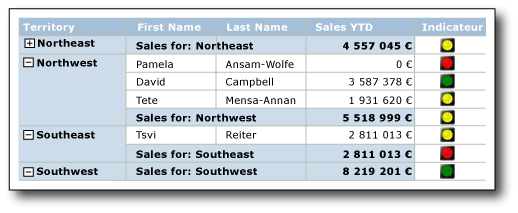
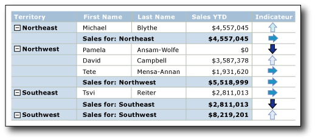

# Indicateurs (Générateur de rapports et SSRS)
  Dans un rapport paginé [!INCLUDE[ssRSnoversion_md](../../includes/ssrsnoversion-md.md)] , les indicateurs sont de petites jauges qui communiquent en un coup d’œil l’état d’une valeur de donnée unique. Les icônes qui représentent des indicateurs et leurs états sont simples et visuellement efficaces même lorsqu'elles sont utilisées dans les petites tailles.  
  
 Vous pouvez utiliser des indicateurs d'état dans vos rapports pour afficher les éléments suivants :  
  
-   **Tendances** à l’aide de flèches de tendance à la hausse, horizontale (pas de changement) ou de tendance à la baisse  
  
-   **État** à l’aide de symboles communément reconnus, tels que les coches et points d’exclamation  
  
-   **Conditions** à l’aide de formes communément reconnues, telles que les panneaux et feux de signalisation  
  
-   **Évaluations** à l’aide de formes et de symboles communément reconnus qui affichent la progression, tels que le nombre de quartiers dans un carré et des étoiles  
  
 Vous pouvez utiliser les indicateurs directement dans les tableaux de bord ou les rapports de forme libre, mais ils sont utilisés le plus souvent dans les tables ou les matrices pour visualiser des données dans les lignes ou les colonnes. Le diagramme suivant illustre une table avec un feu de signalisation qui indique les ventes de l'année par commercial et secteur.  
   
   
  
 [!INCLUDE[ssRSnoversion](../../includes/ssrsnoversion-md.md)] fournit des icônes d’indicateur et des jeux d’indicateurs intégrés à utiliser tels quels, et vous pouvez également personnaliser des icônes d’indicateur individuelles et des jeux d’indicateurs en fonction de vos besoins.  
  
 Pour plus d’informations sur l’utilisation des indicateurs comme indicateurs de performance clés, consultez [Didacticiel : ajout d’un indicateur de performance clé à un rapport &#40;Générateur de rapports&#41;](../../reporting-services/tutorial-adding-a-kpi-to-your-report-report-builder.md).  
  
> [!NOTE]  
>  Vous pouvez publier des indicateurs hors d'un rapport en tant que parties du rapport. En savoir plus sur les [Parties de rapports](../../reporting-services/report-design/report-parts-report-builder-and-ssrs.md).  
  
##   Comparaison des indicateurs aux jauges  
 Bien qu'ils semblent très différents, les indicateurs sont juste de simples jauges. Les indicateurs et les jauges affichent tous deux une valeur des données unique. Les principales différences résident dans le fait que les jauges comportent des éléments, tels que les cadres et pointeurs. Les indicateurs ont uniquement des états, des icônes et, éventuellement, des étiquettes. Les états d'indicateur sont semblables aux plages de jauge.  
  
 Comme les jauges, les indicateurs sont placés à l'intérieur d'un panneau de jauge. Quand vous souhaitez configurer un indicateur à l’aide de la boîte de dialogue **Propriétés des indicateurs** ou du volet Propriétés, vous devez sélectionner l’indicateur plutôt que le panneau. Sinon, les options disponibles s'appliquent aux options du panneau de jauge et vous ne pouvez pas configurer l'indicateur. L'image suivante illustre un indicateur sélectionné dans son panneau de jauge.  
  
   
  
 Selon la façon dont vous souhaitez représenter la valeur des données, les jauges peuvent être plus efficaces que les indicateurs. Pour plus d’informations, consultez [Jauges &#40;Générateur de rapports et SSRS&#41;](../../reporting-services/report-design/gauges-report-builder-and-ssrs.md).  
  
##   Choix du type d'indicateur à utiliser  
 L'utilisation du jeu d'indicateurs approprié permet de communiquer instantanément la signification des données, si les données sont dans une ligne de détails ou dans un groupe de lignes ou de colonnes dans une table ou matrice, ou seules dans le corps du rapport ou tableau de bord. Les jeux d'indicateurs intégrés ont trois icônes ou plus. Les icônes peuvent varier selon la forme, la couleur, ou les deux à la fois. Chaque icône communique un état des données différent.  
  
 Le tableau suivant répertorie les jeux d'indicateurs intégrés et décrit certaines de leurs utilisations courantes.  
  
|Jeu d'indicateurs|Type d'indicateur|  
|-------------------|--------------------|  
||Directionnel : indique les tendances à l'aide de flèches vers le haut, horizontale (pas de changement), de tendance à la hausse ou de tendance à la baisse.|  
||Symboles : indique les états à l'aide de symboles communément reconnus, tels que les coches et points d'exclamation.|  
||Forme : indique les conditions à l'aide de formes communément reconnues, telles que les panneaux de signalisation et les losanges.|  
||Évaluations : indique les évaluations à l'aide de formes et de symboles communément reconnus qui affichent les valeurs de progression, tels que le nombre de quartiers dans un carré.|  
  
 Après avoir choisi un jeu d'indicateurs, vous pouvez personnaliser l'apparence de chaque icône d'indicateur dans le jeu en définissant ses propriétés dans les boîtes de dialogue pour les indicateurs ou le volet Propriétés. Vous pouvez utiliser les couleurs, icônes et tailles ou expressions intégrées pour configurer des indicateurs.  
  
##   Personnalisation des indicateurs  
 Les indicateurs peuvent être personnalisés en fonction de vos besoins. Vous pouvez modifier les jeux d'indicateurs ainsi qu'une icône d'indicateur individuelle dans un jeu des façons suivantes :  
  
-   Modifiez les couleurs des icônes d'indicateur. Par exemple, vous pouvez choisir un modèle de couleurs monochromatique pour le jeu d'indicateurs ou utiliser des couleurs autres que celles par défaut.  
  
-   Modifiez l'icône dans le jeu d'indicateurs. Par exemple, vous pouvez utiliser des icônes de type étoile, cercle et carré dans un jeu d'indicateurs.  
  
-   Spécifiez les valeurs de début et de fin pour un indicateur. Par exemple, vous pouvez incliner l'affichage des données en utilisant une icône pour 75 pour cent des valeurs d'indicateur.  
  
-   Ajoutez des icônes au jeu d'indicateurs. Par exemple, vous pouvez ajouter des icônes supplémentaires aux jeux d'indicateurs pour différencier les valeurs d'indicateur d'une façon plus détaillée.  
  
-   Supprimez des icônes du jeu d'indicateurs pour simplifier l'affichage des données en n'utilisant que quelques icônes.  
  
 Pour plus d’informations, consultez [Modifier les icônes d’indicateur et jeux d’indicateurs &#40;Générateur de rapports et SSRS&#41;](../../reporting-services/report-design/change-indicator-icons-and-indicator-sets-report-builder-and-ssrs.md).  
  
##   Utilisation d'indicateurs dans les tables et les matrices  
 Les formes simples des indicateurs les rendent idéaux pour une utilisation dans les tables et les matrices. Les indicateurs sont efficaces même dans les petites tailles. Cela les rend utiles dans les lignes de détails ou de groupes des rapports.  
  
 Le diagramme suivant montre un rapport avec une table qui utilise le jeu d’indicateurs directionnels, **4 flèches (en couleur)**, pour indiquer les ventes. Les icônes d'indicateur dans le rapport sont configurées pour utiliser des nuances de bleu au lieu des couleurs par défaut : rouge, jaune et vert.  
  
   
  
 Pour plus d’informations sur l’ajout, la modification et la suppression des indicateurs, consultez [Ajouter ou supprimer un indicateur &#40;Générateur de rapports et SSRS&#41;](../../reporting-services/report-design/add-or-delete-an-indicator-report-builder-and-ssrs.md).  
  
 Lorsque vous ajoutez pour la première fois un indicateur à un rapport, il est configuré pour utiliser les valeurs par défaut. Vous pouvez alors modifier les valeurs afin que l'indicateur représente les données comme vous le souhaitez. Vous pouvez modifier l'apparence des icônes d'indicateur, la façon dont l'indicateur choisit l'icône à utiliser et les icônes utilisées par un jeu d'indicateurs. Pour plus d’informations, consultez [Modifier les icônes d’indicateur et jeux d’indicateurs &#40;Générateur de rapports et SSRS&#41;](../../reporting-services/report-design/change-indicator-icons-and-indicator-sets-report-builder-and-ssrs.md).  
  
 Par défaut, les indicateurs sont configurés pour utiliser des pourcentages comme unité de mesure et détecter automatiquement les valeurs maximales et minimales des données. Chaque icône du jeu d'indicateurs a une plage de pourcentages. Le nombre de plages de pourcentages dépend du nombre d'icônes dans le jeu d'icônes : toutefois, les plages sont de la même taille et sont séquentielles. Par exemple, si le jeu d'icônes a cinq icônes, il y a cinq plages de pourcentages qui représentent chacune 20 pour cent de la taille totale. La première plage démarre à 0 et se termine à 20, la deuxième plage démarre à 20 et se termine à 40, et ainsi se suite. L'indicateur du rapport utilise l'icône du jeu d'indicateurs qui a une plage de pourcentages dans laquelle figure la valeur des données de l'indicateur. Vous pouvez modifier la plage de pourcentages de chaque icône du jeu. Les valeurs minimales et maximales peuvent être définies explicitement à l'aide d'une valeur ou d'une expression. Vous pouvez modifier l'unité de mesure en la remplaçant par une valeur numérique. Dans ce cas, vous ne spécifiez pas de valeur minimale ou maximale pour les données. À la place, vous fournissez uniquement les valeurs de début et de fin pour chaque icône utilisé par l'indicateur. Pour plus d’informations, consultez [Définir et configurer des unités de mesure &#40;Générateur de rapports et SSRS&#41;](../../reporting-services/report-design/set-and-configure-measurement-units-report-builder-and-ssrs.md).  
  
 Les indicateurs transmettent les valeurs des données en synchronisant des valeurs des données d'indicateur dans une étendue spécifiée. Par défaut, l'étendue est le conteneur parent de l'indicateur, tel que la table ou matrice qui contient l'indicateur. Vous pouvez modifier la synchronisation de l'indicateur en choisissant une étendue différente, selon la disposition de votre rapport. L'indicateur peut omettre la synchronisation. Pour plus d’informations, consultez [Définir l’étendue de synchronisation &#40;Générateur de rapports et SSRS&#41;](../../reporting-services/report-design/set-synchronization-scope-report-builder-and-ssrs.md).  
  
 Pour obtenir des informations générales sur le fonctionnement et la définition de l’étendue dans les rapports, consultez [Étendue des expressions pour les totaux, les agrégats et les collections intégrées &#40;Générateur de rapports et SSRS&#41;](../../reporting-services/report-design/expression-scope-for-totals-aggregates-and-built-in-collections.md).  
  
 Les indicateurs utilisent uniquement une valeur unique. Si vous devez afficher plusieurs valeurs de données, utilisez un graphique sparkline ou une barre de données au lieu d'un indicateur. Ils peuvent représenter plusieurs valeurs des données mais sont également simples, faciles à comprendre à des petites tailles et fonctionnent correctement dans les tables et les matrices. Pour plus d’informations, consultez [Graphiques sparkline et barres de données &#40;Générateur de rapports et SSRS&#41;](../../reporting-services/report-design/sparklines-and-data-bars-report-builder-and-ssrs.md).  
  
##   Dimensionnement des indicateurs pour optimiser l'impact visuel  
 Outre la couleur, la direction et la forme, vous pouvez utiliser la taille pour optimiser l'impact visuel des indicateurs. Imaginez un rapport qui utilise des indicateurs pour illustrer la satisfaction des clients avec différents types de bicyclettes. L'icône que l'indicateur utilise peut être configurée selon des tailles différentes en fonction de la satisfaction des clients. Plus la satisfaction est grande, plus l'icône qui s'affiche dans le rapport est grande. L'image suivante affiche un rapport des ventes de bicyclettes et les tailles de l'icône reflètent le montant des ventes.  
  
 Vous utilisez des expressions pour définir de façon dynamique la taille des étoiles selon les valeurs de champ utilisées par l'indicateur. Pour plus d’informations, consultez [Spécifier la taille d’un indicateur à l’aide d’une expression &#40;Générateur de rapports et SSRS&#41;](../../reporting-services/report-design/specify-the-size-of-an-indicator-using-an-expression-report-builder-and-ssrs.md).  
  
 Pour en savoir plus sur la création et l’utilisation d’expressions, consultez [Expressions &#40;Générateur de rapports et SSRS&#41;](../../reporting-services/report-design/expressions-report-builder-and-ssrs.md).  
  
##   Insertion d'indicateurs et de jauges dans les panneaux de jauge  
 Les indicateurs sont toujours placés à l'intérieur d'un panneau de jauge. Le panneau de jauge est un conteneur de niveau supérieur qui peut inclure une ou plusieurs jauges et des indicateurs d'état. Le panneau de jauge peut contenir des indicateurs ou des jauges enfants ou adjacents. Si vous utilisez un indicateur en tant qu'enfant d'une jauge, vous pouvez davantage visualiser les données en affichant l'état de la valeur des données affichée dans la jauge. Par exemple, un indicateur dans une jauge peut afficher un cercle vert pour indiquer que la valeur vers laquelle la jauge pointe figure dans les 33 pour cent supérieurs de la plage de valeurs. En utilisant côte à côte une jauge et un indicateur, vous pouvez représenter les données de différentes façons. Dans les deux cas, l'indicateur et la jauge peuvent utiliser des champs de données identiques ou différents.  
  
 Le diagramme suivant illustre un indicateur côte à côte avec une jauge et dans une jauge.  
  
   
  
 Pour plus d’informations, consultez [Inclure des indicateurs et des jauges dans un panneau de jauge &#40;Générateur de rapports et SSRS&#41;](../../reporting-services/report-design/include-indicators-and-gauges-in-a-gauge-panel-report-builder-and-ssrs.md).  
  
 Pour plus d’informations sur l’utilisation de jauges, consultez [Jauges &#40;Générateur de rapports et SSRS&#41;](../../reporting-services/report-design/gauges-report-builder-and-ssrs.md).  
  
##   Séquence d'états d'indicateur  
 La séquence des états d’indicateur sous l’onglet **Valeur et états** de la boîte de dialogue **Propriétés de l’indicateur** détermine l’icône d’indicateur affichée pour une valeur de données quand les valeurs de début et de fin des états d’indicateur se chevauchent.  
  
 Cela peut se produire si vous utilisez l'unité de mesure des états de type pourcentage ou numérique. C'est plus probable si vous utilisez l'unité de mesure numérique car vous fournissez des valeurs spécifiques pour cette mesure. C'est également le cas lorsque vous arrondissez les valeurs des données du rapport car cela a tendance à rendre les valeurs moins discrètes.  
  
 Les scénarios suivants décrivent comment la visualisation des données est affectée quand vous modifiez la séquence des trois états de l’indicateur directionnel **3 flèches (en couleur)** . Par défaut la séquence est :  
  
1.  Flèche vers le bas rouge  
  
2.  Flèche jaune horizontale  
  
3.  Flèche vers le haut verte  
  
 Les scénarios suivants indiquent quatre séquences différentes d'état et leurs plages de valeurs et la façon dont les séquences affectent la visualisation des données.  
  
 Dans ces scénarios, l’indicateur **3 flèches (en couleur)** utilise des mesures d’état numériques.  
  
|Séquence d'état|Valeur de début|Valeur de fin|  
|--------------------|-----------------|---------------|  
|Rouge|0|3500|  
|Jaune|3500|5000|  
|Vert|5000|10000|  
  
 La flèche vers le bas rouge représente la valeur 3500 et la flèche horizontale jaune, 5000.  
  
|Séquence d'état|Valeur de début|Valeur de fin|  
|--------------------|-----------------|---------------|  
|Vert|5000|10000|  
|Jaune|3500|5000|  
|Rouge|0|3500|  
  
 La flèche horizontale jaune représente la valeur 3500 et la flèche vers le haut verte, 5000.  
  
|Séquence d'état|Valeur de début|Valeur de fin|  
|--------------------|-----------------|---------------|  
|Vert|5000|10000|  
|Rouge|0|3500|  
|Jaune|3500|5000|  
  
 La flèche vers le bas rouge représente la valeur 3500 et la flèche vers le haut verte, 5000.  
  
|Séquence d'état|Valeur de début|Valeur de fin|  
|--------------------|-----------------|---------------|  
|Jaune|3500|5000|  
|Rouge|0|3500|  
|Vert|5000|10000|  
  
 La flèche vers le bas jaune représente maintenant les deux valeurs 3500 et 5000.  
  
 En résumé, l'évaluation commence et le haut de la liste d'états de l'indicateur ainsi que le rapport affichent l'icône d'indicateur associée au premier état d'indicateur qui a une plage de valeurs pouvant contenir les données. En modifiant l'ordre des états d'indicateur vous pouvez donc affecter la visualisation des valeurs de données.  
  
##   Rubriques de procédures  
 Cette section répertorie les procédures qui vous indiquent comment ajouter, modifier et supprimer des indicateurs, configurer et personnaliser des indicateurs et utiliser des indicateurs dans les jauges.  
  
-   [Ajouter ou supprimer un indicateur &#40;Générateur de rapports et SSRS&#41;](../../reporting-services/report-design/add-or-delete-an-indicator-report-builder-and-ssrs.md)  
  
-   [Modifier les icônes d’indicateur et jeux d’indicateurs &#40;Générateur de rapports et SSRS&#41;](../../reporting-services/report-design/change-indicator-icons-and-indicator-sets-report-builder-and-ssrs.md)  
  
-   [Définir et configurer des unités de mesure &#40;Générateur de rapports et SSRS&#41;](../../reporting-services/report-design/set-and-configure-measurement-units-report-builder-and-ssrs.md)  
  
-   [Définir l’étendue de synchronisation &#40;Générateur de rapports et SSRS&#41;](../../reporting-services/report-design/set-synchronization-scope-report-builder-and-ssrs.md)  
  
-   [Spécifier la taille d’un indicateur à l’aide d’une expression &#40;Générateur de rapports et SSRS&#41;](../../reporting-services/report-design/specify-the-size-of-an-indicator-using-an-expression-report-builder-and-ssrs.md)  
  
-   [Inclure des indicateurs et des jauges dans un panneau de jauge &#40;Générateur de rapports et SSRS&#41;](../../reporting-services/report-design/include-indicators-and-gauges-in-a-gauge-panel-report-builder-and-ssrs.md)  
  
##  Voir aussi  
 [Jauges &#40;Générateur de rapports et SSRS&#41;](../../reporting-services/report-design/gauges-report-builder-and-ssrs.md)   
 [Graphiques sparkline et barres de données &#40;Générateur de rapports et SSRS&#41;](../../reporting-services/report-design/sparklines-and-data-bars-report-builder-and-ssrs.md)   
 [Graphiques (Générateur de rapports et SSRS)](../../reporting-services/report-design/charts-report-builder-and-ssrs.md)  
  
  
