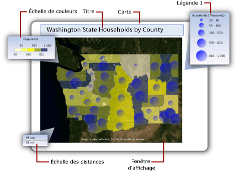
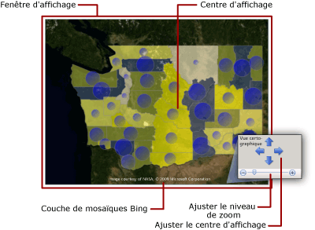
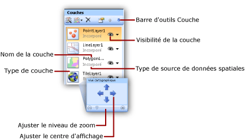

# Cartes (Générateur de rapports et SSRS)
  Pour visualiser des données métier sur un arrière-plan géographique, vous pouvez ajouter une carte à votre rapport paginé [!INCLUDE[ssRSnoversion_md](../../includes/ssrsnoversion-md.md)] . Le type de carte que vous sélectionnez dépend des informations que vous souhaitez communiquer dans votre rapport. Vous pouvez ajouter une carte qui affiche uniquement des emplacements géographiques, ou une carte à bulles dans laquelle la taille des bulles varie en fonction du nombre de ménages habitant dans une zone, ou une carte à marqueurs faisant varier le style de marqueur en fonction du produit ayant le plus gros chiffre d'affaires pour chaque magasin, ou encore une carte linéaire pour afficher des itinéraires entre des magasins.  
  
 Une carte contient un titre, une fenêtre d'affichage qui spécifie le point central d'affichage et l'échelle, un arrière-plan facultatif de mosaïques Bing pour la fenêtre d'affichage, une ou plusieurs couches affichant des données spatiales, ainsi que diverses légendes pour aider les utilisateurs à interpréter les visualisations des données. L'illustration ci-dessous montre les parties principales d'une carte.  
  
   
  
 Pour commencer immédiatement à utiliser une carte, consultez [Didacticiel : Rapport cartographique &#40;Générateur de rapports&#41;](../../reporting-services/tutorial-map-report-report-builder.md) ou [Exemples de rapports (Générateur de rapports et SSRS)](http://go.microsoft.com/fwlink/?LinkId=198283).  
  
> [!NOTE]  
>  Vous pouvez enregistrer des cartes hors d’un rapport en tant que parties de rapports. En savoir plus sur les [Parties de rapports](../../reporting-services/report-design/report-parts-report-builder-and-ssrs.md).  
  
##   Ajout d'une carte à votre rapport  
 Pour ajouter une carte à votre rapport, suivez les étapes générales répertoriées ci-dessous :  
  
-   Déterminez les données analytiques que vous souhaitez afficher et les types de données spatiales dont vous avez besoin. Par exemple, pour afficher des chiffres des ventes annuels relatifs de magasins sur une carte à bulles, vous avez besoin des noms des magasins et de leurs chiffres des ventes comme données analytiques, et des noms et emplacements des magasins en latitude et longitude comme données spatiales.  
  
-   Choisissez le style de carte souhaité. Les cartes simples affichent uniquement les emplacements. Les cartes à bulles font varier la taille des bulles en fonction d'une valeur analytique unique. Les cartes analytiques en couleur font varier des éléments cartographiques en fonction de plages de données analytiques. Le style que vous sélectionnez dépend à la fois des données que vous souhaitez visualiser et du type de données spatiales utilisé.  
  
-   Recueillez les informations nécessaires pour spécifier les sources de données spatiales, les données spatiales, les sources de données analytiques et les données analytiques. Vous devez spécifier les chaînes de connexion aux sources de données spatiales, définir le type de données spatiales dont vous avez besoin et vérifier que vos données de rapport incluent des champs de correspondance associant les données spatiales et les données analytiques.  
  
-   Exécutez l'Assistant Carte pour ajouter une carte à votre rapport. Cela ajoute la première couche à la carte. Exécutez l'Assistant Couche pour créer d'autres couches ou modifier des couches existantes. Les Assistants facilitent le processus de démarrage. Pour plus d’informations, consultez [Assistant Carte et Assistant Couche &#40;Générateur de rapports et SSRS&#41;](../../reporting-services/report-design/map-wizard-and-map-layer-wizard-report-builder-and-ssrs.md).  
  
-   Après avoir affiché un aperçu de la carte dans votre rapport, vous souhaiterez probablement ajuster la vue cartographique, modifier la façon dont vos données font varier l'affichage de chaque couche, créer des légendes pour aider vos utilisateurs à interpréter les données et modifier la résolution pour offrir à vos utilisateurs une meilleure qualité d'affichage.  
  
 Pour plus d’informations, consultez [Planifier un rapport cartographique &#40;Générateur de rapports et SSRS&#41;](../../reporting-services/report-design/plan-a-map-report-report-builder-and-ssrs.md).  
  
##   Ajout de données à une carte  
 Une carte utilise deux types de données : des données spatiales et des données analytiques. Les données spatiales définissent l'apparence de la carte, tandis que les données analytiques fournissent les valeurs associées à la carte. Par exemple, les données spatiales définissent les emplacements des villes dans une région, alors que les données analytiques fournissent la population de chaque ville.  
  
 Une carte doit avoir des données spatiales ; les données analytiques sont facultatives. Par exemple, vous pouvez ajouter une carte qui affiche uniquement les emplacements de magasins dans une ville.  
  
 Pour visualiser des données sur une carte, les données analytiques et les données spatiales doivent être en relation. Lorsque les données spatiales et les données analytiques proviennent de la même source, la relation est connue. Lorsqu'elles proviennent de sources différentes, vous devez spécifier des champs de correspondance pour les mettre en relation.  
  
### Données spatiales  
 Les données spatiales consistent en des jeux de coordonnées. Les données spatiales d'une source de données peuvent être un point unique, plusieurs points, une ligne unique, plusieurs lignes ou un jeu de polygones. Chaque jeu de coordonnées définit un *élément cartographique*, par exemple un polygone représentant la carte d'un district, une ligne représentant une route ou un point représentant l'emplacement d'une ville.  
  
 Les données spatiales sont basées sur l'un des systèmes de coordonnées suivants :  
  
-   **Géographique** Spécifie des coordonnées géodésiques sur une surface sphérique à l'aide des valeurs de longitude et de latitude. Lorsque les données spatiales sont géographiques, une projection doit être spécifiée. Une projection est un jeu de règles spécifiant comment dessiner des objets qui ont des coordonnées sphériques sur une surface planaire. Seules les données géographiques utilisant la même projection peuvent être comparées ou combinées.  
  
-   **Planaire** Spécifie des coordonnées géométriques sur une surface planaire à l'aide de X et Y.  
  
 Chaque couche affiche un type de données spatiales : polygones, lignes ou points. Pour afficher plusieurs types de données spatiales, ajoutez plusieurs couches à la carte. Vous pouvez également ajouter une couche de mosaïques Microsoft Bing. La couche de mosaïques ne dépend pas des données spatiales. Elle affiche des mosaïques d'images correspondant aux coordonnées du point de vue de la carte.  
  
#### Sources de données spatiales  
 Les sources de données spatiales suivantes sont prises en charge :  
  
-   **Rapports de la bibliothèque de cartes.** Les données spatiales sont incorporées dans les rapports situés dans la bibliothèque de cartes. Par défaut, la bibliothèque de cartes est située dans *\<lecteur>*:\Program Files\Microsoft SQL Server\Report Builder\MapGallery.  
  
    > [!NOTE]  
    >  Cette fonctionnalité de cartographie [!INCLUDE[ssRSnoversion](../../includes/ssrsnoversion-md.md)] utilise des données de fichiers de forme TIGER/Line gracieusement fournis par Bureau de recensement ([http://www.census.gov/](http://www.census.gov/)). Les fichiers de forme TIGER/Line sont un extrait d'informations géographiques et cartographiques sélectionnées de la base de données MAF/TIGER du Bureau de recensement. Ces fichiers sont mis à disposition gratuitement par le Bureau de recensement. Pour plus d’informations sur les fichiers de forme TIGER/Line, consultez [http://www.census.gov/geo/www/tiger](http://www.census.gov/geo/www/tiger). Les informations de frontières dans les fichiers de forme TIGER/Line sont fournies à des fins de collecte et de tabulation de données statistiques uniquement ; leur description et leur désignation pour des objectifs statistiques ne constituent pas une détermination d'autorité juridictionnelle ou de droits de propriété et les informations ne constituent pas des descriptions juridiquement valables. Census TIGER et TIGER/Line sont des marques déposées du Bureau de recensement des États-Unis.  
  
-   **Fichiers de forme ESRI.** Les fichiers de forme ESRI contiennent des données conformes au format de données spatiales ESRI (Environmental Systems Research Institute, Inc.). Les fichiers de forme ESRI font référence à un jeu de fichiers. Les données enregistrées dans le fichier .shp spécifient des formes géographiques ou géométriques. Les données du fichier .dbf fournissent des attributs pour ces formes. Pour afficher un plan en mode Conception ou pour exécuter un plan à partir du serveur de rapports, les deux fichiers doivent être dans le même dossier. Lorsque vous ajoutez des données spatiales d'un fichier .shp sur votre système de fichiers local, les données spatiales sont incorporées dans votre rapport. Pour récupérer dynamiquement des données spatiales au moment de l'exécution, téléchargez les fichiers de forme sur votre serveur de rapports, puis spécifiez-les comme source pour les données spatiales. Pour plus d’informations, consultez [Rechercher des fichiers de forme ESRI pour une carte](http://go.microsoft.com/fwlink/?linkid=178814).  
  
-   **Données spatiales SQL Server stockées dans une base de données.** Vous pouvez utiliser une requête qui spécifie les types de données **SQLGeometry** ou **SQLGeography** dans une base de données relationnelle [!INCLUDE[ssNoVersion](../../includes/ssnoversion-md.md)] . Pour plus d’informations, consultez [Présentation des types de données spatiales](../../relational-databases/spatial/spatial-data-types-overview.md) dans la [documentation en ligne de SQL Server](http://go.microsoft.com/fwlink/?linkid=98335).  
  
     Dans le jeu de résultats affiché dans le concepteur de requêtes, chaque ligne de données spatiales est traitée comme une unité et stockée dans un élément cartographique unique. Par exemple, si plusieurs points sont définis dans une ligne dans le jeu de résultats, les propriétés d'affichage s'appliquent à tous les points de cet élément cartographique.  
  
-   **Emplacements personnalisés que vous créez.** Vous pouvez ajouter manuellement des emplacements en tant que points incorporés à une couche de points incorporés. Pour plus d’informations, consultez [Ajouter des emplacements personnalisés à une carte &#40;Générateur de rapports et SSRS&#41;](../../reporting-services/report-design/add-custom-locations-to-a-map-report-builder-and-ssrs.md).  
  
#### Données spatiales en mode Conception  
 En mode Conception, le processeur de rapports affiche des exemples de données spatiales pour vous aider à concevoir la couche. Les données affichées dépendent de la disponibilité des données spatiales :  
  
-   **Données incorporées.** Les exemples de données sont récupérés d'éléments cartographiques incorporés dans les couches de votre rapport.  
  
-   **Lien à un fichier de forme ESRI.** Si le fichier de forme ESRI (.shp) et le fichier de support (.dbf) sont disponibles, les exemples de données sont chargés à partir du fichier de forme. Dans le cas contraire, le processeur de rapports génère les exemples de données et affiche le message **Absence de données spatiales disponibles**.  
  
-   **Données spatiales SQL Server.** Si la source de données est disponible et que les informations d'identification sont valides, les exemples de données sont chargés à partir des données spatiales dans la base de données. Dans le cas contraire, le processeur de rapports génère les exemples de données et affiche le message **Absence de données spatiales disponibles**.  
  
#### Données spatiales incorporées dans la définition de rapport  
 Contrairement aux données analytiques, vous avez l'option d'incorporer des données spatiales pour une couche dans la définition de rapport. Lorsque vous incorporez des données spatiales, vous incorporez des éléments cartographiques utilisés dans la couche.  
  
 Les éléments incorporés augmentent la taille de la définition de rapport, mais garantissent que les données spatiales sont toujours disponibles lors de l'exécution du rapport, que ce soit dans l'aperçu ou sur le serveur de rapports. Un volume plus important de données signifie plus de stockage et des temps de traitement plus longs. Il est toujours recommandé de limiter les données spatiales, comme les autres données du rapport, aux informations nécessaires pour votre rapport.  
  
#### Contrôle de la résolution de la carte à l'exécution  
 Lorsque vous modifiez la résolution des données spatiales, vous spécifiez le niveau de détail des lignes dessinées sur la carte. Par exemple, pour une région, avez-vous besoin d'une granularité jusqu'à cent mètres de la surface du sol, ou un kilomètre est-il suffisant ?  
  
 Si les données spatiales sont incorporées dans le rapport, la résolution utilisée affecte le nombre d'éléments cartographiques inclus dans la définition de rapport. Une résolution plus élevée augmente le nombre d'éléments nécessaires pour dessiner des bordures à cette résolution. Si les données spatiales ne sont pas incorporées dans le rapport, le serveur de rapports calcule les lignes nécessaires pour dessiner les bordures à cette résolution chaque fois que vous affichez le rapport. Pour concevoir un rapport offrant un compromis entre la résolution de l'affichage et un temps de rendu acceptable, simplifiez la résolution de la carte au niveau de détail dont vous avez besoin dans votre rapport pour visualiser vos données analytiques.  
  
### Données analytiques  
 Les données analytiques sont les données que vous souhaitez visualiser sur la carte, par exemple la population d'une ville ou le total des ventes d'un magasin. Les données analytiques peuvent provenir de l'une des sources suivantes :  
  
-   **Champ de dataset.** Un champ d'un dataset dans le volet des données de rapport.  
  
-   **Champ de source de données spatiales.** Champ de la source de données spatiales incluse avec les données spatiales. Par exemple, un fichier de forme ESRI inclut fréquemment à la fois des données spatiales et analytiques. Les noms de champs de la source de données spatiales commencent par # et s'affichent dans la liste déroulante de champs lorsque vous spécifiez le champ de données pour les règles d'une couche.  
  
-   **Données incorporées pour un élément cartographique.** Après avoir incorporé des polygones, des lignes ou des points dans un rapport, vous pouvez remplacer les champs de données d'éléments cartographiques individuels et définir des valeurs personnalisées.  
  
 Quand vous spécifiez des règles pour une couche et que vous sélectionnez le champ de données analytiques, si le type de données est numérique, le processeur de rapports utilise automatiquement la fonction par défaut Sum pour calculer des valeurs agrégées pour l’élément cartographique. Si le champ n’est pas numérique, aucune fonction d’agrégation n’est spécifiée et la fonction d’agrégation First implicite est utilisée. Pour modifier l'expression par défaut, modifiez les options des règles de cette couche. Pour plus d’informations, consultez [Modifier l’affichage des polygones, des lignes et des points à l’aide de règles et de données analytiques &#40;Générateur de rapports et SSRS&#41;](../../reporting-services/report-design/vary-polygon-line-and-point-display-by-rules-and-analytical-data.md).  
  
### Champs de correspondance  
 Pour mettre en relation des données analytiques avec des éléments cartographiques d'une couche, vous devez spécifier des *champs de correspondance*. Les champs de correspondance sont utilisés pour générer une relation entre les éléments cartographiques et les données analytiques. Vous pouvez utiliser un ou plusieurs champs pour la correspondance, à condition qu'ils spécifient une valeur analytique unique pour chaque emplacement spatial.  
  
 Par exemple, les données suivantes sont requises pour une carte à bulles qui fait varier la taille des bulles en fonction de la population des villes :  
  
-   De la source de données spatiales :  
  
    -   **SpatialData.** Champ contenant des données spatiales qui spécifient la latitude et la longitude de la ville.  
  
    -   **Name.** Champ spécifiant le nom de la ville.  
  
    -   **Area.** Champ spécifiant le nom de la région.  
  
-   De la source de données analytiques :  
  
    -   **Population.** Champ spécifiant la population de la ville.  
  
    -   **City.** Champ spécifiant le nom de la ville.  
  
    -   **Area.** Champ spécifiant le nom du secteur, de l'état ou de la région.  
  
 Dans cet exemple, le nom de ville seul n'est pas suffisant pour identifier la population de façon unique. Par exemple, il existe plusieurs villes nommées Albany aux États-Unis. Pour nommer une ville spécifique, vous devez spécifier la région en plus du nom de ville.  
  
##   Fonctionnement du point de vue de la carte  
 Après avoir spécifié des données cartographiques pour un rapport, vous pouvez limiter la zone d'affichage de la carte en spécifiant une *fenêtre d'affichage*de la carte. Par défaut, la fenêtre de carte représente la même zone que l'ensemble de la carte. Pour rogner la carte, vous pouvez spécifier le centre, le niveau de zoom et les coordonnées minimale et maximale qui définissent la zone à inclure dans votre rapport. Pour améliorer l'affichage de la carte dans le rapport, vous pouvez déplacer les légendes, l'échelle des distances et l'échelle de couleurs à l'extérieur de la fenêtre d'affichage. L'illustration suivante montre une fenêtre d'affichage :  
  
   
  
##   Ajout d'une couche de mosaïques Bing  
 Vous pouvez ajouter une couche de mosaïques Bing offrant un arrière-plan géographique à la vue cartographique active telle que définie par la fenêtre d'affichage. Pour ajouter une couche de mosaïques, vous devez spécifier le système de coordonnées **Géographique** et le type de projection **Mercator**. Les mosaïques qui correspondent au centre de la fenêtre d'affichage et au niveau de zoom que vous sélectionnez sont récupérées automatiquement des services Web Bing Maps.  
  
 Vous pouvez personnaliser la couche en spécifiant les options suivantes :  
  
-   Type de mosaïque. Les styles suivants sont pris en charge :  
  
    -   **Route.** Affiche un style de carte routière présentant un arrière-plan blanc, des routes et un texte d'étiquette.  
  
    -   **Aérien.** Affiche un style de vue aérienne sans texte.  
  
    -   **Hybride.** Affiche une combinaison des styles **Route** et **Aérien** .  
  
-   Langue du texte à afficher sur les mosaïques.  
  
-   Nécessité ou non d'utiliser une connexion sécurisée pour récupérer les mosaïques du service Web Bing Maps.  
  
 Pour obtenir des instructions détaillées, consultez [Ajouter, modifier ou supprimer une carte ou une couche &#40;Générateur de rapports et SSRS&#41;](../../reporting-services/report-design/add-change-or-delete-a-map-or-map-layer-report-builder-and-ssrs.md).  
  
 Pour plus d'informations sur les mosaïques, consultez [Système de mosaïques Bing Maps](http://go.microsoft.com/fwlink/?linkid=147315)(éventuellement en anglais). Pour plus d'informations sur l'utilisation de mosaïques Bing dans votre rapport, consultez [Conditions supplémentaires d'utilisation](http://go.microsoft.com/fwlink/?LinkId=151371).  
  
##   Fonctionnement des couches et des éléments cartographiques  
 Une carte peut avoir plusieurs couches. Il existe trois types de couches. Chaque couche affiche un type de données spatiales :  
  
-   **Couche de polygones.** Affiche des plans de zones ou des marqueurs pour le point central de polygone, calculé automatiquement pour chaque polygone.  
  
-   **Couche de lignes.** Affiche des lignes pour les chemins ou les itinéraires.  
  
-   **Couche de points.** Affiche des marqueurs pour les emplacements de points.  
  
 Lorsque vous spécifiez la source de données spatiales pour une couche, l'Assistant vérifie le champ de données spatiales et définit le type de couche selon le type de données spatiales. Un élément cartographique est ajouté à la couche pour chaque valeur de la source de données.  
  
 Par exemple, pour afficher des itinéraires de livraison d'un entrepôt central à vos magasins, vous pouvez ajouter deux couches : une couche de points avec des punaises pour afficher les emplacements des magasins et une couche de lignes pour afficher les itinéraires de livraison de l'entrepôt à chaque magasin. La couche de points nécessite des données spatiales de type Point, qui spécifient les emplacements des magasins, et la couche de lignes nécessite des données spatiales de type Ligne, qui spécifient les itinéraires de livraison.  
  
 Le quatrième type de couche est une couche de mosaïques. Une couche de mosaïques ajoute un arrière-plan de mosaïques Bing correspondant au centre et au niveau de zoom du point de vue de la carte.  
  
 Pour utiliser des couches, sélectionnez une carte sur l'aire de conception du rapport pour afficher le volet Carte. Le volet Carte affiche la liste des couches définies pour la carte. Utilisez ce volet pour sélectionner une couche pour modifier les options, modifier l'ordre de dessin des couches, ajouter une couche ou exécuter l'Assistant Couche, masquer ou afficher une couche et modifier le centre d'affichage et le niveau de zoom du point de vue de la carte. L'illustration suivante montre une fenêtre d'affichage :  
  
   
  
 Pour plus d’informations sur les couches, consultez [Ajouter, modifier ou supprimer une carte ou une couche &#40;Générateur de rapports et SSRS&#41;](../../reporting-services/report-design/add-change-or-delete-a-map-or-map-layer-report-builder-and-ssrs.md).  
  
### Modification des propriétés d'affichage des points, des lignes et des polygones  
 Les options d'affichage d'un élément cartographique peuvent être définies au niveau de la couche, à l'aide de règles pour la couche ou pour des éléments individuels. Par exemple, vous pouvez définir des propriétés d'affichage pour tous les points d'une couche, ou définir des règles qui contrôlent les propriétés d'affichage pour tous les points d'une couche, qu'ils soient incorporés ou non, ou remplacer des paramètres des propriétés d'affichage pour des points incorporés spécifiques.  
  
 Lorsque vous affichez un rapport, les valeurs d'affichage sont contrôlées par la hiérarchie suivante, répertoriée en ordre de priorité croissant. Les numéros les plus élevés sont prioritaires :  
  
1.  **Propriétés des couches.** Propriétés qui s'appliquent à la couche entière. Par exemple, utilisez des propriétés de couche pour définir la source de données analytiques ou la visibilité pour l'ensemble de la couche.  
  
2.  **Propriétés des polygones, des lignes et des points et propriétés des polygones, des lignes et des points incorporés.** Propriétés qui s'appliquent à tous les éléments cartographiques d'une couche, que les éléments proviennent de données spatiales dynamiques ou incorporées. Par exemple, utilisez les propriétés du point central du polygone pour définir la couleur de remplissage des bulles sur un dégradé qui remplit les zones de bulles du bleu foncé au bleu clair et de haut en bas.  
  
3.  **Règles de couleur, règles de taille, règles de largeur et règles de type de marqueur.** Les règles appliquent des propriétés à une couche lorsque la couche contient des éléments cartographiques en relation avec des données analytiques. Le type de règle varie selon le type de couche. Par exemple, utilisez des règles de taille de point pour faire varier la taille des bulles en fonction de la population.  
  
4.  **Option de remplacement pour les propriétés des polygones, lignes ou points incorporés**. Pour les éléments cartographiques incorporés, vous pouvez sélectionner l'option de remplacement et modifier une propriété ou une valeur de données. Toute modification effectuée pour remplacer des règles pour des éléments individuels est irréversible. Par exemple, vous pouvez mettre en évidence un magasin spécifique à l'aide d'un marqueur de punaise.  
  
 Pour plus d’informations, consultez [Modifier l’affichage des polygones, des lignes et des points à l’aide de règles et de données analytiques &#40;Générateur de rapports et SSRS&#41;](../../reporting-services/report-design/vary-polygon-line-and-point-display-by-rules-and-analytical-data.md).  
  
 En plus de faire varier l'apparence d'éléments cartographiques, vous pouvez ajouter des fonctionnalités d'interactivité aux points, aux lignes et aux polygones ou aux couches en appliquant les méthodes suivantes :  
  
-   Créez des info-bulles pour fournir des détails supplémentaires pour un élément cartographique lorsque l'utilisateur pointe un pointeur sur la carte.  
  
-   Ajoutez des actions d'extraction pour lier à d'autres emplacements dans le rapport, à d'autres rapports ou à des pages Web.  
  
-   Ajoutez des paramètres dans des expressions pour définir la visibilité des couches, afin de permettre à un utilisateur d'afficher ou de masquer des couches spécifiques.  
  
 Pour plus d’informations, consultez [Tri interactif, Explorateurs de documents et liens &#40;Générateur de rapports et SSRS&#41;](../../reporting-services/report-design/interactive-sort-document-maps-and-links-report-builder-and-ssrs.md).  
  
##   Fonctionnement des légendes de carte, de l'échelle de couleurs et de l'échelle des distances  
 Vous pouvez ajouter diverses légendes à votre rapport pour aider les utilisateurs à interpréter une carte. Les cartes peuvent inclure les éléments suivants :  
  
-   **Légendes.** Vous pouvez créer plusieurs légendes. Les éléments qui apparaissent dans une légende sont générés automatiquement selon les règles que vous spécifiez pour les éléments cartographiques sur chaque couche. Pour chaque règle, vous spécifiez la légende à utiliser pour afficher ses éléments connexes. De cette manière, vous pouvez attribuer des éléments de plusieurs couches à la même légende ou à des légendes différentes.  
  
-   **Échelle de couleurs.** Vous pouvez créer une échelle de couleurs. Plutôt que de créer une légende pour une règle de couleur, vous pouvez afficher des éléments d'une règle de couleur dans l'échelle de couleurs. Plusieurs règles de couleur différentes peuvent être appliquées à l'échelle de couleurs.  
  
-   **Échelle des distances.** Vous pouvez afficher une échelle des distances. L'échelle des distances affiche une échelle pour la vue cartographique active en kilomètres et en miles.  
  
 Vous pouvez placer les légendes, l'échelle de couleurs et l'échelle des distances à des emplacements discrets à l'intérieur ou à l'extérieur de la fenêtre d'affichage. Pour plus d’informations, consultez [Modifier les légendes de carte, l’échelle de couleurs et les règles associées &#40;Générateur de rapports et SSRS&#41;](../../reporting-services/report-design/change-map-legends-color-scale-and-associated-rules-report-builder-and-ssrs.md).  
  
##   Dépannage de problèmes liés aux cartes  
 Les rapports cartographiques utilisent des données spatiales et analytiques de diverses sources de données. Chaque couche peut utiliser des sources différentes de données. Les propriétés d'affichage de chaque couche suivent un ordre de priorité spécifique basé sur les propriétés de la couche, des règles et des propriétés des éléments cartographiques.  
  
 Si vous n'obtenez pas le résultat souhaité lorsque vous affichez un rapport cartographique, les causes principales peuvent provenir de divers problèmes. Pour vous aider à isoler et à comprendre chaque problème, il est recommandé de travailler avec une seule couche à la fois. Utilisez le volet Carte pour sélectionner une couche et facilement activer/désactiver sa visibilité.  
  
 Pour plus d’informations sur les problèmes de carte de rapport, consultez [Résoudre les problèmes liés aux rapports : rapports cartographiques &#40;Générateur de rapports et SSRS&#41;](../../reporting-services/report-design/troubleshoot-reports-map-reports-report-builder-and-ssrs.md)  
  
##   Rubriques de procédures  
 Cette section répertorie les procédures qui vous montrent pas à pas comment utiliser des cartes et des couches dans vos rapports.  
  
-   [Ajouter, modifier ou supprimer une carte ou une couche &#40;Générateur de rapports et SSRS&#41;](../../reporting-services/report-design/add-change-or-delete-a-map-or-map-layer-report-builder-and-ssrs.md)  
  
-   [Modifier les légendes de carte, l’échelle de couleurs et les règles associées &#40;Générateur de rapports et SSRS&#41;](../../reporting-services/report-design/change-map-legends-color-scale-and-associated-rules-report-builder-and-ssrs.md)  
  
-   [Ajouter des emplacements personnalisés à une carte &#40;Générateur de rapports et SSRS&#41;](../../reporting-services/report-design/add-custom-locations-to-a-map-report-builder-and-ssrs.md)  
  
##   Dans cette section  
 [Planifier un rapport cartographique &#40;Générateur de rapports et SSRS&#41;](../../reporting-services/report-design/plan-a-map-report-report-builder-and-ssrs.md)  
  
 [Assistant Carte et Assistant Couche &#40;Générateur de rapports et SSRS&#41;](../../reporting-services/report-design/map-wizard-and-map-layer-wizard-report-builder-and-ssrs.md)  
  
 [Personnaliser des données et l’affichage d’une carte ou d’une couche &#40;Générateur de rapports et SSRS&#41;](../../reporting-services/report-design/customize-the-data-and-display-of-a-map-or-map-layer-report-builder-and-ssrs.md)  
  
 [Modifier l’affichage des polygones, des lignes et des points à l’aide de règles et de données analytiques &#40;Générateur de rapports et SSRS&#41;](../../reporting-services/report-design/vary-polygon-line-and-point-display-by-rules-and-analytical-data.md)  
  
 [Ajouter, modifier ou supprimer une carte ou une couche &#40;Générateur de rapports et SSRS&#41;](../../reporting-services/report-design/add-change-or-delete-a-map-or-map-layer-report-builder-and-ssrs.md)  
  
 [Modifier les légendes de carte, l’échelle de couleurs et les règles associées &#40;Générateur de rapports et SSRS&#41;](../../reporting-services/report-design/change-map-legends-color-scale-and-associated-rules-report-builder-and-ssrs.md)  
  
 [Ajouter des emplacements personnalisés à une carte &#40;Générateur de rapports et SSRS&#41;](../../reporting-services/report-design/add-custom-locations-to-a-map-report-builder-and-ssrs.md)  
  
 [Résoudre les problèmes liés aux rapports : rapports cartographiques &#40;Générateur de rapports et SSRS&#41;](../../reporting-services/report-design/troubleshoot-reports-map-reports-report-builder-and-ssrs.md)  
  
  
