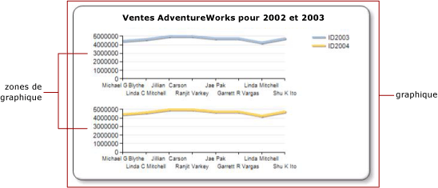

# Plusieurs séries sur un graphique (Générateur de rapports et SSRS)
  Lorsque plusieurs séries sont affichées sur un graphique, vous devez déterminer la meilleure méthode de comparaison de ces séries. Vous pouvez utiliser un graphique empilé pour afficher les proportions relatives de chaque série. Si vous comparez uniquement deux séries qui partagent un axe des abscisses commun (x), utilisez l'axe secondaire. Cela peut s'avérer utile lorsque vous affichez deux séries de données associées (le prix et le volume ou les recettes et les taxes, par exemple). Si le graphique devient illisible, envisagez d'utiliser plusieurs zones de graphique pour produire davantage de séparation visuelle entre chaque série.  
  
 Outre l'utilisation de fonctionnalités de graphique, le choix du type de graphique à utiliser avec vos données est important. Si les champs du dataset sont associés, envisagez d'utiliser un graphique d'étendue.  
  
> [!NOTE]  
>  [!INCLUDE[ssRBRDDup](../../includes/ssrbrddup-md.md)]  
  
## Utilisation de graphiques empilés et de graphiques empilés 100 %  
 Les graphiques empilés sont fréquemment utilisés pour afficher plusieurs séries dans une même zone de graphique. Envisagez d'utiliser des graphiques empilés lorsque les données que vous tentez d'afficher sont étroitement associées. Il est également recommandé d'afficher jusqu'à quatre séries sur un graphique empilé. Si vous souhaitez comparer la part que représente chaque série par rapport à la totalité, utilisez un histogramme, un graphique à barres ou un graphique en aires empilé 100 %. Ces graphiques calculent le pourcentage relatif de chaque série par rapport à la catégorie. Pour plus d’informations, consultez [Graphiques en aires &#40;Générateur de rapports et SSRS&#41;](../../reporting-services/report-design/area-charts-report-builder-and-ssrs.md), [Graphiques à barres &#40;Générateur de rapports et SSRS&#41;](../../reporting-services/report-design/bar-charts-report-builder-and-ssrs.md) et [Histogrammes &#40;Générateur de rapports et SSRS&#41;](../../reporting-services/report-design/column-charts-report-builder-and-ssrs.md).  
  
## Utilisation de l'axe secondaire  
 Lorsqu'une nouvelle série est ajoutée au graphique, elle est tracée par rapport aux axes x et y principaux. Si vous souhaitez comparer des valeurs dont l’unité de mesure est différente, utilisez *l’axe secondaire* pour que vous puissiez tracer les deux séries sur des axes distincts. L'axe secondaire s'avère utile lorsque vous comparez des valeurs dont l'unité de mesure est différente. L'axe secondaire est représenté sur le côté opposé de l'axe principal. Le graphique ne prend en charge qu'un axe principal et qu'un axe secondaire. L'axe secondaire possède les mêmes propriétés que l'axe principal. Pour plus d’informations, consultez [Tracer des données sur un axe secondaire &#40;Générateur de rapports et SSRS&#41;](../../reporting-services/report-design/plot-data-on-a-secondary-axis-report-builder-and-ssrs.md).  
  
 Si vous souhaitez afficher plus de deux séries ayant des plages de données différentes, envisagez de placer les séries dans des zones de graphique distinctes.  
  
## Utilisation de zones de graphique  
 Le graphique est le conteneur de niveau supérieur qui inclut la bordure externe, le titre du graphique et la légende. Par défaut, le graphique contient une zone de graphique par défaut. La zone de graphique n'est pas visible à la surface du graphique, mais vous pouvez la considérer comme un conteneur qui comprend uniquement les étiquettes d'axe, le titre de l'axe et la zone de traçage d'une ou plusieurs séries. L'illustration suivante montre le concept de zones de graphique dans un unique graphique.  
  
   
  
 Dans la boîte de dialogue **Propriétés de la zone de graphique** , vous pouvez spécifier l’orientation 2D et 3D de toutes les séries figurant dans la zone de graphique, aligner plusieurs zones de graphique dans le même graphique et définir les couleurs de la zone de traçage. Lorsqu'une nouvelle zone de graphique est définie sur un graphique qui contient une seule zone de graphique par défaut, l'espace disponible pour une zone de graphique est divisé horizontalement par deux et la nouvelle zone de graphique est positionnée au-dessous de la première zone de graphique.  
  
 Chaque série ne peut être associée qu'à une seule zone de graphique. Par défaut, toutes les séries sont ajoutées à la zone de graphique par défaut. Lorsque vous utilisez des graphiques en aires, des histogrammes, des graphiques en courbes ou à nuages de points, vous pouvez afficher n'importe quelle combinaison de ces séries sur la même zone de graphique. Par exemple, vous pouvez afficher une série de colonnes et une série de lignes sur une même zone de graphique. L'utilisation d'une même zone de graphique pour plusieurs séries présente l'avantage pour les utilisateurs finaux de pouvoir facilement faire des comparaisons.  
  
 Les graphiques à barres, en radar et à base de formes ne peuvent pas être combinés avec un autre type de graphique dans une même zone de graphique. Si vous souhaitez effectuer des comparaisons avec plusieurs séries de type graphique à barres, en radar ou à base de formes, vous devrez effectuer l'une des opérations suivantes :  
  
-   Apportez des modifications à toutes les séries de la zone de graphique pour qu'elles soient toutes du même type de graphique.  
  
-   Créez une nouvelle zone de graphique et déplacez une ou plusieurs séries de la zone de graphique par défaut vers la zone de graphique que vous venez de créer.  
  
 La fonctionnalité de zone de graphique multiple sur un même graphique s'avère également utile lorsque vous tentez de comparer des données dont les échelles de valeurs sont différentes. Par exemple, si votre première série contient une plage de données de 10 à 20 et votre deuxième série contient une plage de données de 400 à 800, les valeurs de votre première série risquent d'être masquées. Envisagez de séparer chaque série dans une zone de graphique différente. Pour plus d’informations, consultez [Spécifier une zone de graphique pour une série &#40;Générateur de rapports et SSRS&#41;](../../reporting-services/report-design/specify-a-chart-area-for-a-series-report-builder-and-ssrs.md).  
  
## Utilisation de graphiques d'étendue  
 Les graphiques d'étendue possèdent deux valeurs par point de données. Si le graphique comporte deux séries qui partagent le même axe des abscisses (x), vous pouvez utiliser un graphique d'étendue pour afficher la différence entre ces deux séries. Les graphiques d'étendue sont particulièrement bien adaptés pour afficher des valeurs minimale et maximale. Par exemple, si votre première série contient la plus forte vente pour chaque jour de janvier et votre deuxième série contient la vente la plus faible pour chaque jour de janvier, vous pouvez utiliser un graphique d'étendue pour afficher la différence entre la vente la plus forte et la vente la plus faible pour chaque jour. Pour plus d’informations, consultez [Graphiques d’étendue &#40;Générateur de rapports et SSRS&#41;](../../reporting-services/report-design/range-charts-report-builder-and-ssrs.md).  
  
##  Voir aussi  
 [Graphiques &#40;Générateur de rapports et SSRS&#41;](../../reporting-services/report-design/charts-report-builder-and-ssrs.md)   
 [Affichage d’une série avec plusieurs plages de données sur un graphique &#40;Générateur de rapports et SSRS&#41;](../../reporting-services/report-design/displaying-a-series-with-multiple-data-ranges-on-a-chart.md)   
 [Types de graphiques &#40;Générateur de rapports et SSRS&#41;](../../reporting-services/report-design/chart-types-report-builder-and-ssrs.md)  
  
  
