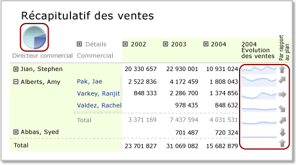

# Régions de données imbriquées (Générateur de rapports et SSRS)
  En règle générale, vous pouvez imbriquer une région de données (par exemple un graphique) dans une autre région de données (par exemple une matrice) pour afficher des synthèses de données de façon concise ou pour proposer une représentation visuelle, ainsi qu'un tableau ou une matrice.  
  
 Par exemple, pour une matrice (également appelée *tableau matriciel*) qui contient des commandes client regroupées par magasin sur les lignes et par trimestre sur les colonnes, vous pouvez ajouter un tableau ou un graphique à la cellule d’angle pour synthétiser les ventes de tous les magasins ou ajouter un graphique à un en-tête de colonne de matrice pour afficher la part des ventes des données figurant dans la colonne sous la forme d’un pourcentage de l’ensemble des ventes.  
  
   
  
 Dans cette illustration, le graphique à secteurs de la cellule d'angle et les graphiques sparkline des lignes sont des régions de données imbriquées.  
  
 Par définition, les régions de données imbriquées reposent sur le même dataset de rapport. Vous ne pouvez pas imbriquer des régions de données qui reposent sur des dataset différents. Pour afficher des données de dataset différents, envisagez d'utiliser des rapports d'extraction ou des sous-rapports. Pour plus d’informations, consultez [Extraction, exploration, sous-rapports et régions de données imbriquées &#40;Générateur de rapports et SSRS&#41;](../../reporting-services/report-design/drillthrough-drilldown-subreports-and-nested-data-regions.md).  
  
> [!NOTE]  
>  [!INCLUDE[ssRBRDDup](../../includes/ssrbrddup-md.md)]  
  
## Présentation de l'étendue d'une région de données imbriquée  
 L'étendue des données d'une région de données imbriquée est automatiquement définie par son positionnement dans la région de données parente. Par exemple, l'étendue des données d'un graphique imbriqué dans une cellule d'angle de tableau matriciel correspond aux données du dataset lié à la région de données de tableau matriciel une fois que les filtres ont été appliqués au dataset, à la région de données de tableau matriciel et à la région de données de graphique. L'étendue d'un tableau matriciel imbriqué dans une cellule de tableau matriciel est la même que l'étendue de la cellule d'angle, tout en s'étendant jusqu'aux membres des groupes de lignes et de colonnes de la cellule dans laquelle elle est imbriquée, une fois les filtres de groupe correspondants appliqués. Pour plus d’informations sur l’étendue, consultez [Étendue des expressions pour les totaux, les agrégats et les collections intégrées &#40;Générateur de rapports et SSRS&#41;](../../reporting-services/report-design/expression-scope-for-totals-aggregates-and-built-in-collections.md).  
  
 L'étendue des cellules des zones de tableau matriciel suivantes est décrite dans la liste ci-dessous :  
  
-   **Angle de tableau matriciel** L’étendue correspond aux données de la région de données liée à la région de données de tableau matriciel, une fois les expressions de filtre et de tri appliquées au dataset et au tableau matriciel externe.  
  
-   **Groupe de colonnes de tableau matriciel** Données figurant dans le groupe de colonnes le plus profond, une fois les expressions de filtre et de tri appliquées au dataset, au tableau matriciel externe et aux groupes de colonnes.  
  
-   **Groupe de lignes de tableau matriciel** Données figurant dans le groupe de lignes le plus profond, une fois les expressions de filtre et de tri appliquées au dataset, au tableau matriciel externe et aux groupes de lignes.  
  
-   **Corps de tableau matriciel** Données figurant dans le groupe le plus profond représenté par l’intersection des groupes de lignes et des groupes de colonnes, une fois les expressions de filtre et de tri appliquées au dataset, au tableau matriciel externe et aux groupes de lignes et de colonnes.  
  
 Pour plus d’informations, consultez [Zones de région de données de tableau matriciel &#40;Générateur de rapports et SSRS&#41;](../../reporting-services/report-design/tablix-data-region-areas-report-builder-and-ssrs.md).  
  
## Imbrication d'un graphique, d'un graphique sparkline ou d'une barre de données dans un tableau matriciel  
 Lorsque vous ajoutez un graphique (y compris un graphique sparkline ou une barre de données) à une ligne de pied de groupe ou d'en-tête de groupe de colonnes de tableau matriciel ou à une cellule de corps de tableau matriciel, les données transmises au graphique s'étendent jusqu'au sous-ensemble de données de cette cellule. Par défaut, lorsque vous ajoutez un graphique à une cellule de tableau matriciel, les dimensions du graphique se développent pour remplir la cellule.  
  
> [!NOTE]  
>  Pour bénéficier d'un contrôle accru sur la taille d'un graphique dans une cellule de tableau matriciel, commencez par ajouter le graphique à un rectangle, puis ajoutez le rectangle à la cellule de tableau matriciel.  
  
 Par défaut, les couleurs de légende du graphique sont déterminées par la couleur des points de données qui figurent dans la série du graphique. Pour contrôler les couleurs de telle sorte que les régions de données de graphique imbriquées utilisent toutes la même couleur pour la même catégorie de données, vous devez utiliser des couleurs personnalisées et définir des expressions de tri pour les données. Pour plus d’informations, consultez [Spécifier des couleurs cohérentes pour plusieurs graphiques à base de formes &#40;Générateur de rapports et SSRS&#41;](../../reporting-services/report-design/specify-consistent-colors-across-multiple-shape-charts-report-builder-and-ssrs.md) et [Trier des données dans une région de données &#40;Générateur de rapports et SSRS&#41;](../../reporting-services/report-design/sort-data-in-a-data-region-report-builder-and-ssrs.md).  
  
## Imbrication d'une jauge ou d'un indicateur dans un tableau matriciel  
 Vous pouvez imbriquer une jauge ou un indicateur dans un tableau, une matrice ou une liste pour afficher un indicateur de performance clé. Lorsque vous placez une jauge ou un indicateur dans un tableau, la jauge ou l'indicateur s'affiche pour chaque ligne du tableau matriciel. Pour plus d’informations sur l’ajout d’indicateurs à un tableau matriciel, consultez [Indicateurs &#40;Générateur de rapports et SSRS&#41;](../../reporting-services/report-design/indicators-report-builder-and-ssrs.md).  
  
### Ajout d'une jauge à un tableau matriciel  
 Vous pouvez ajouter une jauge à une région de données de tableau matriciel de deux façons différentes :  
  
-   Cliquez à l'intérieur de la cellule de tableau matriciel et insérez une jauge. La boîte de dialogue **Sélectionner le type de jauge** s’affiche. Une fois le type de jauge sélectionné, la région de données Jauge est placée dans la cellule de tableau matriciel sélectionnée. Vous devrez vraisemblablement redimensionner le tableau matriciel pour mettre en forme la jauge.  
  
-   Cliquez à l'extérieur du tableau et insérez une jauge. La boîte de dialogue **Sélectionner le type de jauge** s’affiche. Une fois le type de jauge sélectionné, la région de données Jauge est placée dans l'angle supérieur gauche du rapport. Après y avoir ajouté des données et l'avoir mise en forme, faites un glisser-déplacer de cette jauge dans la cellule de tableau matriciel.  
  
 Comme pour le graphique, le dataset transmis à la jauge s'étend jusqu'au sous-ensemble de données de cette cellule. Lorsqu'une jauge est placée dans une cellule de tableau matriciel, elle agrège toujours une seule ligne de données.  
  
 Lorsque les données du tableau matriciel contiennent un regroupement, la région de données Jauge imbriquée dans le tableau matriciel n'hérite pas automatiquement de ce groupe. Vous devez ajouter une expression de groupe correspondante à la jauge pour afficher les mêmes informations que celles qui figurent dans le tableau matriciel. Par exemple, si les données du tableau matriciel sont regroupées par Produit, vous devez ajouter une expression de groupe Produit à la jauge pour afficher les mêmes données. Pour plus d’informations, consultez [Jauges &#40;Générateur de rapports et SSRS&#41;](../../reporting-services/report-design/gauges-report-builder-and-ssrs.md) et [Ajouter ou supprimer un groupe dans une région de données &#40;Générateur de rapports et SSRS&#41;](../../reporting-services/report-design/add-or-delete-a-group-in-a-data-region-report-builder-and-ssrs.md).  
  
 Vous devez définir les valeurs minimale et maximale qui seront indiquées sur l'échelle de la jauge. Pour spécifier la valeur maximale de la jauge, vous pouvez utiliser une expression, par exemple `=Max!MyField.Value`. Or, comme cette expression sera uniquement évaluée dans l'étendue des données de la cellule, la valeur maximale de chaque jauge ne sera pas la même pour toutes les lignes du tableau matriciel. Cela risque de rendre les comparaisons entre les jauges du tableau matriciel plus difficiles à comprendre. Vous avez également la possibilité de spécifier une valeur statique en guise de valeur maximale. Toutes les lignes du tableau matriciel afficheront une jauge avec cette valeur maximale. Pour plus d’informations, consultez [Définir un minimum ou un maximum sur une jauge &#40;Générateur de rapports et SSRS&#41;](../../reporting-services/report-design/set-a-minimum-or-maximum-on-a-gauge-report-builder-and-ssrs.md).  
  
 Si les données deviennent trop nombreuses sur la jauge, envisagez d'utiliser un multiplicateur d'échelle pour réduire la quantité de chiffres affichés. Pour spécifier un multiplicateur, vous pouvez cliquer avec le bouton droit sur l’échelle, puis sélectionner **Propriétés de l’échelle**. Quand la boîte de dialogue **Propriétés de l’échelle** s’ouvre, spécifiez une valeur pour **Multiplicateur**.  
  
## Imbrication d'un tableau ou d'une matrice et d'un graphique dans une liste  
 Pour imbriquer plusieurs régions de données dans une liste, commencez par ajouter un rectangle, puis ajoutez les régions de données au rectangle.  
  
 Vous pouvez définir un groupe pour une région de données de type Liste et ajouter ensuite un tableau matriciel et un graphique pour proposer des vues différentes des mêmes données. Pour obtenir cet effet, vous devez définir des expressions de groupe et de tri identiques pour le tableau matriciel et le graphique incorporés. Par définition, le tableau matriciel et le graphique utilisent les données du dataset de la région de données de liste parente.  
  
> [!NOTE]  
>  Par défaut, lorsque vous ajoutez une région de données de liste à l'aire de conception, la liste inclut une ligne de détails. Vous pouvez modifier cette valeur par défaut en ajoutant une ligne de groupe et en supprimant la ligne de détails. Pour plus d’informations, consultez [Exploration de la souplesse d’une région de données de tableau matriciel &#40;Générateur de rapports et SSRS& #41;](../../reporting-services/report-design/exploring-the-flexibility-of-a-tablix-data-region-report-builder-and-ssrs.md).  
  
 Pour plus d’informations, consultez [Présentation des groupes &#40;Générateur de rapports et SSRS&#41;](../../reporting-services/report-design/understanding-groups-report-builder-and-ssrs.md) et [Ajouter, déplacer ou supprimer une table, une matrice ou une liste &#40;Générateur de rapports et SSRS&#41;](../../reporting-services/report-design/add-move-or-delete-a-table-matrix-or-list-report-builder-and-ssrs.md).  
  
##  Voir aussi  
 [Filtrer, regrouper et trier des données &#40;Générateur de rapports et SSRS&#41;](../../reporting-services/report-design/filter-group-and-sort-data-report-builder-and-ssrs.md)   
 [Tables, matrices et listes &#40;Générateur de rapports et SSRS&#41;](../../reporting-services/report-design/tables-matrices-and-lists-report-builder-and-ssrs.md)   
 [Graphiques &#40;Générateur de rapports et SSRS&#41;](../../reporting-services/report-design/charts-report-builder-and-ssrs.md)   
 [Jauges &#40;Générateur de rapports et SSRS&#41;](../../reporting-services/report-design/gauges-report-builder-and-ssrs.md)   
 [Expressions &#40;Générateur de rapports et SSRS&#41;](../../reporting-services/report-design/expressions-report-builder-and-ssrs.md)   
 [Mise en forme des éléments de rapport &#40;Générateur de rapports et SSRS&#41;](../../reporting-services/report-design/formatting-report-items-report-builder-and-ssrs.md)   
 [Didacticiel : ajout d’un indicateur de performance clé à un rapport &#40;Générateur de rapports&#41;](../../reporting-services/tutorial-adding-a-kpi-to-your-report-report-builder.md)   
 [Mise en forme des échelles sur une jauge &#40;Générateur de rapports et SSRS&#41;](../../reporting-services/report-design/formatting-scales-on-a-gauge-report-builder-and-ssrs.md)  
  
  
