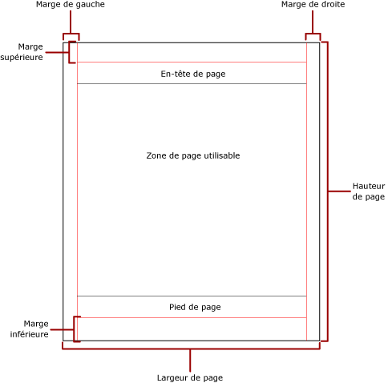
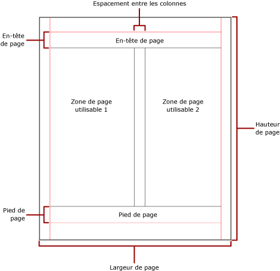

# Pagination dans Reporting Services (Générateur de rapports et SSRS)
  La pagination fait référence au nombre de pages au sein d'un rapport et à la façon dont les éléments d'un rapport sont réorganisés sur ces pages. La pagination dans [!INCLUDE[ssRSnoversion](../../includes/ssrsnoversion-md.md)] dépend de l'extension de rendu que vous utilisez pour afficher et remettre le rapport. Lorsque vous exécutez un rapport sur le serveur de rapports, le rapport utilise le convertisseur HTML. HTML suit un ensemble spécifique de règles de pagination. Par exemple, si vous exportez le même rapport en PDF, le convertisseur PDF est utilisé et un ensemble différent de règles est appliqué ; par conséquent, le rapport est paginé différemment. Pour concevoir avec succès un rapport facile à lire par vos utilisateurs et qui est optimisé pour le convertisseur que vous prévoyez d’utiliser pour remettre votre rapport, vous devez comprendre les règles utilisées pour contrôler la pagination dans [!INCLUDE[ssRSnoversion](../../includes/ssrsnoversion-md.md)].  
  
 Cette rubrique explique l'impact de la taille physique de la page et de la mise en page du rapport sur le rendu des sauts de page manuels du rapport par les convertisseurs. Vous pouvez définir les propriétés pour modifier la taille de la page et les marges physiques, et diviser le rapport en colonnes, à l'aide du volet **Propriétés de rapport** , du volet **Propriétés** ou de la boîte de dialogue **Mise en page** . Pour accéder au volet **Propriétés de rapport** , cliquez sur la zone bleue en dehors du corps du rapport. Pour accéder à la boîte de dialogue **Mise en page** , cliquez sur **Exécuter** dans l'onglet Accueil, puis cliquez sur **Mise en page** sous l'onglet Exécuter.  
  
> [!NOTE]  
>  Si vous avez conçu un rapport de sorte qu'il soit affiché sur une page, mais qu'il est rendu sur plusieurs pages, vérifiez que la largeur du corps du rapport, y compris les marges, n'est pas supérieure à la largeur de la page physique. Pour empêcher que des pages vides soient ajoutées à votre rapport, vous pouvez réduire la taille du conteneur en faisant glisser le coin du conteneur vers la gauche.  
  
> [!NOTE]  
>  [!INCLUDE[ssRBRDDup](../../includes/ssrbrddup-md.md)]  
  
## Le corps du rapport  
 Le corps du rapport est un conteneur rectangulaire affiché comme un espace blanc sur l'aire de conception. Il peut s'agrandir ou réduire pour s'ajuster à la taille des éléments de rapport qu'il contient. Le corps du rapport ne reflète pas la taille physique de la page et, peut même s'agrandir au delà des limites de la taille physique de la page pour s'étendre sur plusieurs pages de rapport. Certains convertisseurs, tels que [!INCLUDE[ofprexcel](../../includes/ofprexcel-md.md)], Word, HTML et MHTML, affichent des rapports qui s'agrandissent ou réduisent en fonction du contenu de la page. Les rapports affichés dans ces formats sont optimisés pour un affichage à l'écran, par exemple dans un navigateur Web. Ces convertisseurs ajoutent des sauts de page verticaux si nécessaire.  
  
 Vous pouvez mettre en forme le corps du rapport afin d'ajouter une couleur, un style et une largeur de bordure. Vous pouvez également ajouter une couleur d'arrière-plan et une image d'arrière-plan.  
  
## La page physique  
 La taille physique de la page correspond au format du papier. Le format de papier que vous spécifiez pour le rapport contrôle le rendu du rapport. Les rapports rendus dans les formats de saut de page manuel insèrent des sauts de page horizontalement et verticalement en fonction de la taille physique de la page pour fournir une lecture optimisée lors de l'impression ou de l'affichage au format de fichier saut de page manuel. Les rapports rendus dans les formats de saut de page conditionnellele insèrent des sauts de page horizontalement en fonction de la taille physique pour fournir une lecture optimisée lors de l'affichage dans un navigateur Web.  
  
 Par défaut, la taille de la page est de 8,5 x 11 pouces, mais vous pouvez modifier cette taille en utilisant le volet **Propriétés de rapport** , la boîte de dialogue **Mise en page** ou en modifiant les propriétés PageHeight et PageWidth dans le volet **Propriétés** . La taille de la page ne varie pas pour s'ajuster au contenu du corps de rapport. Si vous souhaitez que le rapport s'affiche sur une seule page, tout le contenu dans le corps du rapport doit s'ajuster à la page physique. Si le contenu ne s'ajuste pas à la page et que vous utilisez le format de saut de page manuel, le rapport nécessitera des pages supplémentaires. Si le corps du rapport dépasse le bord droit de la page physique, un saut de page est inséré horizontalement. Si le corps du rapport dépasse le bord inférieur de la page physique, un saut de page est inséré verticalement.  
  
 Si vous souhaitez remplacer la taille physique de la page définie dans le rapport, vous pouvez spécifier cette taille à l'aide des paramètres d'informations de périphérique pour le convertisseur spécifique que vous utilisez pour exporter le rapport. Pour plus d'informations, consultez [Paramètres d'informations de périphérique Reporting Services](http://go.microsoft.com/fwlink/?LinkId=102515)(en anglais).  
  
### Marges  
 Les marges sont dessinées à partir bord des dimensions de la page physique vers le paramètre de marge spécifié. Si un élément du rapport dépasse dans la zone de marge, il est détouré afin que la zone superposée ne soit pas rendue. Si vous spécifiez des tailles de marge qui équivalent à une largeur horizontale ou verticale de la page égale à zéro, les paramètres de marge prennent la valeur par défaut zéro. Les marges sont spécifiées à l’aide du volet **Propriétés de rapport** , de la boîte de dialogue **Mise en page** ou en modifiant les propriétés TopMargin, BottomMargin, LeftMargin et RightMargin dans le volet **Propriétés** . Si vous souhaitez remplacer la taille de la marge définie dans le rapport, vous pouvez spécifier cette taille à l'aide des paramètres d'informations de périphérique pour le convertisseur spécifique que vous utilisez pour exporter le rapport.  
  
 La zone de la page physique qui reste après avoir alloué l'espace pour les marges, l'espacement des colonnes et l'en-tête et le pied de page de la page, est appelée la *zone de page utilisable*. Les marges sont appliquées uniquement lorsque vous affichez et imprimez des rapports dans les formats du convertisseur de saut de page manuel. L'image suivante montre la marge et la zone de page utilisable d'une page physique.  
  
   
  
### Colonnes de style bulletin d'informations  
 Votre rapport peut être divisé en colonnes, telles que les colonnes d'un journal, qui sont considérées comme des pages logiques affichées sur la même page physique. Elles sont organisées de gauche à droite, de haut en bas et sont séparées par un espace vide entre chaque colonne. Si le rapport est divisé en plusieurs colonnes, chaque page physique est divisée verticalement en colonnes, chacune d'entre elles étant considérée comme une page logique. Par exemple, vous avez deux colonnes sur une page physique. Le contenu de votre rapport remplit la première colonne, puis la deuxième colonne. Si le rapport ne s'ajuste pas entièrement dans les deux premières colonnes, le rapport remplit la première colonne, puis la deuxième colonne de la page suivante. Les colonnes continuent à être remplies, de gauche à droite, de haut en bas jusqu'à ce que tous les éléments du rapport soient affichés. Si vous spécifiez des tailles de colonne qui équivalent à une largeur horizontale ou verticale de la page égale à zéro, l'espacement entre les colonnes prend la valeur par défaut zéro.  
  
 Les colonnes sont spécifiées à l’aide du volet **Propriétés de rapport** , de la boîte de dialogue **Mise en page** ou en modifiant les propriétés TopMargin, BottomMargin, LeftMargin et RightMargin dans le volet **Propriétés** . Si vous souhaitez utiliser une taille de marge qui n'est pas définie, vous pouvez la spécifier en utilisant les paramètres d'informations de périphérique pour le convertisseur spécifique que vous utilisez pour exporter le rapport. Les colonnes sont appliquées uniquement lorsque vous affichez et imprimez des rapports aux formats PDF ou Image. L'image suivante montre la zone de page utilisable d'une page qui contient des colonnes.  
  
   
  
## Sauts de page et noms de pages  
 Un rapport peut être plus lisible et ses données plus faciles à auditer et exporter lorsque les pages du rapport ont un nom. Reporting Services fournit des propriétés pour les rapports et régions de données de tableau matriciel (table, matrice et liste), groupes et rectangles dans le rapport pour contrôler la pagination, réinitialiser les numéros de page et fournir de nouveaux noms de pages de rapport sur les sauts de page. Ces fonctionnalités peuvent améliorer les rapports indépendamment du format dans lequel les rapports sont rendus, mais sont particulièrement utiles lors de l'exportation de rapports vers les classeurs Excel.  
  
 La propriété InitialPageName fournit le nom de page initial du rapport. Si votre rapport n'inclut pas de noms de pages pour les sauts de page, le nom de page initial est utilisé pour toutes les nouvelles pages créées par les sauts de page. Il n'est pas obligatoire d'utiliser un nom de page initial.  
  
 Un rapport rendu peut fournir un nouveau nom de page pour le changement de page qu'un saut de page provoque. Pour fournir le nom de la page, vous définissez la propriété PageName d’une table, d’une matrice, d’une liste, d’un groupe ou d’un rectangle. Il n'est pas obligatoire de spécifier des noms de pages sur les sauts. Si vous ne spécifiez aucune valeur, la valeur InitialPageName est utilisée. Si InitialPageName est également vide, la nouvelle page n’a aucun nom.  
  
 Les régions de données de tableau matriciel (table, matrice et liste), groupes et rectangles prennent en charge les sauts de page.  
  
 Le saut de page inclut les propriétés suivantes :  
  
-   BreakLocation fournit l’emplacement du saut de page pour l’élément de rapport prenant en charge les sauts de page : au début, à la fin ou au début et à la fin. Sur les groupes, BreakLocation peut se trouver entre les groupes.  
  
-   Disabled indique si un saut de page est appliqué à l’élément de rapport. Si cette propriété a la valeur True, le saut de page est ignoré. Cette propriété est utilisée pour désactiver dynamiquement des sauts de page basés sur des expressions lorsque le rapport est exécuté.  
  
-   ResetPageNumber indique si le numéro de page doit être réinitialisé à 1 quand un saut de page se produit. Si cette propriété a la valeur True, le numéro de page est réinitialisé.  
  
 Vous pouvez définir la propriété BreakLocation dans les boîtes de dialogue **Propriétés du tableau matriciel**, **Propriétés du rectangle**ou **Propriétés du groupe** , mais vous devez définir les propriétés Disabled, ResetPageNumber et PageName dans le volet Propriétés du Générateur de rapports. Si les propriétés dans le volet Propriétés sont organisées par catégorie, vous rechercherez les propriétés dans la catégorie **PageBreak** . Pour les groupes, la catégorie **PageBreak** est à l'intérieur de la catégorie **Group** .  
  
 Vous pouvez utiliser des constantes et des expressions simples ou complexes pour définir la valeur des propriétés Disabled et ResetPageNumber. Toutefois, vous ne pouvez pas utiliser d’expression avec la propriété BreakLocation. Pour plus d’informations sur la création et l’utilisation d’expressions, consultez [Expressions &#40;Générateur de rapports et SSRS&#41;](../../reporting-services/report-design/expressions-report-builder-and-ssrs.md).  
  
 Dans votre rapport, vous pouvez écrire des expressions qui référencent les noms ou numéros des pages actuelles à l'aide de la collection **Globals** . Pour plus d’informations, consultez [Références à des champs Globals et Users prédéfinis &#40;Générateur de rapports et SSRS&#41;](../../reporting-services/report-design/built-in-collections-built-in-globals-and-users-references-report-builder.md).  
  
### Attribution de noms aux onglets de feuille de calcul Excel  
 Ces propriétés sont utiles lorsque vous exportez des rapports vers les classeurs Excel. Utilisez la propriété InitialPage pour spécifier un nom par défaut pour le nom de l’onglet de feuille de calcul quand vous exportez le rapport, et utilisez des sauts de page et la propriété PageName pour fournir des noms différents pour chaque feuille de calcul. Chaque nouvelle page de rapport, définie par un saut de page, est exportée vers une feuille de calcul différente nommée par la valeur de la propriété PageName. Si PageName est vide, mais que le rapport a un nom de page initial, toutes les feuilles de calcul dans le classeur Excel utilisent le même nom, le nom de page initial.  
  
 Pour plus d’informations sur le fonctionnement de ces propriétés quand les rapports sont exportés vers Excel, consultez [Exportation vers Microsoft Excel &#40;Générateur de rapports et SSRS&#41;](../../reporting-services/report-builder/exporting-to-microsoft-excel-report-builder-and-ssrs.md).  
  
##  Voir aussi  
 [Mise en page et rendu &#40;Générateur de rapports et SSRS&#41;](../../reporting-services/report-design/page-layout-and-rendering-report-builder-and-ssrs.md)  
  
  
