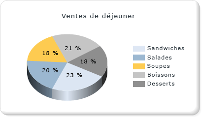

# Graphiques à secteurs (Générateur de rapports et SSRS)
  Les graphiques à secteurs et les graphiques en anneau affichent des données sous la forme d'une proportion de la totalité. Les graphiques en secteurs sont utilisés le plus souvent pour faire des comparaisons entre des groupes. Les graphiques à secteurs et les graphiques en anneau, ainsi que les graphiques en pyramide et les graphiques en entonnoir, comprennent un groupe de graphiques connu sous le nom de graphiques à base de formes. Les graphiques à base de formes n'ont pas d'axe. Lorsqu'un champ numérique est placé sur un graphique à base de formes, le graphique calcule le pourcentage de chaque valeur par rapport au total. Pour plus d’informations sur les graphiques à base de formes, consultez [Graphiques à base de formes &#40;Générateur de rapports et SSRS&#41;](../../reporting-services/report-design/shape-charts-report-builder-and-ssrs.md).  
  
 L'illustration suivante montre un graphique à secteurs 3D avec des étiquettes de données mises en forme sous forme de pourcentages.  La légende est positionnée au centre à droite.  
  
   
  
> [!NOTE]  
>  [!INCLUDE[ssRBRDDup](../../includes/ssrbrddup-md.md)]  
  
## Variantes  
  
-   **Secteurs éclatés**. Graphique en secteurs où tous les secteurs sont déplacés loin du centre du graphique. En plus du graphique à secteurs éclatés, dans lequel tous les secteurs sont séparés, vous pouvez créer un graphique à secteurs éclatés, dans lequel un seul secteur est appelé.  
  
-   **Anneau**. Graphique en anneau qui a un espace vide au centre.  
  
-   **Anneau éclaté**. Graphique en anneau où tous les secteurs sont déplacés loin du centre de l'anneau.  
  
-   **Secteurs 3D**. Graphique à secteurs 3D.  
  
-   **Secteurs éclatés 3D**. Graphique à secteurs éclatés 3D.  
  
## Considérations relatives aux données pour l'affichage sur un graphique en secteurs  
  
-   Les graphiques en secteurs sont populaires dans les rapports en raison de leur impact visuel. Toutefois, les graphiques en secteurs sont un type de graphique très simplifié qui peut ne pas représenter au mieux vos données. Pensez à utiliser un graphique en secteurs uniquement une fois l'agrégation des données en sept points de données maximum terminée.  
  
-   Les graphiques en secteurs affichent chaque groupe de données sous la forme d'un secteur séparé sur le graphique. Vous devez ajouter au moins un champ de données et un champ de catégorie au graphique en secteurs. Si plusieurs champs de données sont ajoutés à un graphique en secteurs, le graphique en secteurs affichera les champs de données dans le même graphique.  
  
-   Les valeurs Null, vides, négatives ou égales à zéro n'ont aucun effet lors du calcul de ratios. C'est pourquoi, ces valeurs ne sont pas affichées sur un graphique en secteurs. Si vous souhaitez indiquer visuellement ces types de valeurs sur votre graphique, modifiez le type de graphique.  
  
-   Si vous définissez vos propres couleurs sur un graphique en secteurs à l'aide d'une palette personnalisée, assurez-vous de disposer de suffisamment de couleurs dans votre palette pour afficher chaque point de données avec sa propre couleur. Pour plus d’informations, consultez [Mise en forme des couleurs des séries d’un graphique &#40;Générateur de rapports et SSRS&#41;](../../reporting-services/report-design/formatting-series-colors-on-a-chart-report-builder-and-ssrs.md).  
  
-   Contrairement à la plupart des autres types de graphiques, un graphique en secteurs affichera des points de données individuels, et non des séries individuelles, dans sa légende.  
  
-   Un graphique en secteurs requiert au moins deux valeurs afin d'établir une comparaison entre des proportions. Si votre graphique en secteurs contient une seule couleur, vérifiez que vous avez ajouté un champ de catégorie pour le regroupement. Lorsque le graphique à secteurs ne contient pas de catégories, il agrège les valeurs de votre champ de données dans une valeur pour l'affichage.  
  
-   Comme tous les autres types de graphiques, le graphique à secteurs génère des couleurs en fonction les valeurs de couleur contenues dans la palette par défaut. C'est pourquoi différents graphiques en secteurs peuvent colorer les points de données différemment lorsque vous utilisez plusieurs graphiques en secteurs dans un rapport. Si votre rapport contient plusieurs graphiques en secteurs, vous pouvez définir manuellement les couleurs pour chaque groupe de catégories afin de conserver la même couleur sur les différents graphiques. Pour plus d’informations sur la définition des couleurs sur un graphique, consultez [Mise en forme des couleurs des séries d’un graphique &#40;Générateur de rapports et SSRS&#41;](../../reporting-services/report-design/formatting-series-colors-on-a-chart-report-builder-and-ssrs.md).  
  
## Application de styles de dessin à un graphique en secteurs  
 Vous pouvez ajouter des styles de dessin spéciaux au graphique en secteurs pour augmenter son impact visuel. Les styles de dessin incluent des effets de biseau et concaves. Ces effets sont disponibles uniquement sur un graphique à secteurs 2D. L'illustration suivante montre un exemple de styles de dessin concaves et en biseau sur un graphique à secteurs.  
  
   
  
 Pour plus d’informations, consultez [Ajouter des styles de biseau, du relief et des textures à un graphique &#40;Générateur de rapports et SSRS&#41;](../../reporting-services/report-design/chart-effects-add-bevel-emboss-or-texture-report-builder.md).  
  
## Affichage de valeurs en pourcentage sur un graphique en secteurs  
 Comme les autres graphiques à base de formes, les graphiques en secteurs représentent des proportions du total. En conséquence, il est courant de mettre en forme les étiquettes de graphique en secteurs en tant que pourcentages. Pour être cohérent avec d'autres types de graphiques, le graphique n'affiche pas les étiquettes de pourcentage par défaut. Pour plus d’informations sur l’affichage des valeurs sous forme de pourcentages dans le graphique, consultez [Afficher des valeurs en pourcentage dans un graphique à secteurs &#40;Générateur de rapports et SSRS&#41;](../../reporting-services/report-design/display-percentage-values-on-a-pie-chart-report-builder-and-ssrs.md). Pour plus d’informations sur la mise en forme de nombres en pourcentages dans votre rapport, consultez [Mise en forme des nombres et des dates &#40;Générateur de rapports et SSRS&#41;](../../reporting-services/report-design/formatting-numbers-and-dates-report-builder-and-ssrs.md).  
  
   
  
## Empêcher les étiquettes qui se chevauchent sur un graphique à secteurs  
 Si votre graphique à secteurs affiche de nombreux points de données, les étiquettes des données se chevaucheront. Il y a plusieurs méthodes pour empêcher le chevauchement des étiquettes :  
  
-   Réduire la taille de la police des étiquettes de point de données.  
  
-   Augmenter la largeur et la hauteur de votre graphique pour prévoir plus de place pour les étiquettes.  
  
-   Afficher les étiquettes de graphique en dehors de la zone de graphique. Pour plus d’informations, consultez [Afficher des étiquettes de points de données à l’extérieur d’un graphique à secteurs &#40;Générateur de rapports et SSRS&#41;](../../reporting-services/report-design/display-data-point-labels-outside-a-pie-chart-report-builder-and-ssrs.md).  
  
-   Regrouper les petits secteurs dans un secteur.  
  
## Regroupement des petits secteurs sur un graphique à secteurs  
 Lorsque le graphique à secteurs comporte trop de points, les données sont masquées et difficilement lisibles. Si vos données comportent de nombreux petits points de données, deux méthodes permettent de regrouper plusieurs secteurs :  
  
-   Regrouper plusieurs petits secteurs en un sur un graphique à secteurs. C'est utile dans les situations où, par exemple, vous souhaitez que le graphique à secteurs présente un point de données « Autre » qui collecte simplement toutes les données restantes. Pour plus d’informations, consultez [Regrouper des petits secteurs sur un graphique à secteurs &#40;Générateur de rapports et SSRS&#41;](../../reporting-services/report-design/collect-small-slices-on-a-pie-chart-report-builder-and-ssrs.md).  
  
-   Regrouper les petits secteurs dans un graphique à secteurs secondaire. Le deuxième graphique à secteurs ne s'affiche pas dans le concepteur. En revanche, pendant le traitement des rapports, le graphique calcule si un deuxième graphique à secteurs est nécessaire, selon les valeurs des points de données. Le cas échéant, les valeurs sont ajoutées dans un autre graphique à secteurs.  
  
##  Voir aussi  
 [Afficher des étiquettes de points de données à l’extérieur d’un graphique à secteurs &#40;Générateur de rapports et SSRS&#41;](../../reporting-services/report-design/display-data-point-labels-outside-a-pie-chart-report-builder-and-ssrs.md)   
 [Regrouper des petits secteurs sur un graphique à secteurs &#40;Générateur de rapports et SSRS&#41;](../../reporting-services/report-design/collect-small-slices-on-a-pie-chart-report-builder-and-ssrs.md)   
 [Afficher des valeurs en pourcentage sur un graphique à secteurs &#40;Générateur de rapports et SSRS&#41;](../../reporting-services/report-design/display-percentage-values-on-a-pie-chart-report-builder-and-ssrs.md)   
 [Didacticiel : ajouter un graphique à secteurs à un rapport &#40;Générateur de rapports&#41;](../../reporting-services/tutorial-add-a-pie-chart-to-your-report-report-builder.md)   
 [Mise en forme de la légende sur un graphique &#40;Générateur de rapports et SSRS&#41;](../../reporting-services/report-design/chart-legend-formatting-report-builder.md)   
 [Points de données vides et Null dans les graphiques &#40;Générateur de rapports et SSRS&#41;](../../reporting-services/report-design/empty-and-null-data-points-in-charts-report-builder-and-ssrs.md)   
 [Mise en forme des couleurs des séries sur un graphique &#40;Générateur de rapports et SSRS&#41;](../../reporting-services/report-design/formatting-series-colors-on-a-chart-report-builder-and-ssrs.md)  
  
  
