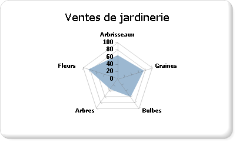

# Graphiques polaires (Générateur de rapports et SSRS)
  Un graphique polaire affiche une série sous la forme d'un ensemble de points groupés en catégorie sur un cercle de 360 degrés. Les valeurs sont représentées par la longueur du point mesurée à partir du centre du cercle. Plus le point est loin du centre, plus la valeur est grande. Les étiquettes de catégorie sont affichées sur le périmètre du graphique. Pour plus d’informations sur l’ajout de données à un graphique polaire, consultez [Graphiques &#40;Générateur de rapports et SSRS&#41;](../../reporting-services/report-design/charts-report-builder-and-ssrs.md).  
  
> [!NOTE]  
>  [!INCLUDE[ssRBRDDup](../../includes/ssrbrddup-md.md)]  
  
## Variantes  
  
-   **Graphique en radar**. Un graphique en radar affiche une série sous la forme d'une ligne ou zone circulaire. Contrairement au graphique polaire, le graphique en radar n'affiche pas les données sous la forme de polaires.  
  
## Considérations relatives aux données pour les graphiques polaires  
  
-   Le graphique en radar est utile pour les comparaisons entre plusieurs séries de données de catégorie.  
  
-   Les graphiques polaires sont utilisés le plus souvent pour tracer des données polaires, où chaque point de données est défini par un angle et une distance.  
  
-   Les graphiques polaires ne peuvent pas être associés avec un autre type de graphique dans la même zone de graphique.  
  
##  Exemple  
 L'exemple suivant montre l'utilisation d'un graphique en radar. Le tableau ci-dessous fournit les données d'exemple pour le graphique.  
  
|Nom   |Ventes|  
|----------|-----------|  
|Arbrisseaux|61|  
|Graines|78|  
|Bulbes|60|  
|Arbres|38|  
|Fleurs|81|  
  
 Dans cet exemple, le champ Nom est placé dans la zone Groupes de catégories. Le champ Ventes est placé dans la zone Valeurs. Le champ Ventes est automatiquement agrégé pour le graphique lorsque vous l'ajoutez. Le graphique en radar calcule où placer les étiquettes en fonction du nombre de valeurs dans le champ Ventes, qui contient cinq valeurs et place les étiquettes à cinq points équidistants sur un cercle. Si le champ Ventes contient trois valeurs, les étiquettes sont placées à trois points équidistants sur un cercle.  
  
 L'illustration suivante montre un exemple de graphique en radar basé sur les données présentées.  
  
   
  
##  Voir aussi  
 [Graphiques &#40;Générateur de rapports et SSRS&#41;](../../reporting-services/report-design/charts-report-builder-and-ssrs.md)   
 [Mise en forme d’un graphique &#40;Générateur de rapports et SSRS&#41;](../../reporting-services/report-design/formatting-a-chart-report-builder-and-ssrs.md)   
 [Types de graphiques &#40;Générateur de rapports et SSRS&#41;](../../reporting-services/report-design/chart-types-report-builder-and-ssrs.md)   
 [Graphiques en courbes &#40;Générateur de rapports et SSRS&#41;](../../reporting-services/report-design/line-charts-report-builder-and-ssrs.md)   
 [Points de données vides et Null dans les graphiques &#40;Générateur de rapports et SSRS&#41;](../../reporting-services/report-design/empty-and-null-data-points-in-charts-report-builder-and-ssrs.md)  
  
  
