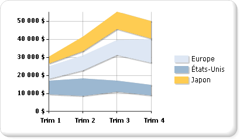

# Graphiques d'étendue (Générateur de rapports et SSRS)
  Un type de graphique d'étendue affiche un ensemble de points de données qui sont chacun définis par plusieurs valeurs pour la même catégorie. Les valeurs sont représentées par la hauteur du marqueur, telle que mesurée par l'axe des ordonnées. Les étiquettes de catégorie sont affichées sur l'axe des abscisses. Le graphique d'étendue ordinaire remplit la zone située entre les valeurs supérieure et inférieure de chaque point de données.  
  
 L'illustration suivante montre un graphique d'étendue ordinaire comportant trois séries.  
  
   
  
> [!NOTE]  
>  [!INCLUDE[ssRBRDDup](../../includes/ssrbrddup-md.md)]  
  
## Variantes  
  
-   **Étendue lissée**. Un graphique d'étendue lissée affiche des courbes plutôt que des droites.  
  
-   **Étendue en colonnes**. Un graphique d'étendue en colonnes utilise des colonnes à la place des aires pour afficher les étendues.  
  
-   **Étendue à barres**. Un graphique d'étendue à barres utilise des barres à la place des aires pour afficher les étendues.  
  
## Considérations relatives aux données pour les graphiques d'étendue  
  
-   Les types de graphique d'étendue nécessitent deux valeurs par point de données. Ces valeurs correspondent à une valeur supérieure et une valeur inférieure qui définissent l'étendue de chaque point de données.  
  
-   Les graphiques d'étendue ne sont utiles pour l'analyse que si les valeurs supérieures sont toujours plus élevées que les valeurs inférieures. Si ce n'est pas le cas, pensez plutôt à utiliser un graphique en courbes. Si la valeur supérieure est moins élevée que la valeur inférieure, le graphique d'étendue affichera la valeur absolue de la différence entre ces valeurs.  
  
-   Si une seule valeur est spécifiée, le graphique d'étendue s'affichera comme un graphique en aires normal, avec une valeur par point de données.  
  
-   Les graphiques d'étendue sont souvent utilisés pour représenter des données qui contiennent des valeurs minimales et maximales pour chaque groupe de catégories dans le dataset.  
  
-   L'affichage de marqueurs sur chaque point de données n'est pas pris en charge dans les graphiques d'étendue.  
  
-   Comme pour un graphique en aires, si dans un graphique d'étendue ordinaire, les valeurs de plusieurs séries sont similaires, celles-ci se chevaucheront. Dans ce cas, vous pouvez utiliser un graphique d'étendue en colonnes ou à barres au lieu d'un graphique d'étendue ordinaire.  
  
-   Les diagrammes de Gantt peuvent être créés à l'aide d'un graphique d'étendue à barres.  
  
## Voir aussi  
 [Graphiques &#40;Générateur de rapports et SSRS&#41;](../../reporting-services/report-design/charts-report-builder-and-ssrs.md)   
 [Types de graphiques &#40;Générateur de rapports et SSRS&#41;](../../reporting-services/report-design/chart-types-report-builder-and-ssrs.md)   
 [Mise en forme d’un graphique &#40;Générateur de rapports et SSRS&#41;](../../reporting-services/report-design/formatting-a-chart-report-builder-and-ssrs.md)  
  
  
