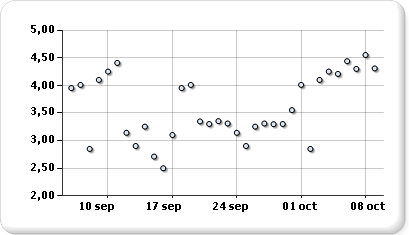

# Graphiques à nuages de points (Générateur de rapports et SSRS)
  Un graphique à nuages de points affiche une série sous la forme d'un ensemble de points. Les valeurs sont représentées par la position des points dans le graphique. et les catégories, par différents marqueurs dans le graphique. Un graphique à nuages de points sert généralement à comparer des données agrégées entre catégories. Pour plus d’informations sur la façon d’ajouter des données à un nuage de points, consultez [Graphiques &#40;Générateur de rapports et SSRS&#41;](../../reporting-services/report-design/charts-report-builder-and-ssrs.md)  
  
 L'illustration suivante montre un exemple de graphique à nuages de points.  
  
   
  
> [!NOTE]  
>  [!INCLUDE[ssRBRDDup](../../includes/ssrbrddup-md.md)]  
  
## Variantes  
  
-   **Bulles.** Les graphiques à bulles affichent la différence entre deux valeurs d'un point de données selon la taille de la bulle. Plus la bulle est grande, plus la différence entre les deux valeurs est importante.  
  
-   **Bulles 3D**. Graphique à bulles affiché en 3D.  
  
## Considérations relatives aux données pour les graphiques à nuages de points  
  
-   Les graphiques à nuages de points servent généralement à afficher et comparer des valeurs numériques, comme des données scientifiques, statistiques et d'ingénierie.  
  
-   Utilisez un graphique à nuages de points lorsque vous souhaitez comparer un grand nombre de points de données sans distinction de temps. Plus vous incluez de données dans un graphique à nuages de points, meilleures sont les comparaisons possibles.  
  
-   Le graphique à bulles requiert deux valeurs (supérieure et inférieure) par point de données.  
  
-   Les graphiques à nuages de points sont idéaux pour gérer la distribution de valeurs et clusters de points de données. Il s'agit du type de graphique le mieux adapté si votre dataset contient de nombreux points (par exemple plusieurs milliers de points). L'affichage de plusieurs séries sur un graphique à points est visuellement gênant et doit être évité. Dans ce cas, envisagez d'utiliser un graphique en courbes.  
  
-   Par défaut, les graphiques à nuages de points affichent les points de données sous la forme de cercles. Si un graphique à nuages de points contient plusieurs séries, envisagez de modifier la forme de marqueur de chaque point pour que ce soit un carré, un triangle, un losange ou une autre forme.  
  
##  Voir aussi  
 [Graphiques &#40;Générateur de rapports et SSRS&#41;](../../reporting-services/report-design/charts-report-builder-and-ssrs.md)   
 [Types de graphiques &#40;Générateur de rapports et SSRS&#41;](../../reporting-services/report-design/chart-types-report-builder-and-ssrs.md)   
 [Mise en forme d’un graphique &#40;Générateur de rapports et SSRS&#41;](../../reporting-services/report-design/formatting-a-chart-report-builder-and-ssrs.md)   
 [Graphiques en courbes &#40;Générateur de rapports et SSRS&#41;](../../reporting-services/report-design/line-charts-report-builder-and-ssrs.md)  
  
  
