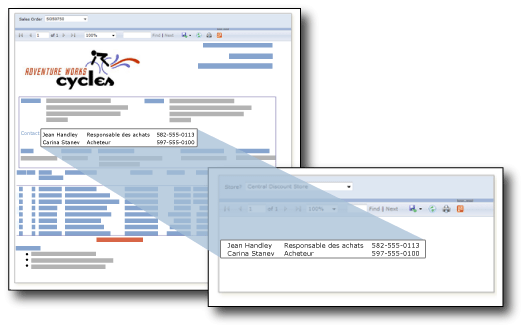

# Sous-rapports (Générateur de rapports et SSRS)
  Un sous-rapport est un élément de rapport qui affiche un autre rapport à l'intérieur du corps d'un rapport principal. D'un point de vue conceptuel, un sous-rapport d'un rapport ressemble à un cadre d'une page Web. Il est utilisé pour incorporer un rapport dans un autre. Vous pouvez utiliser tout rapport comme un sous-rapport. Le rapport affiché en tant que sous-rapport est stocké sur un serveur de rapports, en général dans le même dossier que le rapport parent. Vous pouvez concevoir le rapport parent de sorte qu'il passe des paramètres au sous-rapport. Un sous-rapport peut être répété au sein de régions de données, en utilisant un paramètre pour filtrer les données de chaque instance du sous-rapport.  
  
> [!NOTE]  
>  Si vous utilisez un sous-rapport dans une région de données de tableau matriciel, le sous-rapport et ses paramètres seront traités pour chaque ligne. S'il y a beaucoup de lignes, il convient de déterminer si un rapport d'extraction est plus adapté.  
  
   
  
 Dans cette illustration, les informations de contact affichées dans le rapport Sales Order principal proviennent en fait d'un sous-rapport Contacts.  
  
> [!NOTE]  
>  [!INCLUDE[ssRBRDDup](../../includes/ssrbrddup-md.md)]  
  
## Comparaison des sous-rapports et des régions de données imbriquées  
 Si vous songez à utiliser des sous-rapports pour afficher des groupes distincts de données, envisagez d'employer à la place des régions de données, par exemple des tableaux, des matrices et des graphiques. Les rapports contenant seulement des régions de données montrent de meilleures performances que ceux qui comportent des sous-rapports.  
  
 Utilisez des régions de données pour imbriquer des groupes de données issues de la même source au sein d'une région de données unique. Utilisez des sous-rapports pour imbriquer des groupes de données provenant de sources diverses en une seule région de données, réutiliser un sous-rapport dans plusieurs rapports parents ou afficher un rapport autonome dans un autre rapport. Par exemple, vous pouvez créer un « dossier de synthèse » en plaçant plusieurs sous-rapports dans le corps d'un autre rapport.  
  
 Les régions de données fournissent une grande partie des fonctionnalités et de la flexibilité des sous-rapports, mais avec de meilleures performances. Étant donné que le serveur de rapports traite chaque instance d'un sous-rapport comme un rapport distinct, des problèmes de performance peuvent se produire. Pour plus d’informations, consultez [Régions de données imbriquées &#40;Générateur de rapports et SSRS&#41;](../../reporting-services/report-design/nested-data-regions-report-builder-and-ssrs.md).  
  
## Utilisation de paramètres dans des sous-rapports  
 Pour passer les paramètres du rapport parent au sous-rapport, définissez un paramètre dans le rapport que vous souhaitez utiliser à titre de sous-rapport. Lorsque vous placez le sous-rapport dans le rapport parent, vous pouvez sélectionner le paramètre de rapport et une valeur à passer du rapport parent au paramètre de rapport dans le sous-rapport.  
  
> [!NOTE]  
>  Le paramètre que vous sélectionnez à partir du sous-rapport est un paramètre de rapport, et non un paramètre de requête.  
  
 Vous pouvez placer un sous-rapport dans le corps principal du rapport ou dans une région de données. Si vous le placez dans une région de données, il se répétera avec chaque instance du groupe ou chaque ligne de la région de données. Pour passer au sous-rapport une valeur à partir du groupe ou de la ligne, dans la propriété de la valeur, utilisez une expression de champ pour le champ qui contient la valeur à passer au paramètre du sous-rapport.  
  
 Pour plus d’informations sur l’utilisation des sous-rapports, consultez [Ajouter un sous-rapport et des paramètres &#40;Générateur de rapports et SSRS&#41;](../../reporting-services/report-design/add-a-subreport-and-parameters-report-builder-and-ssrs.md).  
  
## Spécification des noms et emplacements de sous-rapports  
 Vous pouvez concevoir un rapport principal de manière à spécifier un sous-rapport se trouvant dans un dossier différent sur le même serveur de rapports.  
  
 La syntaxe utilisée pour spécifier le sous-rapport varie selon que le serveur de rapports est exécuté en mode natif ou en mode intégré SharePoint. Pour plus d’informations, consultez [Spécification de chemins d’accès à des éléments externes &#40;Générateur de rapports et SSRS&#41;](../../reporting-services/report-design/specifying-paths-to-external-items-report-builder-and-ssrs.md).  
  
 Dans le Générateur de rapports, pour afficher un aperçu d'un sous-rapport dans un rapport principal, les deux rapports doivent se trouver sur le même serveur de rapports ou vous devez spécifier un chemin d'accès complet au sous-rapport.  
  
##  Voir aussi  
 [Extraction, exploration, sous-rapports et régions de données imbriquées &#40;Générateur de rapports et SSRS&#41;](../../reporting-services/report-design/drillthrough-drilldown-subreports-and-nested-data-regions.md)  
  
  
