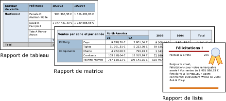
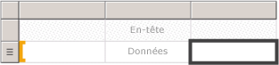

# Tables, matrices et listes (Générateur de rapports et SSRS)
 Dans [!INCLUDE[ssRSnoversion_md](../../includes/ssrsnoversion-md.md)], les tables, matrices et listes sont des *régions de données* qui affichent les données du rapport paginé dans des cellules organisées en lignes et colonnes. Les cellules contiennent en général des données texte, telles que du texte, des dates et des nombres, mais elles peuvent également contenir des jauges, des graphiques ou des éléments de rapport, par exemple des images. Ensemble, les tables, matrices et listes sont fréquemment connues sous le nom de régions de données de *tableau matriciel* .  
  
 Les modèles de table, de matrice et de liste sont basés sur la région de données de tableau matriciel, qui est une grille flexible pouvant afficher des données dans les cellules. Dans les modèles de table et de matrice, les cellules sont organisées en lignes et en colonnes. Étant donné que les modèles sont des variantes de la région de données de tableau matriciel générique sous-jacente, vous pouvez afficher des données dans une combinaison de formats de modèles et modifier la table, la matrice ou la liste pour inclure les fonctionnalités d’une autre région de données pendant que vous développez votre rapport. Par exemple, si vous ajoutez une table et trouvez qu'elle ne répond pas à vos besoins, vous pouvez ajouter des groupes de colonnes pour transformer la table en matrice.  
  
 Les régions de données de matrice et de table peuvent afficher des relations de données complexes en incluant des tables imbriquées, matrices, listes, graphiques et jauges. Les tables et matrices ont une disposition tabulaire et leurs données proviennent d'un seul dataset, basé sur une source de données unique. La principale différence entre les tables et les matrices est que les tables peuvent inclure uniquement des groupes de lignes, alors que les matrices ont des groupes de lignes et des groupes de colonnes.  
  
 Les listes sont un peu différentes. Elles prennent en charge une disposition libre qui peut inclure plusieurs matrices ou tables d'homologue, chacune utilisant des données d'un dataset différent. Les listes peuvent également être utilisées pour des formulaires, tels que les factures.  
  
 Les images suivantes affichent des rapports simples avec une table, matrice ou liste.  
  
   
  
 Pour commencer à utiliser rapidement les tables, matrices et listes, consultez [Didacticiel : création d’un rapport de tableau de base &#40;Générateur de rapports&#41;](../../reporting-services/tutorial-creating-a-basic-table-report-report-builder.md), [Didacticiel : création d’un rapport de matrice &#40;Générateur de rapports&#41;](../../reporting-services/tutorial-creating-a-matrix-report-report-builder.md) et [Didacticiel : création d’un rapport au format libre &#40;Générateur de rapports&#41;](../../reporting-services/tutorial-creating-a-free-form-report-report-builder.md).  
  
> [!NOTE]  
>  Vous pouvez publier des tables, des matrices et des listes indépendamment d'un rapport en tant que parties de rapports. En savoir plus sur les [Parties de rapports](../../reporting-services/report-design/report-parts-report-builder-and-ssrs.md).  
  
##   Table  
 Utilisez une table pour afficher des données de détail, organiser les données dans des groupes de lignes, ou les deux. Le modèle Table comporte trois colonnes avec une ligne d'en-tête de table et une ligne de détails pour les données. L'illustration suivante montre le modèle de table initial sélectionné sur l'aire de conception :  
  
   
  
 Vous pouvez grouper des données selon un champ unique, selon plusieurs champs ou en écrivant votre propre expression. Vous pouvez créer des groupes imbriqués ou des groupes indépendants et adjacents, et afficher des valeurs agrégées pour les données groupées, ou ajouter des totaux aux groupes. Par exemple, si votre table a un groupe de lignes appelé [Category], vous pouvez ajouter un sous-total pour chaque groupe ainsi qu'un total général pour le rapport. Pour améliorer l'apparence de la table et mettre en surbrillance les données que vous souhaitez mettre en évidence, vous pouvez fusionner les cellules et appliquer une mise en forme aux données et titres de table.  
  
 Vous pouvez au départ masquer les données groupées ou les données de détail et inclure des bascules d'extraction pour permettre à un utilisateur de choisir de manière interactive les données à afficher.  
  
 Pour plus d’informations, consultez [Tables &#40;Générateur de rapports et SSRS&#41;](../../reporting-services/report-design/tables-report-builder-and-ssrs.md).  
  
##   Matrice  
 Utilisez une matrice pour afficher des résumés de données agrégées, regroupés dans des lignes et des colonnes, et qui s'apparentent à un tableau croisé dynamique ou à une analyse croisée. Le nombre de lignes et de colonnes des groupes est déterminé par le nombre de valeurs uniques de chaque groupe de lignes et de colonnes. L'illustration suivante montre le modèle de matrice initial sélectionné sur l'aire de conception :  
  
   
  
 Vous pouvez regrouper des données en fonction de plusieurs champs ou expressions dans des groupes de lignes et de colonnes. Au moment de l'exécution, lorsque les régions de données et données de rapport sont combinées, une matrice se développe horizontalement et verticalement sur la page à mesure que des colonnes pour les groupes de colonnes et des lignes pour les groupes de lignes sont ajoutées. Les cellules de matrice affichent des valeurs d'agrégation limitées à l'intersection des groupes de lignes et de colonnes auxquels la cellule appartient. Par exemple, si votre matrice a un groupe de lignes (Category) et deux groupes de colonnes (Territory et Year) qui affichent la somme des ventes, le rapport affiche deux cellules avec les sommes des ventes pour chaque valeur dans le groupe Category. L'étendue des cellules au niveau des deux intersections est : Category et Territory, Category et Year. La matrice peut inclure des groupes imbriqués et adjacents. Les groupes imbriqués ont une relation parent-enfant et les groupes adjacents ont une relation d'égal à égal. Vous pouvez ajouter des sous-totaux pour tous les niveaux de groupes de lignes et de colonnes imbriqués dans la matrice.  
  
 Pour rendre les données de matrice plus lisibles et mettre en surbrillance les données que vous souhaitez mettre en évidence, vous pouvez fusionner les cellules ou fractionner horizontalement et verticalement, et appliquer une mise en forme aux données et titres de table.  
  
 Vous pouvez également inclure des bascules d'extraction qui permettent initialement de masquer les données de détail ; l'utilisateur peut ensuite cliquer sur ces bascules pour afficher plus ou moins de détails, en fonction de ses besoins.  
  
 Pour plus d’informations, consultez [Créer une matrice](../../reporting-services/report-design/create-a-matrix-report-builder-and-ssrs.md).  
  
##   Liste  
 Utilisez une liste pour créer une disposition de forme libre. Comme vous n'êtes pas limité à une disposition sous forme de grille, vous pouvez placer librement des champs à l'intérieur de la liste. Vous pouvez utiliser une liste pour concevoir un formulaire permettant d'afficher de nombreux champs du dataset ou en tant que conteneur permettant d'afficher côte à côte plusieurs régions de données pour les données groupées. Par exemple, vous pouvez définir un groupe pour une liste, ajouter une table, un graphique et une image, et afficher les valeurs sous forme de table et de graphique pour chaque valeur de groupe, comme vous le feriez pour un fichier d'employés ou de patients.  
  
   
  
 Pour plus d’informations, consultez [Créer des formulaires et des factures avec des listes].  
  
##   Préparation des données  
 Les régions de données de table, de matrice et de liste affichent les données d'un dataset. Vous pouvez préparer les données dans la requête qui récupère les données pour le dataset ou en définissant des propriétés dans la table, matrice ou liste.  
  
 Les langages de requêtes, tels que [!INCLUDE[tsql](../../includes/tsql-md.md)], que vous utilisez pour récupérer les données pour les datasets de rapport peuvent préparer les données en appliquant des filtres pour inclure uniquement un sous-ensemble des données, en remplaçant les valeurs Null ou les espaces par des constantes qui rendent le rapport plus lisible, puis en triant et regroupant les données.  
  
 Si vous choisissez de préparer les données dans la région de données de table, matrice ou liste d'un rapport, vous définissez des propriétés sur la région de données ou les cellules dans la région de données. Si vous souhaitez filtrer ou trier les données, définissez les propriétés sur la région de données. Par exemple, pour trier les données, vous spécifiez les colonnes à trier et le sens du tri. Si vous souhaitez fournir une autre valeur pour un champ, vous définissez les valeurs du texte de cellule qui affiche le champ. Par exemple, pour afficher Vide lorsqu'un champ a une valeur vide ou Null, vous utilisez une expression pour définir la valeur.  
  
 Pour plus d’informations, consultez [Préparation des données à afficher dans une région de données de tableau matriciel &#40;Générateur de rapports et SSRS&#41;](../../reporting-services/report-design/preparing-data-for-display-in-a-tablix-data-region-report-builder-and-ssrs.md).  
  
##   Génération et configuration d'une table, matrice ou liste  
 Lorsque vous ajoutez des tables ou des matrices à votre rapport, vous pouvez utiliser l'Assistant Tableau ou Matrice, ou les générer manuellement à partir des modèles fournis par le Générateur de rapports et le Concepteur de rapports. Les listes sont créées manuellement à partir du modèle de liste.  
  
 L'Assistant vous guide pendant la procédure pour générer et configurer rapidement une table ou matrice. Une fois l'Assistant terminé ou si vous créez les régions de données de tableau matriciel de bout en bout, vous pouvez les configurer et les améliorer davantage. Les boîtes de dialogue, disponibles dans les menus contextuels sur les régions de données, facilitent la définition des propriétés utilisées le plus souvent pour les sauts de page, la répétition et la visibilité des en-têtes et pieds de page, les options d'affichage, les filtres et le tri. En outre, la région de données de tableau matriciel fournit une multitude de propriétés supplémentaires, que vous pouvez définir uniquement dans le volet Propriétés du Générateur de rapports. Par exemple, si vous souhaitez afficher un message quand le dataset pour une table, matrice ou liste est vide, vous spécifiez le texte du message dans la propriété de tableau matriciel NoRowsMessage dans le volet Propriétés.  
  
##   Modification entre les modèles de tableau matriciel  
 Vous n'êtes pas tenu de rester à votre choix de modèle de tableau matriciel initial. À mesure que vous ajoutez des groupes, des totaux et des étiquettes, vous pouvez être amené à apporter des modifications à votre conception de tableau matriciel. Par exemple, vous pouvez commencer avec une table, puis supprimer la ligne de détails et ajouter des groupes de colonnes. Pour plus d’informations, consultez [Exploration de la souplesse d’une région de données de tableau matriciel &#40;Générateur de rapports et SSRS& #41;](../../reporting-services/report-design/exploring-the-flexibility-of-a-tablix-data-region-report-builder-and-ssrs.md).  
  
 Vous pouvez poursuivre le développement d'une table, d'une matrice ou d'une liste en y ajoutant toute fonctionnalité de tableau matriciel. Les fonctionnalités de tableau matriciel assurent l'affichage de données de détail ou d'agrégats de données groupées dans des lignes et des colonnes. Vous pouvez créer des groupes imbriqués, des groupes adjacents indépendants ou des groupes récursifs. Vous pouvez filtrer et trier des données groupées et facilement associer des groupes en incluant plusieurs expressions de groupe dans une définition de groupe.  
  
 Vous pouvez également ajouter les totaux d'un groupe ou les totaux généraux de la région de données. Vous pouvez masquer des lignes ou des colonnes pour simplifier un rapport et permettre à l'utilisateur d'activer l'affichage de données masquées, comme dans un rapport d'extraction. Pour plus d’informations, consultez [Contrôle de l’affichage de la région de données de tableau matriciel sur une page de rapport &#40;Générateur de rapports et SSRS&#41;](../../reporting-services/report-design/controlling-the-tablix-data-region-display-on-a-report-page.md).  
  
##   Rubriques de procédures  
 Cette section répertorie les procédures qui vous indiquent pas à pas comment utiliser les tables, matrices et listes dans vos rapports, afficher des données dans les lignes et les colonnes, ajouter et supprimer des colonnes, fusionner des cellules, et inclure des sous-totaux pour les groupes de lignes et de colonnes.  
  
-   [Ajouter un groupe de détails &#40;Générateur de rapports et SSRS&#41;](../../reporting-services/report-design/add-a-details-group-report-builder-and-ssrs.md)  
  
-   [Ajouter un total à un groupe ou à une région de données de tableau matriciel &#40;Générateur de rapports et SSRS&#41;](../../reporting-services/report-design/add-a-total-to-a-group-or-tablix-data-region-report-builder-and-ssrs.md)  
  
-   [Modifier un élément dans une cellule &#40;Générateur de rapports et SSRS&#41;](../../reporting-services/report-design/change-an-item-within-a-cell-report-builder-and-ssrs.md)  
  
-   [Modifier la hauteur de ligne ou la largeur de colonne &#40;Générateur de rapports et SSRS&#41;](../../reporting-services/report-design/change-row-height-or-column-width-report-builder-and-ssrs.md)  
  
-   [Insérer ou supprimer une colonne &#40;Générateur de rapports et SSRS&#41;](../../reporting-services/report-design/insert-or-delete-a-column-report-builder-and-ssrs.md)  
  
-   [Insérer ou supprimer une ligne &#40;Générateur de rapports et SSRS&#41;](../../reporting-services/report-design/insert-or-delete-a-row-report-builder-and-ssrs.md)  
  
-   [Fusionner des cellules dans une région de données &#40;Générateur de rapports et SSRS&#41;](../../reporting-services/report-design/merge-cells-in-a-data-region-report-builder-and-ssrs.md)  
  
-   [Créer un groupe de hiérarchies récursives &#40;Générateur de rapports et SSRS&#41;](../../reporting-services/report-design/create-a-recursive-hierarchy-group-report-builder-and-ssrs.md)  
  
-   [Ajouter ou supprimer un groupe dans une région de données &#40;Générateur de rapports et SSRS&#41;](../../reporting-services/report-design/add-or-delete-a-group-in-a-data-region-report-builder-and-ssrs.md)  
  
-   [Afficher des en-têtes et des pieds de page de groupe &#40;Générateur de rapports et SSRS&#41;](../../reporting-services/report-design/display-headers-and-footers-with-a-group-report-builder-and-ssrs.md)  
  
-   [Créer un rapport en escalier &#40;Générateur de rapports et SSRS&#41;](../../reporting-services/report-design/create-a-stepped-report-report-builder-and-ssrs.md)  
  
-   [Ajouter, déplacer ou supprimer une table, une matrice ou une liste &#40;Générateur de rapports et SSRS&#41;](../../reporting-services/report-design/add-move-or-delete-a-table-matrix-or-list-report-builder-and-ssrs.md)  
  
##   Dans cette section  
 Les rubriques suivantes fournissent des informations supplémentaires sur l'utilisation de la région de données de tableau matriciel.  
  
 [Région de données de tableau matriciel &#40;Générateur de rapports et SSRS&#41;](../../reporting-services/report-design/tablix-data-region-report-builder-and-ssrs.md)  
 Explique les principaux concepts relatifs à la région de données de tableau matriciel, par exemple les zones du tableau matriciel, les données de détail et groupées, les groupes de colonnes et de lignes ainsi que les lignes et colonnes statiques et dynamiques.  
  
 [Ajout de données à une région de données de tableau matriciel &#40;Générateur de rapports et SSRS&#41;](../../reporting-services/report-design/adding-data-to-a-tablix-data-region-report-builder-and-ssrs.md)  
 Fournit des informations détaillées sur l'ajout de données de détail et groupées, de sous-totaux et totaux, et d'étiquettes à une région de données de tableau matriciel.  
  
 [Contrôle de l’affichage de la région de données de tableau matriciel sur une page de rapport &#40;Générateur de rapports et SSRS&#41;](../../reporting-services/report-design/controlling-the-tablix-data-region-display-on-a-report-page.md)  
 Décrit les propriétés d'une région de données de tableau matriciel que vous pouvez modifier pour changer l'affichage d'une région de données de tableau matriciel dans un rapport.  
  
 [Contrôle des en-têtes de ligne et de colonne &#40;Générateur de rapports et SSRS&#41;](../../reporting-services/report-design/controlling-row-and-column-headings-report-builder-and-ssrs.md)  
 Décrit comment contrôler les en-têtes de lignes et de colonnes lorsqu'une région de données de table, matrice ou liste peut s'étendre sur plusieurs pages horizontalement ou verticalement.  
  
 [Création de groupes de hiérarchies récursives &#40;Générateur de rapports et SSRS&#41;](../../reporting-services/report-design/creating-recursive-hierarchy-groups-report-builder-and-ssrs.md)  
 Décrit comment afficher des données récursives là où la relation entre parent et enfant est représentée par des champs dans le dataset.  
  
 [Fonctionnement des groupes &#40;Générateur de rapports et SSRS&#41;](../../reporting-services/report-design/understanding-groups-report-builder-and-ssrs.md)  
 Définit les groupes et le moment de les utiliser ainsi que les groupes disponibles pour les différentes régions de données de tableau matriciel.  
  
##  Voir aussi  
 [Ajouter des filtres de datasets, des filtres de régions de données et des filtres de groupes &#40;Générateur de rapports et SSRS&#41;](../../reporting-services/report-design/add-dataset-filters-data-region-filters-and-group-filters.md)   
 [Régions de données imbriquées &#40;Générateur de rapports et SSRS&#41;](../../reporting-services/report-design/nested-data-regions-report-builder-and-ssrs.md)   
 [Liaison de plusieurs régions de données à un même dataset &#40;Générateur de rapports et SSRS&#41;](../../reporting-services/report-design/linking-multiple-data-regions-to-the-same-dataset-report-builder-and-ssrs.md)   
 [Expressions &#40;Générateur de rapports et SSRS&#41;](../../reporting-services/report-design/expressions-report-builder-and-ssrs.md)   
 [Filtrer, regrouper et trier des données &#40;Générateur de rapports et SSRS&#41;](../../reporting-services/report-design/filter-group-and-sort-data-report-builder-and-ssrs.md)   
 [Paramètres de rapport &#40;Générateur de rapports et Concepteur de rapports&#41;](../../reporting-services/report-design/report-parameters-report-builder-and-report-designer.md)   
 [Graphiques &#40;Générateur de rapports et SSRS&#41;](../../reporting-services/report-design/charts-report-builder-and-ssrs.md)   
 [Jauges &#40;Générateur de rapports et SSRS&#41;](../../reporting-services/report-design/gauges-report-builder-and-ssrs.md)  
  
  
