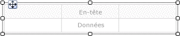
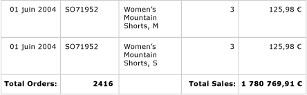
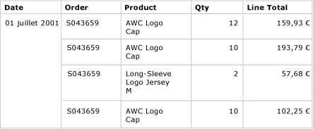
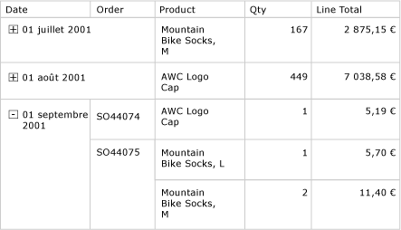

# Tables (Générateur de rapports et SSRS)
 Dans [!INCLUDE[ssRSnoversion_md](../../includes/ssrsnoversion-md.md)], vous pouvez utilisez une table pour afficher des données de détail ou groupées, ou une combinaison des deux dans un rapport paginé.   
   
 Vous pouvez grouper des données selon un champ unique, selon plusieurs champs ou en écrivant votre propre expression. Vous pouvez créer des groupes imbriqués ou des groupes indépendants, adjacents. Pour afficher des valeurs de synthèse pour les données groupées, ajoutez des totaux aux groupes. Formatez les lignes et les colonnes afin de mettre en surbrillance les données que vous souhaitez mettre en évidence. Vous pouvez au départ masquer les données groupées ou les données de détail et inclure des bascules d'extraction pour permettre à un utilisateur de choisir de manière interactive les données à afficher.  
  
 Pour rapidement commencer à utiliser les tables, consultez [Didacticiel : création d’un rapport de table de base &#40;Générateur de rapports&#41;](../../reporting-services/tutorial-creating-a-basic-table-report-report-builder.md) ou [Créer un rapport de table de base &#40;didacticiel SSRS&#41;](../../reporting-services/create-a-basic-table-report-ssrs-tutorial.md).  
  
> [!NOTE]  
>  Vous pouvez publier des tables hors d'un rapport en tant que parties du rapport. En savoir plus sur les [Parties de rapports](../../reporting-services/report-design/report-parts-report-builder-and-ssrs.md).  
  
  
##   Ajout d'une table pour afficher des données de détail  
 Ajoutez une table à l'aire de conception depuis l'onglet Insérer sur le ruban. Vous pouvez ajouter une table à l'aide de l'Assistant Tableau ou matrice, qui inclut la création d'une connexion à la source de données et d'un dataset ainsi que la configuration de la table, ou une table basée sur le modèle de table, que vous configurez manuellement.  
  
> [!NOTE]  
>  L'Assistant est disponible uniquement dans le Générateur de rapports.  
  
 Pour décrire le mode de configuration d'une table du début à la fin, cette rubrique utilise le modèle de table.  
  
 Par défaut, une nouvelle table a un nombre fixe de colonnes avec une ligne d'en-tête pour les étiquettes et une ligne de données pour les données de détail. La figure suivante représente une nouvelle table ajoutée à l'aire de conception.  
  
   
  
 Lorsque vous sélectionnez la table, des poignées de ligne et de colonne apparaissent à l'extérieur de la table tandis que des crochets apparaissent dans les cellules. Les poignées de ligne affichent des graphiques qui vous aident à comprendre l'objectif de chaque ligne. Les crochets indiquent l'appartenance aux groupes pour une cellule sélectionnée. La figure suivante montre une cellule vide sélectionnée dans une table par défaut.  
  
   
  
 Le handle de ligne de la ligne de données affiche le symbole de détails (). Pour afficher des données sur ces lignes, faites glisser les champs du volet des données de rapport vers la ligne d'en-tête ou de détails. Les deux lignes sont remplies simultanément. Pour ajouter des colonnes supplémentaires, faites glisser le champ vers la table jusqu'à ce que vous voyiez un point d'insertion. Après avoir ajouté des champs de dataset à la table, vous pouvez modifier le format par défaut pour les dates et devises afin de contrôler leur mode d'affichage dans le rapport. Le diagramme suivant représente une région de données d'une table comportant les champs suivants : Date, Order, Product, Qty et Line Total.  
  
   
  
 Vérifiez votre conception en affichant le rapport dans l'Aperçu. Elle s'étend vers le bas de la page à mesure des besoins. La ligne d'étiquette et la ligne de détails s'affichent une fois pour chaque ligne du jeu de résultats de requête de dataset. Chaque produit vendu dans la commande est répertorié sur une ligne séparée, avec la quantité et le total de ligne pour l'article, comme indiqué dans l'illustration suivante :  
  
   
  
 La table avec laquelle vous démarrez est un modèle basé sur la région de données de tableau matriciel. Vous pouvez améliorer la conception de votre table en ajoutant des fonctionnalités prises en charge par la région de données de tableau matriciel sous-jacente. Pour plus d’informations, consultez [Contrôle de l’affichage de la région de données de tableau matriciel sur une page de rapport &#40;Générateur de rapports et SSRS&#41;](../../reporting-services/report-design/controlling-the-tablix-data-region-display-on-a-report-page.md). Vous pouvez également continuer à développer votre table en ajoutant des groupes de lignes, des groupes de colonnes, et en ajoutant ou supprimant des groupes de détails. Pour plus d’informations, consultez [Exploration de la souplesse d’une région de données de tableau matriciel &#40;Générateur de rapports et SSRS& #41;](../../reporting-services/report-design/exploring-the-flexibility-of-a-tablix-data-region-report-builder-and-ssrs.md).  
  
### Ajout de totaux pour les données de détail  
 Pour ajouter des totaux, sélectionnez les cellules comportant des données numériques, puis utilisez le menu contextuel pour ajouter automatiquement des étiquettes et des totaux pour les données de détail pour les champs numériques. Vous pouvez également spécifier manuellement d'autres étiquettes ou totaux. L'illustration suivante montre une ligne de total classique qui inclut à la fois et des totaux automatiques et des totaux spécifiés manuellement :  
  
   
  
 Dans l'Aperçu, le rapport affiche la ligne d'en-tête et la ligne de détails une fois pour chaque ligne du jeu de résultats de la requête de dataset, et il affiche la ligne de total. L'illustration suivante montre les dernières lignes de la table et la ligne de total.  
  
   
  
 Pour plus d’informations, consultez [Ajouter un total à un groupe ou à une région de données de tableau matriciel &#40;Générateur de rapports et SSRS&#41;](../../reporting-services/report-design/add-a-total-to-a-group-or-tablix-data-region-report-builder-and-ssrs.md).  
  
##   Ajout de groupes de lignes à une table  
 De la même manière que vous pouvez faire glisser un champ du volet des données de rapport vers une cellule pour afficher les données de détail, vous pouvez faire glisser un champ vers le volet de regroupement pour ajouter un groupe. Pour une table, faites glisser le champ vers le volet Groupes de lignes. Une fois que vous avez ajouté un groupe, la table ajoute automatiquement des cellules dans les nouvelles colonnes dans la région du groupe de lignes dans laquelle afficher les valeurs du groupe. Pour plus d’informations sur les zones, consultez [Zones de région de données de tableau matriciel &#40;Générateur de rapports et SSRS&#41;](../../reporting-services/report-design/tablix-data-region-areas-report-builder-and-ssrs.md).  
  
 L'illustration suivante représente une table avec deux groupes de lignes imbriquées en mode Conception. Les groupes de lignes ont été créés en faisant glisser le champ Order, puis le champ Date vers le volet Groupes de lignes puis en insérant chaque groupe comme un parent des groupes existants. L'illustration montre un groupe parent basé sur la date et un groupe enfant basé sur le numéro de commande, ainsi que le groupe de détails défini par défaut.  
  
   
  
 Dans l'aperçu, le rapport affiche les données de commande regroupées en premier par date, puis par commande, comme indiqué dans l'illustration suivante.  
  
   
  
 Un autre mode d'affichage des données groupées consiste à mettre en retrait la hiérarchie de groupe pour afficher la relation imbriquée de groupes au lieu de présenter chaque valeur dans sa propre colonne. Ce style de mise en forme est appelé rapport par palier. Pour plus d’informations sur la mise en forme des informations d’un groupe sous forme d’un rapport en escalier, consultez [Créer un rapport en escalier &#40;Générateur de rapports et SSRS&#41;](../../reporting-services/report-design/create-a-stepped-report-report-builder-and-ssrs.md).  
  
### Ajout de totaux aux groupes de lignes  
 Pour afficher des totaux pour un groupe, vous pouvez utiliser la commande contextuelle **Ajouter un total** . Pour un groupe de lignes, la commande Ajouter un total ajoute une ligne à l'extérieur du groupe de sorte qu'elle ne se répète qu'une fois par rapport au groupe. Pour les groupes imbriqués, la ligne de total du groupe enfant peut être à l'extérieur du groupe enfant mais à l'intérieur du groupe parent. Dans un tel cas, il est utile de définir une couleur d'arrière-plan de la ligne de total pour le groupe enfant afin de la distinguer des lignes de détails. Vous pouvez également utiliser une couleur d'arrière-plan différente pour distinguer l'en-tête de la table et les lignes de pied de page. L'illustration suivante montre la table avec une ligne de total ajoutée pour le groupe en fonction des numéros de commande.  
  
   
  
 Lorsque vous affichez le rapport, la ligne qui comprend les sous-totaux de commande se répète une fois pour chaque numéro de commande. Le pied de page de la table affiche des totaux pour toutes les dates. Dans l'illustration suivante, les dernières lignes affichent les trois dernières lignes de détails, le sous-total pour le dernier numéro de commande SO71952, et les totaux pour toutes les dates de la table.  
  
   
  
 Pour plus d’informations, consultez [Ajouter un total à un groupe ou à une région de données de tableau matriciel &#40;Générateur de rapports et SSRS&#41;](../../reporting-services/report-design/add-a-total-to-a-group-or-tablix-data-region-report-builder-and-ssrs.md).  
  
##   Suppression ou masquage de lignes de détails  
 Après avoir affiché l'aperçu d'une table dans un rapport, vous pouvez décider de supprimer des lignes de détails existantes. Ou vous pouvez décider de les masquer par défaut et autoriser l'utilisateur à afficher alternativement plus ou moins de détails, comme dans un rapport d'extraction.  
  
 Pour supprimer toutes les lignes de détails d'une table, utilisez le volet de regroupement. Sélectionnez le groupe de détails et utilisez le menu contextuel pour supprimer le groupe et les lignes qui affichent les données de détail. L'illustration suivante montre la vue de conception pour une table regroupée par date et numéro de commande, mais sans lignes de détails. Aucune ligne de total n'a été ajoutée à cette table.  
  
   
  
 Une fois la ligne de détails supprimée, les valeurs sont intégrées aux groupes de lignes. Les données de détail ne s'affichent plus.  
  
> [!NOTE]  
>  Lorsque vous supprimez une ligne de détails, vérifiez que l'expression dans chaque cellule spécifie, le cas échéant, une expression d'agrégation. Si nécessaire, modifiez l'expression pour spécifier les fonctions d'agrégation appropriées.  
  
 L'illustration suivante montre ce rapport affiché dans l'aperçu.  
  
   
  
 Pour ajouter ou supprimer des lignes dans la table, consultez [Insérer ou supprimer une ligne &#40;Générateur de rapports et SSRS&#41;](../../reporting-services/report-design/insert-or-delete-a-row-report-builder-and-ssrs.md).  
  
 Vous pouvez également masquer les lignes de détails lorsque le rapport est affiché initialement. Pour ce faire, vous pouvez créer un rapport d'extraction, dans lequel seules les données du groupe parent sont affichées. Pour chaque groupe interne (y compris le groupe de détails), ajoutez une bascule de visibilité à la cellule de regroupement du groupe conteneur. Par exemple, pour le groupe de détails, ajoutez une bascule vers la zone de texte qui affiche la valeur du groupe numéro de commande. Pour le groupe numéro de commande, ajoutez une bascule vers la zone de texte qui affiche la valeur du groupe date. L'illustration suivante montre la ligne correspondant au 01 septembre 2001, développée pour afficher les quelques premières commandes.  
  
   
  
 Pour plus d’informations, consultez [Ajouter une action Développer ou Réduire à un élément &#40;Générateur de rapports et SSRS&#41;](../../reporting-services/report-design/add-an-expand-or-collapse-action-to-an-item-report-builder-and-ssrs.md).  
  
##  Voir aussi  
 [Filtrer, regrouper et trier des données &#40;Générateur de rapports et SSRS&#41;](../../reporting-services/report-design/filter-group-and-sort-data-report-builder-and-ssrs.md)   
 [Expressions &#40;Générateur de rapports et SSRS&#41;](../../reporting-services/report-design/expressions-report-builder-and-ssrs.md)   
 [Exemples d’expressions &#40;Générateur de rapports et SSRS&#41;](../../reporting-services/report-design/expression-examples-report-builder-and-ssrs.md)   
 [Tables, matrices et listes &#40;Générateur de rapports et SSRS&#41;](../../reporting-services/report-design/tables-matrices-and-lists-report-builder-and-ssrs.md)  
  
  
