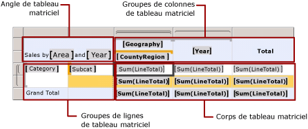
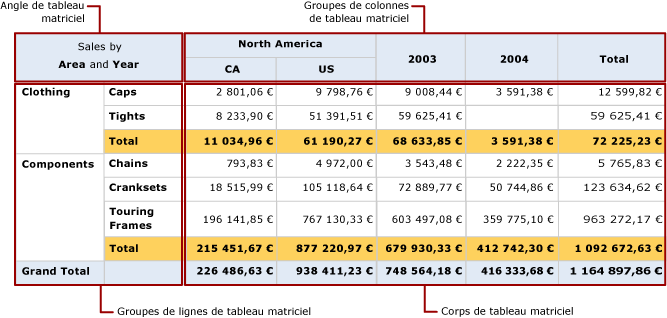

# Zones de région de données de tableau matriciel (Générateur de rapports et SSRS)
 Dans un rapport paginé [!INCLUDE[ssRSnoversion_md](../../includes/ssrsnoversion-md.md)] , une région de données de tableau matriciel a quatre zones qui contiennent des cellules de tableau matriciel :   
* L’angle  
* La zone de groupe de lignes  
* La zone de groupe de colonnes  
* Le corps   
  
Les cellules de chaque zone remplissent une fonction distincte. Les cellules ajoutées à la zone du corps du tableau matriciel permettent d'afficher des données détaillées ainsi que des données groupées. Le Générateur de rapports et le Concepteur de rapports ajoutent des cellules à la zone de groupe de lignes ou à la zone de groupe de colonnes lorsque vous créez un groupe pour afficher les valeurs d'instance de groupe. Le Générateur de rapports et le Concepteur de rapports créent des cellules d'angle de tableau matriciel lorsqu'il existe à la fois des groupes de lignes et des groupes de colonnes.  
  
Sur l'aire de conception, les traits en pointillés délimitent les quatre zones d'une région de données de tableau matriciel. L'illustration suivante montre les zones d'une région de tableau matriciel contenant : des groupes de lignes imbriqués dépendant de la catégorie et de la sous-catégorie, des groupes de colonnes imbriqués dépendant de la géographie, du pays et/ou de la région, ainsi qu'un groupe de colonnes adjacent dépendant de l'année.  
  
   
  
 La liste suivante présente chaque zone :  
  
-   **Zone de l’angle de tableau matriciel**. (Facultatif) L'angle du tableau matriciel se trouve en haut, à gauche ou en haut, à droite pour les dispositions de droite à gauche (RTL). Cette zone est créée automatiquement lorsque vous ajoutez des groupes de lignes et des groupes de colonnes à la région de données du tableau matriciel. Dans cette zone, vous pouvez fusionner des cellules et ajouter une étiquette ou incorporer un autre élément de rapport. Sur l'illustration donnée en exemple, les cellules fusionnées qui apparaissent dans l'angle affichent l'étiquette Ventes par zone et par année.  
  
-   **Zone des groupes de colonnes de tableau matriciel**. (Facultatif) Les groupes de colonnes du tableau matriciel se trouvent en haut, à droite (ou en haut, à gauche pour les dispositions RTL). Cette zone est créée automatiquement lorsque vous ajoutez un groupe de colonnes. Les cellules de cette zone contiennent les membres de la hiérarchie des groupes de colonnes et affichent les valeurs d'instance des groupes de colonnes. Dans l'illustration donnée en exemple, les cellules qui affichent les données [Geography] et [CountryRegion] correspondent à des groupes de colonnes imbriqués et la cellule qui affiche les données [Year] correspond à un groupe de colonnes adjacent. La colonne [Total] affiche les totaux agrégés sur chaque ligne.  
  
-   **Zone des groupes de lignes de tableau matriciel**. (Facultatif) Les groupes de lignes du tableau matriciel se trouvent en bas, à gauche (ou en bas, à droite pour les dispositions RTL). Cette zone est créée automatiquement lorsque vous ajoutez des groupes de lignes. Les cellules de cette zone contiennent les membres de la hiérarchie des groupes de lignes et affichent les valeurs d'instance du groupe de lignes. Dans l'illustration donnée en exemple, les cellules qui affichent les données [Category] et [Subcat] correspondent à des groupes de lignes imbriqués. La ligne Total située au-dessous des cellules Subcat est répétée pour chaque groupe de catégorie distinct afin d'afficher les sous-totaux agrégés de chaque colonne. La ligne du total global contient le total de toutes les catégories.  
  
-   **Zone du corps de tableau matriciel**. Le corps du tableau matriciel se trouve en bas, à droite (ou en bas, à gauche pour les dispositions RTL). Le corps du tableau matriciel affiche les données détaillées et les données groupées. Dans cet exemple, seules les données agrégées sont utilisées. L'étendue de l'expression est déterminée par les groupes, auxquels la zone de texte appartient, dont le niveau est le plus profond. Les cellules du corps du tableau matriciel affichent des données détaillées quand elles figurent dans des lignes de détail et des données agrégées quand elles appartiennent à des lignes ou colonnes associées à des groupes. Par défaut, les cellules des lignes ou colonnes de groupe qui contiennent des expressions simples ne comportant pas de fonction d'agrégation affichent la première valeur du groupe. Sur l'illustration donnée en exemple, les cellules affichent les totaux agrégés pour les totaux de ligne de l'intégralité des bons de commande.  
  
 Pendant l’exécution du rapport, les groupes de colonne s’affichent en détail sur la droite (ou sur la gauche, quand la propriété Direction de la région de données de tableau matriciel est définie sur RTL) pour chaque colonne définie, des valeurs uniques étant attribuées aux expressions de groupe. Les groupes de ligne s'affichent en détail en bas de la page. Pour plus d’informations, consultez [Cellules, lignes et colonnes de région de données de tableau matriciel &#40;Générateur de rapports et SSRS&#41;](../../reporting-services/report-design/tablix-data-region-cells-rows-and-columns-report-builder-and-ssrs.md).  
  
 L'illustration suivante montre la région de données du tableau matriciel telle qu'elle apparaît dans l'Aperçu.  
  
   
  
 La zone de groupe de lignes affiche deux instances de groupe de catégorie, l'une correspondant à la catégorie Clothing et l'autre à la catégorie Components. Le groupe de colonnes affiche une instance de groupe géographique correspondant à l'Amérique du Nord (North America) ainsi que des instances de groupe pays/région imbriquées correspondant respectivement au Canada (CA) et aux États-Unis (US). En outre, la colonne adjacente affiche deux instances de groupe pour les années 2003 et 2004. La ligne de colonne Total affiche les totaux de ligne, la ligne des totaux qui est répétée pour chaque groupe de catégorie affiche les totaux de sous-catégorie et la ligne du total global affiche les totaux de catégorie une seule fois pour la région de données.  
  
##  Voir aussi  
 [Tables, matrices et listes &#40;Générateur de rapports et SSRS&#41;](../../reporting-services/report-design/tables-matrices-and-lists-report-builder-and-ssrs.md)   
 [Didacticiels du Générateur de rapports](../../reporting-services/report-builder-tutorials.md)   
 [Tables &#40;Générateur de rapports et SSRS&#41;](../../reporting-services/report-design/tables-report-builder-and-ssrs.md)   
 [Créer une matrice](../../reporting-services/report-design/create-a-matrix-report-builder-and-ssrs.md)   
 [Créer des factures et des formulaires avec des listes](../../reporting-services/report-design/create-invoices-and-forms-with-lists-report-builder-and-ssrs.md)   
 [Région de données de tableau matriciel &#40;Générateur de rapports et SSRS&#41;](../../reporting-services/report-design/tablix-data-region-report-builder-and-ssrs.md)  
  
  
