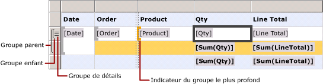
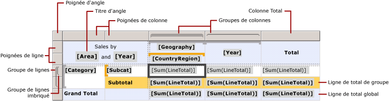
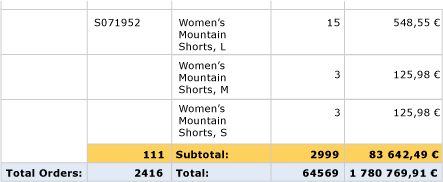

# Cellules, lignes et colonnes de région de données de tableau matriciel (Générateur de rapports et SSRS)
  Pour contrôler la façon dont les lignes et les colonnes d’une région de données de tableau matriciel présentent les données dans un rapport paginé [!INCLUDE[ssRSnoversion_md](../../includes/ssrsnoversion-md.md)] , vous devez comprendre comment les lignes et les colonnes sont spécifiées pour les données de détail, les données de groupe, les étiquettes et les totaux. Dans la plupart des cas, vous pouvez utiliser les structures par défaut pour afficher vos données dans une table, une matrice ou une liste. Pour plus d’informations, consultez [Tables &#40;Générateur de rapports et SSRS&#41;](../../reporting-services/report-design/tables-report-builder-and-ssrs.md), [Matrices](../../reporting-services/report-design/create-a-matrix-report-builder-and-ssrs.md) ou [Listes](../../reporting-services/report-design/create-invoices-and-forms-with-lists-report-builder-and-ssrs.md).  
  
 Une région de données de tableau matriciel affiche des données de détail dans des lignes et des colonnes de détail et des données groupées dans des lignes et des colonnes de groupe. Quand vous ajoutez des groupes de lignes et de colonnes à une région de données de tableau matriciel, les lignes et les colonnes dans lesquelles les données doivent s’afficher sont ajoutées automatiquement. Vous pouvez ajouter et supprimer manuellement des lignes et des colonnes pour personnaliser une région de données de tableau matriciel et contrôler la manière dont vos données s'affichent dans le rapport.  
  
 Pour comprendre comment personnaliser une région de données de tableau matriciel, vous devez d'abord comprendre comment interpréter les signaux visuels que vous voyez quand vous sélectionnez une région de données de tableau matriciel dans l'aire de conception.  
  
> [!NOTE]  
>  [!INCLUDE[ssRBRDDup](../../includes/ssrbrddup-md.md)]  
  
## Fonctionnement des signaux visuels de tableau matriciel  
 Les signaux visuels d’une région de données de tableau matriciel vous aident à afficher les données souhaitées de cette région.  
  
### Poignées de ligne et de colonne  
 Lorsque vous sélectionnez une région de données de tableau matriciel, les poignées graphiques de ligne et de colonne indiquent l'objectif de chaque ligne et colonne. Les handles indiquent les lignes et colonnes qui sont à l'intérieur ou à l'extérieur d'un groupe. Le tableau suivant vous présente divers handles.  
  
|Icône|Description|  
|----------|-----------------|  
||Seulement le groupe de détails dans la hiérarchie des groupes de lignes|  
||Un groupe externe et le groupe de détails enfant|  
||Un groupe externe, un groupe interne ; aucun groupe de détails|  
||Un groupe externe, un groupe interne et le groupe de détails enfant|  
||Un groupe externe avec une ligne de pied de page pour les totaux et un groupe interne|  
||Un groupe externe avec une ligne de pied de page pour les totaux, un groupe interne avec une ligne de pied de page pour les totaux, et une ligne de détail|  
||Un groupe externe avec un en-tête pour les étiquettes et un pied de page pour les totaux, et un groupe interne ; aucun groupe de détails|  
  
### Lignes de groupe  
 Les lignes à l'intérieur d'un groupe se répètent une seule fois par valeur de groupe unique et sont généralement utilisées pour les résumés agrégés. Les lignes à l'extérieur d'un groupe se répètent une seule fois pour ce groupe et sont utilisées pour les étiquettes ou les sous-totaux. Lorsque vous sélectionnez une cellule de tableau matriciel, les poignées et crochets de ligne et de colonne à l'intérieur de la région de données de tableau matriciel indiquent les groupes auxquels la cellule appartient. La figure illustre les signaux visuels suivants :  
  
-   Handles de ligne et de colonne qui indiquent des associations de groupe.  
  
-   Indicateurs de groupe mis en surbrillance qui affichent l'appartenance de groupe la plus interne pour une cellule sélectionnée.  
  
-   Indicateurs de groupe qui affichent toutes les appartenances de groupe pour une cellule sélectionnée.  
  
   
  
### Lignes de totaux  
 Après avoir ajouté des groupes de lignes et de colonnes, vous pouvez ajouter une ligne pour afficher les totaux des colonnes et une colonne pour afficher les totaux des lignes. La figure suivante illustre une matrice avec des groupes de lignes et de colonnes, une ligne de total et une colonne de total.  
  
   
  
### Volet de regroupement  
 Le volet Regroupement affiche les groupes de lignes et de colonnes pour la région de données de tableau matriciel actuellement sélectionnée dans l'aire de conception. La figure suivante illustre le volet Regroupement pour cette région de données de tableau matriciel.  
  
   
  
 Le volet Groupes de lignes contient le groupe parent Category et le groupe enfant Subcat. Le volet Groupes de colonnes affiche le groupe parent Geography et le groupe enfant CountryRegion, ainsi que le groupe Year, qui est un groupe adjacent au groupe Geography. Lorsque vous sélectionnez le groupe Subcat dans le volet Groupes de lignes, la barre de groupe prend une teinte plus sombre d'orange, et la cellule membre du groupe de lignes correspondante est sélectionnée dans l'aire de conception.  
  
## Affichage des données dans des lignes et des colonnes  
 Les lignes, les groupes de lignes, les colonnes et les groupes de colonnes ont des relations identiques. Les paragraphes suivants décrivent comment ajouter des lignes pour afficher des données de détail et de groupe dans les lignes d'une région de données de tableau matriciel, mais les mêmes principes s'appliquent à l'ajout de colonnes pour afficher des données de détail et groupées.  
  
 Chaque ligne dans une région de données de tableau matriciel se trouve à l'intérieur ou à l'extérieur de chaque groupe de lignes. Si la ligne se trouve à l’intérieur d’un groupe de lignes, elle se répète une fois pour chaque valeur unique du groupe ; c’est ce que l’on appelle une *instance de groupe*. Si la ligne est à l'extérieur d'un groupe de lignes, elle se répète une seule fois pour ce groupe. Les lignes à l'extérieur de tous les groupes de lignes sont statiques et se répètent une seule fois pour la région de données. Par exemple, un en-tête de table ou une ligne de pied de page est une ligne statique. Les lignes qui se répètent dans un groupe au moins sont dynamiques.  
  
 Pour les groupes imbriqués, une ligne peut être à l'intérieur d'un groupe parent mais à l'extérieur d'un groupe enfant. La ligne se répète pour chaque valeur de groupe du groupe parent, mais s'affiche une seule fois pour le groupe enfant. Pour afficher des étiquettes ou des totaux pour un groupe, ajoutez une ligne à l'extérieur du groupe. Pour afficher des données qui changent pour chaque instance de groupe, ajoutez une ligne à l'intérieur du groupe.  
  
 Pour les groupes de détails, chaque ligne de détail est à l'intérieur du groupe de détails. La ligne se répète pour chaque valeur dans le jeu de résultats de requête du dataset.  
  
 Pour plus d’informations sur les hiérarchies de groupe, consultez [Présentation des groupes &#40;Générateur de rapports et SSRS&#41;](../../reporting-services/report-design/understanding-groups-report-builder-and-ssrs.md).  
  
 La figure suivante illustre une région de données de tableau matriciel avec un groupe de détails et des groupes de lignes imbriqués.  
  
   
  
 Pour une région de données de tableau matriciel qui affiche des données de détail, le groupe de détails est le groupe enfant le plus profond. Les lignes que vous ajoutez à un groupe de détails se répètent une fois par ligne dans le jeu de résultats de la requête pour le dataset lié à cette région de données de tableau matriciel. La figure suivante illustre la dernière page du rapport rendu. Dans cette figure, vous pouvez voir les dernières lignes de détail et la ligne de sous-total pour la dernière commande.  
  
   
  
 Pour chaque colonne d'une région de données de tableau matriciel, les mêmes principes s'appliquent. Par exemple, une colonne est soit à l'intérieur, soit à l'extérieur de chaque groupe de colonnes ; pour afficher des totaux, ajoutez une colonne à l'extérieur du groupe.  
  
 Pour supprimer des lignes et des colonnes associées à un groupe, vous pouvez supprimer ce groupe. Lorsque vous supprimez un groupe, vous avez le choix entre supprimer la définition de groupe uniquement et supprimer le groupe et toutes ses lignes et colonnes associées. En supprimant le groupe uniquement, vous conservez la mise en forme des lignes et colonnes dans la région de données. Lorsque vous supprimez le groupe et ses lignes et colonnes associées, vous supprimez toutes les lignes et colonnes statiques (y compris les en-têtes et pieds de page de groupe) et toutes les lignes et colonnes dynamiques (y compris les instances de groupe) associées à ce groupe.  
  
 Pour obtenir des instructions détaillées sur l’ajout ou la suppression de lignes et de colonnes, consultez [Insérer ou supprimer une ligne &#40;Générateur de rapports et SSRS&#41;](../../reporting-services/report-design/insert-or-delete-a-row-report-builder-and-ssrs.md) et [Insérer ou supprimer une colonne &#40;Générateur de rapports et SSRS&#41;](../../reporting-services/report-design/insert-or-delete-a-column-report-builder-and-ssrs.md).  
  
## Fonctionnement des cellules de tableau matriciel  
 Les cellules de tableau matriciel appartiennent à l'une de quatre zones de tableau matriciel : le corps, les groupes de lignes ou de colonnes, ou l'angle de tableau matriciel. Bien que chaque cellule puisse afficher potentiellement toute valeur dans le dataset, la fonction par défaut de chaque cellule est déterminée par son emplacement. Pour plus d’informations sur les zones de tableau matriciel, consultez [Zones de région de données de tableau matriciel &#40;Générateur de rapports et SSRS&#41;](../../reporting-services/report-design/tablix-data-region-areas-report-builder-and-ssrs.md).  
  
 Par défaut, les cellules contenues dans les zones de groupes de lignes et de colonnes de tableau matriciel représentent des membres de ces groupes. Les membres de chaque groupe sont organisés en plusieurs arborescences dans la définition de rapport. La hiérarchie des groupes de lignes se développe horizontalement. La hiérarchie des groupes de colonnes se développe verticalement. Ces cellules sont automatiquement ajoutées lorsque vous créez un groupe, et affichent les valeurs uniques d'un groupe au moment de l'exécution.  
  
 Les cellules d'angle de tableau matriciel sont créées lorsqu'il existe des groupes de lignes et de colonnes. Vous pouvez fusionner les cellules de cette zone pour créer une étiquette ou incorporer un autre élément de rapport.  
  
 Les cellules de la zone du corps de tableau matriciel peuvent afficher des données de détail lorsque la cellule est dans une ligne ou une colonne de détail et des données de groupe agrégées lorsque la cellule est dans une ligne ou une colonne de groupe. L'étendue des données d'une cellule s'étend à l'intersection avec les groupes de lignes et de colonnes les plus internes auxquels la cellule appartient.  
  
> [!NOTE]  
>  Les données effectives affichées pour chaque cellule sont l'expression évaluée pour l'élément de rapport que la cellule contient, en général une zone de texte. Dans une cellule qui appartient à une ligne ou une colonne de détail, l’expression a comme valeur par défaut les données de détail (par exemple, **[LineTotal])**. Dans une cellule qui n’appartient pas à une ligne ou une colonne de détail, l’expression a pour valeur par défaut une fonction d’agrégation (par exemple, **Sum[LineTotal])**. Si une expression ne spécifie pas de fonction d'agrégation bien que la cellule appartienne à une ligne ou une colonne de groupe, la première valeur dans le groupe est affichée. Pour plus d’informations sur les agrégats, consultez [Étendue des expressions pour les totaux, les agrégats et les collections intégrées &#40;Générateur de rapports et SSRS&#41;](../../reporting-services/report-design/expression-scope-for-totals-aggregates-and-built-in-collections.md).  
  
### Fusion et fractionnement de cellules  
 À l’intérieur d’une zone de tableau matriciel, vous pouvez fusionner plusieurs cellules adjacentes. Par exemple, vous pouvez créer des cellules pour les étiquettes qui couvrent plusieurs colonnes ou lignes.  
  
 Dans la zone d'angle de tableau matriciel, les cellules peuvent être combinées dans une seule direction à la fois : horizontalement par colonnes ou verticalement par lignes. Pour fusionner un bloc de cellules, commencez par fusionner horizontalement les cellules. Après avoir fusionné en une cellule unique toutes les cellules de chaque ligne, sélectionnez des cellules adjacentes (vous pouvez sélectionner toutes les cellules adjacentes dans une colonne) et fusionnez-les.  
  
 Dans la zone du corps de tableau matriciel, les cellules peuvent seulement être fusionnées horizontalement. La fusion verticale des cellules n'est pas prise en charge.  
  
 Pour plus d’informations, consultez [Fusionner des cellules dans une région de données &#40;Générateur de rapports et SSRS&#41;](../../reporting-services/report-design/merge-cells-in-a-data-region-report-builder-and-ssrs.md).  
  
 Vous pouvez fractionner une cellule précédemment fusionnée. Vous pouvez fractionner des cellules horizontalement par colonnes ou verticalement par lignes. Pour fractionner une cellule en un bloc de cellules, commencez par fractionner horizontalement la cellule, puis fractionnez-la verticalement autant de fois que nécessaire.  
  
##  Voir aussi  
 [Région de données de tableau matriciel &#40;Générateur de rapports et SSRS&#41;](../../reporting-services/report-design/tablix-data-region-report-builder-and-ssrs.md)  
  
  
