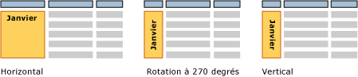

# Zones de texte (Générateur de rapport et SSRS)
  Pour vous, une zone de texte désigne probablement une zone autonome qui contient du texte sur une surface comme [!INCLUDE[msCoName](../../includes/msconame-md.md)] Office PowerPoint. Les rapports paginés [!INCLUDE[ssRSnoversion_md](../../includes/ssrsnoversion-md.md)] utilisent des zones de texte de ce type pour afficher le texte statique des titres, des descriptions et des étiquettes, ou le texte dynamique basé sur des expressions. Toutefois, chaque cellule d’une table ou d’une matrice (région de données de tableau matriciel) contient également une zone de texte, que vous pouvez mettre en forme de la même manière que les zones de texte autonomes de votre rapport.  
  
> [!NOTE]  
>  Si vous faites glisser une valeur de champ de dataset de rapport directement vers l'aire de conception ou vers une zone de texte de l'aire de conception du rapport, seule la première valeur du jeu de résultats est visible lorsque vous exécutez le rapport. Pour afficher toutes les valeurs pour un champ, vous devez d’abord créer une région de données de table, de matrice ou de liste, puis faire glisser le champ vers une cellule de la région de données. Ainsi, lorsque vous exécuterez le rapport, vous verrez toutes les valeurs dans ce champ.  
  
 Pour afficher du texte récurrent dans une disposition de forme libre, créez une région de données de liste et placez-y la zone de texte. Utilisez une liste lorsque vous souhaitez répéter un formulaire pour plusieurs valeurs, par exemple une facture client utilisée une seule fois pour chaque client. En savoir plus sur la [création de factures et de formulaires avec des listes](../../reporting-services/report-design/create-invoices-and-forms-with-lists-report-builder-and-ssrs.md).  
  
 Utilisez un conteneur rectangle lorsque vous souhaitez contrôler la disposition des zones de texte et l'espace blanc en dessous de la dernière zone de texte. Pour plus d’informations, consultez [Rectangles et lignes &#40;Générateur de rapports et SSRS&#41;](../../reporting-services/report-design/rectangles-and-lines-report-builder-and-ssrs.md).  
  
 Les expressions dans une zone de texte peuvent contenir du texte littéral, pointer vers un champ de la base de données ou calculer des données. Toutes les expressions sont affichées sous la forme de texte d'espace réservé de sorte que vous pouvez mettre en forme des nombres, des couleurs et d'autres propriétés d'apparence. Vous pouvez également combiner des espaces réservés avec le texte littéral dans la même zone de texte.  
  
 Vous pouvez mettre en forme le texte dans toute zone de texte unique en utilisant plusieurs polices, couleurs, styles et actions. Pour plus d’informations, consultez [Mise en forme du texte et des espaces réservés &#40;Générateur de rapports et SSRS&#41;](../../reporting-services/report-design/formatting-text-and-placeholders-report-builder-and-ssrs.md).  
  
> [!NOTE]  
>  [!INCLUDE[ssRBRDDup](../../includes/ssrbrddup-md.md)]  
  
##   Agrandissement et réduction d'une zone de texte  
 Par défaut, les zones de texte ont une taille fixe. Vous pouvez autoriser la réduction ou l'agrandissement d'une zone de texte de manière verticale en fonction de son contenu. Pour plus d’informations, consultez [Autoriser l’agrandissement ou la réduction d’une zone de texte &#40;Générateur de rapports et SSRS&#41;](../../reporting-services/report-design/allow-a-text-box-to-grow-or-shrink-report-builder-and-ssrs.md).  
  
## Rotation d’une zone de texte  
 La rotation des zones de texte peut vous aider à améliorer la lisibilité de vos rapports, à prendre en charge l’orientation de texte spécifique aux paramètres régionaux, à ajuster plus de colonnes dans un rapport imprimé ayant une taille de page fixe et à créer des rapports avec un contenu plus graphique. Une zone de texte peut être pivotée dans différentes directions : horizontalement, verticalement (avec une rotation de 90 degrés) ou selon une rotation de 270 degrés. L'option verticale est utilisée le plus communément pour les langues asiatiques qui sont écrites de haut en bas. Dans la plupart des convertisseurs, l’option verticale gère correctement la propriété de rotation du glyphe pour que le texte soit écrit de haut en bas, mais les caractères ne figurent pas sur leurs côtés. Pour d'autres langues, le texte orienté verticalement et selon une rotation à 270 degrés est écrit obliquement.  
  
 Vous pouvez faire pivoter des zones de texte qui contiennent du texte statique, des champs d’un dataset de rapport ou des données calculées. La zone de texte peut être autonome dans le corps d’un rapport, dans une table ou une matrice, ou dans un en-tête ou pied de page de rapport.  
  
 L'image suivante affiche trois versions d'un rapport de tableau qui regroupe des données par mois. La zone de texte qui contient la valeur de mois utilise une orientation de zone de texte différente.  
  
   
  
 L'orientation est définie sur la zone de texte et s'applique à tout le texte de la zone. Vous ne pouvez pas spécifier d'orientation différente pour certaines parties de la zone de texte.  
  
 Pour commencer, consultez la section sur la rotation du texte dans [Didacticiel : mettre en forme du texte &#40;Générateur de rapports&#41;](../../reporting-services/tutorial-format-text-report-builder.md) et consultez [Définir l’orientation d’une zone de texte &#40;Générateur de rapports et SSRS&#41;](../../reporting-services/report-design/set-text-box-orientation-report-builder-and-ssrs.md).  
  
##   Rubriques de procédures  
 [Ajouter, déplacer ou supprimer une zone de texte &#40;Générateur de rapports et SSRS&#41;](../../reporting-services/report-design/add-move-or-delete-a-text-box-report-builder-and-ssrs.md)  
  
 [Mettre en forme du texte dans une zone de texte &#40;Générateur de rapports et SSRS&#41;](../../reporting-services/report-design/format-text-in-a-text-box-report-builder-and-ssrs.md)  
  
 [Définir l’orientation d’une zone de texte &#40;Générateur de rapports et SSRS&#41;](../../reporting-services/report-design/set-text-box-orientation-report-builder-and-ssrs.md)  
  
 [Autoriser l’agrandissement ou la réduction d’une zone de texte &#40;Générateur de rapports et SSRS&#41;](../../reporting-services/report-design/allow-a-text-box-to-grow-or-shrink-report-builder-and-ssrs.md)  
  
##  Voir aussi  
 [Mise en forme du texte et des espaces réservés &#40;Générateur de rapports et SSRS&#41;](../../reporting-services/report-design/formatting-text-and-placeholders-report-builder-and-ssrs.md)   
 [Mise en forme des nombres et des dates &#40;Générateur de rapports et SSRS&#41;](../../reporting-services/report-design/formatting-numbers-and-dates-report-builder-and-ssrs.md)  
  
  
