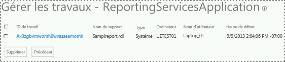

# <a name="manage-a-reporting-services-sharepoint-service-application"></a>Gérer une application de service Reporting Services SharePoint

[!INCLUDE[ssrs-appliesto](../../includes/ssrs-appliesto.md)] [!INCLUDE[ssrs-appliesto-2016](../../includes/ssrs-appliesto-2016.md)] [!INCLUDE[ssrs-appliesto-sharepoint-2013-2016i](../../includes/ssrs-appliesto-sharepoint-2013-2016.md)] [!INCLUDE[ssrs-appliesto-not-pbirsi](../../includes/ssrs-appliesto-not-pbirs.md)])

[!INCLUDE [ssrs-previous-versions](../../includes/ssrs-previous-versions.md)]

  Les applications de service [!INCLUDE[ssRSnoversion](../../includes/ssrsnoversion-md.md)] sont gérées à partir de l’Administration centrale de SharePoint. Les pages de gestion et des propriétés vous permettent de mettre à jour la configuration de l'application de service ainsi que les tâches d'administration courantes.  

> [!NOTE]
> L’intégration de Reporting Services à SharePoint n’est plus disponible après SQL Server 2016.

## <a name="open-service-application-properties-page"></a>Ouvrir la page des propriétés d’une application de service

 Pour ouvrir la page des propriétés pour une application de service [!INCLUDE[ssRSnoversion](../../includes/ssrsnoversion-md.md)] , procédez comme suit :  
  
1.  Dans l'Administration Centrale, sous le groupe Gestion des applications, cliquez sur **Gérer les applications de service**.  
  
2.  Cliquez à côté du nom de votre application de service ou sur la colonne **type** pour sélectionner toute la ligne, puis cliquez sur **Propriétés** dans le ruban SharePoint.  
  
 Pour plus d'informations sur les propriétés d'application de service, consultez [Step 3: Create a Reporting Services Service Application](../../reporting-services/install-windows/install-the-first-report-server-in-sharepoint-mode.md#bkmk_create_serrviceapplication).  
  
## <a name="open-service-application-management-pages"></a>Ouvrir les pages de gestion d’une application de service

 Pour ouvrir les pages de gestion d'une application de service [!INCLUDE[ssRSnoversion](../../includes/ssrsnoversion-md.md)] , procédez comme suit :  
  
1.  Dans l'Administration Centrale, sous le groupe Gestion des applications, cliquez sur **Gérer les applications de service**.  
  
2.  Cliquez sur le nom de votre application de service, la page **Gérer l'application Reporting Services** s'ouvre.  
  
3.  Vous pouvez également cliquer à côté du nom de votre application de service ou sur la colonne **type** correspondante pour sélectionner toute la ligne, puis cliquer sur **Gérer** dans le ruban SharePoint.  
  
## <a name="system-settings-page"></a>Page des paramètres système

 La page des paramètres système vous permet de configurer le comportement et l'expérience de l'utilisateur de votre application de service, y compris les différents délais d'attente.
  
### <a name="report-settings"></a>Paramètres de rapport
  
|Paramètre|Commentaires|  
|-------------|--------------|  
|Délai d'expiration des images externes|La valeur par défaut est 600 secondes.|  
|Compression de capture instantanée|La valeur par défaut est SQL.|  
|Délai d'expiration des rapports système|La valeur par défaut est 1800 secondes.<br /><br /> Spécifie si le traitement d'un rapport expire après un certain nombre de secondes sur le serveur de rapports. Cette valeur s'applique au traitement du rapport sur le serveur de rapports. Elle n'a aucune incidence sur le traitement des données sur le serveur de base de données qui fournit les données pour le rapport. La minuterie du traitement du rapport commence lorsque le rapport est sélectionné et s'arrête lors de l'ouverture du rapport. La valeur que vous spécifiez doit être suffisante pour terminer le traitement des données et du rapport.|  
|Limite des captures instantanées système|La valeur par défaut est -1, indiquant aucune limite.<br /><br /> Sélectionnez une valeur par défaut à l'échelle du site pour déterminer le nombre de copies que l'historique de rapport peut conserver. La valeur par défaut donne un paramètre de départ qui établit le nombre d'instantanés qui peuvent être stockés pour chaque rapport. Vous pouvez spécifier des limites différentes dans les pages de propriétés de rapports particuliers.|  
|Durée de vie des paramètres stockés|La valeur par défaut est 180.|  
|Seuil des paramètres stockés|La valeur par défaut est 1500 jours.|  
  
### <a name="session-settings"></a>Paramètres de session
  
|Paramètre|Commentaires|  
|-------------|--------------|  
|Délai d'expiration de session|La valeur par défaut est 600 secondes.|  
|Utiliser des cookies de session|La valeur par défaut est TRUE.|  
|Délai d'attente de rapport d'EDLX|La valeur par défaut est 1800 secondes.|  
  
### <a name="system-settings-for-logging"></a>Paramètres système pour la journalisation
  
|Paramètre|Commentaires|  
|-------------|--------------|  
|Activer la journalisation des exécutions|La valeur par défaut est TRUE.<br /><br /> Vous pouvez spécifier si le serveur de rapports génère des journaux de traces et le nombre de jours pendant lesquels ces journaux sont conservés. . Les journaux sont stockés sur l'ordinateur serveur de rapports dans le dossier \Microsoft SQL Server\MSSQL.n\ReportServer\Log. Un nouveau fichier journal est démarré chaque fois que le service est démarré. Pour plus d'informations sur les fichiers journaux, consultez [Report Server Service Trace Log](../../reporting-services/report-server/report-server-service-trace-log.md).|  
|Nombre de jours de conservation dans le journal des exécutions|La valeur par défaut est 60 jours.|  
  
 [!INCLUDE[ssRSnoversion](../../includes/ssrsnoversion-md.md)] prend en charge la journalisation ULS SharePoint.  Pour plus d’informations, consultez [Activer des événements Reporting Services pour le journal des traces SharePoint &#40;ULS&#41;](../../reporting-services/report-server/turn-on-reporting-services-events-for-the-sharepoint-trace-log-uls.md)  
  
### <a name="security-settings"></a>Paramètres de sécurité
  
|Paramètre|Commentaires|  
|-------------|--------------|  
|Activer la sécurité intégrée|La valeur par défaut est TRUE.<br /><br /> Spécifie si une connexion à une source de données de rapport peut être établie à l'aide du jeton de sécurité Windows de l'utilisateur qui a demandé le rapport.|  
|Activer la définition de rapport de chargement|La valeur par défaut est TRUE.|  
|Activer les erreurs distantes|La valeur par défaut est FALSE.|  
|Activer les erreurs détaillées de test de connexion|La valeur par défaut est TRUE.|  
  
### <a name="client-settings"></a>Paramètres du client
  
|Paramètre|Commentaires|  
|-------------|--------------|  
|Activer le téléchargement du Générateur de rapports|La valeur par défaut est TRUE.<br /><br /> Spécifie si les clients peuvent voir le bouton de téléchargement de l'application du générateur de rapports.|  
|URL de lancement du Générateur de rapports|Spécifie une URL personnalisée lorsque le serveur de rapports n'utilise pas l'URL par défaut du Générateur de rapports. Ce paramètre est facultatif. Si vous ne spécifiez pas de valeur, l'URL par défaut est utilisée, laquelle lance le Générateur de rapports. Pour lancer le Générateur de rapports 3.0 en tant qu’application ClickOnce, entrez la valeur suivante : http://\<nom_ordinateur>/ReportServer/ReportBuilder/ReportBuilder_3_0_0_0.application.|  
|Activer l'impression cliente|La valeur par défaut est TRUE.<br /><br /> Spécifie si les utilisateurs peuvent télécharger le contrôle côté client, qui fournit des options d'impression.|  
|Modifier le délai d'expiration de la session|La valeur par défaut est 7200 secondes.|  
|Modifier la limite du cache de sessions|La valeur par défaut est 5.|  
  
## <a name="manage-jobs"></a>Gérer les travaux

 Vous pouvez afficher et supprimer les travaux en cours de exécution, par exemple les travaux qui sont créés par les abonnements aux rapports et les abonnements pilotés par les données. Cette page ne permet pas de gérer les abonnements, mais les travaux qui sont déclenchés par un abonnement. Par exemple, un abonnement qui est planifié pour s'exécuter une fois par heure génère un travail une fois par heure, lequel apparaît sur la page **Gérer les travaux** .  
  
   
  
## <a name="key-management"></a>Gestion des clés
 Le tableau suivant résume les pages de gestion des clés  
  
> [!IMPORTANT]  
>  Par mesure de sécurité, il est recommandé de modifier régulièrement la clé de chiffrement Reporting Services. Il est recommandé de modifier la clé juste après la mise à niveau d'une version principale de Reporting Services. La modification de la clé après une mise à niveau réduit l'interruption de service provoquée par la modification de la clé de chiffrement Reporting Services hors du cycle de mise à niveau.  
  
|Radiomessagerie|Description|  
|----------|-----------------|  
|Sauvegarder la clé de chiffrement|1) Tapez un mot de passe dans les zones **Mot de passe** et **Confirmer le mot de passe** , puis cliquez sur **Exporter**. Vous obtiendrez un avertissement si le mot de passe que vous avez tapé ne répond pas aux exigences de complexité de la stratégie de domaine.<br /><br /> 2) Vous serez invité à saisir un emplacement où enregistrer le fichier de clé. Il est conseillé de stocker le fichier de clé sur un ordinateur différent de celui qui exécute [!INCLUDE[ssRSnoversion](../../includes/ssrsnoversion-md.md)]. Le nom du fichier par défaut est le même que celui de l'application de service.|  
|Restaurer la clé de chiffrement|1) Tapez le fichier de clé ou accédez-y dans la zone **Emplacement du fichier** .<br /><br /> 2) Dans la zone **Mot de passe** , tapez le mot de passe utilisé pour sauvegarder le fichier de chiffrement.<br /><br /> 3) Cliquez sur **OK**.|  
|Modifier la clé de chiffrement|Cette opération crée une nouvelle clé et re-chiffre votre contenu chiffré. Si vous avez beaucoup de contenus, cette opération peut prendre plusieurs heures.<br /><br /> Lorsque l'opération de modification de la clé de chiffrement est terminée, il est recommandé d'enregistrer une copie de sauvegarde de votre nouvelle clé.|  
|Contenu chiffré supprimé|Le contenu supprimé ne peut pas être extrait.<br /><br /> **\*\* Important \*\*** La suppression de la clé symétrique ou la création d’une nouvelle clé ne peut être ni inversée ni annulée. La suppression de la clé symétrique ou la création d'une nouvelle clé peut avoir d'importantes conséquences sur votre installation actuelle. Si vous supprimez la clé, toute donnée existante chiffrée par la clé symétrique sera également supprimée. Les données supprimées incluent les chaînes de connexion aux sources de données de rapport externes, les chaînes de connexion stockées et certaines informations d'abonnement.|  

## <a name="execution-account"></a>Compte d’exécution

 Utilisez cette page pour configurer un compte à utiliser pour le traitement sans assistance. Ce compte est utilisé dans des circonstances particulières lorsque d'autres sources d'informations d'identification ne sont pas disponibles :  
  
-   lorsque le serveur de rapports se connecte à une source de données qui n'exige pas d'informations d'identification ; les documents XML et certaines applications de base de données côté client sont des exemples de sources de données qui n'ont pas nécessairement besoin d'informations d'identification.  
  
-   lorsque le serveur de rapports se connecte à un autre serveur pour extraire des fichiers image externes ou d'autres ressources référencées dans un rapport.  

 La définition de ce compte est facultative, mais si vous ne définissez pas le compte, l'utilisation des images externes et des connexions à certaines sources de données est limitée. Lorsque vous récupérez des fichiers image externes, le serveur de rapports vérifie si une connexion anonyme peut être établie. Si la connexion est protégée par mot de passe, le serveur de rapports utilise le compte de traitement sans assistance pour se connecter au serveur de rapports. Lors de l'extraction des données pour un rapport, le serveur de rapports emprunte l'identité de l'utilisateur actuel, invite l'utilisateur à fournir des informations d'identification, utilise des d'informations d'identification stockées ou utilise le compte de traitement sans assistance si la connexion de la source de données spécifie **Aucun** comme type d'informations d'identification. Le serveur de rapports n'autorise pas la délégation ou l'emprunt d'identité des informations d'identification de son compte de service lors de la connexion à d'autres ordinateurs. Par conséquent, il doit utiliser le compte de traitement sans assistance si aucune information d'identification n'est disponible.  

 Le compte que vous spécifiez doit être différent de celui utilisé pour exécuter le compte de service. Si vous exécutez le serveur de rapports dans un déploiement avec montée en puissance parallèle, vous devez configurer ce compte de la même façon sur chaque serveur de rapports.  

 Vous pouvez utiliser n'importe quel compte d'utilisateur Windows. Pour optimiser les résultats, choisissez un compte possédant des autorisations en lecture et des autorisations de connexion réseau afin de prendre en charge les connexions à d'autres ordinateurs. Il doit posséder des autorisations en lecture sur un fichier de données ou image externe que vous voulez utiliser dans un rapport. Ne spécifiez pas un compte local sauf si toutes les images externes et les sources de données de rapport sont stockées sur l'ordinateur du serveur de rapports. Utilisez le compte uniquement pour le traitement sans assistance des rapports.  

 ### <a name="powershell-command"></a>Commande PowerShell

 L'exemple suivant est une commande PowerShell qui retourne la liste des applications de service [!INCLUDE[ssRSnoversion](../../includes/ssrsnoversion-md.md)] avec la propriété UEAccount :  

```
Get-SPRSServiceApplication | select typename, name, service, ueaccountname  
```

 Pour plus d’informations, consultez [Applets de commande PowerShell pour le mode SharePoint de Reporting Services](../../reporting-services/report-server-sharepoint/powershell-cmdlets-for-reporting-services-sharepoint-mode.md).  

### <a name="options"></a>Options

 **Spécifier un compte d'exécution**  
 Sélectionnez un compte.  
  
 **Compte**  
 Entrez un compte d'utilisateur de domaine Windows. Utilisez le format suivant : *\<domaine>\\<compte_utilisateur\>*.  
  
 **Mot de passe**  
 Tapez le mot de passe.  
  
 **Confirmer le mot de passe**  
 Tapez de nouveau le mot de passe.  

## <a name="e-mail-settings"></a>Paramètres d’e-mail

 Utilisez cette page pour spécifier les paramètres du protocole SMTP (Simple Mail Transfer Protocol) qui activent la remise du courrier électronique à partir du serveur de rapports. Vous pouvez utiliser l'extension de remise du courrier électronique Report Server pour distribuer des rapports ou des notifications de traitement de rapport par le biais d'abonnements à la messagerie. L'extension de remise par messagerie Report Server nécessite un serveur SMTP et une adresse de messagerie à utiliser dans le champ De :.  

### <a name="options"></a>Options

 **Utiliser le serveur SMTP**  
 Spécifie que le message du serveur de rapports est acheminé par le biais d'un serveur SMTP.  
  
 **Serveur SMTP sortant**  
 Spécifiez le serveur ou la passerelle SMTP à utiliser. Vous pouvez utiliser un serveur local ou un serveur SMTP sur votre réseau.  
  
 **Adresse d'expéditeur**  
 Spécifie l'adresse de messagerie à utiliser dans le champ De : d'un message généré. Vous devez spécifier un compte d'utilisateur qui a l'autorisation d'envoyer du courrier depuis le serveur SMTP.  

## <a name="provision-subscriptions-and-alerts"></a>Configurer les abonnements et les alertes

 Utilisez cette page pour vérifier si SQL Server Agent s'exécute et pour mettre en service un accès permettant à Reporting Services de l'utiliser. SQL Server Agent est requis pour les abonnements [!INCLUDE[ssRSnoversion](../../includes/ssrsnoversion-md.md)] , les planifications et les alertes de données. [Approvisionner les abonnements et les alertes pour les applications de service de SSRS](../../reporting-services/install-windows/provision-subscriptions-and-alerts-for-ssrs-service-applications.md)  

## <a name="proxy-association"></a>Association de proxy

 Lorsque vous avez créé l'application de service Reporting Services, vous avez sélectionné l'application Web pour associer et mettre en service les autorisations d'accès de celle-ci. Si vous choisissez de ne pas les associer ou si vous souhaitez modifier l'association, suivez les étapes suivantes.  
  
1.  Dans l'Administration Centrale de SharePoint, sous Gestion des applications, cliquez sur **Configurer les associations des applications de service**.  
  
2.  Dans la page des Associations de l'application de service, modifiez la vue en **Applications de service**.  
  
3.  Recherchez et cliquez sur le nom de votre nouvelle application de service [!INCLUDE[ssRSnoversion](../../includes/ssrsnoversion-md.md)] . Vous pourriez cliquer également sur la **valeur par défaut** du nom de groupe du proxy de l'application pour ajouter le proxy au groupe par défaut plutôt que compléter les étapes suivantes.  
  
4.  Sélectionnez **Personnalisé** dans la zone de sélection **Modifier le groupe de connexions suivant :**.  
  
5.  Activez la zone pour votre proxy et cliquez sur **OK**.  
  
D’autres questions ? [Essayez de poser une question dans le forum Reporting Services](http://go.microsoft.com/fwlink/?LinkId=620231)
