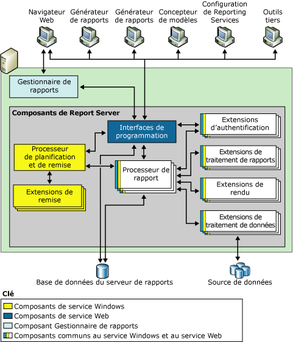
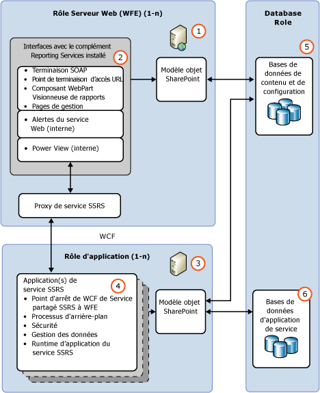

# Serveur de rapports Reporting Services

[!INCLUDE[ssrs-appliesto](../../includes/ssrs-appliesto.md)] [!INCLUDE[ssrs-appliesto-2016-and-later](../../includes/ssrs-appliesto-2016-and-later.md)] [!INCLUDE[ssrs-appliesto-sharepoint-2013-2016i](../../includes/ssrs-appliesto-sharepoint-2013-2016.md)] [!INCLUDE[ssrs-appliesto-pbirsi](../../includes/ssrs-appliesto-pbirs.md)])

[!INCLUDE [ssrs-previous-versions](../../includes/ssrs-previous-versions.md)]

Découvrez la pièce centrale d’une installation [!INCLUDE[ssNoVersion](../../includes/ssnoversion-md.md)] Reporting Services. Il s’agit d’un moteur de traitement et d’extensions permettant d’ajouter des fonctionnalités.

> [!NOTE]
> L’intégration de Reporting Services à SharePoint n’est plus disponible après SQL Server 2016.

Un serveur de rapports Reporting Services s’exécute dans l’un des deux modes de déploiement : le mode natif ou le mode SharePoint. Consultez la section [Comparaison des fonctionnalités du mode natif et du mode SharePoint](#bkmk_featuresupport) pour obtenir une comparaison des fonctionnalités.  
  
 **Installation :** pour plus d’informations sur l’installation de Reporting Services, consultez [Installer SQL Server Reporting Services](../install-windows/install-reporting-services.md).

## Présentation des modes du serveur de rapports

 Les moteurs de traitement (processeurs) sont le cœur du serveur de rapports. Ils prennent en charge l'intégrité du système de rapports et ne peuvent être ni modifiés ni étendus. Les extensions sont également des processeurs, mais elles réalisent des fonctions très spécifiques. Reporting Services comprend une ou plusieurs extensions par défaut pour chaque type d’extension prise en charge. Vous pouvez ajouter des extensions personnalisées à un serveur de rapports. Cela vous permet d'étendre un serveur de rapports pour prendre en charge des fonctionnalités qui ne sont pas prises en charge par défaut. Ces fonctionnalités personnalisées comprennent notamment la prise en charge de technologies d'authentification unique, la génération de rapports dans des formats d'application qui ne sont pas gérés par les extensions de rendu par défaut et la remise de rapports à une imprimante ou une application.  
  
 Une instance de serveur de rapports unique est définie par la collection complète des processeurs et des extensions qui fournissent le traitement de bout en bout, de la gestion de la demande initiale à la présentation d'un rapport fini. Grâce à ses sous-composants, le serveur de rapports traite les demandes de rapports et tient à disposition les rapports pour l'accès à la demande ou la distribution planifiée.  
  
 Un serveur de rapports active sur le plan fonctionnel les expériences de création, de génération et de remise de rapports pour différentes sources de données, ainsi que l'authentification extensible et les schémas d'autorisation. De plus, un serveur de rapports contient des bases de données de serveurs de rapports qui stockent les rapports publiés, les sources de données partagées, les datasets partagés, des parties de rapports, les abonnements et les planifications partagés, les fichiers source de définition de rapport, les définitions de modèle, les rapports compilés, les instantanés, les paramètres, ainsi que d'autres ressources. Un serveur de rapports permet également d'administrer la configuration pour traiter les demandes de rapports, conserver les historiques d'instantanés et gérer les autorisations pour les rapports, les sources de données, les datasets et les abonnements.  
  
 Un serveur de rapports Reporting Services prend en charge deux modes de déploiement de ses instances :  
  
-   **Mode natif**, incluant le mode natif avec les composants WebPart SharePoint, dans lequel un serveur de rapports s’exécute en tant que serveur d’applications qui fournit toutes les fonctions de traitement et de gestion exclusivement via les composants Reporting Services. Vous configurez un serveur de rapports en mode natif à l’aide du Gestionnaire de configuration de Reporting Services et de SQL Server Management Studio.  
  
-   **Mode SharePoint**, dans lequel un serveur de rapports est installé dans le cadre d'une batterie de serveurs SharePoint.  Déployez et configurez le mode SharePoint à l'aide de commandes PowerShell ou des pages de gestion de contenu SharePoint.  
  
 Dans SQL Server Reporting Services, vous ne pouvez pas basculer un serveur de rapports d’un mode à un autre. Si vous souhaitez modifier le type de serveur de rapports utilisé par votre environnement, vous devez installer le mode du serveur de rapports souhaité, puis copier ou déplacer les éléments de rapport ou la base de données du serveur de rapports de l'ancien serveur de rapports avec version vers le nouveau serveur de rapports. Ce processus est habituellement désigné sous le terme de « migration ». Les étapes nécessaires pour la migration dépendent du mode vers lequel vous effectuez la migration et de la version d'origine de la migration. Pour plus d'informations, consultez [Upgrade and Migrate Reporting Services](../../reporting-services/install-windows/upgrade-and-migrate-reporting-services.md)  
  
## Comparaison des fonctionnalités du mode natif et du mode SharePoint
  
|Fonctionnalité ou composant|en mode natif|Mode SharePoint|  
|--------------------------|-----------------|---------------------|  
|**Adressage URL**|Oui|L'adressage des URL est différent en mode intégré SharePoint. Les URL SharePoint sont utilisées pour référencer des rapports, des modèles de rapport, des sources de données partagées et des ressources. L'arborescence des dossiers du serveur de rapports n'est pas utilisée. Si vous possédez des applications personnalisées qui reposent sur un accès URL pris en charge sur un serveur de rapports en mode natif, ces fonctionnalités ne fonctionneront plus lorsque le serveur de rapports sera configuré pour l'intégration SharePoint.   Pour plus d’informations sur l’accès URL, consultez [Référence de paramètre d’accès URL](../../reporting-services/url-access-parameter-reference.md).|  
|**Extensions de sécurité personnalisées**|Oui|Les extensions de sécurité personnalisées Reporting Services ne peuvent pas être déployées ni utilisées sur le serveur de rapports. Le serveur de rapports inclut une extension de sécurité spécifique qui est utilisée chaque fois que vous configurez un serveur de rapports pour qu'il s'exécute en mode intégré SharePoint. Cette extension de sécurité est un composant interne requis pour le fonctionnement intégré.|  
|**Gestionnaire de configuration**|Oui|**\*\* Important \*\*** Le gestionnaire de configuration ne peut pas être utilisé pour gérer un serveur de rapports en mode SharePoint. À la place, utilisez l'Administration centrale de SharePoint.|  
|**Gestionnaire de rapports**|Oui|Le gestionnaire de rapports ne peut pas être utilisé pour gérer le mode SharePoint. Utilisez les pages d'application SharePoint. Pour plus d’informations, consultez [Service Reporting Services SharePoint et applications de service](../../reporting-services/report-server-sharepoint/reporting-services-sharepoint-service-and-service-applications.md).|  
|**Rapports liés**|Oui|Non.|  
|**Mes rapports**|Oui|non|  
|**Mes abonnements** et méthodes de traitement par lot.|Oui|non|  
|**Alertes de données**|non|Oui|  
|**Power View**|non|Oui   Requiert Silverlight dans le navigateur client. Pour plus d’informations sur la configuration de navigateur requise, consultez [Planification de la prise en charge des navigateurs pour Reporting Services et Power View](../../reporting-services/browser-support-for-reporting-services-and-power-view.md).|  
|**Rapports .RDL**|Oui|Oui   Les rapports .RDL peuvent s’exécuter sur des serveurs de rapports Reporting Services en mode natif ou en mode SharePoint.|  
|**Rapports .RDLX**|non|Oui   Les rapports .RDLX Power View peuvent s’exécuter uniquement sur des serveurs de rapports Reporting Services en mode SharePoint.|  
|**Informations d'identification du jeton utilisateur SharePoint pour l'extension de liste SharePoint**|non|Oui|  
|**Zones AAM (mappages des accès de substitution) pour les déploiements exposés à Internet**|non|Oui|  
|**Sauvegarde et récupération SharePoint**|non|Oui|  
|**Prise en charge des journaux ULS**|non|Oui|  
  
## en mode natif

 En mode natif, un serveur de rapports est un serveur d'applications autonome qui assure l'ensemble de l'affichage, de la gestion, du traitement et de la remise des rapports et des modèles de rapport. Il s'agit du mode par défaut pour les instances de serveur de rapports. Vous pouvez installer un serveur de rapports en mode natif en le configurant pendant l'installation ou une fois l'installation terminée.  
  
 Le diagramme qui suit illustre l’architecture à trois niveaux d’un déploiement de Reporting Services en mode natif. Il présente la base de données du serveur de rapports et les sources de données dans la couche Données, les composants de serveur de rapports au niveau intermédiaire, ainsi que les applications clientes et les outils intégrés ou personnalisés dans la couche de présentation. Enfin, il décrit le flux des demandes et des données entre les composants serveur en indiquant quels composants envoient et récupèrent du contenu dans une banque de données.  
  
   
  
 Le serveur de rapports est implémenté en tant que service [!INCLUDE[msCoName](../../includes/msconame-md.md)] Windows, appelé service Report Server, qui héberge un service Web, le traitement en arrière-plan et d'autres opérations. Dans l'application de console Services, le service est répertorié sous SQL Server Reporting Services (MSSQLSERVER).  
  
 Les développeurs tiers peuvent créer des extensions supplémentaires pour remplacer ou étendre les capacités de traitement du serveur de rapports. Pour en savoir plus sur les interfaces de programmation à la disposition des développeurs d'applications, consultez les [Références Techniques](../../reporting-services/technical-reference-ssrs.md).  
  
### Mode natif avec composants WebPart SharePoint

 Reporting Services fournit deux composants WebPart que vous pouvez installer et inscrire sur une instance de [!INCLUDE[winSPServ](../../includes/winspserv-md.md)] 2.0 ou version ultérieure, ou sur une instance de [!INCLUDE[spPortalServ](../../includes/spportalserv-md.md)] 2003 ou version ultérieure. À partir d’un site SharePoint, vous pouvez utiliser les composants WebPart pour rechercher et afficher les rapports stockés et traités sur un serveur de rapports qui s’exécute en mode natif. Ces composants WebPart ont été introduits dans des versions antérieures de Reporting Services.  
  
## Mode SharePoint

 En mode SharePoint, un serveur de rapports doit s'exécuter dans une batterie de serveurs SharePoint. Les fonctionnalités de traitement, de rendu et de gestion du serveur de rapports sont représentées par un serveur d’applications SharePoint exécutant le service partagé Reporting Services SharePoint et une ou plusieurs applications de service Reporting Services. Un site SharePoint fournit l'accès frontal au contenu et aux opérations du serveur de rapports.  
  
 Le mode SharePoint requiert :  
  
-   [!INCLUDE[SPF2010](../../includes/spf2010-md.md)] ou [!INCLUDE[SPS2010](../../includes/sps2010-md.md)].  
  
-   Une version appropriée du complément Reporting Services pour les produits SharePoint 2010.  
  
-   Un serveur d’applications SharePoint sur lequel le service partagé Reporting Services est installé et au moins une application de service Reporting Services.  
  
 L’illustration suivante montre un environnement Reporting Services en mode SharePoint :  
  
   
  
||Description|  
|-|-----------------|  
|**(1)**|Serveurs Web ou serveurs Web frontaux (WFE). Le complément Reporting Services doit être installé sur chaque serveur web à partir duquel vous souhaitez utiliser les fonctionnalités d’application web, comme l’affichage de rapports ou des pages de gestion Reporting Services pour effectuer des tâches telles que la gestion de sources de données ou des abonnements.|  
|**(2)**|Ce complément installe les points de terminaison URL et SOAP afin que les clients communiquent avec les serveurs d’applications, via le proxy du service Reporting Services.|  
|**(3)**|Serveurs d’applications exécutant le service partagé Reporting Services. La montée en puissance du traitement des rapports est gérée dans le cadre de la batterie de serveurs SharePoint et par l’ajout du service Reporting Services à des serveurs d’applications supplémentaires.|  
|**(4)**|Vous pouvez créer plusieurs applications de service Reporting Services, avec différentes configurations, notamment des autorisations, un e-mail, un proxy et des abonnements.|  
|**(5)**|Les rapports, les sources de données et les autres éléments sont stockés dans les bases de données de contenu SharePoint.|  
|**(6)**|Les applications de service Reporting Services créent trois bases de données pour le serveur de rapports, les fonctionnalités d’alerte de données et les données temporaires. Les paramètres de configuration qui s'appliquent à l'ensemble des applications de service SSRS sont stockés dans le fichier **RSReportserver.config** .|  
  
## Processus de rapports et processus de planification et de remise

 Le serveur de rapports comprend deux moteurs de traitement qui assurent les traitements préliminaire et intermédiaire des rapports ainsi que des opérations planifiées et de remise. Le processeur de rapports récupère la définition du rapport ou le modèle, combine des informations de mise en page avec des données provenant de l'extension pour le traitement des données et présente le rapport au format requis. Le processus de planification et de remise traite les rapports déclenchés par une planification et remet les rapports aux destinations cibles.  
  
## Base de données du serveur de rapports

 Le serveur de rapports est un serveur sans état qui stocke toutes les propriétés, objets et métadonnées dans une base de données [!INCLUDE[ssNoVersion](../../includes/ssnoversion-md.md)] . Les données stockées englobent les rapports publiés, les rapports compilés, les modèles de rapport et l'arborescence des dossiers fournissant l'adressage de tous les éléments gérés par le serveur de rapports. Une base de données de serveur de rapports offre un stockage interne pour une seule installation de Reporting Services ou pour plusieurs serveurs de rapports faisant partie d’un déploiement avec montée en puissance parallèle. Si vous configurez un serveur de rapports pour s'exécuter dans un déploiement plus vaste d'un produit ou d'une technologie SharePoint, le serveur de rapports utilise les bases de données SharePoint en plus de la base de données du serveur de rapports. Pour plus d’informations sur les banques de données utilisées dans l’installation de Reporting Services, consultez [Report Server Database &#40;SSRS Native Mode&#41;](../../reporting-services/report-server/report-server-database-ssrs-native-mode.md).  
  
## Extensions d’authentification, de rendu, de données et de remise

 Le serveur de rapports prend en charge les types d'extensions suivants : extensions d'authentification, extensions pour le traitement des données, extensions pour le traitement des rapports, extensions de rendu et extensions de remise. Un serveur de rapports nécessite au moins une extension d'authentification, une extension pour le traitement des données et une extension de rendu. Les extensions de remise et les extensions pour le traitement des rapports personnalisés sont facultatives, mais nécessaires si vous voulez prendre en charge la diffusion des rapports ou les contrôles personnalisés.  
  
 Reporting Services fournit des extensions par défaut afin que vous puissiez utiliser toutes les fonctionnalités de serveur sans avoir à développer des composants personnalisés. Le tableau suivant décrit les extensions par défaut qui contribuent à une instance de serveur de rapports complète avec des fonctions prêtes à utiliser :  
  
|Type|Valeur par défaut|  
|----------|-------------|  
|Authentification|Une instance de serveur de rapports par défaut prend en charge l'authentification Windows, y compris l'emprunt d'identité et les fonctionnalités de délégation si elles sont activées dans votre domaine.|  
|Traitement des données|Une instance de serveur de rapports par défaut contient des extensions pour le traitement des données pour les sources de données [!INCLUDE[ssNoVersion](../../includes/ssnoversion-md.md)], [!INCLUDE[ssASnoversion](../../includes/ssasnoversion-md.md)], Oracle, Hyperion Essbase, SAPBW, OLE DB, Parallel Data Warehouse et ODBC.|  
|Rendu|Une instance de serveur de rapports par défaut contient des extensions de rendu pour les formats HTML, Excel, CSV, XML, Image, Word, liste SharePoint et PDF.|  
|Remise|Une instance de serveur de rapports par défaut contient une extension de remise par messagerie et une extension de remise par partage de fichiers. Si le serveur de rapports est configuré pour l'intégration SharePoint, vous pouvez utiliser une extension de remise qui enregistre des rapports dans une bibliothèque SharePoint.|  
  
> [!NOTE]  
>  Reporting Services comprend un jeu complet d'outils et d'applications que vous pouvez utiliser pour gérer le serveur, créer du contenu et mettre ce contenu à la disposition des utilisateurs de votre organisation.  
  
## Tâches associées

 Les rubriques suivantes fournissent des informations supplémentaires sur l'installation, l'utilisation et la gestion d'un serveur de rapports :  
  
|Tâche|Lien|  
|----------|----------|  
|Vérifier les configurations matérielle et logicielle requises|[Hardware and Software Requirements for Reporting Services in SharePoint Mode](http://msdn.microsoft.com/library/ed91877d-4f74-4266-a932-b824b4810c99).|  
|Installer Reporting Services en mode SharePoint.|[Installer le mode SharePoint de Reporting Services pour SharePoint 2010](http://msdn.microsoft.com/47efa72e-1735-4387-8485-f8994fb08c8c)|  
|Si vous êtes un développeur Web expérimenté dans la création de feuilles de style en cascade, vous pouvez modifier les styles par défaut à vos propres risques pour changer les couleurs, les polices et la disposition de la barre d'outils ou du Gestionnaire de rapports. Ni les feuilles de style par défaut, ni les instructions pour modifier ces feuilles de style ne sont documentées dans cette version.|[Personnaliser des feuilles de style pour la visionneuse HTML et pour le Gestionnaire de rapports](http://msdn.microsoft.com/library/df805cff-b1de-4062-b2ac-423f37390fbd)|  
|Les développeurs de sites Web qui sont habitués aux styles HTML et aux feuilles de style en cascade (CSS) peuvent utiliser les informations de cette rubrique pour déterminer les fichiers à modifier dans le but de personnaliser l'apparence du Gestionnaire de rapports.|[Configurer le portail web pour passer des cookies d’authentification personnalisée](assetid:///91aeb053-149e-4562-ae4c-a688d0e1b2ba)|  
|Explique comment ajuster les paramètres de la mémoire pour le service Web Report Server et le service Windows.|[Configurer la mémoire disponible pour les applications du serveur de rapports](../../reporting-services/report-server/configure-available-memory-for-report-server-applications.md)|  
|Explique les étapes recommandées pour configurer un serveur de rapports pour l'administration à distance.|[Configurer un serveur de rapports pour l'administration à distance](../../reporting-services/report-server/configure-a-report-server-for-remote-administration.md)|  
|Fournit des instructions pour configurer la disponibilité de **Mes rapports** sur une instance de serveur de rapports en mode natif.|[Activer et désactiver Mes rapports](../../reporting-services/report-server/enable-and-disable-my-reports.md)|  
|Fournit des instructions pour configurer le contrôle RSClientPrint qui expose les fonctionnalités d'impression dans les navigateurs pris en charge. Pour plus d’informations sur la configuration de navigateur requise, consultez [Planification de la prise en charge des navigateurs pour Reporting Services et Power View](../../reporting-services/browser-support-for-reporting-services-and-power-view.md).|[Activer et désactiver l'impression côté client pour Reporting Services](../../reporting-services/report-server/enable-and-disable-client-side-printing-for-reporting-services.md)|  

## Étapes suivantes

[Extensions Reporting Services](../../reporting-services/extensions/reporting-services-extensions.md)   
[Outils de Reporting Services](../../reporting-services/tools/reporting-services-tools.md)   
[Abonnements et remise &#40;Reporting Services&#41;](../../reporting-services/subscriptions/subscriptions-and-delivery-reporting-services.md)   
[Base de données du serveur de rapports &#40;SSRS en mode natif&#41;](../../reporting-services/report-server/report-server-database-ssrs-native-mode.md)   
[Implémentation d’une extension de sécurité](../../reporting-services/extensions/security-extension/implementing-a-security-extension.md)   
[Implémentation d'une extension pour le traitement des données](../../reporting-services/extensions/data-processing/implementing-a-data-processing-extension.md)   
[Sources de données prises en charge par Reporting Services &#40;SSRS&#41;](../../reporting-services/report-data/data-sources-supported-by-reporting-services-ssrs.md)   

D’autres questions ? [Essayez de poser une question dans le forum Reporting Services](http://go.microsoft.com/fwlink/?LinkId=620231)
