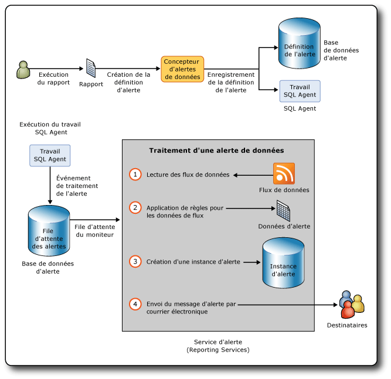

# Alertes de données Reporting Services

[!INCLUDE [ssrs-appliesto](../includes/ssrs-appliesto.md)] [!INCLUDE [ssrs-appliesto-2016](../includes/ssrs-appliesto-2016.md)] [!INCLUDE [ssrs-appliesto-not-2017](../includes/ssrs-appliesto-not-2017.md)] [!INCLUDE[ssrs-appliesto-sharepoint-2013-2016i](../includes/ssrs-appliesto-sharepoint-2013-2016.md)] [!INCLUDE [ssrs-appliesto-not-pbirs](../includes/ssrs-appliesto-not-pbirs.md)]

[!INCLUDE [ssrs-previous-versions](../includes/ssrs-previous-versions.md)]

Les alertes de données SQL Server Reporting Services sont une solution d’alerte pilotée par les données qui vous informe des données de rapport intéressantes ou importantes pour vous, à un moment donné. Grâce aux alertes de données, vous n'aurez plus besoin de chercher les informations, car elles viendront à vous.

Les messages d'alerte de données sont envoyés par courrier électronique. Selon l'importance des informations, vous pouvez choisir la fréquence d'envoi des messages ou choisir de recevoir un message uniquement en cas de modification des résultats. Vous pouvez spécifier plusieurs destinataires de courrier électronique pour informer vos collègues et améliorer l'efficacité et la collaboration au sein de votre équipe.

> [!NOTE]
> L’intégration de Reporting Services à SharePoint n’est plus disponible après SQL Server 2016.

##   Architecture des alertes de données et flux de travail

Voici les zones clés des alertes de données d' [!INCLUDE[ssRSnoversion](../includes/ssrsnoversion-md.md)] :

-   **Définition et enregistrement des alertes de données**. Vous pouvez consulter un rapport, créer des règles qui identifient des valeurs de données intéressantes, définir les périodicités d'envoi de l'alerte de données et spécifier les destinataires du message d'alerte.  
  
-   **Exécution des définitions d'alerte de données**. Le service d'alerte traite les définitions d'alerte selon la périodicité définie, récupère les données du rapport et crée des alertes de données en fonction des règles dans la définition d'alerte.  
  
-   **Remise des messages d'alerte de données aux destinataires**. Le service d'alerte créé une instance d'alerte et envoie un message d'alerte aux destinataires par courrier électronique.  
  
 En outre, en tant que propriétaire de l'alerte de données, vous pouvez afficher les informations relatives aux alertes de données et supprimer et modifier vos définitions d'alerte. Une alerte a un seul propriétaire, la personne qui l'a créée.  
  
 Les administrateurs d'alertes, c'est-à-dire les utilisateurs disposant d'autorisations d'alerte SharePoint, peuvent gérer les alertes de données au niveau du site. Ils peuvent consulter les listes d'alertes pour chaque utilisateur du site et supprimer des alertes.  
  
 [!INCLUDE[ssRSnoversion](../includes/ssrsnoversion-md.md)] sont différentes des alertes SharePoint. Vous pouvez définir des alertes SharePoint sur tout type de document, notamment les rapports. Les alertes SharePoint sont envoyées lorsque le document change. Par exemple, lorsque vous ajoutez une colonne à une table dans un rapport. En revanche, les alertes de données sont envoyées lorsque les données affichées dans un rapport répondent aux règles définies dans les définitions d'alerte. Les règles référencent en général les données qui s'affichent dans un rapport.  
  
 En créant des alertes de données sur des rapports, vous pouvez surveiller les modifications apportées aux données d'un rapport et envoyer des messages d'alerte de données par courrier électronique lorsque les données du rapport suivent les règles définissant celles qui présentent un intérêt pour vous et vos collègues, à des intervalles répondant à vos besoins. Vous pouvez également exécuter des alertes de données à la demande. Si vous avez l'autorisation de créer des alertes dans SharePoint Create, vous pouvez créer des alertes sur tout rapport que vous avez l'autorisation de consulter. Vous pouvez créer plusieurs alertes sur un rapport et plusieurs utilisateurs peuvent créer la même alerte ou des alertes différentes sur un rapport. Pour collaborer avec vos collègues, vous pouvez les spécifier comme destinataires des messages d'alerte dans les définitions d'alerte de données que vous créez.  
  
 Le diagramme suivant affiche le déroulement du flux de travail de création et d'enregistrement d'une définition d'alerte de données, de création d'un travail de l'Agent SQL pour commencer le traitement d'une instance de l'alerte de données et de l'envoi de messages d'alerte de données à un ou plusieurs destinataires par courrier électronique, contenant les données de rapport qui ont déclenché l'alerte.  
  
   
  
### Rapports pris en charge par les alertes de données  
 Vous pouvez créer des alertes de données sur tous les types de rapports professionnels écrits en langage RDL et créés dans le Concepteur de rapports ou le Générateur de rapports. Rapports qui incluent des régions de données telles que les tables et les graphiques, rapports avec des sous-états, et rapports complexes avec plusieurs groupes de colonnes parallèles et régions de données imbriquées. Les seules conditions requises sont que le rapport inclue au moins une région de données de n'importe quel type et que la source de données du rapport soit configurée pour utiliser des informations d'identification stockées ou bien aucune information d'identification. Si le rapport n'a pas de régions de données, vous ne pouvez pas créer d'alerte sur ses données.  
  
 Vous ne pouvez pas créer des alertes de données sur des rapports créés avec [!INCLUDE[ssCrescent](../includes/sscrescent-md.md)].  
  
 Lorsque vous installez [!INCLUDE[ssRSnoversion](../includes/ssrsnoversion-md.md)] en mode natif ou en mode SharePoint ou lorsque vous utilisez la version autonome du Générateur de rapports, vous pouvez enregistrer des rapports sur un serveur de rapports, votre ordinateur ou une bibliothèque SharePoint. Pour créer des alertes de données sur les rapports, les rapports doivent être enregistrés ou téléchargés sur une bibliothèque SharePoint. Cela signifie que vous ne pouvez pas créer d'alertes sur des rapports enregistrés sur un serveur de rapports en mode natif ou votre ordinateur. Par ailleurs, vous ne pouvez pas créer d'alertes incorporées dans des applications personnalisées.  
  
 [!INCLUDE[ssRSnoversion](../includes/ssrsnoversion-md.md)] prend en charge divers types d'informations d'identification dans les rapports. Vous pouvez créer des alertes de données sur des rapports avec une source de données configurée pour utiliser des informations d'identification stockées ou bien aucune information d'identification. Vous ne pouvez pas créer d'alertes sur des rapports configurés pour utiliser des informations d'identification de sécurité intégrée ou une invite pour les informations d'identification. Le rapport est exécuté dans le cadre du traitement de la définition d'alerte et ce dernier échoue sans informations d'identification. Pour plus d'informations, consultez les documents suivants :  
  
-   [Spécifier des informations d'identification et de connexion pour les sources de données de rapport](../reporting-services/report-data/specify-credential-and-connection-information-for-report-data-sources.md)  
  
-   [Rôles et autorisations &#40;Reporting Services&#41;](../reporting-services/security/roles-and-permissions-reporting-services.md)  
  
-   [Authentification avec le serveur de rapports](../reporting-services/security/authentication-with-the-report-server.md)  
  
### Exécuter des rapports  
 La première étape dans la création d'une définition d'alerte de données est de rechercher le rapport que vous souhaitez dans la bibliothèque SharePoint, puis de l'exécuter. Si un rapport ne contient pas de données lorsque vous l'exécutez, vous ne pouvez pas y créer d'alerte pour le moment.  
  
 Si le rapport est paramétré, vous devez spécifier les valeurs de paramètre à utiliser lorsque vous exécutez le rapport. Les valeurs de paramètre sont enregistrées dans les définitions d'alerte de données que vous créez sur un rapport. Les valeurs sont utilisées lorsque le rapport est exécuté à nouveau en tant qu'étape lors du traitement de la définition d'alerte de données. Si vous souhaitez modifier les valeurs de paramètre, vous devez réexécuter le rapport avec ces valeurs de paramètre et créer une définition d'alerte dans cette version du rapport.  
  
### Créer des définitions d'alerte de données  
 La fonctionnalité d'alertes de données d' [!INCLUDE[ssRSnoversion](../includes/ssrsnoversion-md.md)] inclut le Concepteur d'alerte de données, que vous utilisez pour créer des définitions d'alerte de données.  
  
 Pour créer une définition d'alerte de données, vous devez exécuter le rapport et ouvrir le Concepteur d'alertes de données à partir du menu **Actions** de la visionneuse de rapports SharePoint. Les flux de données de rapport sont générés et les 100 premières lignes du flux de données s'affichent dans une table d'aperçu dans le Concepteur d'alertes de données. Tous les flux de données d'un rapport sont mis en cache aussi longtemps que vous travaillez sur la définition d'alerte dans le Concepteur d'alerte de données. La mise en cache vous permet de commuter rapidement entre des flux de données. Lorsque vous rouvrez une définition d'alerte dans Concepteur d'alertes de données, les flux de données sont actualisés.  
  
 Les définitions d'alerte de données comprennent des règles et des clauses que les données du rapport doivent satisfaire pour déclencher un message d'alerte de données ; elles comprennent également une planification qui définit la fréquence d'envoi des messages d'alerte et, éventuellement, les dates de début et de fin d'envoi des messages d'alerte, ainsi que des informations telles la ligne Objet et une description à inclure dans le message d'alerte, et les destinataires du message. Après avoir créé une définition d'alerte, vous l'enregistrez dans la base de données des alertes SQL Server.  
  
### Enregistrement des définitions d'alerte de données et des métadonnées d'alerte  
 Lorsque vous installez [!INCLUDE[ssRSnoversion](../includes/ssrsnoversion-md.md)] en mode SharePoint, la base de données des alertes SQL Server est automatiquement créée.  
  
 Les définitions d'alerte de données et les métadonnées d'alerte sont enregistrées dans la base de données des alertes. Par défaut, cette base de données est nommée ReportingServices\<GUID>_Alerting.  
  
 Lorsque vous enregistrez la définition d'alerte de données, les alertes créent un travail de SQL Server Agent. Le travail inclut une planification du travail. La planification est basée sur la périodicité que vous définissez sur la définition d'alerte. L'exécution du travail lance le traitement de la définition d'alerte de données.  
  
### Traitement des définitions d'alerte de données  
 Lorsque la planification du travail de SQL Server Agent démarre le traitement de la définition de l'alerte, le rapport est exécuté pour actualiser son flux de données. Le service d'alertes lit les flux de données et applique les règles que les définitions d'alerte de données spécifient aux valeurs de données. Si une ou plusieurs valeurs de données satisfont aux règles, une instance d'alerte de données est créée et un message d'alerte de données contenant les résultats de l'alerte est envoyé à tous les destinataires par courrier électronique. Les résultats sont des lignes de données de rapport qui satisfont à toutes les règles au moment où l'instance d'alerte a été créée. Pour éviter l'envoi de plusieurs messages d'alerte contenant les mêmes résultats, vous pouvez spécifier que les messages soient envoyés uniquement lorsque les résultats changent. Dans ce cas, une instance d'alerte est créée et enregistrée dans la base de données des alertes, mais aucun message d'alerte n'est généré. Si une erreur se produit, l'instance d'alerte est également enregistrée dans la base de données des alertes et un message d'alerte fournissant des détails sur l'erreur est envoyé aux destinataires. La section Diagnostic et connexion plus loin dans cette rubrique fournit plus d'informations sur la connexion et la résolution des problèmes.  
  
### Envoyer des messages d'alerte de données  
 Les messages d'alerte de données sont envoyés par courrier électronique.  
  
 La ligne **De** contient une valeur fournie par la configuration de la distribution du courrier électronique [!INCLUDE[ssRSnoversion](../includes/ssrsnoversion-md.md)] . La ligne **À** répertorie les destinataires que vous avez spécifiés quand vous avez créé l'alerte dans le Concepteur d'alertes de données.  
  
 Excepté la ligne Objet du courrier électronique, que vous spécifiez dans le Concepteur d'alertes de données, le message d'alerte de données inclut les informations suivantes :  
  
-   Nom de la personne qui a créé la définition d'alerte de données.  
  
-   Si vous fournissiez une description dans la définition d'alerte, elle s'affiche en haut du texte du courrier électronique.  
  
-   Résultats de l'alerte, qui comportent les lignes dans le flux de données de rapport qui satisfont aux règles spécifiées dans la définition de l'alerte.  
  
-   Lien vers le rapport sur lequel la définition d'alerte repose.  
  
-   Règles dans la définition de l'alerte.  
  
-   Paramètres et valeurs utilisés pour exécuter le rapport.  
  
-   Valeurs contextuelles des éléments du rapport qui se trouvent hors des régions de données du rapport.  
  
 S'il est impossible de créer une instance d'alerte de données ou un message d'alerte de données, un message d'erreur est envoyé à tous les destinataires. Au lieu des résultats de l'alerte, le message contient une description de l'erreur.  
  
 Pour plus d’informations, consultez [Data Alert Messages](../reporting-services/data-alert-messages.md).  
  
##   Installer des alertes de données  
 La fonctionnalité d'alertes de données est disponible uniquement lorsque [!INCLUDE[ssRSnoversion](../includes/ssrsnoversion-md.md)] est installé en mode SharePoint. Lorsque vous installez [!INCLUDE[ssRSnoversion](../includes/ssrsnoversion-md.md)] en mode SharePoint, le programme d'installation crée automatiquement la base de données des alertes qui stocke les définitions d'alerte de données et les métadonnées d'alerte, crée deux pages SharePoint pour la gestion des alertes et ajoute le Concepteur d'alertes de données au site SharePoint. Il n'y a pas d'étapes spéciales à effectuer ni d'options à définir pour créer des alertes pendant l'installation.  
  
 Si vous souhaitez en savoir plus sur l’installation de [!INCLUDE[ssRSnoversion](../includes/ssrsnoversion-md.md)] en mode SharePoint, dont le nouveau service partagé [!INCLUDE[ssRSnoversion](../includes/ssrsnoversion-md.md)] dans [!INCLUDE[ssSQL11](../includes/sssql11-md.md)] et l’application de service [!INCLUDE[ssRSnoversion](../includes/ssrsnoversion-md.md)] que vous devez créer et configurer avant de pouvoir utiliser les fonctionnalités [!INCLUDE[ssRSnoversion](../includes/ssrsnoversion-md.md)] , consultez [Installer le mode SharePoint de Reporting Services pour SharePoint 2010](http://msdn.microsoft.com/en-us/47efa72e-1735-4387-8485-f8994fb08c8c) dans MSDN Library.  
  
 Comme le montre le schéma plus haut dans cette rubrique, les alertes de données utilisent des travaux de SQL Server Agent. Pour créer des travaux, SQL Server Agent doit s'exécuter. Il est possible que vous ayez configuré SQL Server Agent pour qu'il démarre automatiquement lors de l'installation d' [!INCLUDE[ssRSnoversion](../includes/ssrsnoversion-md.md)]. Sinon, vous pouvez démarrer SQL Server Agent manuellement. Pour plus d’informations, consultez [Configurer l’Agent SQL Server](http://msdn.microsoft.com/library/2e361a62-9e92-4fcd-80d7-d6960f127900) et [Démarrer, arrêter, suspendre, reprendre, redémarrer le moteur de base de données, SQL Server Agent ou le service SQL Server Browser](../database-engine/configure-windows/start-stop-pause-resume-restart-sql-server-services.md).  
  
 Vous pouvez utiliser la page **Configurer les abonnements et les alertes** dans l'Administration centrale de SharePoint pour déterminer si SQL Server Agent s'exécute, et pour créer et télécharger les scripts personnalisés [!INCLUDE[tsql](../includes/tsql-md.md)] que vous exécuterez ensuite pour accorder des autorisations à SQL Server Agent. Vous pouvez également générer les scripts [!INCLUDE[tsql](../includes/tsql-md.md)] à l'aide de PowerShell. Pour plus d’informations, consultez [Configurer les abonnements et les alertes pour les applications de service de SSRS](../reporting-services/install-windows/provision-subscriptions-and-alerts-for-ssrs-service-applications.md).  
  
##   Configurer des alertes de données  
 À partir de [!INCLUDE[ssSQL11](../includes/sssql11-md.md)] , les paramètres des fonctionnalités d' [!INCLUDE[ssRSnoversion](../includes/ssrsnoversion-md.md)] , y compris les données d'alerte, sont répartis entre le fichier de configuration du serveur de rapports (rsreportserver.config) et une base de données de configuration SharePoint lorsque vous installez [!INCLUDE[ssRSnoversion](../includes/ssrsnoversion-md.md)] en mode SharePoint. Lorsque vous créez l'application de service en tant qu'étape en installant et en configurant [!INCLUDE[ssRSnoversion](../includes/ssrsnoversion-md.md)], la base de données de configuration SharePoint est automatiquement créée. Pour plus d’informations, consultez [Fichier de configuration RsReportserver.config](../reporting-services/report-server/rsreportserver-config-configuration-file.md) et [Fichiers de configuration Reporting Services](../reporting-services/report-server/reporting-services-configuration-files.md).  
  
 Les paramètres des alertes de données d' [!INCLUDE[ssRSnoversion](../includes/ssrsnoversion-md.md)] incluent les intervalles de nettoyage des données et des métadonnées d'alerte et le nombre de tentatives d'envoi des messages d'alerte de données par courrier électronique. Vous pouvez modifier le fichier de configuration et la base de données afin d'utiliser des valeurs différentes pour les paramètres d'alerte de données.  
  
 Pour cela, vous mettez à jour le fichier de configuration du serveur de rapports directement. Vous mettez à jour la base de données de configuration SharePoint à l'aide des applets de commande Windows PowerShell.  
  
 Le tableau suivant répertorie les éléments de configuration des alertes de données, leurs valeurs par défaut, les descriptions et les emplacements.  
  
|Paramètre|Valeur par défaut|Description|Emplacement|  
|-------------|-------------------|-----------------|--------------|  
|AlertingCleanupCycleMinutes|20|Nombre de minutes entre les démarrages du cycle de nettoyage.|Fichier de configuration du serveur de rapports|  
|AlertingExecutionLogCleanupMinutes|10080|Nombre de minutes pendant lesquelles les entrées du journal des exécutions sont conservées.|Fichier de configuration du serveur de rapports|  
|AlertingDataCleanupMinutes|360|Nombre de minutes pendant lesquelles les données temporaires sont conservées.|Fichier de configuration du serveur de rapports|  
|AlertingMaxDataRetentionDays|180|Nombre de jours avant que les métadonnées d'exécution des alertes, les instances d'alerte et les résultats d'exécution soient supprimés.|Fichier de configuration du serveur de rapports|  
|MaxRetries|3|Nombre de tentatives de traitement des alertes de données.|Base de données de configuration du service|  
|SecondsBeforeRetry|900|Nombre de secondes à attendre avant chaque nouvelle tentative.|Base de données de configuration du service|  
  
 Par défaut, les paramètres MaxRetries et SecondsBeforeRetry s'appliquent à tous les événements qui déclenchent des alertes de données. Si vous souhaitez avoir un contrôle plus précis des tentatives et des intervalles entre chaque tentative, vous pouvez ajouter des éléments à l'un des gestionnaires d'événements ou à tous les gestionnaires d'événements spécifiant des valeurs MaxRetries et SecondsBeforeRetry différentes.  
  
### Gestionnaires d'événements et reprise  
 Les gestionnaires d'événements sont les suivants :  
  
|Gestionnaire d'événements|Description|  
|-------------------|-----------------|  
|FireAlert|Vous cliquez sur **Exécuter**  dans le Gestionnaire des alertes de données pour initialiser le traitement immédiat d'une définition d'alerte.|  
|FireSchedule|SQL Server Agent lance la planification du travail pour une définition d'alerte.|  
|CreateSchedule|Vous créez une définition d'alerte de données et une planification de travail de SQL Server Agent est créée selon l'intervalle de fréquence spécifié dans la définition d'alerte.|  
|UpdateSchedule|Vous mettez à jour l'intervalle de fréquence de la définition d'alerte de données et la planification du travail de SQL Server Agent est mise à jour.|  
|DeleteSchedule|Vous supprimez la définition d'alerte de données et le travail de SQL Server Agent correspondant est supprimé.|  
|GenerateAlert|Le runtime de l'alerte traite le flux de données du rapport, applique les règles spécifiées dans la définition de l'alerte de données, détermine si créer une instance d'alerte de données, et la crée si nécessaire.|  
|DeliverAlert|Le runtime crée le message d'alerte de données et l'envoie à tous les destinataires par courrier électronique.|  
  
 Le tableau suivant récapitule les gestionnaires d'événements et indique à quel moment la reprise est lancée :  
  
|Catégorie de l'erreur|<|\<|Type d'événement||>|>|>|  
|--------------------|--------|--------|----------------|-|--------|--------|--------|  
||**FireAlert**|**FireSchedule**|**CreateSchedule**|**UpdateSchedule**|**DeleteSchedule**|**GenerateAlert**|**DeliverAlert**|  
|Mémoire insuffisante|X|X|X|X|X|X|X|  
|Abandon de thread|X|X|X|X|X|X|X|  
|SQL Agent n'est pas en cours d'exécution|X||X|X|X|||  
|Temporaire. Principalement en raison de problèmes de connexions, de délais d'attente et de verrouillages.|X|X|X|X|X|X|X|  
|IOException|||||||X|  
|WebException|||||||X|  
|SocketException|||||||X|  
|SMTPException **(\*)**|||||||X|  
  
 **(\*)** Les erreurs SMTP entraînent une reprise :  
  
-   SmtpStatusCode.ServiceNotAvailable  
  
-   SmtpStatusCode.MailboxBusy  
  
-   SmtpStatusCode.MailboxUnavailable  
  
###   Désactiver les alertes de données  
 Si vous souhaitez désactiver la fonctionnalité d'alerte de données, modifiez la section Service du fichier de configuration. Le code suivant affiche la section Service du fichier de configuration.  
  
 `<Service>`  
  
 `<IsSchedulingService>True</IsSchedulingService>`  
  
 `<IsNotificationService>True</IsNotificationService>`  
  
 `<IsEventService>True</IsEventService>`  
  
 `<IsAlertingService>True</IsAlertingService>`  
  
 `…`  
  
 `</Service>`  
  
 Pour désactiver les alertes, modifiez True en False dans `<IsAlertingService>True</IsAlertingService>`.  
  
##   Autorisations pour les alertes de données  
 Pour pouvoir créer des alertes de données sur les rapports, vous devez avoir l'autorisation d'exécuter le rapport et créer des alertes sur le site SharePoint. Pour plus d'informations sur les autorisations de rapport, consultez les rubriques suivantes.  
  
-   [Génération de flux de données à partir de rapports &#40;Générateur de rapports et SSRS&#41;](../reporting-services/report-builder/generating-data-feeds-from-reports-report-builder-and-ssrs.md)  
  
-   [Définir les autorisations sur les éléments de serveur de rapports sur un site SharePoint &#40;Reporting Services en mode intégré SharePoint&#41;](../reporting-services/security/set-permissions-for-report-server-items-on-a-sharepoint-site.md)  
  
 [!INCLUDE[ssRSnoversion](../includes/ssrsnoversion-md.md)] prennent en charge deux niveaux d'autorisation : travailleur de l'information et administrateur d'alertes. Le tableau suivant répertorie les autorisations et les tâches utilisateur SharePoint connexes.  
  
|Type d'utilisateur|Autorisation SharePoint|Description de la tâche|  
|---------------|---------------------------|----------------------|  
|Travailleur de l'information|Afficher les éléments   Créer des alertes|Consultez des éléments tels que des rapports et créez des alertes de données reposant sur des rapports. Modification et suppression d'alertes|  
|Administrateur d'alertes|Gérer les alertes|Consultez la liste de toutes les alertes de données enregistrée sur le site SharePoint et supprimez des alertes.|  
  
##   Diagnostic et connexion  
 Les alertes de données offrent plusieurs moyens pour aider les travailleurs de l'information et les administrateurs à suivre les alertes et comprendre pourquoi elles échouent, ou aider les administrateurs à utiliser les journaux d'exécution pour connaître les messages d'alerte envoyés, les destinataires, le nombre d'instances d'alerte envoyées, etc.  
  
### Gestionnaire des alertes de données  
 Le Gestionnaire des alertes de données répertorie les définitions d'alerte et les informations d'erreur qui aident les travailleurs de l'information et les administrateurs des alertes à comprendre pourquoi un échec se produit. Voici quelques causes courantes d'échec :  
  
-   Le flux de données de rapport a changé et les colonnes qui sont référencées dans les règles de la définition d'alerte de données ne sont plus incluses dans le flux de données.  
  
-   L'autorisation pour consulter le rapport a été révoquée.  
  
-   Le type de données dans la source de données sous-jacente a changé et la définition d'alerte n'est plus valide.  
  
### Journaux  
 [!INCLUDE[ssRSnoversion](../includes/ssrsnoversion-md.md)] fournit un certain nombre de journaux qui peuvent vous aider à en savoir plus les rapports exécutés lors du traitement des définitions d'alerte de données, les instances d'alerte de données créées etc. Trois journaux sont particulièrement utiles : le journal d'exécution des alertes, le journal d'exécution du serveur de rapports et le journal des traces du serveur de rapports.  
  
 Pour plus d’informations sur les autres journaux [!INCLUDE[ssRSnoversion](../includes/ssrsnoversion-md.md)] , consultez [Fichiers journaux et sources de Reporting Services](../reporting-services/report-server/reporting-services-log-files-and-sources.md).  
  
#### Journal d'exécution des alertes  
 Le service d’exécution des alertes écrit des entrées dans la table ExecutionLogView dans la base de données des alertes. Vous pouvez interroger la table ou exécuter les procédures stockées suivantes pour obtenir des informations de diagnostic plus détaillées sur les alertes enregistrées dans la base de données des alertes.  
  
-   ReadAlertData  
  
-   ReadAlertHistory  
  
-   ReadAlertInstances  
  
-   ReadEventHistory  
  
-   ReadFeedPollHistory  
  
-   ReadFeedPools  
  
-   ReadPollData  
  
-   ReadSentAlerts  
  
 Vous pouvez utiliser l'Agent SQL pour exécuter la procédure stockée selon une planification donnée. Pour plus d’informations, consultez [SQL Server Agent](http://msdn.microsoft.com/library/8d1dc600-aabb-416f-b3af-fbc9fccfd0ec).  
  
#### Journal d'exécution du serveur de rapports  
 Les rapports sont exécutés pour générer les flux de données sur lesquels les définitions d'alerte de données reposent. Le journal d'exécution du serveur de rapports dans la base de données du serveur de rapports capture des informations chaque fois que le rapport est exécuté. Vous pouvez interroger la vue ExecutionLog2 dans la base de données pour obtenir des informations détaillées. Pour plus d’informations, consultez [Journal des exécutions du serveur de rapports et vue ExecutionLog3](../reporting-services/report-server/report-server-executionlog-and-the-executionlog3-view.md).  
  
#### Journal des traces du serveur de rapports  
 Le journal des traces du serveur de rapports contient des informations très détaillées sur les opérations du service de serveur de rapports, y compris celles effectuées par le service Web du serveur de rapports et le traitement en arrière-plan. Les informations du journal des traces sont utiles si vous déboguez une application qui comprend un serveur de rapports, ou si vous essayez de déterminer l'origine d'un problème consigné dans le journal des événements ou le journal des exécutions. Pour plus d’informations, consultez [Report Server Service Trace Log](../reporting-services/report-server/report-server-service-trace-log.md).  
  
##   Compteurs de performances  
 Les alertes de données fournissent leurs propres compteurs de performances. Tous les compteurs de performances sauf un sont liés à un événement qui fait partie du service d'exécution des alertes. Le compteur de performances relatif à la file d'attente des événements indique la longueur de la file d'attente de tous les événements actifs.  
  
|Événement ou file d'attente d'événements|Compteur de performances|  
|--------------------------|-------------------------|  
|ALERTINGQUEUESIZE|Alerte : longueur de la file d'attente des événements|  
|FireAlert|Alerte : événements traités - FireAlert|  
|FireSchedule|Alerte : événements traités - FireSchedule|  
|CreateSchedule|Alerte : événements traités - CreateSchedule|  
|UpdateSchedule|Alerte : événements traités - UpdateSchedule|  
|DeleteSchedule|Alerte : événements traités - DeleteSchedule|  
|GenerateAlert|Alerte : événements traités - GenerateAlert|  
|DeliverAlert|Alerte : événements traités - DeliverAlert|  
  
 [!INCLUDE[ssRSnoversion](../includes/ssrsnoversion-md.md)] fournit des compteurs de performances pour d'autres fonctionnalités d' [!INCLUDE[ssRSnoversion](../includes/ssrsnoversion-md.md)] . Pour plus d’informations, consultez [Compteurs de performance pour les objets de performance ReportServer:Service et ReportServerSharePoint:Service](../reporting-services/report-server/performance-counters-reportserver-service-performance-objects.md), [Compteurs de performance du service web MSRS 2011 et des objets de performance du service Windows MSRS 2011 &#40;mode natif&#41;](../reporting-services/report-server/performance-counters-msrs-2011-web-service-performance-objects.md), et [Compteurs de performance du service web MSRS 2011 en mode SharePoint et des objets de performance du service Windows MSRS 2011 en mode SharePoint &#40;mode SharePoint&#41;](../reporting-services/report-server/performance-counters-msrs-2011-sharepoint-mode-performance-objects.md).  
  
##   Prise en charge d'SSL  
 [!INCLUDE[ssRSnoversion](../includes/ssrsnoversion-md.md)] peut utiliser le service HTTP SSL (Secure Sockets Layer) pour établir des connexions chiffrées à un serveur de rapports ou à un site SharePoint.  
  
 Le service de runtime des alertes et l'interface utilisateur des alertes de données prend en charge SSL et fonctionne de façon similaire à SSL ou HTTP ; toutefois, il existe de légères différences. Lorsque la définition de l'alerte de données est créée à l'aide d'une connexion SSL, l'URL qui revient à la bibliothèque SharePoint depuis le message d'alerte de données utilise également SSL. Vous pouvez identifier la connexion SSL car elle utilise HTTPS au lieu de HTTP dans son URL. De même, si la définition d'alerte de données a été créée à l'aide d'une connexion HTTP, le lien vers le site SharePoint utilise HTTP. Si la définition d'alerte a été créée avec SSL ou HTTP, l'expérience pour les utilisateurs et les administrateurs des alertes est identique lorsqu'on utilise le Concepteur d'alertes de données ou le Gestionnaire des alertes de données. Si le protocole (HTTP ou SSL) change entre le moment où la définition de l'alerte a été créée et le moment où elle a été mise à jour et resauvegardée, le protocole d'origine est conservé et utilisé dans les URL du lien.  
  
 Si vous créez une alerte de données sur un site SharePoint configuré pour utiliser SSL, puis supprimez la spécification SSL, l'alerte continue de fonctionner sur le site. Si le site est supprimé, le site de zone par défaut est utilisé à la place.  
  
##   Interface utilisateur des alertes de données  
 Les alertes de données fournissent des pages SharePoint pour gérer les alertes et un concepteur pour créer et modifier les définitions des alertes de données.  
  
-   **Concepteur d'alertes de données** dans lequel vous créez ou modifiez des définitions d'alerte de données. Pour plus d’informations, consultez [Concepteur d’alertes de données](../reporting-services/data-alert-designer.md), [Créer une alerte de données dans le Concepteur d’alertes](../reporting-services/create-a-data-alert-in-data-alert-designer.md) et [Modifier une alerte de données dans le Concepteur d’alertes](../reporting-services/edit-a-data-alert-in-alert-designer.md).  
  
-   **Gestionnaire des alertes de données** dans lequel vous consultez des listes d'alertes de données, vous supprimez des alertes et vous ouvrez des alertes pour les modifier. Le Gestionnaire des alertes de données est disponible en deux versions : l'une destinée aux utilisateurs pour gérer les alertes qu'ils ont créées, et l'autre pour les administrateurs, destinée à gérer les alertes qui appartiennent aux utilisateurs du site.  
  
     Pour plus d’informations sur la gestion des alertes de données que vous avez créées, consultez [Gestionnaire des alertes de données pour les utilisateurs SharePoint](../reporting-services/data-alert-manager-for-sharepoint-users.md) et [Gérer mes alertes de données dans le Gestionnaire des alertes de données](../reporting-services/manage-my-data-alerts-in-data-alert-manager.md).  
  
     Pour plus d’informations sur la gestion de toutes les alertes de données d’un site, consultez [Gestionnaire des alertes de données pour les administrateurs d’alertes](../reporting-services/data-alert-manager-for-alerting-administrators.md) et [Gérer toutes les alertes de données sur un site SharePoint dans le Gestionnaire des alertes de données](../reporting-services/manage-all-data-alerts-on-a-sharepoint-site-in-data-alert-manager.md).  
  
-   Dans la section**Configurer les abonnements et les alertes** vous déterminez si Reporting Services peut utiliser SQL Server Agent pour les alertes de données et télécharger les scripts qui autorisent l'accès à SQL Server Agent. Pour plus d’informations, consultez [Configurer les abonnements et les alertes pour les applications de service de SSRS](../reporting-services/install-windows/provision-subscriptions-and-alerts-for-ssrs-service-applications.md).  
  
##   Globalisation des alertes de données  
 Certain script tel que l'arabe et hébreu sont écrits de droite à gauche. Les alertes de données prennent en charge les scripts de droite à gauche ainsi que les scripts de gauche à droite. Les alertes de données détectent la culture et modifient en conséquence l'apparence et le comportement de l'interface utilisateur, ainsi que la disposition des messages d'alerte de données. La culture est dérivée du paramètre régional du système d'exploitation sur l'ordinateur de l'utilisateur. La culture est enregistrée chaque fois que vous mettez à jour puis resauvegardez la définition d'une alerte de données.  
  
 La culture de la définition de l'alerte peut déterminer si oui ou non les données satisfont aux règles dans la définition de l'alerte. Les comparaisons de chaînes sont très fréquemment affectées par les règles spécifiques à la culture.  
  
 La culture de la définition de l'alerte peut déterminer si oui ou non les données d'un rapport satisfont aux règles dans la définition de l'alerte. Cela se produit le plus souvent dans les chaînes. Par exemple, dans une définition d'alerte de culture allemande, une règle qui compare la lettre anglaise « o » et la lettre allemande « ö » ne sera pas satisfaite. Si la même définition d'alerte avait utilisé la culture anglaise la règle aurait été satisfaite.  
  
 La mise en forme des données est également basée sur la culture de la définition de l'alerte. Par exemple, si la culture utilise un point comme symbole décimal, la valeur s'affiche au format 45.67 ; alors qu'une culture qui utilise une virgule comme symbole décimal, affichera une valeur 45,67.  
  
 Selon l'interface utilisateur de l'alerte de données que vous utilisez, la prise en charge de droite à gauche varie. Le Concepteur d'alertes de données prend en charge le script de droite à gauche dans les zones de texte, mais la disposition du concepteur n'est pas de droite à gauche. Elle est de gauche à droite comme dans les autres outils. Si une définition d'alerte est créée avec l'orientation de texte de droite à gauche, puis modifiée dans un environnement de gauche à droite, l'orientation de texte de droite à gauche est conservée lorsque vous enregistrez la définition de l'alerte. Le Gestionnaire des alertes de données se comporte de la même manière qu'une page SharePoint. Sa disposition est de droite à gauche, tout comme les autres pages SharePoint. Les messages d'alerte de données basés sur les définitions d'alerte de données de droite à gauche affichent le texte du message de droite à gauche et la disposition du message est de gauche à droite.  
  
##   Tâches associées  
  
-   [Enregistrer un rapport dans une bibliothèque SharePoint &#40;Générateur de rapports&#41;](../reporting-services/report-builder/save-a-report-to-a-sharepoint-library-report-builder.md)  
  
-   [Créer une alerte de données dans le Concepteur d’alertes](../reporting-services/create-a-data-alert-in-data-alert-designer.md)  
  
-   [Modifier une alerte de données dans le concepteur d'alertes](../reporting-services/edit-a-data-alert-in-alert-designer.md)  
  
-   [Gérer mes alertes de données dans le gestionnaire des alertes de données](../reporting-services/manage-my-data-alerts-in-data-alert-manager.md)  
  
-   [Gérer toutes les alertes de données sur un site SharePoint dans le Gestionnaire des alertes de données](../reporting-services/manage-all-data-alerts-on-a-sharepoint-site-in-data-alert-manager.md)  
  
-   [Accorder des autorisations aux utilisateurs et alerter les administrateurs](../reporting-services/grant-permissions-to-users-and-alerting-administrators.md)  
  
##  Voir aussi

[Concepteur d'alertes de données](../reporting-services/data-alert-designer.md)   
[Gestionnaire des alertes de données pour les administrateurs d’alertes](../reporting-services/data-alert-manager-for-alerting-administrators.md)   
[Gestionnaire des alertes de données pour les utilisateurs SharePoint](../reporting-services/data-alert-manager-for-sharepoint-users.md)  

D’autres questions ? [Essayez de poser une question dans le forum Reporting Services](http://go.microsoft.com/fwlink/?LinkId=620231)
