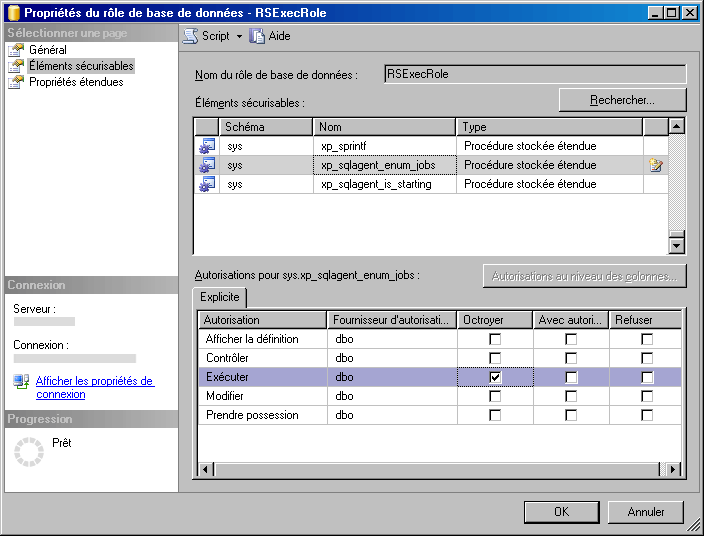

# Créer le rôle RSExecRole

  [!INCLUDE[ssRSnoversion](../../includes/ssrsnoversion-md.md)] utilise un rôle de base de données prédéfini appelé **RSExecRole** pour octroyer des autorisations de serveur de rapports à la base de données du serveur de rapports. Le rôle **RSExecRole** est créé automatiquement avec la base de données du serveur de rapports. En règle générale, ne modifiez ou n'assignez jamais d'autres utilisateurs au rôle. Toutefois, lorsque vous déplacez une base de données du serveur de rapports vers un [!INCLUDE[ssNoVersion](../../includes/ssnoversion-md.md)] [!INCLUDE[ssDE](../../includes/ssde-md.md)]nouveau ou différent, vous devez recréer le rôle dans les bases de données système Master ou MSDB.  
  
 À l'aide des instructions suivantes, vous exécuterez les étapes ci-dessous :  
  
-   créer et mettre en service le rôle **RSExecRole** dans la base de données système Master ;  
  
-   créer et mettre en service le rôle **RSExecRole** dans la base de données système MSDB.  
  
> [!NOTE]  
>  Les instructions de cette rubrique sont destinées aux utilisateurs qui ne souhaitent pas exécuter un script ou écrire du code WMI pour mettre en service la base de données du serveur de rapports. Si vous gérez un grand déploiement et que vous allez déplacer régulièrement des bases de données, il est conseillé d'écrire un script pour automatiser ces étapes. Pour plus d’informations, consultez [Accéder au fournisseur WMI de Reporting Services](../../reporting-services/tools/access-the-reporting-services-wmi-provider.md).  
  
## Avant de commencer  
  
-   Effectuez une sauvegarde des clés de chiffrement afin de pouvoir les restaurer après le déplacement de la base de données. Cette étape n'affecte pas directement votre capacité à créer et à mettre en service le rôle **RSExecRole**, mais vous devez disposer d'une sauvegarde des clés afin de vérifier votre travail. Pour plus d’informations, consultez [Back Up and Restore Reporting Services Encryption Keys](../../reporting-services/install-windows/ssrs-encryption-keys-back-up-and-restore-encryption-keys.md).  
  
-   Vérifiez que vous avez ouvert une session avec un compte d’utilisateur qui dispose d’autorisations **sysadmin** sur l’instance de [!INCLUDE[ssNoVersion](../../includes/ssnoversion-md.md)] .  
  
-   Vérifiez que le service [!INCLUDE[ssNoVersion](../../includes/ssnoversion-md.md)] Agent est installé et en cours d'exécution sur l'instance du [!INCLUDE[ssDE](../../includes/ssde-md.md)] que vous envisagez d'utiliser.  
  
-   Attachez les bases de données reportservertempdb and reportserver. Vous n'êtes pas obligé d'attacher les bases de données pour créer le rôle réel, mais elles doivent l'être pour que vous puissiez tester votre travail.  
  
 Les instructions permettant de créer manuellement le rôle **RSExecRole** sont destinées à être utilisées dans le contexte de la migration d'une installation du serveur de rapports. Les tâches importantes telles que la sauvegarde et le déplacement de la base de données du serveur de rapports ne sont pas traitées dans cette rubrique, mais sont présentées dans la documentation du moteur de base de données.  
  
## Création du rôle RSExecRole dans la base de données Master  
 [!INCLUDE[ssRSnoversion](../../includes/ssrsnoversion-md.md)] utilise des procédures stockées étendues associées au service [!INCLUDE[ssNoVersion](../../includes/ssnoversion-md.md)] Agent pour prendre en charge des opérations planifiées. Les étapes suivantes expliquent comment octroyer au rôle **RSExecRole** des autorisations Execute pour les procédures.  
  
#### Pour créer RSExecRole dans la base de données système Master à l'aide de Management Studio  
  
1.  Démarrez [!INCLUDE[ssNoVersion](../../includes/ssnoversion-md.md)] [!INCLUDE[ssManStudio](../../includes/ssmanstudio-md.md)] et connectez-vous à l'instance du [!INCLUDE[ssDE](../../includes/ssde-md.md)] qui héberge la base de données du serveur de rapports.  
  
2.  Ouvrez **Bases de données**.  
  
3.  Ouvrez **Bases de données système**.  
  
4.  Ouvrez **Master**.  
  
5.  Ouvrez **Sécurité**.  
  
6.  Ouvrez **Rôles**.  
  
7.  Cliquez avec le bouton droit sur **Rôles de base de données**, puis sélectionnez **Nouveau rôle de base de données**. La page Général s'affiche.  
  
8.  Dans **Nom du rôle**, tapez **RSExecRole**.  
  
9. Dans **Propriétaire**, tapez **DBO**.  
  
10. Cliquez sur **Éléments sécurisables**.  
  
11. Cliquez sur **Rechercher**. La boîte de dialogue **Ajouter des objets** s'affiche. L'option **Objets spécifiques** est sélectionnée par défaut.  
  
12. Cliquez sur **OK**. La boîte de dialogue **Sélectionner des objets** s'affiche.  
  
13. Cliquez sur **Types d'objets**.  
  
14. Cliquez sur **Procédures stockées étendues**.  
  
15. Cliquez sur **OK**.  
  
16. Cliquez sur **Parcourir**.  
  
17. Faites défiler la liste des procédures stockées étendues et sélectionnez les éléments suivants :  
  
    1.  xp_sqlagent_enum_jobs  
  
    2.  xp_sqlagent_is_starting  
  
    3.  xp_sqlagent_notify  
  
18. Cliquez sur **OK**, puis à nouveau sur **OK** .  
  
19. Cliquez sur la case à cocher située à l'intersection de la ligne **Execute** et de la colonne **Octroyer** , puis cliquez sur **OK**.  
  
20. Répétez ces étapes pour chacune des procédures stockées restantes. **RSExecRole** doit disposer des autorisations d'exécution pour les trois procédures stockées.  
  
   
  
## Création du rôle RSExecRole dans la base de données MSDB  
 Reporting Services utilise des procédures stockées associées au service Agent SQL Server et extrait des informations sur les travaux à partir de tables système pour prendre en charge les opérations planifiées. Les étapes suivantes expliquent comment octroyer au rôle RSExecRole des autorisations Execute pour les procédures et des autorisations Select sur les tables.  
  
#### Pour créer RSExecRole dans la base de données système MSDB  
  
1.  Répétez les mêmes étapes pour octroyer des autorisations aux procédures stockées et aux tables dans MSDB. Pour simplifier ces étapes, vous mettrez en service les procédures stockées et les tables séparément.  
  
2.  Ouvrez **MSDB**.  
  
3.  Ouvrez **Sécurité**.  
  
4.  Ouvrez **Rôles**.  
  
5.  Cliquez avec le bouton droit sur **Rôles de base de données**, puis sélectionnez **Nouveau rôle de base de données**. La page Général s'affiche.  
  
6.  Dans Nom du rôle, tapez **RSExecRole**.  
  
7.  Dans Propriétaire, tapez **DBO**.  
  
8.  Cliquez sur **Éléments sécurisables**.  
  
9. Cliquez sur **Ajouter**. La boîte de dialogue **Ajouter des objets** s'affiche. L'option **Spécifier des objets** est sélectionnée par défaut.  
  
10. Cliquez sur **OK**.  
  
11. Cliquez sur **Types d'objets**.  
  
12. Cliquez sur **Procédures stockées**.  
  
13. Cliquez sur **OK**.  
  
14. Cliquez sur **Parcourir**.  
  
15. Faites défiler la liste des éléments et sélectionnez les suivants :  
  
    1.  sp_add_category  
  
    2.  sp_add_job  
  
    3.  sp_add_jobschedule  
  
    4.  sp_add_jobserver  
  
    5.  sp_add_jobstep  
  
    6.  sp_delete_job  
  
    7.  sp_help_category  
  
    8.  sp_help_job  
  
    9. sp_help_jobschedule  
  
    10. sp_verify_job_identifiers  
  
16. Cliquez sur **OK**, puis à nouveau sur **OK** .  
  
17. Sélectionnez la première procédure stockée : sp_add_category.  
  
18. Cliquez sur la case à cocher située à l'intersection de la ligne **Execute** et de la colonne **Octroyer** , puis cliquez sur **OK**.  
  
19. Répétez ces étapes pour chacune des procédures stockées restantes. Des autorisations Execute doivent être octroyées à RSExecRole pour les dix procédures stockées.  
  
20. Sous l'onglet Éléments sécurisables, cliquez à nouveau sur **Ajouter** . La boîte de dialogue **Ajouter des objets** s'affiche. L'option **Spécifier des objets** est sélectionnée par défaut.  
  
21. Cliquez sur **OK**.  
  
22. Cliquez sur **Types d'objets**.  
  
23. Cliquez sur **Tables.**  
  
24. Cliquez sur **OK**.  
  
25. Cliquez sur **Parcourir**.  
  
26. Faites défiler la liste des éléments et sélectionnez les suivants :  
  
    1.  syscategories  
  
    2.  sysjobs  
  
27. Cliquez sur **OK**, puis à nouveau sur **OK** .  
  
28. Sélectionnez la première table : syscategories.  
  
29. Cliquez sur la case à cocher située à l'intersection de la ligne **Select** et de la colonne **Octroyer** , puis cliquez sur **OK**.  
  
30. Répétez ces étapes pour la table sysjobs. Des autorisations Select doivent être octroyées à RSExecRole pour les deux tables.  
  
## Déplacement de la base de données du serveur de rapports  
 Une fois les rôles créés, vous pouvez déplacer la base de données du serveur de rapports vers une nouvelle instance de SQL Server. Pour plus d’informations, consultez [Déplacement des bases de données du serveur de rapports vers un autre ordinateur](../../reporting-services/report-server/moving-the-report-server-databases-to-another-computer-ssrs-native-mode.md).  
  
 Si vous mettez à niveau le [!INCLUDE[ssDE](../../includes/ssde-md.md)] vers SQL Server 2016, vous pouvez effectuer cette opération avant ou après le déplacement de la base de données.  
  
 La base de données du serveur de rapports sera automatiquement mise à niveau quand le serveur de rapports s’y connectera. Il n'y a pas d'étapes spécifiques requises pour mettre à niveau la base de données.  
  
## Restauration des clés de chiffrement et vérification de votre travail  
 Si vous avez attaché les bases de données du serveur de rapports, vous devez maintenant être en mesure d'effectuer les étapes suivantes pour vérifier votre travail.  
  
#### Pour vérifier le bon fonctionnement du serveur de rapports après le déplacement d'une base de données  
  
1.  Démarrez l'outil de configuration de Reporting Services, puis connectez-vous au serveur de rapports.  
  
2.  Cliquez sur **Base de données**.  
  
3.  Cliquez sur **Modifier la base de données**.  
  
4.  Cliquez sur **Choisir une base de données de serveur de rapports existante**.  
  
5.  Entrez le nom de serveur du moteur de base de données. Si vous avez attaché les bases de données du serveur de rapports à une instance nommée, vous devez taper le nom de l’instance au format suivant : \<nom_serveur>\\<nom_instance\>.  
  
6.  Cliquez sur **Tester la connexion**.  
  
7.  Cliquez sur **Suivant**.  
  
8.  Dans Base de données, sélectionnez la base de données du serveur de rapports.  
  
9. Cliquez sur **Suivant** et mettez fin à l'Assistant.  
  
10. Cliquez sur **Clés de chiffrement**.  
  
11. Cliquez sur **Restaurer**.  
  
12. Sélectionnez le fichier fort (.snk) qui contient la copie de sauvegarde de la clé symétrique utilisée pour déchiffrer les informations d'identification stockées et les informations de connexion dans la base de données du serveur de rapports.  
  
13. Entrez le mot de passe, puis cliquez sur **OK**.  
  
14. Cliquez sur **URL du Gestionnaire de rapports**.  
  
15. Cliquez sur le lien pour ouvrir le Gestionnaire de rapports. Les éléments du serveur de rapports provenant de la base de données du serveur de rapports doivent s'afficher.  

## Étapes suivantes

[Déplacement des bases de données du serveur de rapports vers un autre ordinateur &#40;en mode natif SSRS&#41;](../../reporting-services/report-server/moving-the-report-server-databases-to-another-computer-ssrs-native-mode.md)   
[Gestionnaire de configuration de Reporting Services &#40;mode natif&#41;](../../reporting-services/install-windows/reporting-services-configuration-manager-native-mode.md)   
[Créer une base de données du serveur de rapports en mode natif &#40;Gestionnaire de configuration de SSRS&#41;](../../reporting-services/install-windows/ssrs-report-server-create-a-native-mode-report-server-database.md)   
[Sauvegarder et restaurer les clés de chiffrement Reporting Services](../../reporting-services/install-windows/ssrs-encryption-keys-back-up-and-restore-encryption-keys.md)  

D’autres questions ? [Essayez de poser une question dans le forum Reporting Services](http://go.microsoft.com/fwlink/?LinkId=620231)
