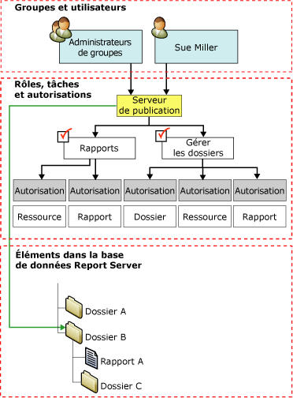

# Attributions de rôles
  Dans [!INCLUDE[ssRSnoversion](../../includes/ssrsnoversion-md.md)], les *attributions de rôles* déterminent l’accès aux éléments stockés et au serveur de rapports proprement dit. Une attribution de rôle est composée des parties suivantes :  
  
-   Un élément sécurisable dont vous souhaitez contrôler l'accès. Dossiers, rapports et ressources sont des exemples d'éléments sécurisables.  
  
-   Un utilisateur ou un groupe pouvant être authentifié par la sécurité Windows ou un autre mécanisme d'authentification.  
  
-   Des définitions de rôles qui configurent un ensemble de tâches. **Administrateur système**, **Gestionnaire de contenu**et **Serveur de publication**sont des exemples de définitions de rôle.  
  
 Les attributions de rôles sont héritées dans la hiérarchie des dossiers. L'attribution de rôle qui est définie pour un dossier est automatiquement héritée par tous les rapports, les sources de données partagées, les ressources et les sous-dossiers contenus dans ce dossier. Vous pouvez passer outre la sécurité héritée en définissant les attributions de rôles des éléments individuels. Toutes les parties de la hiérarchie de dossiers doivent être sécurisées par au moins une attribution de rôle. Vous ne pouvez pas créer d'élément non sécurisé ou manipuler des paramètres d'une manière qui produise un élément non sécurisé.  
  
 La diagramme suivant illustre une attribution de rôle qui mappe un groupe et un utilisateur spécifique au rôle **Serveur de publication** du dossier B.  
  
   
Diagramme des attributions de rôles  
  
## Attributions de rôles de niveau système et de niveau élément  
 Dans [!INCLUDE[ssRSnoversion](../../includes/ssrsnoversion-md.md)] , la sécurité basée sur les rôles s'articule autour des niveaux suivants :  
  
-   Les attributions de rôles de niveau élément contrôlent l'accès aux rapports, dossiers, modèles de rapport, sources de données partagées et ressources figurant dans la hiérarchie des dossiers du serveur de rapports. Les attributions de rôles de niveau élément sont définies lorsque vous créez une attribution de rôle sur un élément spécifique ou sur le dossier racine.  
  
-   Les attributions de rôles système autorisent les opérations limitées à l'ensemble du serveur (par exemple, la possibilité de gérer des travaux est une opération de niveau système). Une attribution de rôle système n'est pas l'équivalent d'un administrateur système. Elle ne confère pas d'autorisations avancées qui accordent le contrôle total d'un serveur de rapports.  
  
 Une attribution de rôle système ne permet pas d'accéder aux éléments de la hiérarchie des dossiers. La sécurité système et la sécurité de niveau élément s'excluent mutuellement. Pour n'importe quel utilisateur ou groupe donné, vous pouvez être amené à créer une attribution de rôle de niveau système et une attribution de rôle de niveau élément afin d'accorder un accès suffisant à un serveur de rapports.  
  
## Utilisateurs et groupes dans les attributions de rôles  
 Les utilisateurs ou les comptes de groupe que vous spécifiez dans les attributions de rôles sont des comptes de domaine. Le serveur de rapports fait référence à des utilisateurs et des groupes d’un domaine [!INCLUDE[msCoName](../../includes/msconame-md.md)] Windows (ou un autre modèle de sécurité si vous utilisez une extension de sécurité personnalisée), mais ne crée ni ne gère ces utilisateurs et groupes.  
  
 De toutes les attributions de rôles qui s'appliquent à un élément donné, deux attributions ne peuvent pas spécifier le même utilisateur ou groupe. Si un compte d'utilisateur est également membre d'un compte de groupe, et que vous avez des attributions de rôles pour les deux, vous pouvez disposer de l'ensemble combiné des tâches des deux attributions de rôles.  
  
 Lorsque vous ajoutez un utilisateur à un groupe qui fait déjà partie d'une attribution de rôle, vous devez réinitialiser Internet Information Services (IIS) afin que la nouvelle attribution de rôle prenne effet pour cet utilisateur.  
  
## Attributions de rôles prédéfinies  
 Par défaut, les attributions de rôles prédéfinies intégrées permettent aux administrateurs locaux de gérer le serveur de rapports. Vous devez ajouter des attributions de rôles pour accorder l'accès à d'autres utilisateurs.  
  
 Pour plus d'informations sur les attributions de rôles prédéfinies qui assurent la sécurité par défaut, consultez [Rôles prédéfinis](../../reporting-services/security/role-definitions-predefined-roles.md).  
  
##  Voir aussi  
 [Créer, supprimer ou modifier un rôle &#40;Management Studio&#41;](../../reporting-services/security/role-definitions-create-delete-or-modify.md)   
 [Accorder à un utilisateur l’accès à un serveur de rapports &#40;Gestionnaire de rapports&#41;](../../reporting-services/security/grant-user-access-to-a-report-server-report-manager.md)   
 [Modifier ou supprimer une affectation de rôle &#40;Gestionnaire de rapports&#41;](../../reporting-services/security/role-assignments-modify-or-delete.md)   
 [Définir les autorisations sur les éléments du serveur de rapports sur un site SharePoint &#40;Reporting Services en mode intégré SharePoint&#41;](../../reporting-services/security/set-permissions-for-report-server-items-on-a-sharepoint-site.md)   
 [Octroi d'autorisations sur un serveur de rapports en mode natif](../../reporting-services/security/granting-permissions-on-a-native-mode-report-server.md)  
  
  
