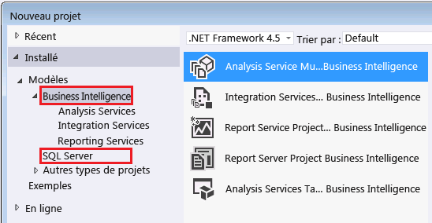

# <a name="reporting-services-in-sql-server-data-tools-ssdt"></a>Reporting Services dans les outils de données SQL Server (SSDT)

  [!INCLUDE[ssBIDevStudioFull](../../includes/ssbidevstudiofull-md.md)] est un environnement [!INCLUDE[msCoName](../../includes/msconame-md.md)] [!INCLUDE[vsprvs](../../includes/vsprvs-md.md)] pour créer des solutions d’aide à la décision. SSDT comprend l’environnement de création Concepteur de rapports, où vous pouvez ouvrir, modifier, afficher un aperçu, enregistrer et déployer des définitions de rapport paginés [!INCLUDE[ssRSnoversion_md](../../includes/ssrsnoversion-md.md)] , des sources de données partagées, des datasets partagés et des parties de rapports. [!INCLUDE[ssBIDevStudioFull](../../includes/ssbidevstudiofull-md.md)] n’est pas fourni avec SQL Server. Téléchargez [SQL Server Data Tools](http://go.microsoft.com/fwlink/?LinkID=616714). 
  
 Cette rubrique décrit les solutions, les projets, les modèles de projet, et les configurations de [!INCLUDE[ssBIDevStudio](../../includes/ssbidevstudio-md.md)] utilisés pour [!INCLUDE[ssRSnoversion](../../includes/ssrsnoversion-md.md)], ainsi que les vues, les menus, les barres d'outils et les raccourcis que vous pouvez utiliser dans le Concepteur de rapports.  
  
 Pour commencer à concevoir des rapports, consultez [Concevoir des rapports à l’aide du Concepteur de rapports &#40;SSRS&#41;](../../reporting-services/tools/design-reporting-services-paginated-reports-with-report-designer-ssrs.md).  
  
##  <a name="bkmk_SolutionsandProjects"></a> Solutions et projets  
 Un projet de rapport fonctionne comme un conteneur de définitions de rapports et de ressources. Tous les fichiers du projet de rapport sont publiés sur le serveur de rapports lors du déploiement du projet. Lorsque vous créez un projet pour la première fois, une solution est également créée comme conteneur pour le projet. Vous pouvez ajouter plusieurs projets dans une solution unique.  
  
  
##  <a name="bkmk_Configurations"></a> Configurations  
 Pour créer plusieurs jeux de propriétés du projet pour diverses opérations de déploiement (par exemple, des tests en entreprise ou des serveurs de rapports de production), utilisez le Gestionnaire de configuration. Pour plus d’informations, consultez [Déploiement et prise en charge des versions dans les outils de données SQL Server &#40;SSRS&#41;](../../reporting-services/tools/deployment-and-version-support-in-sql-server-data-tools-ssrs.md).  
  
##  <a name="bkmk_ReportServerProjects"></a> Projets Report Server  
 Lorsque vous installez [!INCLUDE[ssRSnoversion](../../includes/ssrsnoversion-md.md)], les modèles de projet suivants sont disponibles dans [!INCLUDE[ssBIDevStudioFull](../../includes/ssbidevstudiofull-md.md)]:  
  
-   **Projet Report Server.** Lorsque vous sélectionnez un projet Report Server, le Concepteur de rapports s'ouvre. Un projet Report Server est un modèle de projets Business Intelligence installé par [!INCLUDE[vsprvs](../../includes/vsprvs-md.md)] et disponible dans la boîte de dialogue **Nouveaux projets** . Pour plus d’information, consultez [Ajouter un nouveau rapport ou un rapport existant à un projet de rapport &#40;SSRS&#41;](../../reporting-services/tools/add-a-new-or-existing-report-to-a-report-project-ssrs.md). Les propriétés du projet Report Server s’appliquent à tous les rapports et à toutes les sources de données partagées au sein d’un projet [!INCLUDE[ssBIDevStudioFull](../../includes/ssbidevstudiofull-md.md)]. Ces propriétés incluent l'URL du serveur de rapports et les noms des dossiers des rapports et des sources de données partagées. Pour afficher les propriétés actuelles du projet, ouvrez la boîte de dialogue **Pages de propriétés du projet** . Pour ce faire, dans le menu **Projet** , cliquez sur **Propriétés**.  
  
-   **Assistant Projet Report Server.** Lorsque vous sélectionnez l'Assistant Projet Report Server, un projet de serveur de rapports est automatiquement créé et l'Assistant Rapport s'ouvre. Dans l'Assistant, pour créer un rapport, suivez les instructions de chaque page pour créer une chaîne de connexion dans une source de données, définir les informations d'identification de la source de données, créer une requête, ajouter une région de données de table ou de matrice, spécifier des données de rapport et des groupes, choisir une police et un style de couleur, publier le rapport sur un serveur de rapports et afficher un aperçu local du rapport. Après avoir créé un rapport au moyen de l'Assistant, vous pouvez modifier les données du rapport et le Concepteur de rapports à l'aide de l'outil Concepteur de rapports dans le projet Report Server.  
  
   
  
  
##  <a name="bkmk_ReportDesignerWindowsandPanes"></a> Fenêtres et volets du Concepteur de rapports  
 Le Concepteur de rapports prend en charge deux modes : le mode **Conception** définit les données et la mise en page du rapport ; le mode **Aperçu** affiche un rendu du rapport. Chaque mode vous permet d'afficher plusieurs fenêtres pour vous aider à concevoir un rapport ou générer son rendu.  
  
###  <a name="bkmk_ReportDataPane"></a> Données du rapport, volet  
 Le volet des données de rapport affiche des champs intégrés, des sources de données, des datasets, des collections de champs, des paramètres de rapport et des images.  
  
 Utilisez le volet des données du rapport pour afficher :  
  
-   **Champs intégrés** Informations prédéfinies sur les rapports, telles que leur nom ou l’heure à laquelle ils ont été traités.  
  
-   **Sources de données** La source des données représente un nom et une connexion à une source de données.  
  
-   **Datasets** Chaque dataset comprend une requête qui spécifie les données à extraire de la source de données. Développez le dataset pour afficher la collection de champs définie par la requête du dataset.  
  
     Dans certains concepteurs de requêtes pour les datasets multidimensionnels, vous pouvez spécifier des filtres dans le volet des filtres et indiquer s'il faut créer des paramètres de rapport. Si vous spécifiez l'option de paramètre de rapport, un dataset particulier est créé automatiquement pour remplir la liste des valeurs valides du paramètre.  Par défaut, le dataset n'apparaît pas dans le volet des données de rapport. Pour plus d’informations, consultez [Afficher des datasets masqués pour les valeurs de paramètres des données multidimensionnelles &#40;Générateur de rapports et SSRS&#41;](../../reporting-services/report-data/show-hidden-datasets-for-parameter-values-multidimensional-data.md).  
  
-   **Paramètres de rapport** La liste des paramètres de rapport. Les paramètres peuvent être créés manuellement ou automatiquement lorsqu'une requête de dataset comprend des paramètres de requête.  
  
-   **Images** La liste des images disponibles à inclure comme élément de rapport image dans un rapport.  
  
 Les sources de données et datasets dans le volet des données du rapport représentent les éléments dans la définition de rapport. Le volet des données du rapport est une fonctionnalité prise en charge par plusieurs environnements de création de rapports. Dans le Générateur de rapports, il s'agit du seul volet disponible pour gérer des sources de données et datasets. Dans le Concepteur de rapports, le volet des données du rapport s'exécute avec l'explorateur de solutions, qui répertorie les sources de données partagées et des datasets partagés en tant que fichiers. Les sources de données partagées et des datasets partagés dans le volet des données du rapport doivent indiquer leurs sources de données partagées et les datasets partagés correspondants dans l'explorateur de solutions. Les éléments du volet des données du rapport contiennent ensuite une référence aux fichiers de données dans l'explorateur de solutions. Les propriétés du projet déterminent si les sources de données partagées et des datasets partagés sont déployés sur le serveur de rapports ou site SharePoint. Pour plus d’informations, consultez [Convertir des sources de données &#40;Générateur de rapports et SSRS&#41;](../../reporting-services/report-data/convert-data-sources-report-builder-and-ssrs.md).  
  
> [!NOTE]  
>  Si le volet des données de rapport n’est pas visible, cliquez dans la zone de conception, puis sur **Données du rapport** dans le menu **Affichage**. Si le volet des données de rapport est flottant, vous pouvez l'ancrer. Pour plus d’informations, consultez [Ancrer le volet des données de rapport dans le Concepteur de rapports &#40;SSRS&#41;](../../reporting-services/tools/dock-the-report-data-pane-in-report-designer-ssrs.md).  
  
  
###  <a name="bkmk_GroupingPane"></a> Volet de regroupement  
 Utilisez le volet de regroupement pour définir les groupes d'une région de données de tableau matriciel. Vous pouvez définir des groupes de lignes et de détails pour les tables et des groupes de lignes et de colonnes pour les matrices. Vous ne pouvez pas utiliser le volet de regroupement pour définir des groupes pour les graphiques ou d'autres régions de données. Pour plus d’informations, consultez [Fonctionnement des groupes&#40;Générateur de rapports et SSRS&#41;](../../reporting-services/report-design/understanding-groups-report-builder-and-ssrs.md).  
  
 Le volet de regroupement comporte deux modes :  
  
-   **Valeur par défaut.** Pour afficher les propriétés actuelles du projet, ouvrez la boîte de dialogue **Par défaut** pour afficher tous les groupes de lignes et de colonnes dans un format hiérarchique qui montre la relation des groupes parents, des groupes enfants, des groupes adjacents et des groupes de détails. Un groupe enfant apparaît au niveau de retrait suivant, en dessous de son groupe parent. Un groupe adjacent apparaît au même niveau de retrait que ses groupes homologues ou frères.  
  
     Utilisez le mode par défaut pour ajouter, modifier ou supprimer des groupes. Pour les groupes basés sur un champ de dataset unique, faites glisser le champ du volet Groupes de lignes vers le volet Groupes de colonnes. Vous pouvez insérer le groupe au-dessus ou en dessous d'un groupe existant. Pour ajouter un groupe adjacent, cliquez avec le bouton droit sur le groupe frère et utilisez le menu contextuel. Pour afficher les cellules de tableau matriciel qui appartiennent à un groupe, sélectionnez le groupe dans le volet de regroupement.  
  
-   **Avancé.** Pour afficher les propriétés actuelles du projet, ouvrez la boîte de dialogue **Avancé** , affichez des membres statiques et dynamiques de groupes de lignes et de colonnes de la région de données du tableau matriciel sélectionné.  Vous devez utiliser des membres de groupe pour définir les propriétés qui contrôlent la visibilité des lignes et des colonnes associées à un groupe ou à un membre d'un groupe, ou bien les règles que les convertisseurs utilisent pour tenter de maintenir des groupes ensemble sur une page. Les membres de groupe apparaissent sur l'aire de conception en tant que cellules des groupes de lignes et des groupes de colonnes.  
  
> [!NOTE]  
>  Pour basculer entre le mode **Par défaut** et le mode **Avancé** , cliquez avec le bouton droit sur la flèche vers le bas à droite de l’icône **Groupes de colonnes** .  
  
 Pour plus d'informations, consultez [Grouping Pane](../../reporting-services/tools/grouping-pane.md).  
  
  
###  <a name="bkmk_Toolbox"></a> Boîte à outils  
 La boîte à outils contient des éléments de rapport que vous pouvez faire glisser vers l'aire de conception. Les régions de données sont des éléments de rapport qui vous permettent d'organiser des données dans le rapport. Table, Matrice, Liste, Graphique, Jauge, Barre de données, Graphique sparkline et Indicateur sont des régions de données. Carte, Zone de texte, Rectangle, Graphique en courbe, Image et Sous-rapport sont également des éléments de rapport. Des éléments de rapport personnalisés peuvent également figurer dans cette liste s'ils ont été installés et enregistrés par votre administrateur système.  
  
###  <a name="bkmk_PropertiesPane"></a> Volet Propriétés  
 Le volet Propriétés est une fenêtre standard de [!INCLUDE[vsprvs](../../includes/vsprvs-md.md)] qui précise les noms et les valeurs des propriétés de l'élément de rapport actuellement sélectionné dans l'aire de conception. Dans la plupart des cas, les noms des propriétés correspondent à des éléments et à des attributs au sein du fichier RDL (Report Definition Language). Les propriétés les plus fréquemment employées peuvent être définies au moyen de la boîte de dialogue Propriétés de l'élément sélectionné. Pour ouvrir la boîte de dialogue correspondante, cliquez sur le bouton **Pages de propriétés** dans la barre d'outils du volet Propriétés. Les utilisateurs expérimentés peuvent définir des valeurs de propriété directement dans le volet Propriétés.  
  
 Utilisez le volet Propriétés pour :  
  
-   définir les propriétés pour l'élément actuellement sélectionné dans l'aire de conception. Certaines propriétés affichent une liste déroulante de valeurs. Vous pouvez aussi taper la valeur directement dans la cellule. Certaines propriétés contiennent une collection de valeurs désignée par la valeur **(Collection)**. La plupart des propriétés peuvent accepter une expression ; les expressions complexes sont signalées par la valeur **\<Expression>**. Cliquez sur **\<Expression>** pour ouvrir la boîte de dialogue **Expression**. Pour plus d'informations, consultez [Expression Dialog Box](http://msdn.microsoft.com/library/e6c74ccb-4594-4d4f-b958-618d710e34eb).  
  
-   Utilisez les boutons de la barre d'outils du volet Propriétés pour modifier la grille et la faire basculer de l'affichage des catégories vers un affichage alphabétique. En affichage des catégories, vous devrez peut-être développer une catégorie pour afficher toutes ses propriétés en dessous. Pour ouvrir la boîte de dialogue Propriétés d’un élément, cliquez sur le bouton **Pages de propriétés** de la barre d’outils, ou cliquez avec le bouton droit sur l’élément, puis cliquez sur **Propriétés**.  
  
-   Dans le volet de regroupement, définissez les propriétés pour le membre du groupe sélectionné actuellement. Les propriétés de membre de groupe aident à contrôler la répétition des lignes statiques d'en-tête de groupe et de pied de page pour chaque instance de groupe. Pour plus d’informations, consultez [Afficher des en-têtes et des pieds de page avec un groupe &#40;Générateur de rapports et SSRS&#41;](../../reporting-services/report-design/display-headers-and-footers-with-a-group-report-builder-and-ssrs.md).  
  
 Pour afficher le volet Propriétés, dans le menu **Affichage** , cliquez sur **Fenêtre Propriétés**. Vous pouvez détacher ce volet et le déplacer vers une autre zone de la fenêtre [!INCLUDE[ssBIDevStudio](../../includes/ssbidevstudio-md.md)]ou bien l'afficher sous forme de fenêtre à onglets dans l'aire de conception.  
  
  
###  <a name="bkmk_SolutionExplorer"></a> Explorateur de solutions  
 L'Explorateur de solutions est un composant [!INCLUDE[vsprvs](../../includes/vsprvs-md.md)] standard qui affiche tous les éléments de votre projet. Pour un projet Report Server, cela inclut des dossiers pour organiser des sources de données partagées, des datasets partagés, des rapports et des ressources. Lorsque vous ouvrez le fichier des solutions, les dossiers sont automatiquement classés par ordre alphabétique. Pour afficher les propriétés d'un élément dans le volet propriétés, sélectionnez l'élément.  
  
###  <a name="bkmk_Output"></a> Sortie  
 La fenêtre Sortie affiche les erreurs de traitement lorsque vous visualisez un rapport, ainsi que les erreurs de publication lors du déploiement d'un rapport ou d'une source de données partagée.  
  
 Pour déboguer des erreurs dans les expressions, utilisez la sortie et les fenêtres Structure du document.  
  
  
###  <a name="bkmk_DocumentOutline"></a> Structure du document  
 La fenêtre Structure du document affiche une liste hiérarchique de tous les éléments de rapport dans la définition du rapport. Pour l'ouvrir, dans le menu **Affichage** , pointez sur **Autres fenêtres** , puis cliquez sur **Structure du document**.  
  
 Utilisez le volet Structure du document pour identifier les zones de texte et autres éléments de rapport par nom. Lorsque vous sélectionnez un élément dans la Structure du document, l'élément est également sélectionné dans l'Aire de conception.  
  
###  <a name="bkmk_TaskList"></a> Liste des tâches  
 La fenêtre Liste des tâches affiche les erreurs de build pour les fonctionnalités non prises en charge lorsque vous importez un rapport depuis une autre application, telle que [!INCLUDE[msCoName](../../includes/msconame-md.md)] Access.  
  
  
##  <a name="bkmk_ReportDesignerDesignView"></a> Mode conception du Concepteur de rapports  
 Par défaut, lorsque vous créez un projet Report Server, le Concepteur de rapports s'ouvre en mode création et affiche l'aire de conception. Par défaut, l'aire de conception affiche le corps du rapport et son arrière-plan.  
  
 Le menu contextuel dans l'arrière-plan propose des options permettant d'ajouter un en-tête et un pied de page, puis, à partir du menu Affichage, d'afficher une règle et le volet de regroupement.  
  
 Utilisez le contrôle de zoom pour augmenter ou diminuer l'agrandissement du rapport.  
  
 Pour concevoir un rapport, faites glisser les éléments de la boîte à outils vers l'aire de conception, puis configurez leurs propriétés et modifiez leur agencement au sein du rapport.  
  
  
##  <a name="bkmk_ReportDesignerPreview"></a> Aperçu du Concepteur de rapports  
 Utilisez le mode Aperçu pour exécuter le rapport et afficher un rendu du rapport dans la visionneuse de rapports. Le mode Aperçu permet de mettre en cache localement les données du rapport. Vous pouvez également définir les propriétés de configuration pour exécuter le rapport en mode débogage à l'aide d'un navigateur.  
  
 Lorsque vous affichez l'aperçu d'un rapport, le Concepteur de rapports se connecte aux sources de données du rapport, exécute des requêtes de dataset, met en cache les données sur l'ordinateur local, traite le rapport pour fusionner les données et la mise en page, puis restitue le rapport. Vous pouvez afficher le rapport dans l'onglet Aperçu ou bien définir les propriétés du projet afin de visualiser le rapport en mode débogage et le consulter directement dans un navigateur.  
  
-   **Aperçu des rapports paramétrables.** Lors de l'aperçu d'un rapport, ce dernier est automatiquement traité si l'ensemble de ses paramètres possèdent des valeurs valides par défaut. Si un ou plusieurs paramètres du rapport ne sont pas dotés de valeurs valides par défaut, vous devez choisir une valeur pour chaque paramètre non attribué, puis cliquer sur **Afficher le rapport**dans la barre d'outils du rapport.  
  
-   **Présentation du cache de données local** Lors de l’aperçu d’un rapport, le processeur de rapports exécute toutes les requêtes pour les datasets dans le rapport à l’aide des paramètres par défaut actuels, puis enregistre les résultats dans un fichier de cache de données local (.rdl.data). Vous pouvez toujours concevoir votre rapport sans avoir à récupérer de nouveau ces données si vous n'apportez aucune modification aux requêtes de dataset du rapport ou à ses paramètres.  
  
-   **Aperçu du rapport via le Gestionnaire de configuration et l'outil de débogage.** Dans [!INCLUDE[ssBIDevStudioFull](../../includes/ssbidevstudiofull-md.md)], les propriétés du projet définissent la manière dont vous souhaitez déployer et déboguer vos rapports. Ces propriétés s'appliquent à tous les rapports et à toutes les sources de données partagées au sein du projet . Pour définir les propriétés du projet, dans le menu **Projet** , cliquez sur **Propriétés**. Testez vos rapports au moyen de ces paramètres et publiez-les sur le serveur de rapports.  
  
-   **Contrôle des messages d'erreur dans le volet Sortie.** Lorsque vous affichez l'aperçu d'un rapport et que le processeur de rapports détecte un problème, il génère des messages d'erreur dans le volet Sortie.  
  
  
##  <a name="bkmk_ReportDesignerMenus"></a> Menus du Concepteur de rapports  
 Quand un projet du Concepteur de rapports est actif dans [!INCLUDE[ssBIDevStudioFull](../../includes/ssbidevstudiofull-md.md)], les barres d'outils suivantes apparaissent dans la barre d'outils principale. Les menus du Concepteur de rapports sont visibles uniquement en mode Conception.  
  
###  <a name="FormatMenu"></a> Menu Format  
 Lorsque vous sélectionnez un élément dans l'aire de conception, le menu **Format** dévoile les options suivantes :  
  
-   **Couleur de premier plan** Sélectionnez la couleur d'un texte. Le noir est la couleur par défaut.  
  
-   **Couleur d'arrière-plan** Choisissez une couleur d'arrière-plan pour vos zones de texte et les régions de données.  
  
-   **Police** Spécifiez si le texte doit apparaître en gras, en italique ou souligné.  
  
-   **Justifier** Indiquez si le texte est aligné à droite, centré ou aligné à gauche.  
  
-   **Aligner** Précisez comment les objets sélectionnés sont alignés les uns par rapport aux autres au sein du rapport.  
  
-   **Uniformiser la taille** Ajustez la taille des objets sélectionnés au sein du rapport.  
  
-   **Espacement horizontal** Ajustez l'espacement horizontal entre les objets sélectionnés au sein du rapport.  
  
-   **Espacement vertical** Ajustez l'espacement vertical entre les objets sélectionnés au sein du rapport.  
  
-   **Centrer sur le formulaire** Centrez l'objet choisi verticalement et horizontalement par rapport à la fenêtre du Concepteur de rapports.  
  
-   **Ordre** Déplacez les objets sélectionnés à l'arrière-plan ou au premier plan.  
  
###  <a name="ReportMenu"></a> Menu Rapport  
 Lorsque l'aire de conception du rapport est active, le menu **Rapport** comprend les options suivantes :  
  
-   **Propriétés du rapport** Sélectionnez cette option pour ouvrir la boîte de dialogue **Propriétés du rapport** . Dans cette boîte de dialogue, vous pouvez affecter les propriétés générales du rapport, telles que le nom de l'auteur et l'espacement de la grille, et définir des propriétés pour sa mise en page, notamment le nombre de colonnes et la taille de la page. Vous pouvez également inclure du code personnalisé, des références à des assemblys et à des classes, ainsi que les noms d'éléments de sortie des données, des transformations de données et des schémas de données.  
  
-   **Vue** Basculez entre les deux onglets du Concepteur de rapports : Conception et aperçu.  
  
-   **En-tête de page** Ajoutez ou supprimez un en-tête de page dans le rapport. Lorsque vous supprimez un en-tête de page, tous les éléments qu'il contient sont supprimés.  
  
-   **Pied de page** Ajoutez ou supprimez un pied de page dans le rapport. Lorsque vous supprimez un pied de page, tous les éléments qu'il contient sont supprimés.  
  
-   **Volet de regroupement** Affichez ou masquez le volet de regroupement.  
  
###  <a name="ViewMenu"></a> Menu Afficher  
 Le menu **Affichage** permet d'afficher les fenêtres et les barres d'outils du Concepteur de rapports.  
  
-   **Liste d'erreurs** Utilisez cette option pour afficher des erreurs détectées lors de la publication ou de l'aperçu d'un rapport.  
  
-   **Sortie** Utilisez cette option pour afficher les erreurs détectées lors de la publication ou du traitement d’un rapport, ou pour obtenir de plus amples informations sur les erreurs d’expression quand un rapport affiche le texte « #Erreur ».  
  
-   **Fenêtre Propriétés** Utilisez cette option pour afficher les valeurs des propriétés de l'élément de rapport actuellement sélectionné dans l'aire de conception. Pour afficher les propriétés des éléments de rapport imbriqués, vous devez cliquer plusieurs fois sur un élément de rapport pour parcourir sa hiérarchie et ses membres imbriqués. Vérifiez le nom de l'élément de rapport qui apparaît en haut du volet Propriétés pour savoir lesquelles parmi ses propriétés sont affichées.  
  
-   **Boîte à outils** Utilisez cette option pour afficher la boîte à outils.  
  
-   **Autres fenêtres** Utilisez cette option pour afficher le volet suivant :  
  
    -   **Structure du document** Utilisez cette option pour afficher une vue hiérarchique des éléments de rapport et leurs collections de zones de texte dans un rapport.  
  
-   **Barres d'outils** Utilisez cette option pour afficher les barres d'outils qui prennent en charge les fonctionnalités du Concepteur de rapports, notamment **Bordures du rapport** et **Formatage du rapport**. Pour plus d'informations, consultez [Barres d'outils du Concepteur de rapports](#bkmk_ReportDesignerToolbars).  
  
-   **Données du rapport** Utilisez cette option pour afficher le volet des données de rapport où vous pouvez ajouter des paramètres de rapport, des sources de données, des datasets et des images.  
  
###  <a name="ProjectMenu"></a> Menu Projet  
 Utilisez le menu **Projet** pour gérer des sources de données partagées et des rapports dans un projet. Lorsque vous ajoutez ou supprimez des éléments du projet, l'affichage hiérarchique des éléments du projet dans l'Explorateur de solutions est automatiquement mis à jour.  
  
-   **Ajouter un nouvel élément** Ajoutez une nouvelle source de données partagée ou un nouveau rapport au projet.  
  
-   **Ajouter un élément existant** Ajoutez une source de données partagée existante ou un rapport existant au projet.  
  
-   **Importer des rapports** Importez des rapports d'une autre application (par exemple, Microsoft Access).  
  
-   **Exclure du projet** Excluez des éléments du projet. Cette option ne supprime pas l'élément de votre système de fichiers.  
  
-   **Afficher tous les fichiers** Affichez l'ensemble des fichiers dans un projet.  
  
-   **Actualiser les éléments de boîte à outils du projet** Actualisez le cache de boîte à outils lorsque vous installez de nouveaux éléments de rapport personnalisés dans votre projet.  
  
-   **Propriétés** Ouvrez la boîte de dialogue **Pages de propriétés** du projet concerné. Pour plus d’informations, consultez [Pages de propriétés du projet, boîte de dialogue](../../reporting-services/tools/project-property-pages-dialog-box.md).  
  
  
##  <a name="bkmk_ReportDesignerToolbars"></a> Barres d'outils du Concepteur de rapports  
 Le Concepteur de rapports propose les barres d'outils spécialisées suivantes pour la création de rapports :  
  
-   **Rapport** Ajoutez un en-tête ou un pied de page, définissez les propriétés du rapport, basculez vers la règle ou le volet de regroupement ou modifiez l'affichage du rapport à l'aide du contrôle de zoom.  
  
-   **Bordures du rapport** Définissez la couleur, le style et la largeur de toutes les lignes sélectionnées, ainsi que les bordures de tous les éléments de rapport choisis.  
  
-   **Formatage du rapport** Définissez le format des éléments de rapport sélectionnés. Pour les zones de texte, les types de mise en forme suivants peuvent être modifiés à l'aide de la barre d'outils : propriétés de la police et couleur du texte, couleur d'arrière-plan et justification du texte.  
  
-   **Mise en page** Définissez l'ordre de dessin des éléments de rapport et la fusion des cellules dans une région de données.  
  
-   **Standard** Ouvrez ou enregistrez des projets et des fenêtres d'affichage et sélectionnez la configuration du débogage.  
  
 Utilisez le menu **Affichage** pour choisir ou non d'afficher ces barres d'outils. D'autres barres d'outils de [!INCLUDE[vsprvs](../../includes/vsprvs-md.md)] peuvent être désactivées si leurs fonctionnalités ne s'appliquent pas à celles du Concepteur de rapports.  
  

##  <a name="bkmk_SourceControl"></a> contrôle de code source ;  
 [!INCLUDE[ssBIDevStudio](../../includes/ssbidevstudio-md.md)] peut intégrer des plug-ins de source. Utilisez les pages Projets et Solutions de la boîte de dialogue **Options** pour spécifier le plug-in et configurer les paramètres.  
  
##  <a name="bkmk_CustomReportTemplates"></a> Modèles de rapports personnalisés  
 Pour utiliser des rapports personnalisés comme modèles pour de nouveaux rapports, il suffit de les copier dans le dossier ReportProject sur l'ordinateur sur lequel [!INCLUDE[ssBIDevStudio](../../includes/ssbidevstudio-md.md)] est installé. Par défaut, ce dossier se trouve dans l’emplacement suivant : `<drive>:\Program Files\Microsoft Visual Studio 14.0\Common7\IDE\Private Assemblies\ProjectItems\ReportProject`. Lorsque vous ajoutez un nouvel élément au projet de rapport, votre rapport personnalisé s'affiche dans le volet Modèles.  
  
 Vous pouvez également ajouter des styles personnalisés à l'Assistant de rapport.  
  
  
##  <a name="bkmk_CommandLineSupportForssdt"></a> Prise en charge de la ligne de commandes pour les outils de données SQL Server  
 [!INCLUDE[ssBIDevStudio](../../includes/ssbidevstudio-md.md)] est basé sur [!INCLUDE[msCoName](../../includes/msconame-md.md)] [!INCLUDE[vsprvs](../../includes/vsprvs-md.md)] et sur l’application devenv.exe sous-jacente. Pour pouvoir utiliser ces options, vous devez définir des valeurs valides pour les deux éléments suivants :  
  
-   Propriétés de projet pour OverwriteDataSources, TargetDataSourceFolder, TargetReportFolder et TargetServerURL.  
  
-   Au moins un jeu de propriétés de configuration, par exemple, Debug ou Release.  
  
 Pour plus d'informations, consultez [Publishing Data Sources and Reports](../../reporting-services/reports/publishing-data-sources-and-reports.md).  
  
 Pour un projet de serveur de rapports, vous pouvez spécifier les options suivantes à partir de la ligne de commande :  
  
-   **/deploy** Permet de déployer des rapports à l’aide des propriétés de projet spécifiées dans un fichier de configuration. Par exemple, la commande suivante déploie les rapports spécifiés par le fichier solution Reports.sln en utilisant les paramètres de configuration Release spécifiés dans les propriétés de projet :  
  
    ```  
    devenv.exe "C:\Users\MyUser\Documents\Visual Studio 2015\Projects\Reports\Reports.sln" /deploy "Release"  
    ```  
  
-   **/build** Permet de générer le fichier solution, mais pas de le déployer. Par exemple, la commande suivante génère les rapports spécifiés par le fichier solution Reports.sln en utilisant les paramètres de configuration Debug spécifiés dans les propriétés de projet :  
  
    ```  
    devenv.exe "C:\Users\MyUser\Documents\Visual Studio 2015\Projects\Reports\Reports.sln" /build "Debug"  
    ```  
  
-   **/out** Permet de rediriger la sortie générée en créant une solution dans le fichier spécifié. Par exemple, la commande suivante redirige la sortie générée dans l'exemple précédent vers un fichier nommé mybuildlog.txt.  
  
    ```  
    devenv.exe "C:\Users\MyUser\Documents\Visual Studio 2015\Projects\Reports\Reports.sln" /build "Debug" /out mybuildlog.txt  
    ```  
  
##  <a name="bkmk_KeyboardShortcuts"></a> Raccourcis clavier dans Reporting Services  
 Utilisez les raccourcis clavier pour :  
  
-   Contrôler les fenêtres et les modes dans [!INCLUDE[ssBIDevStudio](../../includes/ssbidevstudio-md.md)]:  
  
    |Description|Combinaison de touches|  
    |-----------------|---------------------|  
    |Génération du projet sélectionné|CTRL+MAJ+B|  
    |Affichage de la fenêtre Propriétés|F4|  
    |Affichage de la fenêtre Données|CTRL+Alt+D|  
    |Démarrage du débogage|F5|  
    |Passage d'une fenêtre ouverte à la suivante|F6|  
  
-   contrôler les éléments sur l'aire de conception du rapport :  
  
    |Description|Combinaison de touches|  
    |-----------------|---------------------|  
    |Déplacer le focus d'un élément de rapport vers l'élément de rapport suivant|Tab|  
    |Déplacer l'élément de rapport sélectionné|Touches de direction|  
    |Déplacer l'élément de rapport sélectionné|CTRL+Touches de direction|  
    |Augmenter ou diminuer la taille de l'élément de rapport sélectionné|CTRL+MAJ+Touches de direction|  
    |Dans une zone de texte, déplacer le curseur au début du texte d'affichage visible|Ctrl+Origine|  
    |Dans une zone de texte, déplacer le curseur à la fin du texte d'affichage visible|Ctrl+Fin|  
    |Dans une zone de texte, sélectionner le texte à partir de la position actuelle du curseur jusqu'au début du texte d'affichage visible|Maj+Origine|  
    |Dans une zone de texte, sélectionner le texte à partir de la position actuelle du curseur jusqu'à la fin du texte d'affichage visible|Maj+Fin|  
    |Dans une zone de texte, sélectionner le texte à partir de la position actuelle du curseur jusqu'au début de l'expression|CTRL+MAJ+ORIGINE|  
    |Dans une zone de texte, sélectionner le texte à partir de la position actuelle du curseur jusqu'à la fin de l'expression|Ctrl+Maj+Fin|  
    |Ouvrir le menu contextuel de l'élément de rapport sélectionné|MAJ+F10+Clé de propriété sur les claviers récents|
  
## <a name="next-steps"></a>Étapes suivantes

[Télécharger SQL Server Data Tools](http://go.microsoft.com/fwlink/?LinkID=616714)
[Explorateur de solutions](http://msdn.microsoft.com/library/0df09843-0d4f-4925-bc6c-99265035a0c1)   
[Rapports Reporting Services](../../reporting-services/reports/reporting-services-reports-ssrs.md)   
[Langage de définition des rapports](../../reporting-services/reports/report-definition-language-ssrs.md)   
[Prise en charge du déploiement et de la version dans les outils de données de serveur SQL](../../reporting-services/tools/deployment-and-version-support-in-sql-server-data-tools-ssrs.md)  

D’autres questions ? [Essayez de poser une question dans le forum Reporting Services](http://go.microsoft.com/fwlink/?LinkId=620231)
