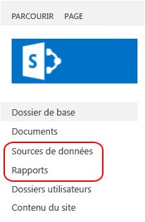

# <a name="sample-reporting-services-rsexe-script-to-copy-content-between-report-servers"></a>Exemple de script Reporting Services rs.exe pour copier du contenu entre des serveurs de rapports

[!INCLUDE[ssrs-appliesto](../../includes/ssrs-appliesto.md)] [!INCLUDE [ssrs-appliesto-2008r2-and-later](../../includes/ssrs-appliesto-2008r2-and-later.md)] [!INCLUDE [ssrs-appliesto-sharepoint-2013-2016](../../includes/ssrs-appliesto-sharepoint-2013-2016.md)] [!INCLUDE [ssrs-appliesto-pbirs](../../includes/ssrs-appliesto-pbirs.md)])

Cet article inclut et décrit un exemple de script RSS [!INCLUDE[ssRSnoversion](../../includes/ssrsnoversion-md.md)] qui copie les éléments de contenu et les paramètres d’un serveur de rapports [!INCLUDE[ssNoVersion](../../includes/ssnoversion-md.md)] [!INCLUDE[ssRSnoversion](../../includes/ssrsnoversion-md.md)] vers un autre serveur de rapports au moyen de l’utilitaire **RS.exe**. RS.exe est installé avec [!INCLUDE[ssRSnoversion](../../includes/ssrsnoversion-md.md)], en mode natif et SharePoint. Le script copie les éléments de [!INCLUDE[ssRSnoversion](../../includes/ssrsnoversion-md.md)] , par exemple les rapports et les abonnements, de serveur à serveur. Il prend en charge le mode SharePoint et les serveurs de rapports en mode natif.  

##  <a name="bkmk_download_script"></a> Pour télécharger le script ssrs_migration.rss  
 Téléchargez le [script de migration Reporting Services RS.exe](https://github.com/Microsoft/sql-server-samples/tree/master/samples/features/reporting-services/ssrs-migration-rss) à partir du site GitHub dans un dossier local. Pour plus d’informations, consultez la section [Pour utiliser le script](#bkmk_how_to_use_the_script) dans cet article.  
  
##  <a name="bkmk_supported_scenarios"></a> Scénarios pris en charge  
 Il prend en charge le mode SharePoint et les serveurs de rapports en mode natif. Le script peut être exécuté sur des serveurs de rapports version [!INCLUDE[ssKilimanjaro](../../includes/sskilimanjaro-md.md)] ou ultérieure et Power BI Report Server.  
  
Il peut être utilisé pour copier le contenu entre des serveurs de rapports ayant le même mode ou des modes différents. Par exemple, exécutez le script pour copier le contenu à partir d’un serveur de rapports en mode natif [!INCLUDE[ssKilimanjaro](../../includes/sskilimanjaro-md.md)] vers un serveur de rapports en mode SharePoint [!INCLUDE[ssSQL11SP1](../../includes/sssql11sp1-md.md)] . Exécutez le script à partir de n'importe quel serveur sur lequel RS.exe est installé. Par exemple, dans le déploiement suivant, vous pouvez :  
  
-   Exécuter RS.exe et le script **SUR** le serveur A.  
  
-   Copier le contenu **À PARTIR DU** serveur B.  
  
-   **VERS** le serveur C.  
  
|Nom du serveur|Mode du serveur de rapports|  
|-----------------|------------------------|  
|Serveur A|Natif|  
|serveur B.|SharePoint|  
|le serveur C.|SharePoint|  
  
 Pour plus d’informations sur l’utilitaire RS.exe, consultez [Utilitaire RS.exe &#40;SSRS&#41;](../../reporting-services/tools/rs-exe-utility-ssrs.md).  
  
###  <a name="bkmk_what_is_migrated"></a> Éléments et ressources migrés par le script  
 Le script ne remplacera pas les éléments de contenu existants ayant le même nom.  Si le script détecte des éléments sur le serveur de destination qui ont le même nom sur le serveur source, chaque élément générera un message d'« échec » et le script va continuer. Le tableau suivant répertorie les types de contenu et les ressources que le script peut migrer vers les modes de serveur de rapports cibles.  
  
|Élément|Migré|SharePoint|Description|  
|----------|--------------|----------------|-----------------|  
|Mots de passe|**Non**|**Non**|Les mots de passe **NE sont PAS** migrés. Une fois que les éléments de contenu sont migrés, mettez à jour les informations d'identification sur le serveur de destination. Par exemple, les sources de données avec les informations d'identification stockées.|  
|Mes rapports|**Non**|**Non**|La fonctionnalité « Mes rapports » du mode natif utilise les connexions utilisateur individuelles, par conséquent, le service de script n’a pas accès au contenu des dossiers « Mes rapports » pour les utilisateurs, sauf pour le paramètre **–u** utilisé pour exécuter le script rss. De plus, « Mes rapports » n’est pas une fonctionnalité du mode SharePoint de [!INCLUDE[ssRSnoversion](../../includes/ssrsnoversion-md.md)], et les éléments dans les dossiers ne peuvent pas être copiés dans un environnement SharePoint. Par conséquent, le script ne copie pas les éléments de rapport qui sont dans les dossiers « Mes rapports » sur un serveur de rapports source en mode natif<br /><br /> Pour migrer le contenu des dossiers « Mes rapports » avec ce script, effectuez les étapes suivantes :<br /><br /> 1.  Créez de nouveaux dossiers dans le Gestionnaire de rapports. Éventuellement, créez des dossiers ou des sous-dossier pour chaque utilisateur.<br />2.  Ouvrez une session en tant qu’utilisateur avec un contenu « Mes rapports ».<br />3.  Dans le Gestionnaire de rapports, cliquez sur le dossier **Mes rapports**.<br />4.  Cliquez sur la vue **Détails** du dossier.<br />5.  Sélectionnez chaque rapport que vous souhaitez copier.<br />6.  Dans la barre d’outils du Gestionnaire de rapports, cliquez sur **Déplacer**.<br />7.  Sélectionnez le dossier de destination souhaité.<br />8.  Répétez les étapes 2 à 7 pour chaque utilisateur.<br />9. Exécutez le script.|  
|Historique|**Non**|**Non**||  
|Paramètres d'historique|Oui|Oui|Les paramètres d'historique sont migrés, cependant les informations d'historique NE SONT PAS migrées.|  
|Planifications|oui|oui|Pour migrer des planifications, il est nécessaire que SQL Server Agent soit en cours de exécution sur le serveur cible. Si SQL Server Agent n’est pas exécuté sur la cible, un message d’erreur semblable au suivant s’affiche :<br /><br /> `Migrating schedules: 1 items found. Migrating schedule: theMondaySchedule ... FAILURE:  The SQL Agent service isn't running. This operation requires the SQL Agent service. ---> Microsoft.ReportingServices.Diagnostics.Utilities.SchedulerNotResponding Exception: The SQL Agent service isn't running. This operation requires the SQL Agent service.`|  
|Rôles et stratégies système|Oui|Oui|Par défaut, le script ne copie pas de schéma d’autorisation personnalisé entre les serveurs. Le comportement par défaut est que les éléments sont copiés sur le serveur de destination avec l’indicateur « Hériter les autorisations de l’élément parent » défini sur TRUE. Si vous voulez générer un script pour copier les autorisations pour chaque élément, utilisez le commutateur SECURITY.<br /><br /> Si les serveurs sources et cibles **n’ont pas le même mode de serveur de rapports**, par exemple si le serveur source est en mode natif et le serveur cible est en mode SharePoint, et si vous utilisez le commutateur SECURITY, le script tente de mapper les rôles et les groupes par défaut en effectuant une comparaison, comme cela est décrit dans l’article [Comparer des rôles et des tâches dans Reporting Services avec les autorisations et les groupes SharePoint](../../reporting-services/security/reporting-services-roles-tasks-vs-sharepoint-groups-permissions.md). Les rôles et les groupes personnalisés ne sont pas copiés sur le serveur de destination.<br /><br /> Quand le script copie entre des serveurs qui **ont le même mode**, et si vous utilisez le commutateur SECURITY, le script crée des rôles (mode natif) ou des groupes (mode SharePoint) sur le serveur de destination.<br /><br /> Si un rôle existe déjà sur le serveur de destination, le script crée un message d’échec similaire au suivant, et poursuit la migration des autres éléments. Une fois le script terminé, vérifiez que les rôles sur le serveur de destination sont configurés conformément à vos besoins. Rôles de migration : 8 éléments trouvés.<br /><br /> `Migrating role: Browser ... FAILURE: The role 'Browser' already exists and cannot be created. ---> Microsoft.ReportingServices.Diagnostics.Utilities.RoleAlreadyExistsException: The role 'Browser' already exists and cannot be created.`<br /><br /> Pour plus d’informations, consultez [Accorder à un utilisateur l’accès à un serveur de rapports &#40;Gestionnaire de rapports&#41;](../../reporting-services/security/grant-user-access-to-a-report-server-report-manager.md).<br /><br /> **Remarque :** Si un utilisateur qui existe sur le serveur source n’existe pas sur le serveur de destination, le script ne peut pas appliquer les attributions de rôles sur le serveur de destination, même si le commutateur SECURITY est utilisé.|  
|Source de données partagée|Oui|Oui|Le script ne remplace pas les éléments existants sur le serveur cible. Si un élément du même nom existe déjà sur le serveur cible, un message d’erreur similaire au suivant s’affiche :<br /><br /> `Migrating DataSource: /Data Sources/Aworks2012_oltp ... FAILURE:The item '/Data Sources/Aworks2012_oltp' already exists. ---> Microsoft.ReportingServices.Diagnostics.Utilities.ItemAlreadyExistsException: The item '/Data Source s/Aworks2012_oltp' already exists.`<br /><br /> Les informations d’identification **NE sont PAS** copiées dans le cadre de la source de données. Une fois que les éléments de contenu sont migrés, mettez à jour les informations d'identification sur le serveur de destination.|  
|Dataset partagé|Oui|Oui||  
|Dossier|Oui|Oui|Le script ne remplace pas les éléments existants sur le serveur cible. Si un élément du même nom existe déjà sur le serveur cible, un message d’erreur similaire au suivant s’affiche :<br /><br /> `Migrating Folder: /Reports ... FAILURE: The item '/Reports' already exists. ---> Microsoft.ReportingServices.Diagnostics.Utilities.ItemAlreadyExistsException: The item '/Reports' already exists.`|  
|Rapport|Oui|Oui|Le script ne remplace pas les éléments existants sur le serveur cible. Si un élément du même nom existe déjà sur le serveur cible, un message d’erreur similaire au suivant s’affiche :<br /><br /> `Migrating Report: /Reports/testThe item '/Reports/test' already exists. ---> Microsoft.ReportingServices.Diagnostics.Utilities.ItemAlreadyExistsException: The item '/Reports/test' already exists.`|  
|Paramètres|Oui|Oui||  
|Abonnements|Oui|Oui||  
|Paramètres d'historique|Oui|Oui|Les paramètres d'historique sont migrés, cependant les informations d'historique NE SONT PAS migrées.|  
|options de traitement|Oui|Oui||  
|options d'actualisation du cache|Oui|Oui|Les paramètres dépendants sont migrés en tant qu'éléments du catalogue. Ce qui suit est un exemple hors du script car il migre un rapport (.rdl) et les paramètres liés tels que les options d'actualisation du cache :<br /><br /> -   Migrating parameters for report TitleOnly.rdl 0 items found.<br />-   Migrating subscriptions for report TitleOnly.rdl: 1 items found.<br />-   Migrating subscription Save in \\\server\public\savedreports as TitleOnly ... SUCCESS<br />-   Migrating history settings for report TitleOnly.rdl ... SUCCESS<br />-   Migrating processing options for report TitleOnly.rdl ... 0 items found.<br />-   Migrating cache refresh options for report TitleOnly.rdl ... SUCCESS<br />-   Migrating cache refresh plans for report TitleOnly.rdl: 1 items found.<br />-   Migrating cache refresh plan titleonly_refresh735amM2F ... SUCCESS|  
|Plans d’actualisation du cache|Oui|Oui||  
|Images|Oui|Oui||  
|Parties de rapports|Oui|Oui||  
  
##  <a name="bkmk_required_permissions"></a> Autorisations requises  
 Les autorisations requises pour lire ou écrire des éléments et ressources ne sont pas les mêmes pour toutes les méthodes utilisées dans le script. Le tableau suivant résume les méthodes utilisées pour chaque élément ou ressource et renvoie à une rubrique spécifique. Accédez à chaque rubrique pour voir les autorisations requises. Par exemple, la rubrique qui traite de la méthode ListChildren indique les autorisations requises pour :  
  
-   **Autorisations requises en mode natif :** ReadProperties sur Item  
  
-   **Autorisations nécessaires en mode SharePoint :** ViewListItems  
  
|Élément ou ressource|Source|Cible|  
|----------------------|------------|------------|  
|Éléments du catalogue|<xref:ReportService2010.ReportingService2010.ListChildren%2A><br /><br /> <xref:ReportService2010.ReportingService2010.GetProperties%2A><br /><br /> <xref:ReportService2010.ReportingService2010.GetItemDataSources%2A><br /><br /> <xref:ReportService2010.ReportingService2010.GetItemReferences%2A><br /><br /> <xref:ReportService2010.ReportingService2010.GetDataSourceContents%2A><br /><br /> <xref:ReportService2010.ReportingService2010.GetItemLink%2A>|<xref:ReportService2010.ReportingService2010.CreateCatalogItem%2A><br /><br /> <xref:ReportService2010.ReportingService2010.SetItemDataSources%2A><br /><br /> <xref:ReportService2010.ReportingService2010.GetItemReferences%2A><br /><br /> <xref:ReportService2010.ReportingService2010.CreateDataSource%2A><br /><br /> <xref:ReportService2010.ReportingService2010.CreateLinkedItem%2A><br /><br /> <xref:ReportService2010.ReportingService2010.CreateFolder%2A>|  
|Rôle|<xref:ReportService2010.ReportingService2010.ListRoles%2A><br /><br /> <xref:ReportService2010.ReportingService2010.GetRoleProperties%2A>|<xref:ReportService2010.ReportingService2010.CreateRole%2A>|  
|Stratégie système|<xref:ReportService2010.ReportingService2010.GetSystemPolicies%2A>|<xref:ReportService2010.ReportingService2010.SetSystemPolicies%2A>|  
|Planifier|<xref:ReportService2010.ReportingService2010.ListSchedules%2A>|<xref:ReportService2010.ReportingService2010.CreateSchedule%2A>|  
|Abonnement|<xref:ReportService2010.ReportingService2010.ListSubscriptions%2A><br /><br /> <xref:ReportService2010.ReportingService2010.GetSubscriptionProperties%2A><br /><br /> <xref:ReportService2010.ReportingService2010.GetDataDrivenSubscriptionProperties%2A>|<xref:ReportService2010.ReportingService2010.CreateSubscription%2A><br /><br /> <xref:ReportService2010.ReportingService2010.CreateDataDrivenSubscription%2A>|  
|Plan d'actualisation du cache|<xref:ReportService2010.ReportingService2010.ListCacheRefreshPlans%2A><br /><br /> <xref:ReportService2010.ReportingService2010.GetCacheRefreshPlanProperties%2A>|<xref:ReportService2010.ReportingService2010.CreateCacheRefreshPlan%2A>|  
|Paramètres|<xref:ReportService2010.ReportingService2010.GetItemParameters%2A>|<xref:ReportService2010.ReportingService2010.SetItemParameters%2A>|  
|Options d'exécution|<xref:ReportService2010.ReportingService2010.GetExecutionOptions%2A>|<xref:ReportService2010.ReportingService2010.SetExecutionOptions%2A>|  
|Options de cache|<xref:ReportService2010.ReportingService2010.GetCacheOptions%2A>|<xref:ReportService2010.ReportingService2010.SetCacheOptions%2A>|  
|Paramètres d'historique|<xref:ReportService2010.ReportingService2010.GetItemHistoryOptions%2A>|<xref:ReportService2010.ReportingService2010.SetItemHistoryOptions%2A>|  
|Stratégie d'élément|<xref:ReportService2010.ReportingService2010.GetPolicies%2A>|<xref:ReportService2010.ReportingService2010.SetPolicies%2A>|  
  
 Pour plus d'informations, consultez [Comparer des rôles et des tâches dans Reporting Services pour des autorisations et des groupes SharePoint](../../reporting-services/security/reporting-services-roles-tasks-vs-sharepoint-groups-permissions.md).  
  
##  <a name="bkmk_how_to_use_the_script"></a> Pour utiliser le script  
  
1.  Téléchargez le fichier de script dans un dossier local, par exemple **c:\rss\ssrs_migration.rss**.  
  
2.  Ouvrez une invite de commandes **avec des privilèges d’administrateur**.  
  
3.  Accédez au dossier qui contient le fichier ssrs_migration.rss.  
  
4.  Exécutez la commande avec les paramètres appropriés pour votre scénario.  
  
 **Exemple de base, serveur de rapports en mode natif vers serveur de rapports en mode natif :**  
  
 L’exemple suivant migre le contenu du mode natif **Sourceserver** au mode natif **Targetserver**.  
  
 `rs.exe -i ssrs_migration.rss -e Mgmt2010 -s http://SourceServer/ReportServer -u Domain\User -p password -v ts="http://TargetServer/reportserver" -v tu="Domain\Userser" -v tp="password"`  
  
 **Remarques d'utilisation :**  
  
-   Le script s'exécute en deux étapes.  
  
     La première étape est un audit, qui retourne la liste des éléments qui seront migrés, et la deuxième étape est le processus de migration.  
  
     Vous pouvez **annuler le script après la première étape** si vous voulez uniquement afficher la liste de migration possible ou si vous souhaitez changer les paramètres. Les paramètres dépendants ne sont pas listés dans la première étape. Par exemple, les options de cache d’un rapport ne figurent pas dans la liste, mais le rapport lui-même y figure.  
  
    > [!TIP]  
    >  Si vous voulez uniquement auditer un serveur, utilisez le même serveur pour la source et la destination et annulez après l'étape 1  
  
     Pour utiliser à bon escient les informations d'audit de la première étape, vérifiez les rôles existants sur les serveurs en mode natif source et cible à la fois. Ce qui suit est un exemple de la liste d'audit de la première étape. Notez que la liste comprend une section « roles », car le commutateur switch-v security="True" a été utilisé :  
  
    -   `Retrieve and report the list of items that will be migrated. You can cancel the script after step 1 if you do not want to start the actual migration.`  
  
         `Retrieving roles:`  
  
         `Role: Browser`  
  
         `Role: Content Manager`  
  
         `Role: Model Item Browser`  
  
         `Retrieve and report the list of items that will be migrated. You can cancel the script after step 1 if you do not want to start the actual migration.`  
  
         `Retrieving roles:`  
  
         `Role: Browser`  
  
         `Role: Content Manager`  
  
         `Role: CustomRole`  
  
         `Role: Model Item Browser`  
  
         `Role: My Reports`  
  
         `Role: Publisher`  
  
         `Role: Report Builder`  
  
         `Role: System Administrator`  
  
         `Role: System User`  
  
         `Retrieving system policies:`  
  
         `Retrieving system policies:`  
  
         `System policy: BUILTIN\Administrators`  
  
         `System policy: domain\user1`  
  
         `System policy: domain\ueser2`  
  
         `Retrieving schedules:`  
  
         `Schedule: theMondaySchedule`  
  
         `Retrieving catalog items. This may take a while.`  
  
         `Folder: /Data Sources`  
  
         `DataSource: /Data Sources/Aworks2012_oltp`  
  
         `Folder: /images`  
  
         `Resource: /images/Boba Fett.png`  
  
         `Resource: /images/R2-D2.png`  
  
         `Folder: /Reports`  
  
         `Report: /Reports/products`  
  
         `Report: /Reports/test`  
  
         `Report: /Reports/TitleOnly`  
  
-   SOURCE_URL et TARGET_URL doivent être des URL de serveur de rapports valides qui pointent vers les serveurs de rapports [!INCLUDE[ssRSnoversion](../../includes/ssrsnoversion-md.md)] source et cible. En mode natif, une URL de serveur de rapports est semblable à cette URL :  
  
    -   `http://servername/reportserver`  
  
     En mode SharePoint, l’URL ressemble à cette URL :  
  
    -   `http://servername/_vti_bin/reportserver`  
  
-   La structure de dossiers virtuelle présentée à l'utilisateur dans SharePoint peut être différente que celle sous-jacente. Ouvrez `http://servername/_vti_bin/reportserver` ou `http://servername/sites/site_name/_vti_bin/reportserver` dans un navigateur pour afficher la structure de dossiers non virtuelle. Cela est utile pour définir le dossier source et le dossier cible autrement qu'avec « / », pour un serveur en mode SharePoint.  
  
-   Les mots de passe ne sont pas migrés et doivent être retapés. C’est le cas, par exemple, des sources de données avec des informations d’identification stockées.  
  
##  <a name="bkmk_parameter_description"></a> Description des paramètres  
  
|Paramètre|Description|Requis|  
|---------------|-----------------|--------------|  
|**-s** Source_URL|URL du serveur de rapports source|Oui|  
|**-u** Domain\password **–p** password|Informations d'identification pour le serveur source.|FACULTATIF, les informations d'identification par défaut sont utilisées si manquantes|  
|**-v st**="SITE"||FACULTATIF. Ce paramètre n'est utilisé que pour les serveurs de rapports en mode SharePoint.|  
|**- v f**="SOURCEFOLDER"|Défini sur « / » pour tout migrer, ou bien sur « /dossier/sous-dossier » pour une migration. Tout le contenu du dossier sera copié|FACULTATIF, la valeur par défaut est « / ».|  
|**-v ts**="TARGET_URL"|'URL of the target RS server"||  
|**-v tu**="domain\username" **-v tp**="password"|Informations d'identification du serveur cible.|FACULTATIF, les informations d'identification par défaut sont utilisées si manquantes. **Remarque :** L’utilisateur est répertorié comme « créateur » des planifications partagées et « modifié par » pour les éléments de rapport, sur le serveur cible.|  
|**-v tst**="SITE"||FACULTATIF. Ce paramètre n'est utilisé que pour les serveurs de rapports en mode SharePoint.|  
|**-v tf** ="TARGETFOLDER"|Défini sur « / » pour migrer vers le niveau racine. Défini sur « /dossier/sous-dossier » pour copier le contenu dans un dossier existant. Tout le contenu de « SOURCEFOLDER » sera copié dans « TARGETFOLDER.|FACULTATIF, la valeur par défaut est « / ».|  
|**-v security**= "True/False"|Si la valeur est « False », les éléments du catalogue de destination hériteront le paramètre de sécurité en fonction des paramètres du système cible. Ce paramètre est recommandé pour les migrations entre des serveurs de rapports de type différent, par exemple du mode natif vers le mode SharePoint. Si la valeur est « True », le script tente de migrer les paramètres de sécurité.|FACULTATIF, La valeur par défaut est « False ».|  
  
##  <a name="bkmk_more_examples"></a> Plus d'exemples  
  
###  <a name="bkmk_native_2_native"></a> Serveur de rapports en mode natif vers serveur de rapports en mode natif  
 L’exemple suivant migre le contenu du mode natif **Sourceserver** au mode natif **Targetserver**.  
  
```  
rs.exe -i ssrs_migration.rss -e Mgmt2010 -s http://SourceServer/ReportServer -u Domain\User -p password -v ts="http://TargetServer/reportserver" -v tu="Domain\Userser" -v tp="password"  
```  
  
 L'exemple suivant ajoute le commutateur de sécurité :  
  
```  
rs.exe -i ssrs_migration.rss -e Mgmt2010 -s http://SourceServer/ReportServer -u Domain\User -p password -v ts="http://TargetServer/reportserver" -v tu="Domain\Userser" -v tp="password" -v security="True"  
```  
  
###  <a name="bkmk_native_2_sharepoint_root"></a> Mode natif vers mode SharePoint - site racine  
 L’exemple suivant migre le contenu d’un **Sourceserver** en mode natif vers le « site racine » sur un serveur **Targetserver**en mode SharePoint. Les dossiers « Rapports » et « Sources de données » sur le serveur en mode natif sont migrés sous la forme de nouvelles bibliothèques sur le déploiement SharePoint.  
  
   
  
```  
rs.exe -i ssrs_migration.rss -e Mgmt2010 -s http://SourceServer/ReportServer -u Domain\User -p Password -v ts="http://TargetServer/_vti_bin/ReportServer" -v tu="Domain\User" -v tp="Password"  
```  
  
###  <a name="bkmk_native_2_sharepoint_with_site"></a> Mode natif vers mode SharePoint - collection de sites « bi »  
 L'exemple suivant migre le contenu d'un serveur en mode natif vers un serveur SharePoint qui contient une collection de sites « sites/bi » et une bibliothèque de documents partagés. Le script crée des dossiers dans la bibliothèque de destination. Par exemple, le script crée des dossiers « Rapports » et « Sources de données » dans la bibliothèque de documents cible.  
  
```  
rs.exe -i ssrs_migration.rss -e Mgmt2010 -s http://SourceServer/ReportServer -u Domain\User -p Password -v ts="http://TargetServer/sites/bi/_vti_bin/reportserver" -v tst="sites/bi" -v tf="Shared Documents" -v tu="Domain\User" -v tp="Password"  
```  
  
###  <a name="bkmk_sharepoint_2_sharepoint"></a> Mode SharePoint vers mode SharePoint - collection de sites « bi »  
 L'exemple suivant migre le contenu :  
  
-   À partir d’un serveur SharePoint **SourceServer** qui contient une collection de sites « sites/bi » et une bibliothèque de documents partagés.  
  
-   Vers un serveur SharePoint **TargetServer** qui contient une collection de sites « sites/bi » et une bibliothèque de documents partagés.  
  
```  
rs.exe -i ssrs_migration.rss -e Mgmt2010 -s http://SourceServer/_vti_bin/reportserver -v st="sites/bi" -v f="Shared Documents" -u Domain\User1 -p Password -v ts="http://TargetServer/sites/bi/_vti_bin/reportserver" -v tst="sites/bi" -v tf="Shared Documents" -v tu="Domain\User" -v tp="Password"  
```  
  
###  <a name="bkmk_native_to_native_Azure_vm"></a> Mode natif vers mode natif – Machine virtuelle Windows Azure  
 L'exemple suivant migre le contenu :  
  
-   À partir d’un serveur de rapports en mode natif **SourceServer**.  
  
-   Vers un serveur de rapports en mode natif **TargetServer** sur une machine virtuelle Microsoft Azure. **TargetServer** n’est pas joint au domaine de **SourceServer** et **User2** est un administrateur de **TargetServer** sur la machine virtuelle Microsoft Azure.  
  
```  
rs.exe -i ssrs_migration.rss -e Mgmt2010 -s http://SourceServer/ReportServer -u Domain\user1 -p Password -v ts="http://ssrsnativeazure.cloudapp.net/ReportServer" -v tu="user2" -v tp="Password2"  
```  
  
> [!TIP]  
>  Pour plus d’informations sur l’utilisation de Windows PowerShell pour créer des serveurs de rapports [!INCLUDE[ssRSnoversion](../../includes/ssrsnoversion-md.md)] sur des machines virtuelles Microsoft Azure, consultez [Utiliser PowerShell pour créer une machine virtuelle Microsoft Azure avec un serveur de rapports en mode natif](http://msdn.microsoft.com/library/dn449661.aspx).  
  
##  <a name="bkmk_sharepoint_site_to_native_Azure_vm"></a> Mode SharePoint – Collection de sites « bi » vers un serveur en mode natif sur une machine virtuelle Windows Azure  
 L'exemple suivant migre le contenu :  
  
-   À partir d’un serveur de rapports en mode SharePoint **SourceServer** qui contient une collection de sites « sites/bi » et une bibliothèque de documents partagés.  
  
-   Vers un serveur de rapports en mode natif **TargetServer** sur une machine virtuelle Microsoft Azure. **TargetServer** n’est pas joint au domaine de **SourceServer** et **User2** est un administrateur de **TargetServer** sur la machine virtuelle Microsoft Azure.  
  
```  
rs.exe -i ssrs_migration.rss -e Mgmt2010 -s http://uetesta02/_vti_bin/reportserver -u user1 -p Password -v ts="http://ssrsnativeazure.cloudapp.net/ReportServer" -v tu="user2" -v tp="Passowrd2"  
```  
  
##  <a name="bkmk_verification"></a> Vérification  
 La section résume les étapes à effectuer sur le serveur de destination pour vérifier si le contenu et les stratégies ont été correctement migrés.  
  
### <a name="schedules"></a>Planifications  
 Pour vérifier les planifications sur le serveur cible :  
  
 **Native Mode**  
  
1.  Accédez au Gestionnaire de rapports sur le serveur de destination.  
  
2.  Dans le menu supérieur, cliquez sur **Paramètres du site** .  
  
3.  Dans le volet gauche, cliquez sur **Planifications** .  
  
 **Mode SharePoint :**  
  
1.  Accédez à **Paramètres du site**.  
  
2.  Dans le groupe **Reporting Services** , cliquez sur **Gérer les planifications partagées**.  
  
### <a name="roles-and-groups"></a>Rôles et groupes  
 **Native Mode**  
  
1.  Ouvrez [!INCLUDE[ssManStudioFull](../../includes/ssmanstudiofull-md.md)] et connectez-vous au serveur de rapports en mode natif.  
  
2.  Dans l’ **Explorateur d’objets** , cliquez sur **Sécurité**.  
  
3.  Cliquez sur **Rôles**.  
  
##  <a name="bkmk_troubleshoot"></a> Dépannage  
 Utilisez l’indicateur de trace **–t** pour recevoir plus d’informations. Par exemple, si vous exécutez le script et voyez un message similaire au suivant  
  
-   Impossible de se connecter au serveur : http://\<nom_serveur>/ReportServer/ReportService2010.asmx  
  
 Réexécutez le script avec l’indicateur **–t** pour voir un message de ce type :  
  
-   System.Exception : Impossible de se connecter au serveur : http://\<nom_serveur>/ReportServer/ReportService2010.asmx ---> System.Net.WebException: **Échec de la requête avec l’état HTTP 401 : Non autorisé**.   à System.Web.Services.Protocols.SoapHttpClientProtocol.ReadResponse (SoapClientMessage message, WebResponse response, Stream responseStream, Boolean asyncCall) à System.Web.Services.Protocols.SoapHttpClientProtocol.Invoke (String methodName, Object [] parameters) à Microsoft.SqlServer.reportingservices2010.reportingservice2010.issslrequired () à Microsoft.ReportingServices.ScriptHost.Management2010Endpoint.PingService (String url, String userName, String password String domain, Int32 timeout) à Microsoft.ReportingServices.scripthost.scripthost.determineserverurlsecurity ()---fin de la trace de pile d’exception interne---  
  
## <a name="see-also"></a> Voir aussi  
 [Utilitaire RS.exe &#40;SSRS&#41;](../../reporting-services/tools/rs-exe-utility-ssrs.md)   
 [Comparer des rôles et des tâches dans Reporting Services pour des autorisations et des groupes SharePoint](../../reporting-services/security/reporting-services-roles-tasks-vs-sharepoint-groups-permissions.md)  
  
  
