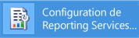
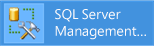

# Didacticiel : comment localiser et démarrer les outils Reporting Services (SSRS)

  Ce didacticiel présente les outils permettant de configurer un serveur de rapports, de gérer le contenu et les opérations d’un serveur de rapports, et de créer et publier des rapports [!INCLUDE[ssRSnoversion](../../includes/ssrsnoversion-md.md)] paginés et mobiles. Si vous connaissez déjà les différents outils, vous pouvez passer aux autres didacticiels pour savoir comment tirer pleinement parti de [!INCLUDE[ssRSnoversion](../../includes/ssrsnoversion-md.md)]. Pour obtenir d’autres didacticiels, consultez [Didacticiels sur Reporting Services &#40;SSRS&#41;](../../reporting-services/reporting-services-tutorials-ssrs.md).  
  
  
##   Gestionnaire de configurations de Reporting Services (mode natif)  
 Utilisez le Gestionnaire de configuration en mode natif pour effectuer les opérations suivantes :  
  
-   Spécifiez le compte de service.  
-   Créez ou mettez à niveau la base de données de serveur de rapports.  
-   Modifiez les propriétés de connexion.  
-   Spécifiez des URL.  
-   Gérez les clés de chiffrement.  
-   Configurez le traitement des rapports sans assistance et la remise de rapports par courrier électronique.  
  
 **Installation :** [!INCLUDE[ssRSnoversion](../../includes/ssrsnoversion-md.md)] est installé en même temps que le mode natif de [!INCLUDE[ssRSnoversion](../../includes/ssrsnoversion-md.md)] . Pour plus d’informations, consultez [Installer le serveur de rapports Reporting Services en mode natif](assetid:///8f25e6dc-b753-400e-9e9a-50f4f35bf6c4).  
  
### Pour démarrer le Gestionnaire de configuration de Reporting Services  
  
1.  Dans l’écran de démarrage de Windows, tapez **reporting** et dans les résultats de la recherche **Applications** , cliquez sur **Gestionnaire de configuration de Reporting Services**.  
  
       
  
     **Or**  
  
     Cliquez sur **Démarrer**, puis sur **Programmes**, sur [!INCLUDE[ssCurrentUI](../../includes/sscurrentui-md.md)], sur **Outils de configuration**, puis sur **Gestionnaire de configuration de Reporting Services**.  
  
     La boîte de dialogue **Sélection de l'instance d'installation de Report Server** s'affiche pour que vous spécifiiez l'instance de serveur de rapports à configurer.  
  
2.  Dans **Nom du serveur**, spécifiez le nom de l'ordinateur sur lequel est installée l'instance de serveur de rapports. Le nom de l'ordinateur local est spécifié par défaut, mais vous pouvez également taper le nom d'une instance de [!INCLUDE[ssNoVersion](../../includes/ssnoversion-md.md)] distante.  
  
     Si vous spécifiez un ordinateur distant, cliquez sur **Rechercher** pour établir une connexion. Le serveur de rapports doit être configuré à l'avance pour l'administration à distance. Pour plus d’informations, consultez [Configurer un serveur de rapports pour l’administration à distance](../../reporting-services/report-server/configure-a-report-server-for-remote-administration.md).  
  
3.  Dans **Dansstance Name**, choisissez l'instance de [!INCLUDE[ssNoVersion](../../includes/ssnoversion-md.md)] [!INCLUDE[ssRSnoversion](../../includes/ssrsnoversion-md.md)] que vous souhaitez configurer. Seules les instances de serveur de rapports SQL Server 2008 et ultérieur figurent dans la liste. Vous ne pouvez pas configurer d'instances de versions antérieures de [!INCLUDE[ssRSnoversion](../../includes/ssrsnoversion-md.md)].  
  
4.  Cliquez sur **Se connecter**.  
  
5.  Pour vérifier si l'outil a été lancé, comparez vos résultats à l'image suivante :  
  
       
  
 **Étapes suivantes :** [Configurer et administrer un serveur de rapports &#40;SSRS en mode natif&#41;](../../reporting-services/report-server/configure-and-administer-a-report-server-ssrs-native-mode.md) et [Gestionnaire de configuration de Reporting Services &#40;mode natif&#41;](../../reporting-services/install-windows/reporting-services-configuration-manager-native-mode.md).  
  
##  Portail web (mode natif)  
 Utilisez le [Web portal (SSRS Native Mode)](../../reporting-services/web-portal-ssrs-native-mode.md) pour définir les autorisations, gérer les abonnements et les planifications, et travailler sur les rapports. Vous pouvez également utiliser le portail web pour afficher les rapports.  
  
 **Installation :** Le portail web est installé quand vous installez [!INCLUDE[ssRSnoversion](../../includes/ssrsnoversion-md.md)] en mode natif : [Installer le serveur de rapports Reporting Services en mode natif](assetid:///8f25e6dc-b753-400e-9e9a-50f4f35bf6c4)  
  
 Avant de pouvoir ouvrir le portail web, vous devez avoir les autorisations suffisantes (initialement, seuls les membres du groupe local Administrateurs ont les autorisations nécessaires pour accéder aux fonctionnalités du portail web). Le portail web propose des pages et options différentes en fonctions des attributions de rôle de l’utilisateur en cours. Les utilisateurs qui ne bénéficient pas d'autorisations obtiennent une page vide. Les utilisateurs avec l'autorisation d'afficher les rapports obtiennent des liens sur lesquels ils peuvent cliquer pour ouvrir les rapports. Pour en savoir plus sur les autorisations, consultez [Rôles et autorisations &#40;Reporting Services&#41;](../../reporting-services/security/roles-and-permissions-reporting-services.md).  
  
### Pour démarrer le portail web  
  
1.  Ouvrez votre navigateur. Pour plus d’informations sur les versions et les navigateurs pris en charge, consultez [Planification de la prise en charge des navigateurs pour Reporting Services et Power View](../../reporting-services/browser-support-for-reporting-services-and-power-view.md).  
  
2.  Dans la barre d’adresses du navigateur web, tapez l’URL du portail web. Par défaut, l’URL est `http://<serverName>/reports`. Vous pouvez utiliser l'outil de configuration de Reporting Services pour confirmer le nom du serveur et l'URL. Pour plus d’informations sur les URL utilisées dans [!INCLUDE[ssRSnoversion](../../includes/ssrsnoversion-md.md)], consultez [Configurer des URL de serveurs de rapports &#40;Gestionnaire de configuration de SSRS&#41;](../../reporting-services/install-windows/configure-report-server-urls-ssrs-configuration-manager.md).  
  
3.  Le portail web s’ouvre dans la fenêtre du navigateur. La page de démarrage est constituée du dossier Home. En fonction des autorisations, vous verrez au sein de la page de démarrage des dossiers supplémentaires, des liens vers les rapports et des fichiers de ressources. Il se peut aussi que la barre d'outils contienne des commandes et des boutons supplémentaires.  
  
4.  Si vous exécutez le portail web sur le serveur de rapports local, consultez [Configurer un serveur de rapports en mode natif pour l’administration locale &#40;SSRS&#41;](../../reporting-services/report-server/configure-a-native-mode-report-server-for-local-administration-ssrs.md).  
   
##   Management Studio  
 Les administrateurs du serveur de rapports peuvent utiliser [!INCLUDE[ssManStudio](../../includes/ssmanstudio-md.md)] pour gérer le serveur de rapports en même temps que d'autres composants serveur [!INCLUDE[ssNoVersion](../../includes/ssnoversion-md.md)] . Pour plus d’informations, consultez [Use SQL Server Management Studio](http://msdn.microsoft.com/library/f289e978-14ca-46ef-9e61-e1fe5fd593be).  
  
### Pour démarrer SQL Server Management Studio  
  
1.  Dans l’écran de démarrage de Windows, tapez **sql server** et dans les résultats de la recherche **Applications** , cliquez sur **SQL Server Management Studio**.  
  
       
  
     **Or**  
  
     Cliquez sur **Démarrer**, puis sur **Tous les programmes**, sur [!INCLUDE[ssCurrentUI](../../includes/sscurrentui-md.md)]et sur **SQL Server Management Studio**. La boîte de dialogue **Se connecter au serveur** s'ouvre.  
  
2.  Si la boîte de dialogue **Se connecter au serveur** n'apparaît pas, dans la liste **Explorateur d'objets**, cliquez sur **Se connecter** , puis sélectionnez **Reporting Services**.  
  
3.  Dans la liste **Type de serveur** , sélectionnez **Reporting Services**. Si [!INCLUDE[ssRSnoversion](../../includes/ssrsnoversion-md.md)] ne figure pas dans la liste, c'est qu'il n'est pas installé.  
  
4.  Dans la liste **Nom du serveur** , sélectionnez une instance de serveur de rapports. Les instances locales figurent dans la liste. Vous pouvez aussi taper le nom d'une instance distante de [!INCLUDE[ssNoVersion](../../includes/ssnoversion-md.md)] .  
  
5.  Cliquez sur **Se connecter**. Vous pouvez développer le nœud racine pour définir les propriétés du serveur, modifier les définitions de rôle ou désactiver des fonctionnalités du serveur de rapports.  
  
##   SQL Server Data Tools avec le Concepteur de rapports et l'Assistant Rapport  
 Pour créer des rapports paginés [!INCLUDE[ssNoVersion](../../includes/ssnoversion-md.md)] , vous avez le choix entre deux outils : le Concepteur de rapports et le [Générateur de rapports](#bkmk_report_builder).  
  
 Le Concepteur de rapports est disponible dans [!INCLUDE[ssBIDevStudioFull](../../includes/ssbidevstudiofull-md.md)] -Visual Studio. L’aire de conception du Concepteur de rapports inclut des fenêtres avec onglets, des Assistants et des menus permettant d’accéder aux fonctionnalités de création de rapports. L’outil Concepteur de rapports devient disponible lorsque vous choisissez un projet Report Server ou un modèle de l’Assistant Report Server dans [!INCLUDE[ssBIDevStudioFull](../../includes/ssbidevstudiofull-md.md)]. Pour en savoir plus, consultez [Reporting Services dans les outils de données SQL Server &#40;SSDT&#41;](../../reporting-services/tools/reporting-services-in-sql-server-data-tools-ssdt.md). 
 
Téléchargez [SQL Server Data Tools](http://go.microsoft.com/fwlink/?LinkID=616714).  
  
### Pour démarrer le Concepteur de rapports  
  
1.  Ouvrez **SQL Server Data Tools**.  
  
2.  Dans le menu **Fichier** , pointez sur **Nouveau**, puis cliquez sur **Projet**.  
  
3.  Dans la liste **Types de projets** , cliquez sur **Projets Business Intelligence**.  
  
4.  Dans la liste **Modèles** , cliquez sur **Projet Report Server**. Le schéma suivant montre comment les modèles de projet s'affichent dans la boîte de dialogue :  
  
       
  
5.  Tapez un nom et un emplacement pour le projet. Vous pouvez également cliquer sur **Parcourir** , puis sélectionner un emplacement.  
  
6.  [!INCLUDE[clickOK](../../includes/clickok-md.md)] [!INCLUDE[ssBIDevStudioFull](../../includes/ssbidevstudiofull-md.md)] s'ouvre avec la page de démarrage de [!INCLUDE[vsprvs](../../includes/vsprvs-md.md)] . L'Explorateur de solutions fournit des catégories pour la création de rapports et de sources de données. Vous pouvez utiliser ces catégories pour créer de nouveaux rapports et de nouvelles sources de données. Les fenêtres avec onglets s'affichent quand vous créez une définition de rapport. Les fenêtres avec onglets sont les suivantes : Données, Mise en page et Aperçu.  
  
 Pour commencer votre premier rapport, consultez [Créer un rapport de table de base &#40;didacticiel SSRS&#41;](../../reporting-services/create-a-basic-table-report-ssrs-tutorial.md). Pour en savoir plus sur les concepteurs de requêtes que vous pouvez utiliser dans le Concepteur de rapports, consultez [Outils de création de requêtes &#40;SSRS&#41;](../../reporting-services/report-data/query-design-tools-ssrs.md).  
  
##   [!INCLUDE[ssRBnoversion](../../includes/ssrbnoversion-md.md)]  
 Le[Générateur de rapports dans SQL Server 2016](../../reporting-services/report-builder/report-builder-in-sql-server-2016.md) est une application autonome que vous pouvez utiliser pour créer des rapports paginés en dehors de [!INCLUDE[ssNoVersion](../../includes/ssnoversion-md.md)]. Vous pouvez personnaliser et mettre à jour tous les rapports existants, qu’ils aient été créés dans le Concepteur de rapports ou dans des versions précédentes du [!INCLUDE[ssRBnoversion](../../includes/ssrbnoversion-md.md)]. Vous pouvez l’installer depuis le portail web de [!INCLUDE[ssNoVersion](../../includes/ssnoversion-md.md)] ou le Centre de téléchargement Microsoft.  
  
 [Téléchargez le Générateur de rapports](http://go.microsoft.com/fwlink/?LinkID=219138) depuis le Centre de téléchargement Microsoft.  
  
### Pour démarrer le [!INCLUDE[ssRBnoversion](../../includes/ssrbnoversion-md.md)]  
  
1.  Dans le portail web de [!INCLUDE[ssNoVersion](../../includes/ssnoversion-md.md)] , cliquez sur le menu  **Nouveau** , puis sélectionnez **Rapport paginé**.  
  
       
  
2.  Si [!INCLUDE[ssRBnoversion](../../includes/ssrbnoversion-md.md)] n’est pas encore installé sur cet ordinateur, sélectionnez **Obtenir l’[!INCLUDE[ssRBnoversion](../../includes/ssrbnoversion-md.md)]**.  
  
     ou  
  
     [Téléchargez le Générateur de rapports](http://go.microsoft.com/fwlink/?LinkID=219138) depuis le Centre de téléchargement Microsoft.  
  
3.  [!INCLUDE[ssRBnoversion](../../includes/ssrbnoversion-md.md)] s’ouvre et vous pouvez créer ou ouvrir un rapport paginé.  
  
##   [!INCLUDE[SS_MobileReptPub_Long](../../includes/ss-mobilereptpub-long-md.md)]  
 Utilisez [l’Éditeur de rapports mobiles SQL Server](http://msdn.microsoft.com/library/e23cf095-cb9a-4631-ab46-10413d8e3a7c) pour créer des rapports mobiles consultables dans le portail web de [!INCLUDE[ssNoVersion](../../includes/ssnoversion-md.md)] et sur des appareils mobiles tels que des iPad et des iPhone.   Vous pouvez l’installer depuis le portail web de [!INCLUDE[ssNoVersion](../../includes/ssnoversion-md.md)] ou le Centre de téléchargement Microsoft.  
  
 [Téléchargez l’Éditeur de rapports mobiles SQL Server](http://go.microsoft.com/fwlink/?LinkID=733527) depuis le Centre de téléchargement Microsoft.  
  
### Pour démarrer le [!INCLUDE[SS_MobileReptPub_Short](../../includes/ss-mobilereptpub-short-md.md)]  
  
1.  Dans le portail web de [!INCLUDE[ssNoVersion](../../includes/ssnoversion-md.md)] , cliquez sur le menu  **Nouveau** , puis sélectionnez **Rapport mobile**.  
  
       
  
2.  Si [!INCLUDE[SS_MobileReptPub_Short](../../includes/ss-mobilereptpub-short-md.md)] n’est pas encore installé sur cet ordinateur, sélectionnez **Obtenir l’[!INCLUDE[SS_MobileReptPub_Short](../../includes/ss-mobilereptpub-short-md.md)]**.  
  
     ou  
  
     [Téléchargez l’Éditeur de rapports mobiles SQL Server](http://go.microsoft.com/fwlink/?LinkID=733527) depuis le Centre de téléchargement Microsoft.  
  
3.  [!INCLUDE[SS_MobileReptPub_Short](../../includes/ss-mobilereptpub-short-md.md)] s’ouvre et vous pouvez créer ou ouvrir un rapport mobile.  

## Étapes suivantes

[Téléchargez l’Éditeur de rapports mobiles SQL Server](http://go.microsoft.com/fwlink/?LinkID=733527)   
[Téléchargez le Générateur de rapports](http://go.microsoft.com/fwlink/?LinkID=219138)  
[Télécharger SQL Server Data Tools](http://go.microsoft.com/fwlink/?LinkID=616714) 
[Installer le mode SharePoint de Reporting Services](../../reporting-services/install-windows/install-reporting-services-sharepoint-mode.md)   
[Serveur de rapports Reporting Services](../../reporting-services/report-server-sharepoint/reporting-services-report-server.md)   
[Outils de création de requêtes](../../reporting-services/report-data/query-design-tools-ssrs.md)   
[Didacticiels sur Reporting Services](../../reporting-services/reporting-services-tutorials-ssrs.md)  

D’autres questions ? [Essayez de poser une question dans le forum Reporting Services](http://go.microsoft.com/fwlink/?LinkId=620231)
