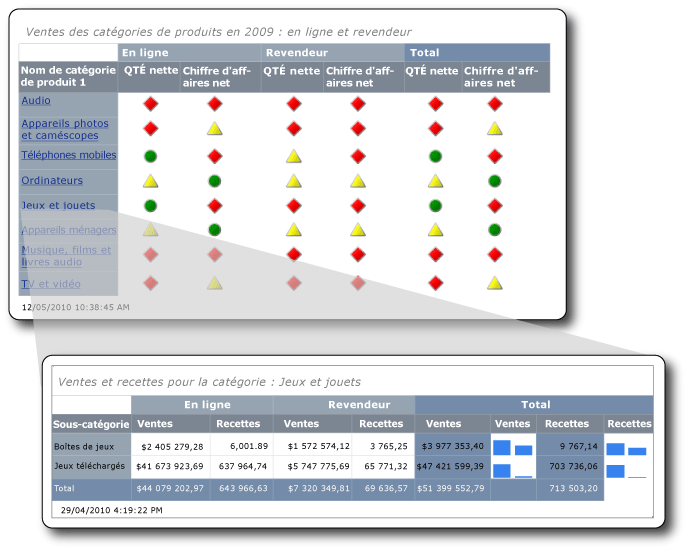

# <a name="tutorial-creating-drillthrough-and-main-reports-report-builder"></a>Didacticiel : création d'un rapport principal et d'un rapport d'extraction (Générateur de rapports)
Ce didacticiel vous apprend comment créer deux types de rapports paginés [!INCLUDE[ssRSnoversion_md](../includes/ssrsnoversion-md.md)] : un rapport d’extraction et un rapport principal. Les exemples de données de ventes utilisés dans ces rapports sont récupérés d'un cube Analysis Services. 

L’illustration suivante montre les rapports que vous allez créer et comment la valeur de champ, Games and Toys, du rapport principal s’affiche dans le titre du rapport d’extraction. Les données du rapport d’extraction se rapportent à la catégorie de produit Games and Toys.  
  
  
   
Durée estimée pour effectuer ce didacticiel : 30 minutes.  
  
## <a name="requirements"></a>Spécifications  
Ce didacticiel nécessite l’accès au cube Contoso Sales pour le rapport d’extraction et le rapport principal. Ce dataset se compose de l’entrepôt de données ContosoDW et de la base de données de traitement analytique en ligne (OLAP) Contoso_Retail. Les rapports que vous allez créer dans ce didacticiel récupèrent des données du cube Contoso Sales. Vous pouvez télécharger la base de données OLAP Contoso_Retail à partir du [Centre de téléchargement Microsoft](http://go.microsoft.com/fwlink/?LinkID=191575). Il vous suffit de télécharger le fichier ContosoBIdemoABF.exe. Il contient la base de données OLAP.  
  
L'autre fichier, ContosoBIdemoBAK.exe, concerne l'entrepôt de données ContosoDW, qui n'est pas utilisé dans ce didacticiel.  
  
Le site Web comporte des instructions relatives à l'extraction et à la restauration du fichier de sauvegarde ContosoRetail.abf dans la base de données OLAP Contoso_Retail.  

Vous devez accéder à une instance de [!INCLUDE[ssASnoversion](../includes/ssasnoversion-md.md)] sur laquelle installer la base de données OLAP.  
    
Pour plus d’informations sur les spécifications générales, consultez [Éléments requis pour les didacticiels &#40;Générateur de rapports&#41;](../reporting-services/prerequisites-for-tutorials-report-builder.md).  
  
## <a name="DMatrixAndDataset"></a>1. Créer un rapport d'extraction à partir de l'Assistant Tableau ou matrice  
Dans la boîte de dialogue Prise en main, créez un rapport de matrice à l’aide de **l’Assistant Tableau ou matrice**. Deux modes sont disponibles dans l'assistant : création de rapport et création de dataset partagé. Dans ce didacticiel, vous allez utiliser le mode création de rapport.  
  
#### <a name="to-create-a-new-report"></a>Pour créer un rapport  
  
1.  [Démarrez le Générateur de rapports](../reporting-services/report-builder/start-report-builder.md) à partir de votre ordinateur, du portail web [!INCLUDE[ssRSnoversion_md](../includes/ssrsnoversion-md.md)] , ou en mode intégré SharePoint.  
  
    La boîte de dialogue **Nouveau rapport ou dataset** s’ouvre.  
  
    Si vous ne voyez pas la boîte de dialogue **Nouveau rapport ou dataset**, dans le menu **Fichier**, choisissez **Nouveau**.  
  
2.  Dans le volet gauche, assurez-vous que **Nouveau rapport** est sélectionné.  
  
3.  Dans le volet droit, vérifiez que **Assistant Tableau ou matrice** est sélectionné.  
  
## <a name="DConnection"></a>1a. Spécifier une connexion de données  
Une connexion de données contient les informations nécessaires pour se connecter à une source de données externe telle qu'un cube Analysis Services ou une base de données [!INCLUDE[ssNoVersion](../includes/ssnoversion-md.md)] . Pour spécifier une connexion de données, vous pouvez utiliser une source de données partagée sur le serveur de rapports ou créer une source de données incorporée utilisée uniquement dans ce rapport. Dans ce didacticiel, vous allez utiliser une source de données incorporée. Pour en savoir plus sur l’utilisation d’une source de données partagée, consultez [Autres manières d’obtenir une connexion de données &#40;Générateur de rapports&#41;](../reporting-services/alternative-ways-to-get-a-data-connection-report-builder.md).  
  
#### <a name="to-create-an-embedded-data-source"></a>Pour créer une source de données incorporée  
  
1.  Dans la page **Choisir un dataset** , sélectionnez **Créer un dataset**, puis cliquez sur **Suivant**. La page **Choisir une connexion à une source de données** s’ouvre.  
  
2.  Cliquez sur **Nouveau**. La boîte de dialogue **Propriétés de la source de données** s'ouvre.  
  
3.  Dans **Nom**, tapez **Online and Reseller Sales Detail** comme nom de la source de données.  
  
4.  Dans **Sélectionner un type de connexion**, sélectionnez **Microsoft SQL Server Analysis Services**, puis cliquez sur **Générer**.  
  
5.  Dans **Source de données**, vérifiez que la source de données est **Microsoft SQL Server Analysis Services (AdomdClient)**.  
  
6.  Dans **Nom du serveur**, tapez le nom d’un serveur où est installée une instance d’Analysis Services.  
  
7.  Dans **Sélectionner ou entrer un nom de base de données**, sélectionnez le cube Contoso.  
  
8.  [!INCLUDE[clickOK](../includes/clickok-md.md)]  
  
9. Vérifiez que **Chaîne de connexion** présente la syntaxe suivante :  
  
    ```  
    Data Source=<servername>; Initial Catalog = Contoso  
    ```  
  
    `<servername>` est le nom d'une instance de [!INCLUDE[ssNoVersion](../includes/ssnoversion-md.md)] où est installé Analysis Services.  
  
10. Cliquez sur **Type d’informations d’identification**.  
  
    > [!NOTE]  
    > Selon le mode de configuration des autorisations sur la source de données, vous devrez peut-être modifier les options d'authentification par défaut. Pour plus d’informations, consultez [Security &#40;Report Builder&#41;](../reporting-services/report-builder/security-report-builder.md).  
  
11. [!INCLUDE[clickOK](../includes/clickok-md.md)]  
  
    La page **Choisir une connexion à une source de données** s’affiche.  
  
12. Pour vérifier que vous pouvez vous connecter à la source de données, cliquez sur **Tester la connexion**.  
  
    Le message **La connexion a été correctement créée** s’affiche.  
  
13. [!INCLUDE[clickOK](../includes/clickok-md.md)]  
  
14. Cliquez sur **Suivant**.  
  
## <a name="DMDXQuery"></a>1b. Créer une requête MDX  
Dans un rapport, vous pouvez utiliser un dataset partagé qui comprend une requête prédéfinie, ou vous pouvez créer un dataset incorporé utilisable uniquement dans votre rapport. Dans ce didacticiel, vous allez créer un dataset incorporé.  
  
#### <a name="to-create-query-filters"></a>Pour créer des filtres de requête  
  
1.  Dans la page **Créer une requête** , dans le volet Métadonnées, cliquez sur le bouton **(…)**.  
  
2.  Dans la boîte de dialogue **Sélection de cube** , cliquez sur Sales, puis sur **OK**.  
  
    > [!TIP]  
    > Si vous ne souhaitez pas générer la requête MDX manuellement, cliquez sur l’icône , basculez le concepteur de requêtes en mode Requête, collez la requête MDX complète dans le concepteur de requêtes, puis passez à l’étape 6 de la section [Pour créer le dataset](#DSkip).  
  
    ```  
    SELECT NON EMPTY { [Measures].[Sales Amount], [Measures].[Sales Return Amount] } ON COLUMNS, NON EMPTY { ([Channel].[Channel Name].[Channel Name].ALLMEMBERS * [Product].[Product Category Name].[Product Category Name].ALLMEMBERS * [Product].[Product Subcategory Name].[Product Subcategory Name].ALLMEMBERS ) } DIMENSION PROPERTIES MEMBER_CAPTION, MEMBER_UNIQUE_NAME ON ROWS FROM ( SELECT ( { [Date].[Calendar Year].&[2009] } ) ON COLUMNS FROM ( SELECT ( { [Sales Territory].[Sales Territory Group].&[North America] } ) ON COLUMNS FROM ( SELECT ( STRTOSET(@ProductProductCategoryName, CONSTRAINED) ) ON COLUMNS FROM ( SELECT ( { [Channel].[Channel Name].&[2], [Channel].[Channel Name].&[4] } ) ON COLUMNS FROM [Sales])))) WHERE ( [Sales Territory].[Sales Territory Group].&[North America], [Date].[Calendar Year].&[2009] ) CELL PROPERTIES VALUE, BACK_COLOR, FORE_COLOR, FORMATTED_VALUE, FORMAT_STRING, FONT_NAME, FONT_SIZE, FONT_FLAGS  
    ```  
  
3.  Dans le volet Groupe de mesures, développez Channel, puis faites glisser Channel Name vers la colonne **Hierarchy** dans le volet de filtre.  
  
    Le nom de la dimension, Channel, est ajouté automatiquement à la colonne **Dimension** . Ne modifiez pas la colonne **Dimension** ou **Opérateur** .  
  
4.  Pour ouvrir la liste **Expression de filtre** , cliquez sur la flèche vers le bas dans la colonne **Expression de filtre** .  
  
5.  Dans la liste d’expression de filtre, développez **All Channel**, cliquez sur **Online**, sur **Reseller**, puis sur **OK**.  
  
    La requête inclut maintenant un filtre ne comportant que les canaux suivants : Online (en ligne) et Reseller (revendeur).  
  
6.  Développez la dimension Sales Territory, puis faites glisser Sales Territory Group vers la colonne **Hierarchy** , sous **Channel Name**.  
  
7.  Ouvrez la liste **Expression de filtre** , développez **All Sales Territory**, cliquez sur **North America**, puis sur **OK**.  
  
    La requête comporte désormais un filtre permettant de n'inclure que les ventes réalisées en Amérique du Nord.  
  
8.  Dans le volet Groupe de mesures, développez Date, puis faites glisser Calendar Year vers la colonne **Hierarchy** dans le volet de filtre.  
  
    Le nom de la dimension, Date, est ajouté automatiquement à la colonne **Dimension** . Ne modifiez pas la colonne **Dimension** ou **Opérateur** .  
  
9. Pour ouvrir la liste **Expression de filtre** , cliquez sur la flèche vers le bas dans la colonne **Expression de filtre** .  
  
10. Dans la liste Expression de filtre, développez **All Date**, cliquez sur **Year 2009**, puis sur **OK**.  
  
    La requête comporte maintenant un filtre permettant de n'inclure que l'année civile 2009.  
  
#### <a name="to-create-the-parameter"></a>Pour créer le paramètre  
  
1.  Développez la dimension Product, puis faites glisser le membre Product Category Name vers la colonne **Hierarchy** sous **Calendar Year**.  
  
2.  Ouvrez la liste **Expression de filtre** , cliquez sur **All Products**, puis sur **OK**.  
  
3.  Cliquez sur la case à cocher **Paramètre** . La requête contient à présent le paramètre ProductProductCategoryName.  
  
    > [!NOTE]  
    > Le paramètre contient les noms des catégories de produits. Lorsque vous cliquez sur le nom d'une catégorie de produit dans le rapport principal, celui-ci est passé au rapport d'extraction à l'aide de ce paramètre.  
  
### <a name="DSkip"></a>Pour créer le dataset  
  
1.  À partir de la dimension Channel, faites glisser Channel Name vers le volet de données.  
  
2.  À partir de la dimension Product, faites glisser Product Category Name vers le volet de données, et placez-le à droite de Channel Name.  
  
3.  À partir de la dimension Product, faites glisser Product Subcategory Name vers le volet de données, puis placez-le à droite de Product Category Name.  
  
4.  Dans le volet Métadonnées, développez **Mesure**, puis Sales.  
  
5.  Faites glisser la mesure Sales Amount vers le volet de données, puis placez-la à droite de Product Subcategory Name.  
  
6.  Dans la barre d’outils du Concepteur de requêtes, cliquez sur **Exécuter (!)**.  
  
7.  Cliquez sur **Suivant**.  
  
## <a name="DLayout"></a>1c. Organiser les données dans des groupes  
Lorsque vous sélectionnez les champs dans lesquels regrouper les données, vous concevez une matrice dont les lignes et les colonnes affichent des données de détail et des données agrégées.  
  
#### <a name="to-organize-data-into-groups"></a>Pour organiser les données en groupes  
  
1.  Cliquez sur Conception pour basculer en mode **Conception**.  
  
2.  Dans la page **Organiser les champs** , faites glisser Product_Subcategory_Name vers **Groupes de lignes**.  
  
    > [!NOTE]  
    > Les espaces dans les noms sont remplacés par des traits de soulignement (_). Par exemple, Product Category Name est remplacé par Product_Category_Name.  
  
3.  Faites glisser Channel_Name vers **Groupes de colonnes**.  
  
4.  Faites glisser Sales_Amount vers **Valeurs**.  
  
    Sales_Amount est agrégé automatiquement par la fonction Sum, l’agrégat par défaut des champs numériques. La valeur est `[Sum(Sales_Amount)]`.  
  
    Pour consulter les autres fonctions d'agrégation disponibles, ouvrez la liste déroulante (ne modifiez pas la fonction d'agrégation).  
  
5.  Faites glisser Sales_Return_Amount vers **Valeurs**et placez-le sous `[Sum(Sales_Amount)]`.  
  
    Les étapes 4 et 5 spécifient les données à afficher dans la matrice.  
  
6.  Cliquez sur **Suivant**.  
  
## <a name="DTotals"></a>1d. Ajouter des sous-totaux et des totaux  
Après avoir créé des groupes, vous pouvez ajouter et mettre en forme les lignes dans lesquelles afficher les valeurs d'agrégat des champs. Vous pouvez également afficher toutes les données ou laisser l'utilisateur développer/réduire les données regroupées de manière interactive.  
  
#### <a name="to-add-subtotals-and-totals"></a>Pour ajouter des sous-totaux et des totaux  
  
1.  Dans la page **Choisir la disposition** , sous **Options**, vérifiez que **Afficher les sous-totaux et les totaux généraux** est sélectionné.  
  
    Le volet Aperçu de l'Assistant affiche une matrice avec quatre lignes.  
  
2.  Cliquez sur **Suivant**.  
  
2.  Cliquez sur **Terminer**.  
  
    Le tableau est ajouté à l'aire de conception.  
  
3.  Pour afficher un aperçu du rapport, cliquez sur **Exécuter (!)**.  
  
## <a name="DFormat"></a>2. Mettre en forme les données en tant que devises  
Appliquez une mise en forme de devise aux champs de montant des ventes dans le rapport d'extraction.  
  
#### <a name="to-format-data-as-currency"></a>Pour mettre en forme les données en tant que devise  
  
1.  Cliquez sur Conception pour basculer en mode **Conception**.  
  
2.  Pour sélectionner et mettre en forme plusieurs cellules simultanément, appuyez sur la touche Ctrl et sélectionnez les cellules qui contiennent les données de ventes numériques.  
  
3.  Sous l’onglet **Accueil** , dans le groupe **Nombre** , cliquez sur **Devise**.  
  
## <a name="DSparkline"></a>3. Ajouter des colonnes pour afficher des valeurs de vente dans des graphiques sparkline  
Au lieu d'afficher les ventes et les retours de ventes sous forme de valeurs monétaires, le rapport affiche les valeurs dans un graphique sparkline.  
  
#### <a name="to-add-sparklines-to-columns"></a>Pour ajouter des graphiques sparkline à des colonnes  
  
1.  Cliquez sur Conception pour basculer en mode **Conception**.  
  
2.  Dans le groupe Total de la matrice, cliquez avec le bouton droit sur la colonne **Sales Amount** , sélectionnez **Insérer une colonne**, puis **À droite**.  
  
    Une colonne vide est ajoutée à la droite de **Sales Amount**.  
  
3.  Sur le ruban, cliquez sur **Rectangle**, puis cliquez sur la cellule vide à la droite de la cellule `[Sum(Sales_Amount)]` dans le groupe de lignes [Product_Subcategory].  
  
4.  Sur le ruban, cliquez sur l’icône **Graphique sparkline** , puis cliquez sur la cellule dans laquelle le rectangle a été ajouté.  
  
5.  Dans la boîte de dialogue **Sélectionner un type de graphique sparkline** , vérifiez que le type **Colonne** est sélectionné.  
  
6.  [!INCLUDE[clickOK](../includes/clickok-md.md)]  
  
7.  Cliquez avec le bouton droit sur le graphique sparkline.  
  
8.  Dans le volet Données du graphique, cliquez sur l’icône **Ajouter un champ** , puis sur Sales_Amount.  
  
9. Cliquez avec le bouton droit sur la colonne `Sales_Return_Amount` , puis ajoutez une colonne à la droite de celle-ci.  
  
10. Répétez les étapes 2 à 6.  
  
11. Cliquez avec le bouton droit sur le graphique sparkline.  
  
12. Dans le volet Données du graphique, cliquez sur l’icône **Ajouter un champ** , puis sur Sales_Return_Amount.  
  
13. Pour afficher un aperçu du rapport, cliquez sur **Exécuter (!)**.  
  
## <a name="DReportTitle"></a>4. Ajouter un titre de rapport avec le nom d'une catégorie de produit  
Un titre de rapport s'affiche dans la partie supérieure du rapport. Vous pouvez placer le titre du rapport dans un en-tête de rapport, ou si le rapport n'en utilise pas, dans une zone de texte située en haut du corps du rapport. Dans ce didacticiel, vous allez utiliser la zone de texte placée automatiquement en haut du corps du rapport.  
  
#### <a name="to-add-a-report-title"></a>Pour ajouter un titre de rapport  
  
1.  Cliquez sur Conception pour basculer en mode **Conception**.  
  
2.  Dans l'aire de conception, cliquez sur **Cliquez pour ajouter un titre**.  
  
3.  Tapez **Sales and Returns for Category:**.  
  
4.  Cliquez avec le bouton droit, puis sélectionnez **Créer un espace réservé**.  
  
5.  Cliquez sur le bouton **(fx)** à la droite de la liste **Valeur** .  
  
6.  Dans la boîte de dialogue **Expression** , dans le volet Catégorie, cliquez sur **Dataset**, puis dans la liste **Valeurs** , double-cliquez sur `First(Product_Category_Name)`.  
  
    La zone **Expression** contient l’expression suivante :  
  
    ```  
    =First(Fields!Product_Category_Name.Value, "DataSet1")  
    ```  
  
7.  Pour afficher un aperçu du rapport, cliquez sur **Exécuter (!)**.  
  
Le titre du rapport inclut le nom de la première catégorie de produit. Par la suite, après avoir exécuté ce rapport en tant que rapport d'extraction, le nom de la catégorie de produit changera de manière dynamique afin de refléter le nom de la catégorie de produit sur lequel l'utilisateur a cliqué dans le rapport principal.  
  
## <a name="DParameter"></a>5. Mettre à jour des propriétés de paramètre  
Par défaut, les paramètres sont visibles, ce qui n'est pas approprié pour ce rapport. Vous allez mettre à jour les propriétés de paramètre pour le rapport d'extraction.  
  
#### <a name="to-hide-a-parameter"></a>Pour masquer un paramètre  
  
1.  Dans le volet des données de rapport, développez **Paramètres**.  
  
2.  Cliquez avec le bouton droit sur @ProductProductCategoryName, puis cliquez sur **Propriétés du paramètre**.  
  
    > [!NOTE]  
    > Le caractère @ en regard du nom indique qu'il s'agit d'un paramètre.  
  
3.  Sous l’onglet **Général** , cliquez sur **Masqué**.  
  
4.  Dans la zone **Demander** , tapez **Product Category**.  
  
    > [!NOTE]  
    > Comme le paramètre est masqué, cette invite n'est jamais utilisée.  
  
5.  Cliquez éventuellement sur **Valeurs disponibles** et sur **Valeurs par défaut** , et passez en revue leurs options. Ne modifiez aucune des options de ces onglets.  
  
6.  [!INCLUDE[clickOK](../includes/clickok-md.md)]  
  
## <a name="DSave"></a>6. Enregistrer le rapport dans une bibliothèque SharePoint  
Vous pouvez enregistrer le rapport dans une bibliothèque SharePoint, sur un serveur de rapports ou sur votre ordinateur. Si vous enregistrez le rapport sur votre ordinateur, plusieurs fonctionnalités de [!INCLUDE[ssRSnoversion](../includes/ssrsnoversion-md.md)] telles que les parties de rapports et les sous-rapports ne sont pas disponibles. Dans ce didacticiel, vous allez enregistrer le rapport dans une bibliothèque SharePoint.  
  
#### <a name="to-save-the-report"></a>Pour enregistrer le rapport  
  
1.  À partir du bouton Générateur de rapports, cliquez sur **Enregistrer**. La boîte de dialogue **Enregistrer en tant que rapport** s’affiche.  
  
    > [!NOTE]  
    > Si vous réenregistrez un rapport, il est automatiquement stocké à son emplacement précédent. Pour modifier l’emplacement, utilisez l’option **Enregistrer sous** .  
  
2.  Pour afficher une liste de serveurs de rapports et de sites SharePoint récemment utilisés, cliquez sur **Sites et serveurs récents**.  
  
3.  Sélectionnez ou tapez le nom du site SharePoint sur lequel vous êtes autorisé à enregistrer des rapports.  
  
    L'URL de la bibliothèque SharePoint présente la syntaxe suivante :  
  
    ```  
    Http://<ServerName>/<Sites>/  
    ```  
  
4.  Cliquez sur **Enregistrer**.  
  
    La liste**Sites et serveurs récents** répertorie les bibliothèques sur le site SharePoint.  
  
5.  Accédez à la bibliothèque où vous souhaitez enregistrer le rapport.  
  
6.  Dans la zone **Nom** , remplacez le nom par défaut par **ResellerVSOnlineDrillthrough**.  
  
    > [!NOTE]  
    > Vous allez enregistrer le rapport principal au même emplacement. Si vous souhaitez enregistrer les rapports principal et d’extraction dans des bibliothèques ou des sites différents, vous devez mettre à jour le chemin de l’action **Atteindre le rapport** dans le rapport principal.  
  
7.  Cliquez sur **Enregistrer**.  
  
## <a name="MMatrixAndDataset"></a>1. Créer le rapport principal à partir de l’Assistant Tableau ou matrice  
Dans la boîte de dialogue **Prise en main** , créez un rapport de matrice à l’aide de **l’Assistant Tableau ou matrice**.  
  
#### <a name="to-create-the-main-report"></a>Pour créer le rapport principal  
  
1.  [Démarrez le Générateur de rapports](../reporting-services/report-builder/start-report-builder.md) à partir de votre ordinateur, du portail web de [!INCLUDE[ssRSnoversion_md](../includes/ssrsnoversion-md.md)] ou du mode intégré SharePoint.  
  
    La boîte de dialogue **Nouveau rapport ou dataset** s’ouvre.  
  
    Si vous ne voyez pas la boîte de dialogue **Nouveau rapport ou dataset**, dans le menu **Fichier**, choisissez **Nouveau**.  
 
2.  Dans la boîte de dialogue **Prise en main** , vérifiez que **Nouveau rapport** est sélectionné, puis cliquez sur **Assistant Tableau ou matrice**.  
  
## <a name="MConnection"></a>1a. Spécifier une connexion de données  
Vous allez ajouter une source de données incorporée au rapport principal.  
  
#### <a name="to-create-an-embedded-data-source"></a>Pour créer une source de données incorporée  
  
1.  Dans la page **Choisir un dataset** , sélectionnez **Créer un dataset**, puis cliquez sur **Suivant**.  
  
2.  Cliquez sur **Nouveau**.  
  
3.  Dans la zone **Nom**, tapez **Online and Reseller Sales Main** comme nom de la source de données.  
  
4.  Dans **Sélectionner un type de connexion**, sélectionnez **Microsoft SQL Server Analysis Services**, puis cliquez sur **Générer**.  
  
5.  Dans **Source de données**, vérifiez que la source de données est **Microsoft SQL Server Analysis Services (AdomdClient)**.  
  
6.  Dans **Nom du serveur**, tapez le nom d’un serveur où est installée une instance de [!INCLUDE[msCoName](../includes/msconame-md.md)][!INCLUDE[ssASnoversion](../includes/ssasnoversion-md.md)] .  
  
7.  Dans **Sélectionner ou entrer un nom de base de données**, sélectionnez le cube Contoso.  
  
8.  [!INCLUDE[clickOK](../includes/clickok-md.md)]  
  
9. Vérifiez que **Chaîne de connexion** présente la syntaxe suivante :  
  
    ```  
    Data Source=<servername>; Initial Catalog = Contoso  
    ```  
  
10. Cliquez sur **Type d’informations d’identification**.  
  
    Selon le mode de configuration des autorisations sur la source de données, vous devrez peut-être modifier l'authentification par défaut.  
  
11. [!INCLUDE[clickOK](../includes/clickok-md.md)]  
  
12. Pour vous assurer que vous pouvez vous connecter à la source de données, cliquez sur **Tester la connexion**.  
  
13. [!INCLUDE[clickOK](../includes/clickok-md.md)]  
  
14. Cliquez sur **Suivant**.  
  
## <a name="MMDXQuery"></a>1b. Créer une requête MDX  
À présent, créez un dataset incorporé. Pour ce faire, vous allez utiliser le concepteur de requêtes afin de créer des filtres, des paramètres et des membres calculés, ainsi que le dataset lui-même.  
  
#### <a name="to-create-query-filters"></a>Pour créer des filtres de requête  
  
1.  Dans la page **Créer une requête** , dans le volet Métadonnées, dans la section du cube, cliquez sur le bouton de sélection **(…)**.  
  
2.  Dans la boîte de dialogue **Sélection de cube** , cliquez sur Sales, puis sur **OK**.  
  
    > [!TIP]  
    > Si vous ne souhaitez pas générer la requête MDX manuellement, cliquez sur l’icône , basculez le concepteur de requêtes en mode Requête, collez la requête MDX complète dans le concepteur de requêtes, puis passez à l’étape 5 de la section [Pour créer le dataset](#MSkip).  
  
    ```  
    WITH MEMBER [Measures].[Net QTY] AS [Measures].[Sales Quantity] -[Measures].[Sales Return Quantity] MEMBER [Measures].[Net Sales] AS [Measures].[Sales Amount] - [Measures].[Sales Return Amount] SELECT NON EMPTY { [Measures].[Net QTY], [Measures].[Net Sales] } ON COLUMNS, NON EMPTY { ([Channel].[Channel Name].[Channel Name].ALLMEMBERS * [Product].[Product Category Name].[Product Category Name].ALLMEMBERS ) } DIMENSION PROPERTIES MEMBER_CAPTION, MEMBER_UNIQUE_NAME ON ROWS FROM ( SELECT ( { [Date].[Calendar Year].&[2009] } ) ON COLUMNS FROM ( SELECT ( STRTOSET(@ProductProductCategoryName, CONSTRAINED) ) ON COLUMNS FROM ( SELECT ( { [Sales Territory].[Sales Territory Group].&[North America] } ) ON COLUMNS FROM ( SELECT ( { [Channel].[Channel Name].&[2], [Channel].[Channel Name].&[4] } ) ON COLUMNS FROM [Sales])))) WHERE ( [Sales Territory].[Sales Territory Group].&[North America], [Date].[Calendar Year].&[2009] ) CELL PROPERTIES VALUE, BACK_COLOR, FORE_COLOR, FORMATTED_VALUE, FORMAT_STRING, FONT_NAME, FONT_SIZE, FONT_FLAGSQuery text: Code.  
    ```  
  
3.  Dans le volet Groupe de mesures, développez Channel, puis faites glisser Channel Name vers la colonne **Hierarchy** dans le volet de filtre.  
  
    Le nom de la dimension, Channel, est ajouté automatiquement à la colonne **Dimension** . Ne modifiez pas la colonne **Dimension** ou **Opérateur** .  
  
4.  Pour ouvrir la liste **Expression de filtre** , cliquez sur la flèche vers le bas dans la colonne **Expression de filtre** .  
  
5.  Dans la liste Expression de filtre, développez **All Channel**, cliquez sur **Online** et **Reseller**, puis sur **OK**.  
  
    La requête inclut maintenant un filtre ne comportant que les canaux suivants : Online (en ligne) et Reseller (revendeur).  
  
6.  Développez la dimension Sales Territory, puis faites glisser Sales Territory Group vers la colonne **Hierarchy** , sous **Channel Name**.  
  
7.  Ouvrez la liste **Expression de filtre** , développez **All Sales Territory**, cliquez sur **North America**, puis sur **OK**.  
  
    La requête comporte désormais un filtre permettant de n'inclure que les ventes réalisées en Amérique du Nord.  
  
8.  Dans le volet Groupe de mesures, développez Date, et faites glisser Calendar Year vers la colonne **Hierarchy** dans le volet de filtre.  
  
    Le nom de la dimension, Date, est ajouté automatiquement à la colonne **Dimension** . Ne modifiez pas la colonne **Dimension** ou **Opérateur** .  
  
9. Pour ouvrir la liste **Expression de filtre** , cliquez sur la flèche vers le bas dans la colonne **Expression de filtre** .  
  
10. Dans la liste Expression de filtre, développez **All Date**, cliquez sur **Year 2009**, puis sur **OK**.  
  
    La requête comporte maintenant un filtre permettant de n'inclure que l'année civile 2009.  
  
#### <a name="to-create-the-parameter"></a>Pour créer le paramètre  
  
1.  Développez la dimension Product, faites glisser le membre Product Category Name vers la colonne **Hierarchy** sous **Sales Territory Group**.  
  
2.  Ouvrez la liste **Expression de filtre** , cliquez sur **All Products**, puis sur **OK**.  
  
3.  Cliquez sur la case à cocher **Paramètre** . La requête contient à présent le paramètre ProductProductCategoryName.  
  
#### <a name="to-create-calculated-members"></a>Pour créer des membres calculés  
  
1.  Placez le curseur à l’intérieur du volet Membres calculés, cliquez avec le bouton droit, puis sélectionnez **Nouveau membre calculé**.  
  
2.  Dans le volet Métadonnées, développez **Mesures** , puis Sales.  
  
3.  Faites glisser la mesure Sales Quantity vers la zone **Expression** , tapez le caractère de soustraction (-), puis faites glisser la mesure Sales Return Quantity vers la zone **Expression** ; placez-la après le caractère de soustraction.  
  
    Le code suivant montre l'expression :  
  
    ```  
    [Measures].[Sales Quantity] - [Measures].[Sales Return Quantity]  
    ```  
  
4.  Dans la zone Nom, tapez **Net QTY**, puis cliquez sur **OK**.  
  
    Le volet Membres calculés contient le membre calculé **Net QTY** .  
  
5.  Cliquez avec le bouton droit sur **Membres calculés**, puis sélectionnez **Nouveau membre calculé**.  
  
6.  Dans le volet Métadonnées, développez **Mesures**, puis Sales.  
  
7.  Faites glisser la mesure Sales Amount vers la zone **Expression** , tapez le caractère de soustraction (-), puis faites glisser la mesure Sales Return Amount vers la zone **Expression** ; placez-la après le caractère de soustraction.  
  
    Le code suivant montre l'expression :  
  
    ```  
    [Measures].[Sales Amount] - [Measures].[Sales Return Amount]  
    ```  
  
8.  Dans la zone **Nom** , tapez  **Net Sales**, puis cliquez sur **OK**. Le volet Membres calculés contient le membre calculé **Net Sales** .  
  
### <a name="MSkip"></a>Pour créer le dataset  
  
1.  À partir de la dimension Channel, faites glisser Channel Name vers le volet de données.  
  
2.  À partir de la dimension Product, faites glisser Product Category Name vers le volet de données, et placez-le à droite de Channel Name.  
  
3.  À partir de **Membres calculés**, faites glisser `Net QTY` vers le volet de données, puis placez-le à droite de Product Category Name.  
  
4.  À partir de Membres calculés, faites glisser Net Sales vers le volet de données, puis placez-le à droite de `Net QTY`.  
  
5.  Dans la barre d’outils du Concepteur de requêtes, cliquez sur **Exécuter (!)**.  
  
    Passez en revue le jeu de résultats de la requête.  
  
6.  Cliquez sur **Suivant**.  
  
## <a name="MLayout"></a>1c. Organiser les données dans des groupes  
Lorsque vous sélectionnez les champs dans lesquels regrouper des données, vous concevez une matrice dont les lignes et les colonnes affichent des données de détail et des données agrégées.  
  
#### <a name="to-organize-data-into-groups"></a>Pour organiser les données en groupes  
  
1.  Dans la page **Organiser les champs** , faites glisser Product_Category_Name vers **Groupes de ligne**.  
  
2.  Faites glisser Channel_Name vers **Groupes de colonnes**.  
  
3.  Faites glisser `Net_QTY` vers **Valeurs**.  
  
    `Net_QTY` est agrégé automatiquement par la fonction Sum, l’agrégat par défaut des champs numériques. La valeur est `[Sum(Net_QTY)]`.  
  
    Pour consulter les autres fonctions d'agrégation disponibles, ouvrez la liste déroulante. Ne modifiez pas la fonction d'agrégation.  
  
4.  Faites glisser `Net_Sales_Return` vers **Valeurs** et placez-le sous `[Sum(Net_QTY)]`.  
  
    Les étapes 3 et 4 spécifient les données à afficher dans la matrice.  
  
## <a name="MTotals"></a>1d. Ajouter des sous-totaux et des totaux  
Vous pouvez afficher des sous-totaux et des totaux généraux dans les rapports. Les données dans le rapport principal s'affichent sous la forme d'un indicateur ; vous allez supprimer le total général après avoir exécuté l'assistant.  
  
#### <a name="to-add-subtotals-and-grand-totals"></a>Pour ajouter des sous-totaux et des totaux généraux  
  
1.  Dans la page **Choisir la disposition** , sous **Options**, vérifiez que **Afficher les sous-totaux et les totaux généraux** est sélectionné.  
  
    Le volet Aperçu de l'Assistant affiche une matrice avec quatre lignes.  Lorsque vous exécutez le rapport, chaque ligne s'affiche de la manière suivante : la première ligne correspond au groupe de colonnes, la seconde ligne aux titres de colonnes, la troisième ligne contient les données de catégories de produits (`[Sum(Net_ QTY)]` et `[Sum(Net_Sales)]`, tandis que la quatrième ligne indique les totaux.  
  
2.  Cliquez sur **Suivant**.  
  
3.  Cliquez sur **Terminer**.  
  
3.  Pour afficher un aperçu du rapport, cliquez sur **Exécuter (!)**.  
  
## <a name="MGrandTotal"></a>2. Supprimer la ligne de total général  
Les valeurs de données sont affichées sous forme d'états d'indicateur, avec les totaux des groupes de colonnes. Supprimez la ligne qui affiche le total général.  
  
#### <a name="to-remove-the-grand-total-row"></a>Pour supprimer la ligne de total général  
  
1.  Cliquez sur Conception pour basculer en mode **Conception**.  
  
2.  Cliquez sur la ligne Total (la dernière ligne dans la matrice), cliquez avec le bouton droit, puis cliquez sur **Supprimer les lignes**.  
  
3.  Pour afficher un aperçu du rapport, cliquez sur **Exécuter (!)**.  
  
## <a name="MDrillthrough"></a>3. Configurer une action de zone de texte pour l'extraction  
Pour activer l'extraction, spécifiez une action sur une zone de texte dans le rapport principal.  
  
#### <a name="to-enable-an-action"></a>Pour activer une action  
  
1.  Cliquez sur Conception pour basculer en mode **Conception**.  
  
2.  Cliquez avec le bouton droit dans la cellule qui contient Product_Category_Name, puis sélectionnez **Propriétés de la zone de texte**.  
  
3.  Cliquez sur l’onglet **Action** .  
  
4.  Sélectionnez **Atteindre le rapport**.  
  
5.  Dans **Spécifier un rapport**, cliquez sur **Parcourir**, puis recherchez le rapport d’extraction nommé ResellerVSOnlineDrillthrough.  
  
6.  Pour ajouter un paramètre pour exécuter le rapport d’extraction, cliquez sur **Ajouter**.  
  
7.  Dans la liste **Nom** , sélectionnez ProductProductCategoryName.  
  
8.  Dans **Valeur**, tapez `[Product_Category_Name.UniqueName]`.  
  
    Product_Category_Name est un champ du dataset.  
  
    > [!IMPORTANT]  
    > Vous devez inclure la propriété **UniqueName** car l’action d’extraction nécessite une valeur unique.  
  
9. [!INCLUDE[clickOK](../includes/clickok-md.md)]  
  
#### <a name="to-format-the-drillthrough-field"></a>Pour mettre en forme le champ d'extraction  
  
1.  Cliquez avec le bouton droit dans la cellule qui contient `Product_Category_Name`, puis cliquez sur **Propriétés de la zone de texte**.  
  
2.  Cliquez sur l'onglet **Police** .  
  
3.  Dans la liste **Effets** , sélectionnez **Souligné**.  
  
4.  Dans la liste **Couleur** , sélectionnez **Bleu**.  
  
5.  [!INCLUDE[clickOK](../includes/clickok-md.md)]  
  
6.  Cliquez sur **Exécuter**pour afficher un aperçu du rapport.  
  
Les noms des catégories de produits présentent le format de lien courant (bleu et souligné).  
  
## <a name="MIndicators"></a>4. Remplacer des valeurs numériques par des indicateurs  
Utilisez des indicateurs pour afficher l'état de quantités et de ventes pour les canaux en ligne et les revendeurs.  
  
#### <a name="to-add-an-indicator-for-net-qty-values"></a>Pour ajouter un indicateur pour les valeurs de quantité nette  
  
1.  Cliquez sur Conception pour basculer en mode **Conception**.  
  
2.  Sur le ruban, cliquez sur l’icône **Rectangle** , puis cliquez dans la cellule `[Sum(Net QTY)]` dans le groupe de lignes `[Product_Category_Name]` dans le groupe de colonnes `Channel_Name` .  
  
3.  Sur le ruban, cliquez sur l’icône **Indicateur** , puis cliquez à l’intérieur du rectangle. La boîte de dialogue **Sélectionner un type d’indicateur** s’affiche ; l’indicateur **Directionnel** y est sélectionné.  
  
4.  Cliquez sur le type **3 Signes** , puis sur **OK**.  
  
5.  Cliquez avec le bouton droit sur l’indicateur et, dans le volet Données de la jauge, cliquez sur la flèche vers le bas en regard de **(Non spécifié)**. Sélectionnez `Net_QTY`.  
  
6.  Répétez les étapes 2 à 5 pour la cellule `[Sum(Net QTY)]` dans le groupe de lignes `[Product_Category_Name]` dans **Total**.  
  
#### <a name="to-add-an-indicator-for-net-sales-values"></a>Pour ajouter un indicateur pour les valeurs de chiffre d'affaires net  
  
1.  Sur le ruban, cliquez sur l’icône **Rectangle** , puis cliquez à l’intérieur de la cellule `[Sum(Net_Sales)]` dans le groupe de lignes `[Product_Category_Name]` dans le groupe de colonnes `Channel_Name` .  
  
2.  Sur le ruban, cliquez sur l’icône **Indicateur** , puis cliquez à l’intérieur du rectangle.  
  
3.  Cliquez sur le type **3 Signes** , puis sur **OK**.  
  
4.  Cliquez avec le bouton droit sur l’indicateur et, dans le volet Données de la jauge, cliquez sur la flèche vers le bas en regard de **(Non spécifié)**. Sélectionnez `Net_Sales`.  
  
5.  Répétez les étapes 1 à 4 pour la cellule `[Sum(Net_Sales)]` dans le groupe de lignes `[Product_Category_Name]` dans **Total**.  
  
6.  Cliquez sur **Exécuter**pour afficher un aperçu du rapport.  
  
## <a name="MParameter"></a>5. Mettre à jour des propriétés de paramètre  
Par défaut, les paramètres sont visibles, ce qui n'est pas approprié pour ce rapport. Vous allez mettre à jour les propriétés de paramètre afin de rendre ce dernier interne au rapport.  
  
#### <a name="to-make-the-parameter-internal"></a>Pour rendre le paramètre interne  
  
1.  Dans le volet des données de rapport, développez **Paramètres**.  
  
2.  Cliquez avec le bouton droit sur `@ProductProductCategoryName,` , puis sélectionnez **Propriétés du paramètre**.  
  
3.  Sous l’onglet **Général** , cliquez sur **Interne**.  
  
4.  Cliquez éventuellement sur les onglets **Valeurs disponibles** et **Valeurs par défaut** et passez en revue les options qu’ils contiennent. Ne modifiez aucune des options de ces onglets.  
  
5.  [!INCLUDE[clickOK](../includes/clickok-md.md)]  
  
## <a name="MTitle"></a>6. Ajouter un titre de rapport  
Ajoutez un titre au rapport principal.  
  
#### <a name="to-add-a-report-title"></a>Pour ajouter un titre de rapport  
  
1.  Dans l'aire de conception, cliquez sur **Cliquez pour ajouter un titre**.  
  
2.  Tapez **2009 Product Category Sales: Online and Reseller Category:**.  
  
3.  Sélectionnez le texte que vous avez tapé.  
  
4.  Sous l’onglet **Accueil** du ruban, dans le groupe Police, sélectionnez la police **Times New Roman** , la taille **16pt** et les styles **Gras** et **Italique** .  
  
5.  Cliquez sur **Exécuter**pour afficher un aperçu du rapport.  
  
## <a name="MSave"></a>7. Enregistrer le rapport principal dans une bibliothèque SharePoint  
Enregistrez le rapport principal dans une bibliothèque SharePoint.  
  
#### <a name="to-save-the-report"></a>Pour enregistrer le rapport  
  
1.  Cliquez sur Conception pour basculer en mode **Conception**.  
  
2.  À partir du bouton Générateur de rapports, cliquez sur **Enregistrer**.  
  
3.  Cliquez éventuellement sur **Sites et serveurs récents**pour afficher une liste de serveurs de rapports et de sites SharePoint récemment utilisés.  
  
4.  Sélectionnez ou tapez le nom du site SharePoint sur lequel vous êtes autorisé à enregistrer des rapports. L'URL de la bibliothèque SharePoint présente la syntaxe suivante :  
  
    ```  
    Http://<ServerName>/<Sites>/  
    ```  
  
5.  Naviguez jusqu'à la bibliothèque où vous souhaitez enregistrer le rapport.  
  
6.  Dans la zone **Nom**, remplacez le nom par défaut par **ResellerVSOnlineMain**.  
  
    > [!IMPORTANT]  
    > Enregistrez le rapport principal au même emplacement que celui où vous avez enregistré le rapport d'extraction. Pour enregistrer les rapports principal et d’extraction dans des bibliothèques ou des sites différents, confirmez que l’action **Atteindre le rapport** du rapport principal pointe vers l’emplacement correct du rapport d’extraction.  
  
7.  Cliquez sur **Enregistrer**.  
  
## <a name="MRunReports"></a>8. Exécuter les rapports principal et d'extraction  
Exécutez le rapport principal, puis cliquez sur des valeurs dans la colonne de catégorie de produit afin d'exécuter le rapport d'extraction.  
  
#### <a name="to-run-the-reports"></a>Pour exécuter les rapports  
  
1.  Ouvrez la bibliothèque SharePoint où sont enregistrés les rapports.  
  
2.  Double-cliquez sur ResellerVSOnlineMain.  
  
    Le rapport est exécuté et affiche les informations relatives aux ventes de catégories de produits.  
  
3.  Cliquez sur le lien **Games and Toys** dans la colonne qui contient les noms des catégories de produits.  
  
    Le rapport d'extraction est exécuté et affiche uniquement les valeurs pour la catégorie de produit Games and Toys.  
  
4.  Pour revenir au rapport principal, cliquez sur le bouton Précédent dans Internet Explorer.  
  
5.  Explorez éventuellement les autres catégories de produits en cliquant sur leur nom.  
  
## <a name="see-also"></a> Voir aussi  
[Didacticiels du Générateur de rapports](../reporting-services/report-builder-tutorials.md)  
  
