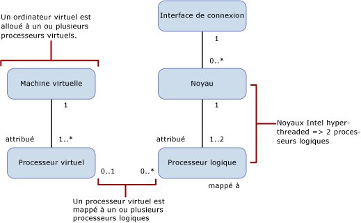

# Limites de capacité de calcul des éditions SQL Server
[!INCLUDE[appliesto-ss-xxxx-xxxx-xxx-md](../includes/appliesto-ss-xxxx-xxxx-xxx-md.md)]
  Cet article traite des limites de capacité de calcul des éditions de [!INCLUDE[ssCurrent](../includes/sscurrent-md.md)] et de leurs différences dans les environnements physiques et virtualisés avec des processeurs hyperthreaded.  
  
   
  
 Ce tableau décrit les notations dans le diagramme précédent :  
  
|Valeur|Description|  
|-----------|-----------------|  
|0..1|Zéro ou un|  
| 1|Un seul|  
|1..\*|Un ou plus|  
|0..\*|Zéro ou plus|  
|1..2|Un ou deux|  
  
> [!IMPORTANT]  
> Pour approfondir :  
>   
> - Une machine virtuelle compte un ou plusieurs processeurs virtuels.  
> - Un ou plusieurs processeurs virtuels sont alloués à un seul ordinateur virtuel.  
> - Zéro ou un processeur virtuel est mappé à zéro ou un processeur logique. Quand le mappage des processeurs virtuels à un processeur logique est : 
>     -   Un à zéro, il représente un processeur logique indépendant non utilisé par les systèmes d’exploitation invités.  
>     -   Un à plusieurs, il représente une survalidation (overcommit).  
>     -   Zéro à plusieurs, il représente l’absence de machine virtuelle sur le système hôte. Donc, les machines virtuelles n’utilisent pas de processeurs logiques.  
> - Un socket est mappé à zéro ou plusieurs noyaux. Quand le mappage de socket au cœur est :  
>     -   Un à zéro, il représente un socket vide. Aucun processeur n’est installé.  
>     -   Un à un, il représente un processeur monocœur installé dans le socket. Ce mappage est rare de nos jours.  
>     -   Un à plusieurs, il représente un processeur multicœur installé dans le socket. Les valeurs sont habituellement 2, 4 et 8.  
> - Un noyau est mappé à un ou deux processeurs logiques. Quand le mappage des cœurs à un processeur logique est :  
>     -   Un à un, l’hyperthreading est désactivé.  
>     -   Un à deux, l’hyperthreading est activé.  
  
 Les définitions suivantes s'appliquent aux termes utilisés dans cet article :  
  
-   Un thread ou un processeur logique est un moteur de calcul logique du point de vue de [!INCLUDE[ssNoVersion](../includes/ssnoversion-md.md)], du système d'exploitation, d’une application ou d’un pilote.  
  
-   Un cœur est une unité de processeur. Il peut être constitué d’un ou plusieurs processeurs logiques.  
  
-   Un processeur physique peut comprendre un ou plusieurs noyaux. Un processeur physique est identique à un package de processeurs ou à un socket.  
  
Les systèmes avec plusieurs processeurs physiques ou avec des processeurs physiques qui ont plusieurs noyaux et/ou des hyperthreads, permettent au système d'exploitation d'exécuter plusieurs tâches simultanément. Chaque thread d'exécution apparaît comme un processeur logique. Par exemple, si votre ordinateur a deux processeurs à quatre cœurs avec l’hyperthreading activé et deux threads par cœur, vous avez 16 processeurs logiques : 2 processeurs x 4 cœurs par processeur x 2 thread par cœur. À noter que :  
  
-   La capacité de calcul d'un processeur logique à partir d'un thread unique d'un noyau hyperthreaded est inférieure à la capacité de calcul d'un processeur logique de ce même noyau avec l'hyperthreading désactivé.  
  
-   La capacité de calcul des deux processeurs logiques dans le cœur avec l’hyperthreading activé est supérieure à la capacité de calcul du même cœur avec l’hyperthreading désactivé.  
  
Chaque édition de [!INCLUDE[ssNoVersion](../includes/ssnoversion-md.md)] a deux limites de capacité de calcul :  
  
- Un nombre maximal de sockets (ou processeurs physiques ou packages de processeurs)  
  
- Un nombre maximal de cœurs comme indiqué par le système d’exploitation  
  
Ces limites s'appliquent à une seule instance de [!INCLUDE[ssNoVersion](../includes/ssnoversion-md.md)]. Elles représentent la capacité maximale de calcul qu'une seule instance utilise. Elles ne restreignent pas le serveur sur lequel l’instance peut être déployée. En fait, le déploiement de plusieurs instances de [!INCLUDE[ssNoVersion](../includes/ssnoversion-md.md)] sur le même serveur physique est un moyen efficace d’utiliser la capacité de calcul d’un serveur physique avec plus de sockets et/ou de cœurs que les limites de capacité n’autorisent.  
  
Le tableau suivant présente les limites de capacité de calcul pour une instance unique de chaque édition de [!INCLUDE[ssCurrent](../includes/sscurrent-md.md)]:  
  
|Édition de[!INCLUDE[ssNoVersion](../includes/ssnoversion-md.md)] |Capacité maximale de calcul pour une instance unique ([!INCLUDE[ssNoVersion](../includes/ssnoversion-md.md)][!INCLUDE[ssDE](../includes/ssde-md.md)])|Capacité maximale de calcul pour une instance unique (AS,RS)|  
|---------------------------------------|--------------------------------------------------------------------------------------------------------|-------------------------------------------------------------------|  
|Enterprise Edition : contrat de licence selon le nombre de cœurs\*|Maximum du système d'exploitation|Maximum du système d'exploitation|  
|Développeur|Maximum du système d'exploitation|Maximum du système d'exploitation|  
|Standard|Limité à moins de 4 sockets ou 24 cœurs|Limité à moins de 4 sockets ou 24 cœurs|  
|Express|Limité à moins de 1 socket ou 4 cœurs|Limité à moins de 1 socket ou 4 cœurs|  

\*Édition Entreprise avec licences d’accès client (CAL) + serveur limitées à 20 cœurs par instance de [!INCLUDE[ssNoVersion](../includes/ssnoversion-md.md)]. (Cette licence n’est pas disponible pour les nouveaux contrats.) Il n'existe aucune limite dans le mode de licence Serveur selon le nombre de cœurs.  
  
Dans un environnement virtualisé, la limite de capacité de calcul est basée sur le nombre de processeurs logiques et non sur le nombre de cœurs. La raison est que l’architecture de processeurs n’est pas visible aux applications invitées. 

Par exemple, un serveur avec quatre sockets comprenant des processeurs quadruple cœur et autorisant l’activation de deux hyperthreads par cœur, contient 32 processeurs logiques avec l'hyperthreading activé. Mais il contient seulement 16 processeurs logiques avec l’hyperthreading désactivé. Ces processeurs logiques peuvent être mappés aux machines virtuelles sur le serveur. La charge de calcul des machines virtuelles sur ce processeur logique est mappée à un thread d'exécution sur le processeur physique du serveur hôte.  
  
Vous pouvez désactiver l’hyperthreading quand les performances de chaque processeur virtuel sont importantes. Vous pouvez activer ou désactiver l’hyperthreading à l’aide d’un paramètre BIOS du processeur au cours de la configuration du BIOS. Mais c’est généralement une opération limitée au serveur qui affecte toutes les charges de travail exécutées sur le serveur. Dans ce cas, la solution peut être de séparer les charges de travail qui s'exécutent dans des environnements virtualisés des charges de travail qui tirent parti de l'amélioration des performances grâce à l'hyperthreading dans un environnement de système d'exploitation physique.  
  
## Voir aussi  
 [Éditions et composants de SQL Server 2016](../sql-server/editions-and-components-of-sql-server-2016.md)   
 [Fonctionnalités prises en charge par les éditions de SQL Server 2016](~/sql-server/editions-and-supported-features-for-sql-server-2016.md)   
 [Spécifications de capacité maximale pour SQL Server](../sql-server/maximum-capacity-specifications-for-sql-server.md)   
 [Démarrer rapidement l’installation de SQL Server 2016](http://msdn.microsoft.com/library/672afac9-364d-4946-ad5d-8a2d89cf8d81)  

[!INCLUDE[get-help-options](../includes/paragraph-content/get-help-options.md)]

[!INCLUDE[contribute-to-content](../includes/paragraph-content/contribute-to-content.md)]
