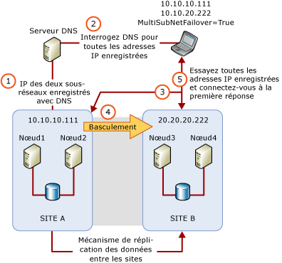

# Clustering de sous-réseaux multiples SQL Server (SQL Server)
[!INCLUDE[appliesto-ss-xxxx-xxxx-xxx-md](../../../includes/appliesto-ss-xxxx-xxxx-xxx-md.md)]
  Un cluster de basculement de sous-réseaux multiples [!INCLUDE[ssNoVersion](../../../includes/ssnoversion-md.md)] est une configuration dans laquelle chaque nœud de cluster de basculement est connecté à un sous-réseau différent ou à un ensemble différent de sous-réseaux. Ces sous-réseaux peuvent se trouver au même emplacement ou dans des sites géographiquement dispersés. En cas de clustering dans des sites géographiquement dispersés, on utilise parfois le terme « clusters étendus ». Comme tous les nœuds ne peuvent pas accéder à un stockage partagé, les données doivent être répliquées entre le stockage des données sur les sous-réseaux multiples. Avec la réplication de données, il existe plusieurs copies des données disponibles. Par conséquent, un cluster de basculement de sous-réseaux multiples fournit une solution de récupération d'urgence en plus d'une haute disponibilité.  
  
   
##   Cluster de basculement de sous-réseaux multiples SQL Server (deux nœuds, deux sous-réseaux)  
 L'illustration suivante représente une instance de cluster de basculement (FCI) à deux nœuds et deux sous-réseaux dans [!INCLUDE[ssCurrent](../../../includes/sscurrent-md.md)].  
  
   
  
  
##   Configurations d'une instance de cluster de basculement à plusieurs sous-réseaux  
 Voici quelques exemples d'instances de cluster de basculement FCI [!INCLUDE[ssNoVersion](../../../includes/ssnoversion-md.md)] qui utilisent plusieurs sous-réseaux :  
  
-   [!INCLUDE[ssNoVersion](../../../includes/ssnoversion-md.md)] FCI SQLCLUST1 inclut Node1 et Node2. Node1 est connecté à Subnet1. Node2 est connecté à Subnet2. [!INCLUDE[ssNoVersion](../../../includes/ssnoversion-md.md)] Le programme de configuration considère cette configuration comme un cluster à plusieurs sous-réseaux et définit la dépendance de ressource d’adresse IP sur **OR**.  
  
-   [!INCLUDE[ssNoVersion](../../../includes/ssnoversion-md.md)] FCI SQLCLUST1 inclut Node1, Node2 et Node3. Node1 et Node2 sont connectés à Subnet1. Node3 est connecté à Subnet2. [!INCLUDE[ssNoVersion](../../../includes/ssnoversion-md.md)] Le programme de configuration considère cette configuration comme un cluster à plusieurs sous-réseaux et définit la dépendance de ressource d’adresse IP sur **OR**. Étant donné que Node1 et Node2 se trouvent sur le même sous-réseau, cette configuration fournit une haute disponibilité locale supplémentaire.  
  
-   [!INCLUDE[ssNoVersion](../../../includes/ssnoversion-md.md)] FCI SQLCLUST1 inclut Node1 et Node2. Node1 se trouve sur Subnet1. Node2 est sur Subnet1 et Subnet2. [!INCLUDE[ssNoVersion](../../../includes/ssnoversion-md.md)] Le programme de configuration considère cette configuration comme un cluster à plusieurs sous-réseaux et définit la dépendance de ressource d’adresse IP sur **OR**.  
  
-   [!INCLUDE[ssNoVersion](../../../includes/ssnoversion-md.md)] FCI SQLCLUST1 inclut Node1 et Node2. Node1 est connecté à Subnet1 et Subnet2. Node2 est également connecté à Subnet1 et Subnet2. La dépendance de ressource d’adresse IP est définie sur **AND** par le programme de configuration de [!INCLUDE[ssNoVersion](../../../includes/ssnoversion-md.md)] .  
  
    > **REMARQUE :** cette configuration n’est pas considérée comme une configuration de cluster de basculement de sous-réseaux multiples car les nœuds de clusters se trouvent sur le même ensemble de sous-réseaux.  
  
##   Considérations relatives aux ressources d'adresses IP  
 Dans une configuration de cluster de basculement de sous-réseaux multiples, les adresses IP ne sont pas détenues par tous les nœuds dans le cluster de basculement et ne peuvent pas être toutes en ligne pendant le démarrage de [!INCLUDE[ssNoVersion](../../../includes/ssnoversion-md.md)] . À compter de [!INCLUDE[ssSQL11](../../../includes/sssql11-md.md)], vous pouvez définir la dépendance de ressource d’adresse IP sur **OR**. Cela permet à [!INCLUDE[ssNoVersion](../../../includes/ssnoversion-md.md)] d'être en ligne lorsqu'il y a au moins une adresse IP valide avec laquelle il peut être lié.  
  
> **REMARQUE :** dans les versions de [!INCLUDE[ssNoVersion](../../../includes/ssnoversion-md.md)] antérieures à [!INCLUDE[ssSQL11](../../../includes/sssql11-md.md)], une technologie d’étirement V-LAN a été utilisée dans les configurations de clusters multisites pour exposer une adresse IP unique pour le basculement à travers différents sites. Avec la nouvelle fonctionnalité de [!INCLUDE[ssNoVersion](../../../includes/ssnoversion-md.md)] permettant de mettre des nœuds de cluster à travers différents sous-réseaux, vous pouvez maintenant configurer des clusters de basculement [!INCLUDE[ssNoVersion](../../../includes/ssnoversion-md.md)] à travers plusieurs sites sans implémenter la technologie d'étirement V-LAN.  
  
### Considérations relatives à la dépendance OR de la ressource d'adresse IP  
 Vous pouvez considérer le comportement du basculement suivant si vous définissez la dépendance de ressource d’adresse IP sur **OR**:  
  
-   Lorsqu'il y a un échec de l'une des adresses IP sur le nœud qui possède actuellement le groupe de ressources de cluster [!INCLUDE[ssNoVersion](../../../includes/ssnoversion-md.md)] , aucun basculement n'est déclenché automatiquement tant que toutes les adresses IP valides sur ce nœud n'ont pas échoué.  
  
-   Lorsqu'un basculement se produit, [!INCLUDE[ssNoVersion](../../../includes/ssnoversion-md.md)] est mis en ligne s'il peut créer une liaison avec au moins une adresse IP valide sur le nœud actuel. Les adresses IP qui n'ont pas créé de liaison avec [!INCLUDE[ssNoVersion](../../../includes/ssnoversion-md.md)] au démarrage apparaîtront dans le journal des erreurs.  
  
   
 Lorsqu'une instance de cluster de basculement (FCI) [!INCLUDE[ssNoVersion](../../../includes/ssnoversion-md.md)] est installée côte à côte avec une instance autonome de [!INCLUDE[ssDEnoversion](../../../includes/ssdenoversion-md.md)], prenez soin d'éviter les conflits de numéro de port TCP sur les adresses IP. Les conflits se produisent généralement lorsque deux instances de [!INCLUDE[ssDE](../../../includes/ssde-md.md)] sont configurées pour utiliser le port TCP par défaut (1433). Pour éviter des conflits, configurez une instance pour utiliser un port fixe non défini par défaut. La configuration d'un port fixe est généralement plus simple sur l'instance autonome. La configuration de [!INCLUDE[ssDE](../../../includes/ssde-md.md)] de manière à utiliser des ports différents empêche un conflit inattendu adresse IP/port TCP qui bloque un démarrage de l'instance lorsqu'une instance de cluster de basculement (FCI) [!INCLUDE[ssNoVersion](../../../includes/ssnoversion-md.md)] échoue au nœud en attente.  
  
##   Latence de récupération cliente pendant un basculement  
 Une instance FCI à plusieurs sous-réseaux active par défaut la ressource de cluster RegisterAllProvidersIP pour son nom réseau. Dans une configuration à plusieurs sous-réseaux, les adresses IP en ligne et hors connexion du nom réseau seront inscrites sur le serveur DNS. L'application cliente récupère ensuite toutes les adresses IP inscrites depuis le serveur DNS, puis tente de se connecter aux adresses dans l'ordre ou en parallèle. Cela signifie que le temps de récupération client dans les basculements à plusieurs sous-réseaux ne dépend plus des latences de mise à jour DNS. Par défaut, le client tente les adresses IP dans l'ordre. Quand le client utilise le nouveau paramètre facultatif **MultiSubnetFailover=True** dans sa chaîne de connexion, il tente à la place les adresses IP simultanément et se connecte au premier serveur qui répond. Cela peut réduire la latence de récupération cliente lorsque des basculements se produisent. Pour plus d’informations, consultez [Connectivité client AlwaysOn (SQL Server)](../../../database-engine/availability-groups/windows/always-on-client-connectivity-sql-server.md) et [Créer ou configurer un écouteur de groupe de disponibilité (SQL Server)](../../../database-engine/availability-groups/windows/create-or-configure-an-availability-group-listener-sql-server.md).  
  
 Avec les bibliothèques clientes héritées ou les fournisseurs de données tiers, vous ne pouvez pas utiliser le paramètre **MultiSubnetFailover** dans votre chaîne de connexion. Pour vous aider à vous assurer que votre application cliente s'exécute de façon optimale avec l'instance FCI à plusieurs sous-réseaux dans [!INCLUDE[ssCurrent](../../../includes/sscurrent-md.md)], essayez d'ajuster le délai de connexion dans la chaîne de connexion du client par 21 secondes pour chaque adresse IP supplémentaire. Cela garantit que la tentative de reconnexion du client n'expire pas avant de pouvoir faire défiler toutes les adresses IP de votre instance FCI à plusieurs sous-réseaux.  
  
 Le délai d’expiration de connexion cliente par défaut pour [!INCLUDE[ssNoVersion](../../../includes/ssnoversion-md.md)] Management Studio et **sqlcmd** est de 15 secondes.  
  
   
##   Contenu connexe  
  
|Description du contenu|Rubrique|  
|-------------------------|-----------|  
|Installation d'un cluster de basculement SQL Server|[Créer un cluster de basculement SQL Server (programme d'installation)](../../../sql-server/failover-clusters/install/create-a-new-sql-server-failover-cluster-setup.md)|  
|Mise à niveau sur place de votre cluster de basculement SQL Server existant|[Mettre à niveau une instance de cluster de basculement SQL Server &#40;programme d’installation&#41;](../../../sql-server/failover-clusters/windows/upgrade-a-sql-server-failover-cluster-instance-setup.md)|  
|Maintenance de votre cluster de basculement SQL Server existant|[Ajouter ou supprimer des nœuds dans un cluster de basculement SQL Server &#40;programme d’installation&#41;](../../../sql-server/failover-clusters/install/add-or-remove-nodes-in-a-sql-server-failover-cluster-setup.md)|  
|Utiliser le composant logiciel enfichable de gestion du cluster de basculement pour afficher les événements et les journaux WSFC|[Afficher les événements et journaux pour un cluster de basculement](http://technet.microsoft.com/library/cc772342\(WS.10\).aspx)|  
|Utiliser Windows PowerShell pour créer un fichier journal pour tous les nœuds (ou un nœud spécifique) dans un cluster de basculement WSFC|[Applets de commande de cluster de basculement Get-ClusterLog](http://technet.microsoft.com/library/ee461045.aspx)|  
  

  
  
