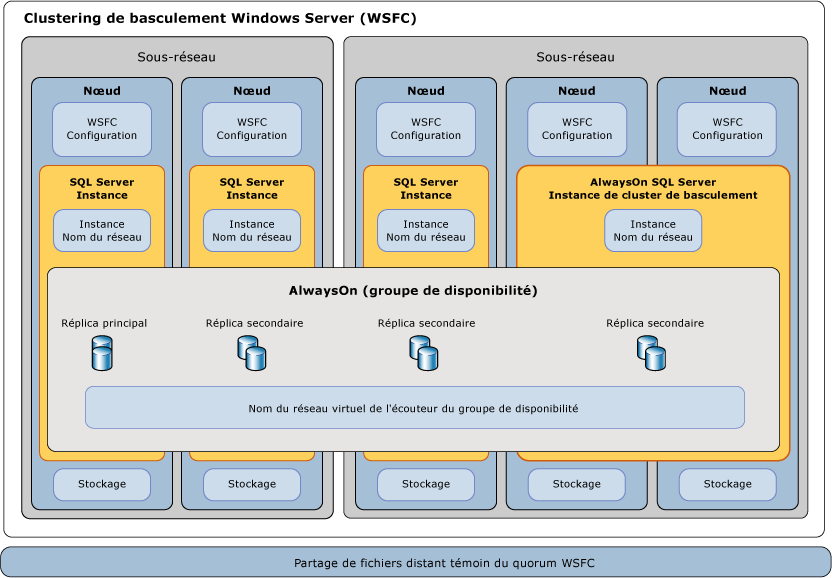

# Clustering de basculement Windows Server avec SQL Server
[!INCLUDE[appliesto-ss-xxxx-xxxx-xxx-md](../../../includes/appliesto-ss-xxxx-xxxx-xxx-md.md)]
  Un *cluster de basculement Windows Server* (WSFC, Windows Server Failover Cluster) est un groupe de serveurs indépendants qui fonctionnent conjointement afin d’augmenter la disponibilité des applications et des services. [!INCLUDE[ssCurrent](../../../includes/sscurrent-md.md)] tire parti des services et des fonctionnalités de WSFC afin de prendre en charge [!INCLUDE[ssHADR](../../../includes/sshadr-md.md)] et les instances de cluster de basculement [!INCLUDE[ssNoVersion](../../../includes/ssnoversion-md.md)] .  
  
   
##   Termes et définitions  
 Un cluster WSFC est un groupe de serveurs indépendants qui fonctionnent conjointement afin d’augmenter la disponibilité des applications et des services.  
  
 Nœud  
 Serveur qui fait partie d’un cluster WSFC.
  
 Ressource de cluster  
 Entité physique ou logique qui peut être détenue par un nœud, être mise en ligne et hors connexion, déplacée entre des nœuds et être gérée comme un objet cluster. Une ressource de cluster ne peut appartenir qu'à un seul nœud à un moment donné.  
  
 Role  
 Collection de ressources de cluster gérée comme un même objet de cluster pour fournir des fonctionnalités spécifiques. Pour SQL Server, un rôle est un groupe de disponibilité Always On ou une instance de cluster de basculement Always On. Un rôle contient toutes les ressources de cluster qui sont requises pour un groupe de disponibilité ou une instance de cluster de basculement. Le basculement et la restauration automatique agissent toujours dans le contexte des rôles. Pour une instance de cluster de basculement, le rôle contient une ressource d’adresse IP, une ressource de nom de réseau et les ressources SQL Server. Un rôle de groupe de disponibilité contient la ressource de groupe de disponibilité et, si un écouteur est configuré, un nom de réseau et une ressource d’adresse IP. 

 Ressource de nom réseau  
 Nom de serveur logique qui est géré en tant que ressource de cluster. La ressource de nom réseau doit être utilisée avec une ressource d'adresse IP. Ces entrées peuvent nécessiter des objets dans Active Directory Domain Services et/ou DNS. 
  
 Dépendance de ressources  
 Ressource dont dépend une autre ressource. Si la ressource A dépend de la ressource B, B est une dépendance de A. La ressource A n’est pas en mesure de démarrer sans la ressource B.  
  
  
 Propriétaire favori  
 Nœud sur lequel un groupe de ressources préfère s'exécuter. Chaque groupe de ressources est associé à une liste des propriétaires favoris triés par ordre de préférence. Au cours d'un basculement automatique, le groupe de ressources est déplacé vers le nœud favori suivant dans la liste des propriétaires favoris.  
  
 Propriétaire possible  
 Nœud secondaire sur lequel une ressource peut s'exécuter. Chaque groupe de ressources est associé à une liste des propriétaires possibles. Les rôles peuvent basculer uniquement vers des nœuds répertoriés comme propriétaires possibles.   
  
 Mode de quorum  
 Configuration de quorum dans un cluster de basculement qui détermine le nombre d'échecs de nœud que le cluster peut soutenir.  
  
 Quorum forcé  
 Processus pour démarrer le cluster même si une minorité des éléments requis pour le quorum sont en communication.  
  

##   Vue d'ensemble du clustering de basculement Windows Server  
 Le clustering de basculement Windows Server fournit les fonctionnalités d'infrastructure qui prennent en charge les scénarios de haute disponibilité et de récupération d'urgence pour les applications serveur hébergées telles que Microsoft [!INCLUDE[ssNoVersion](../../../includes/ssnoversion-md.md)] et Microsoft Exchange. Si un nœud de cluster ou un service échoue, les services qui étaient hébergés sur ce nœud peuvent être transférés automatiquement ou manuellement vers un autre nœud disponible dans un processus appelé *basculement*.  
  
 Les nœuds dans un cluster WSFC fonctionnent de concert afin de fournir collectivement ces types de fonctionnalités :  
  
-   **Métadonnées et notifications distribuées.** Le service WSFC et les métadonnées d'application hébergées sont gérés sur chaque nœud du cluster. Ces métadonnées incluent la configuration et l'état WSFC, en plus des paramètres d'application hébergés. Les modifications apportées aux métadonnées ou à l’état d’un nœud sont automatiquement propagées aux autres nœuds du cluster WSFC.  
  
-   **Gestion des ressources.** Les différents nœuds du cluster WSFC peuvent fournir des ressources physiques telles que le stockage DAS, les interfaces réseau et l’accès au stockage sur disque partagé. Les applications hébergées s'inscrivent elles-mêmes en tant que ressource de cluster et peuvent configurer les dépendances de démarrage et d'intégrité sur d'autres ressources.  
  
-   **Contrôle d'intégrité.** La détection d'intégrité du nœud principal et entre les nœuds est réalisée par une combinaison de communications réseau de type pulsations et de surveillance des ressources. L’intégrité globale du cluster WSFC est déterminée par les votes d’un quorum de nœuds dans le cluster WSFC.  
  
-   **Coordination du basculement.** Chaque ressource est configurée en vue d'être hébergée sur un nœud principal, et chacune peut être transférée automatiquement ou manuellement vers un ou plusieurs nœuds secondaires. Une stratégie de basculement basée sur l'intégrité contrôle le transfert automatique de la propriété des ressources entre les nœuds. Les nœuds et les applications hébergées sont informées lorsque le basculement se produit afin de pouvoir réagir correctement.  
  
 Pour plus d’informations, consultez : [Vue d’ensemble du clustering de basculement - Windows Server](https://technet.microsoft.com/library/hh831579(v=ws.11).aspx)  
  
##   Technologies AlwaysOn de SQL Server et WSFC  
 [!INCLUDE[ssCurrent](../../../includes/sscurrent-md.md)] *AlwaysOn* est une solution haute disponibilité et de récupération d’urgence qui tire parti de WSFC. Les fonctionnalités AlwaysOn offrent des solutions intégrées et souples qui augmentent la disponibilité d’application, fournissent de meilleurs retours sur les investissements en matériel, et simplifient le déploiement et la gestion haute disponibilité.  
  
 [!INCLUDE[ssHADR](../../../includes/sshadr-md.md)] et les instances de cluster de basculement AlwaysOn utilisent WSFC comme technologie de plateforme, en enregistrant les composants en tant que ressources de cluster WSFC.  Des ressources associées sont combinées en un *rôle*, lequel peut être rendu dépendant d’autres ressources de cluster WSFC. Le cluster WSFC peut ensuite détecter et indiquer la nécessité de redémarrer l’instance de [!INCLUDE[ssNoVersion](../../../includes/ssnoversion-md.md)] ou de la basculer automatiquement vers un nœud serveur différent dans le cluster WSFC.  
  
> **IMPORTANT** Pour tirer pleinement parti des technologies [!INCLUDE[ssNoVersion](../../../includes/ssnoversion-md.md)] AlwaysOn, vous devez remplir plusieurs conditions requises en rapport avec WSFC.  
>   
>  Pour plus d’informations, consultez [Conditions préalables requises, restrictions et recommandations pour les groupes de disponibilité Always On &#40;SQL Server&#41;](../../../database-engine/availability-groups/windows/prereqs-restrictions-recommendations-always-on-availability.md).  
  
### Haute disponibilité au niveau de l’instance avec des instances de cluster de basculement AlwaysOn  
 Une *instance de cluster de basculement* AlwaysOn est une instance de [!INCLUDE[ssNoVersion](../../../includes/ssnoversion-md.md)] installée sur des nœuds dans un cluster WSFC. Ce type d’instance dépend de ressources pour le stockage et le nom de réseau virtuel. Le stockage peut utiliser Fibre Channel, iSCSI, FCoE ou SAS pour le stockage sur disque partagé, ou encore un stockage attaché localement avec [espaces de stockage direct (S2D)](http://technet.microsoft.com/windows-server-docs/storage/storage-spaces/storage-spaces-direct-overview). La ressource de nom de réseau virtuel dépend d’une ou plusieurs adresses IP virtuelles situées chacune dans un sous-réseau distinct. Le service SQL Server et le service SQL Server Agent sont également des ressources. Tous deux sont dépendants des ressources de stockage et de nom de réseau virtuel.  
  
 En cas de basculement, le service WSFC transfère la propriété des ressources de l'instance à un nœud de basculement indiqué. L'instance [!INCLUDE[ssNoVersion](../../../includes/ssnoversion-md.md)] est ensuite redémarrée sur le nœud de basculement, et les bases de données sont récupérées comme à l'accoutumée. À un moment donné, seul un nœud dans le cluster peut héberger l'instance FCI et les ressources sous-jacentes.  
  
> **REMARQUE :**  une instance de cluster de basculement AlwaysOn requiert un stockage sur disque partagé symétrique, tel qu’un réseau de stockage (SAN) ou un partage de fichiers SMB.  Les volumes de stockage sur disque partagé doivent être disponibles à tous les nœuds de basculement potentiels dans le cluster WSFC.  
  
 Pour plus d’informations, consultez [Instances de cluster de basculement Always On &#40;SQL Server&#41;](../../../sql-server/failover-clusters/windows/always-on-failover-cluster-instances-sql-server.md).  
  
### Haute disponibilité de niveau base de données avec [!INCLUDE[ssHADR](../../../includes/sshadr-md.md)]  
 Un *groupe de disponibilité* Always On correspond à une ou plusieurs bases de données utilisateur qui basculent de concert. Un groupe de disponibilité comprend un *réplica de disponibilité* principal et un à quatre réplicas secondaires qui sont conservés par le biais des déplacements de données enregistrés dans le journal SQL Server pour la protection des données sans qu’un stockage partagé soit requis. Chaque réplica est hébergé par une instance de [!INCLUDE[ssNoVersion](../../../includes/ssnoversion-md.md)] sur un autre nœud du cluster WSFC. Le groupe de disponibilité et un nom de réseau virtuel correspondant sont inscrits en tant que ressources dans le cluster WSFC.  
  
 Un *écouteur de groupe de disponibilité* sur le nœud du réplica principal répond aux requêtes client entrantes pour la connexion au nom de réseau virtuel et, selon les attributs figurant dans la chaîne de connexion, il redirige chaque requête vers l'instance appropriée de [!INCLUDE[ssNoVersion](../../../includes/ssnoversion-md.md)] .  
  
 En cas de basculement, au lieu de transférer la propriété des ressources physiques partagées sur un autre nœud, WSFC est utilisé pour reconfigurer un réplica secondaire sur une autre instance [!INCLUDE[ssNoVersion](../../../includes/ssnoversion-md.md)] afin d'en faire le réplica principal du groupe de disponibilité. La ressource de nom de réseau virtuel du groupe de disponibilité est ensuite transférée à cette instance.  
  
 À un moment donné, seule une instance [!INCLUDE[ssNoVersion](../../../includes/ssnoversion-md.md)] peut héberger le réplica principal des bases de données d'un groupe de disponibilité, tous les réplicas secondaires associés doivent résider sur une instance distincte et chaque instance doit résider sur des nœuds physiques distincts.  
  
> **REMARQUE :** [!INCLUDE[ssHADR](../../../includes/sshadr-md.md)] ne nécessite pas le déploiement d’une instance de cluster de basculement ni l’utilisation du stockage symétrique (SAN ou SMB).  
>   
>  Une instance de cluster de basculement (FCI) peut être utilisée avec un groupe de disponibilité afin d'améliorer la disponibilité d'un réplica de disponibilité. Toutefois, pour empêcher des conditions de concurrence potentielles dans le cluster WSFC, le basculement automatique du groupe de disponibilité n'est pas pris en charge dans ou à partir d'un réplica de disponibilité qui réside sur une instance FCI.  
  
 Pour plus d’informations, consultez [Vue d’ensemble des groupes de disponibilité Always On (SQL Server)](../../../database-engine/availability-groups/windows/overview-of-always-on-availability-groups-sql-server.md).  
  
##   Contrôle d'intégrité de WSFC et basculement  
 La haute disponibilité d’une solution AlwaysOn tient au contrôle d’intégrité proactif des ressources de cluster WSFC physiques et logiques, ainsi qu’au basculement automatique et à la reconfiguration du matériel redondant.  Un administrateur système peut également initier un *basculement manuel* d'un groupe de disponibilité ou d'une instance [!INCLUDE[ssNoVersion](../../../includes/ssnoversion-md.md)] d'un nœud vers un autre.  
  
### Stratégies de basculement pour les nœuds, les instances de cluster de basculement et les groupes de disponibilité  
 Une *stratégie de basculement* est configurée au niveau du nœud de cluster WSFC, de l’instance de cluster de basculement de [!INCLUDE[ssNoVersion](../../../includes/ssnoversion-md.md)] et des niveaux des groupes de disponibilité.  Ces stratégies, selon la gravité, la durée et la fréquence d'un état de ressource de cluster défectueux et la réactivité de nœud, peuvent déclencher le redémarrage d'un service ou le *basculement automatique* de ressources de cluster d'un nœud vers un autre, ou elles peuvent déclencher le déplacement d'un réplica principal de groupe de disponibilité d'une instance [!INCLUDE[ssNoVersion](../../../includes/ssnoversion-md.md)] vers une autre.  
  
 Le basculement d'un réplica de groupe de disponibilité n'affecte pas l'instance [!INCLUDE[ssNoVersion](../../../includes/ssnoversion-md.md)] sous-jacente.  Le basculement d'une instance FCI déplace les réplicas de groupe de disponibilité hébergés avec l'instance.  
  
 Pour plus d’informations, consultez [Stratégie de basculement pour les instances de cluster de basculement](../../../sql-server/failover-clusters/windows/failover-policy-for-failover-cluster-instances.md).  
  
### Détection d'intégrité des ressources WSFC  
 Chaque ressource dans un cluster WSFC peut signaler son état et son intégrité, de manière régulière ou à la demande. D'autres circonstances peuvent indiquer un échec de la ressource : par exemple, une faille de l'alimentation, des erreurs de disque ou de la mémoire, des erreurs de communication réseau ou des services non réactifs.  
  
 Les ressources WSFC telles que les réseaux, le stockage ou les services peuvent être rendues dépendantes les unes des autres. L'intégrité cumulative d'une ressource est déterminée en regroupant successivement son intégrité avec l'intégrité de chacune de ses dépendances de ressource.  
  
### Détection d'intégrité entre les nœuds WSFC et vote du quorum  
 Chaque nœud d’un cluster WSFC participe à la communication périodique de pulsation pour partager l’état d’intégrité du nœud avec les autres nœuds. Les nœuds qui ne répondent pas sont considérés comme étant en état d'échec.  
  
 Un *quorum* est un mécanisme qui permet de s’assurer que le cluster WSFC est opérationnel en garantissant qu’un nombre suffisant de ressources sont en ligne dans le cluster WSFC. Si le cluster WSFC a suffisamment de votes, il est sain et en mesure d’assurer la tolérance de panne au niveau du nœud.  
  
 Un *mode de quorum* est configuré dans le cluster WSFC et dicte la méthodologie utilisée pour le vote du quorum, ainsi que le moment choisi pour effectuer un basculement automatique ou mettre le cluster hors connexion. 
  
> **ASTUCE !!** Il est recommandé de toujours avoir un nombre impair de votes de quorum dans un cluster WSFC.  Pour les besoins du vote du quorum, il n'est pas nécessaire que [!INCLUDE[ssNoVersion](../../../includes/ssnoversion-md.md)] soit installé sur tous les nœuds du cluster. Un serveur supplémentaire peut jouer le rôle de membre de quorum, ou le modèle de quorum WSFC peut être configuré pour utiliser un partage de fichiers distant comme ressource de contrôle décisive.  
>   
>  Pour plus d’informations, consultez [Modes de quorum WSFC et configuration de vote (SQL Server)](../../../sql-server/failover-clusters/windows/wsfc-quorum-modes-and-voting-configuration-sql-server.md).  
  
### Récupération d’urgence par le quorum forcé  
 En fonction des pratiques opérationnelles et de la configuration de cluster WSFC, vous pouvez procéder à des basculements automatiques et manuels, tout en conservant une solution AlwaysOn [!INCLUDE[ssNoVersion](../../../includes/ssnoversion-md.md)] fiable et à tolérance de panne. Cependant, si un quorum des nœuds de vote éligibles dans le cluster WSFC ne peut pas communiquer avec un autre, ou si le cluster WSFC échoue lors de la validation d’intégrité, le cluster WSFC peut être mis hors connexion.  
  
 Si le cluster WSFC est mis hors connexion en raison d’un problème grave non planifié, ou en raison d’un problème de matériel ou de communication persistant, une intervention administrative manuelle est nécessaire pour *forcer un quorum* et remettre les nœuds de cluster survivants en ligne dans une configuration sans tolérance de panne.  
  
 Ensuite, une série de mesures doit également être prise pour reconfigurer le cluster WSFC, récupérer les réplicas de base de données affectés et rétablir un nouveau quorum.  
  
 Pour plus d’informations, consultez [Récupération d’urgence WSFC par le quorum forcé (SQL Server)](../../../sql-server/failover-clusters/windows/wsfc-disaster-recovery-through-forced-quorum-sql-server.md).  
  
##   Relation des composants AlwaysOn de SQL Server avec WSFC  
 Plusieurs couches de relations existent entre les fonctionnalités et les composants WSFC et AlwaysOn [!INCLUDE[ssNoVersion](../../../includes/ssnoversion-md.md)] .  
  
 Les groupes de disponibilité AlwaysOn sont hébergés sur des instances [!INCLUDE[ssNoVersion](../../../includes/ssnoversion-md.md)] .  
 La requête d’un client qui spécifie un nom de réseau d’écouteur de groupe de disponibilité logique pour se connecter à une base de données principale ou secondaire est redirigée vers le nom de réseau d’instance approprié de l’instance de [!INCLUDE[ssNoVersion](../../../includes/ssnoversion-md.md)] sous-jacente ou de l’instance de cluster de basculement de [!INCLUDE[ssNoVersion](../../../includes/ssnoversion-md.md)].  
  
 Les instances SQL Server sont hébergées activement sur un nœud unique.  
 Si elle est présente, une instance [!INCLUDE[ssNoVersion](../../../includes/ssnoversion-md.md)] autonome réside toujours sur un nœud unique avec un nom réseau d'instance statique.  Si elle est présente, une instance de cluster de basculement [!INCLUDE[ssNoVersion](../../../includes/ssnoversion-md.md)] est active sur l'un des deux nœuds ou plus de basculement possibles avec un nom réseau d'instance virtuel unique.  
  
 Les nœuds sont membres d'un cluster WSFC.  
 Les métadonnées et l'état de la configuration WSFC pour tous les nœuds sont stockés sur chaque nœud. Chaque serveur peut fournir des volumes de stockage ou de stockage partagé asymétriques (SAN) pour les bases de données utilisateur ou système. Chaque serveur possède au moins une interface réseau physique sur un ou plusieurs sous-réseaux IP.  
  
 Le cluster WSFC surveille l’intégrité et gère la configuration d’un groupe de serveurs.  
 Les mécanismes WSFC propagent les modifications apportées aux métadonnées et à l’état de la configuration WSFC à tous les nœuds du cluster. Si un témoin de disque est utilisé, les métadonnées y sont également stockées. Par défaut, chaque nœud du cluster WSFC obtient un vote pour constituer un quorum et un témoin est utilisé si nécessaire et configuré.
 
 [!INCLUDE[ssHADR](../../../includes/sshadr-md.md)] sont des sous-clés du cluster WSFC.  
 Si vous supprimez et recréez un cluster WSFC, vous devez désactiver et réactiver la fonctionnalité [!INCLUDE[ssHADR](../../../includes/sshadr-md.md)] sur chaque instance de serveur activée pour [!INCLUDE[ssHADR](../../../includes/sshadr-md.md)] sur le cluster WSFC d’origine. Pour plus d’informations, consultez [Activer et désactiver les groupes de disponibilité Always On &#40;SQL Server&#41;](../../../database-engine/availability-groups/windows/enable-and-disable-always-on-availability-groups-sql-server.md).  
  
   
  
##   Tâches associées  
  
-   [Afficher les paramètres NodeWeight pour le quorum de cluster](../../../sql-server/failover-clusters/windows/view-cluster-quorum-nodeweight-settings.md)  
  
-   [Configurer les paramètres NodeWeight pour un quorum de cluster](../../../sql-server/failover-clusters/windows/configure-cluster-quorum-nodeweight-settings.md)  
  
-   [Forcer un cluster WSFC à démarrer sans quorum](../../../sql-server/failover-clusters/windows/force-a-wsfc-cluster-to-start-without-a-quorum.md)  
  
##   Contenu associé  
  
-   [Technologies de Windows Server : clusters de basculement](http://technet.microsoft.com/library/cc732488\(v=WS.10\).aspx)  

-   [Espaces de stockage direct \(S2D\) Vue d’ensemble](http://technet.microsoft.com/windows-server-docs/storage/storage-spaces/storage-spaces-direct-overview)

-   [Clusters de basculement dans Windows Server 2008 R2](http://technet.microsoft.com/library/ff182338\(WS.10\).aspx)  
  
-   [Afficher les événements et journaux pour un cluster de basculement](http://technet.microsoft.com/library/cc772342\(WS.10\).aspx)  
  
-   [Applets de commande de cluster de basculement Get-ClusterLog](http://technet.microsoft.com/library/ee461045.aspx)  
  
##  Voir aussi  
 [Instances de cluster de basculement Always On (SQL Server)](../../../sql-server/failover-clusters/windows/always-on-failover-cluster-instances-sql-server.md)   
 [Vue d’ensemble des groupes de disponibilité Always On (SQL Server)](../../../database-engine/availability-groups/windows/overview-of-always-on-availability-groups-sql-server.md)   
 [Modes de quorum WSFC et configuration de vote (SQL Server)](../../../sql-server/failover-clusters/windows/wsfc-quorum-modes-and-voting-configuration-sql-server.md)   
 [Stratégie de basculement pour les instances de cluster de basculement](../../../sql-server/failover-clusters/windows/failover-policy-for-failover-cluster-instances.md)   
 [Récupération d’urgence WSFC par le quorum forcé (SQL Server)](../../../sql-server/failover-clusters/windows/wsfc-disaster-recovery-through-forced-quorum-sql-server.md)  
 [SQL  Server 2016 prend en charge la fonctionnalité Espaces de stockage direct de Windows Server 2016](http://blogs.technet.microsoft.com/dataplatforminsider/2016/09/27/sql-server-2016-now-supports-windows-server-2016-storage-spaces-direct/)
  
