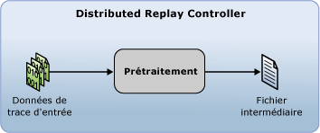

# Préparer les données de trace d'entrée
[!INCLUDE[appliesto-ss-xxxx-xxxx-xxx-md](../../includes/appliesto-ss-xxxx-xxxx-xxx-md.md)]
  Avant de pouvoir démarrer une relecture distribuée avec la fonctionnalité [!INCLUDE[msCoName](../../includes/msconame-md.md)] [!INCLUDE[ssNoVersion](../../includes/ssnoversion-md.md)] Distributed Replay, vous devez préparer les données de trace d'entrée en initialisant l'étape de prétraitement de l'outil d'administration de relecture distribuée. Dans l'étape de prétraitement, Distributed Replay Controller traite les données de trace et génère un fichier intermédiaire :  
  
   
  
 Pour plus d'informations sur l'étape de prétraitement, consultez [SQL Server Distributed Replay](../../tools/distributed-replay/sql-server-distributed-replay.md).  
  
> [!NOTE]  
>  Les données de trace d'entrée doivent être capturées dans une version de [!INCLUDE[ssNoVersion](../../includes/ssnoversion-md.md)] compatible avec Distributed Replay. Les données de trace d'entrée doivent également être compatibles avec le serveur cible sur lequel vous souhaitez relire les données de trace. Pour plus d'informations sur les conditions requises en matière de version, consultez [Distributed Replay Requirements](../../tools/distributed-replay/distributed-replay-requirements.md).  
  
### Pour préparer les données de trace d'entrée  
  
1.  **(Facultatif) Modifier les paramètres de configuration du prétraitement**: si vous voulez modifier les paramètres de configuration du prétraitement, tels que filtrer ou non les sessions système ou configurer la durée d’inactivité maximale, vous devez modifier l’élément `<PreprocessModifiers>` du fichier de configuration de prétraitement XML, `DReplay.exe.preprocess.config`. Si vous modifiez le fichier de configuration de prétraitement, nous vous recommandons de modifier une copie plutôt que l'original. Pour modifier des paramètres, suivez la procédure suivante :  
  
    1.  Faites une copie du fichier par défaut de configuration de prétraitement, `DReplay.exe.preprocess.config`, et renommez le nouveau fichier. Le fichier par défaut de configuration de prétraitement se trouve dans le dossier d'installation de l'outil d'administration.  
  
    2.  Modifiez les paramètres de configuration de prétraitement dans le nouveau fichier de configuration.  
  
    3.  Quand vous initialisez l’étape de prétraitement (étape suivante), utilisez le paramètre *config_file* de l’option **preprocess** pour spécifier l’emplacement du fichier de configuration modifié.  
  
     Pour plus d'informations sur le fichier de configuration de prétraitement, consultez [Configurer Distributed Replay](../../tools/distributed-replay/configure-distributed-replay.md).  
  
2.  **Initialiser l’étape de prétraitement**: pour préparer les données de trace d’entrée, vous devez exécuter l’outil d’administration avec l’option **preprocess** . Pour plus d’informations, consultez [Option preprocess &#40;outil d’administration Distributed Replay&#41;](../../tools/distributed-replay/preprocess-option-distributed-replay-administration-tool.md).  
  
    1.  Ouvrez l’utilitaire d’invite de commandes Windows (**CMD.exe**) et accédez à l’emplacement d’installation de l’outil d’administration Distributed Replay (**DReplay.exe**).  
  
    2.  (Facultatif) Utilisez le paramètre *controller* , **-m**, pour spécifier le contrôleur, si le service du contrôleur s’exécute sur un ordinateur différent de l’outil d’administration.  
  
    3.  Utilisez le paramètre *input_trace_file* , **-i**, pour spécifier l’emplacement et le nom des fichiers de trace d’entrée.  
  
    4.  Utilisez le paramètre *controller_working_directory* , **-d**, pour spécifier l’emplacement où le fichier intermédiaire doit être enregistré sur le contrôleur.  
  
    5.  (Facultatif) Utilisez le paramètre *config_file* , **-c**, pour spécifier l’emplacement du fichier de configuration de prétraitement. Utilisez ce paramètre pour pointer sur le nouveau fichier de configuration, si vous avez modifié une copie du fichier de configuration de prétraitement par défaut.  
  
    6.  (Facultatif) Utilisez le paramètre *status_interval* , **-f**, pour spécifier si vous voulez que l’outil d’administration affiche des messages d’état à une fréquence autre que 30 secondes.  
  
     Par exemple, l’initialisation de l’étape de prétraitement sur le même ordinateur que le service contrôleur, pour un fichier de trace situé dans `c:\trace1.trc`, un répertoire de travail du contrôleur situé dans `c:\WorkingDir` et un message d’état affiché selon la valeur par défaut de 30 secondes, requiert la syntaxe : `dreplay preprocess -i c:\trace1.trc -d c:\WorkingDir`  
  
3.  Une fois l'étape de prétraitement terminée, le fichier intermédiaire est stocké dans le répertoire de travail du contrôleur. Pour initialiser l’étape de relecture d’événements, vous devez exécuter l’outil d’administration avec l’option **replay** . Pour plus d’informations, consultez [Relire les données de trace](../../tools/distributed-replay/replay-trace-data.md).  
  
##  Voir aussi  
 [SQL Server Distributed Replay](../../tools/distributed-replay/sql-server-distributed-replay.md)   
 [Distributed Replay Requirements](../../tools/distributed-replay/distributed-replay-requirements.md)   
 [Options de ligne de commande de l’outil d’administration &#40;Distributed Replay Utility&#41;](../../tools/distributed-replay/administration-tool-command-line-options-distributed-replay-utility.md)   
 [Configurer Distributed Replay](../../tools/distributed-replay/configure-distributed-replay.md)  
  
  
