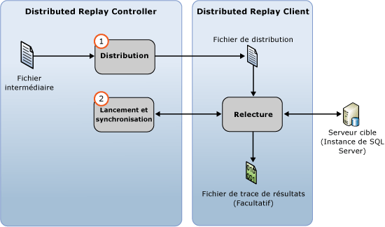

# Relire les données de trace
[!INCLUDE[appliesto-ss-xxxx-xxxx-xxx-md](../../includes/appliesto-ss-xxxx-xxxx-xxx-md.md)]
  Vous pouvez démarrer une relecture distribuée avec la fonctionnalité [!INCLUDE[msCoName](../../includes/msconame-md.md)] [!INCLUDE[ssNoVersion](../../includes/ssnoversion-md.md)] Distributed Replay après avoir préparé les données de trace d'entrée. Pour plus d’informations, consultez [préparer les données de Trace d’entrée](../../tools/distributed-replay/prepare-the-input-trace-data.md).  
  
 Utilisez l’option de **relecture** de l’outil d’administration pour initialiser l’étape de relecture d’événements de la relecture distribuée. Cette étape consiste en deux parties : la répartition des données de trace et le démarrage et la synchronisation de la relecture distribuée.  
  
   
  
 Vous pouvez relire les données de trace dans l'un de ces deux modes de mise en séquence : mode simultané (stress) ou mode de synchronisation. Le comportement par défaut consiste à relire les données de trace en mode simultané (stress). Pour plus d'informations sur l'étape de relecture d'événements et les modes de mise en séquence, consultez [SQL Server Distributed Replay](../../tools/distributed-replay/sql-server-distributed-replay.md).  
  
> [!NOTE]  
>  Les données de trace d'entrée doivent être capturées dans une version de [!INCLUDE[ssNoVersion](../../includes/ssnoversion-md.md)] compatible avec Distributed Replay. Les données de trace d'entrée doivent également être compatibles avec le serveur cible sur lequel vous souhaitez relire les données de trace. Pour plus d'informations sur les conditions requises en matière de version, consultez [Distributed Replay Requirements](../../tools/distributed-replay/distributed-replay-requirements.md).  
  
### Pour relire la trace  
  
1.  **(Facultatif) Modifier les paramètres de configuration de la relecture**: si vous voulez modifier les paramètres de configuration de la relecture, tels que le mode de mise en séquence et différentes valeurs de mise à l’échelle, vous devez modifier l’élément `<ReplayOptions>` du fichier XML `DReplay.exe.replay.config`de configuration de relecture. Vous pouvez également modifier l'élément `<OutputOptions>` pour spécifier des paramètres de sortie, tels que l'enregistrement ou non du nombre de lignes. Si vous modifiez le fichier de configuration de relecture, nous vous recommandons de modifier une copie plutôt que l'original. Pour modifier des paramètres, suivez la procédure suivante :  
  
    1.  Faites une copie du fichier par défaut de configuration de relecture, `DReplay.exe.replay.config`, et renommez le nouveau fichier. Le fichier par défaut de configuration de relecture se trouve dans le dossier d'installation de l'outil d'administration.  
  
    2.  Modifiez les paramètres de configuration de relecture dans le nouveau fichier de configuration.  
  
    3.  Quand vous initialisez l’étape de relecture d’événements (étape suivante), utilisez le paramètre *config_file* de l’option **replay** pour spécifier l’emplacement du fichier de configuration modifié.  
  
     Pour plus d’informations sur le fichier de configuration de prétraitement, consultez [Configure Distributed Replay](../../tools/distributed-replay/configure-distributed-replay.md)(Configurer Distributed Replay).  
  
2.  **Initialiser l’étape de relecture d’événements**: pour démarrer la relecture distribuée, vous devez exécuter l’outil d’administration avec l’option de **relecture** . Pour plus d’informations, consultez [Option preprocess &#40;outil d’administration Distributed Replay&#41;](../../tools/distributed-replay/replay-option-distributed-replay-administration-tool.md).  
  
    1.  Ouvrez l’utilitaire d’invite de commandes Windows (**CMD.exe**) et accédez à l’emplacement d’installation de l’outil d’administration Distributed Replay (**DReplay.exe**).  
  
    2.  (Facultatif) Utilisez le paramètre *controller* , **-m**, pour spécifier le contrôleur, si le service du contrôleur s’exécute sur un ordinateur différent de l’outil d’administration.  
  
    3.  Utilisez le paramètre *répertoire_de_travail_contrôleur* , **-d**, pour spécifier l’emplacement où le fichier intermédiaire a été enregistré sur le contrôleur lors de l’étape de prétraitement.  
  
    4.  (Facultatif) Utilisez le paramètre **-o** pour capturer l’activité de relecture dans un fichier de trace de résultats sur chaque client.  
  
    5.  (Facultatif) Utilisez le paramètre *serveur_cible* , **-s**, pour spécifier l’instance de [!INCLUDE[ssNoVersion](../../includes/ssnoversion-md.md)] dans laquelle les clients de relecture distribuée doivent relire la charge de travail de la trace. Ce paramètre n'est pas nécessaire si vous avez utilisé l'élément `<Server>` pour spécifier le serveur cible dans l'élément `<ReplayOptions>` du fichier de configuration de relecture.  
  
    6.  Utilisez le paramètre *clients* , **-w**, pour spécifier les clients de relecture distribuée qui doivent participer à la relecture. Répertoriez les noms des ordinateurs clients, séparés par des virgules. Remarque : les adresses IP ne sont pas autorisées.  
  
    7.  (Facultatif) Utilisez le paramètre *fichier_configuration* , **-c**, pour spécifier l’emplacement du fichier de configuration de relecture. Utilisez ce paramètre pour pointer sur le nouveau fichier de configuration si vous avez modifié une copie du fichier de configuration de relecture par défaut.  
  
    8.  (Facultatif) Utilisez le paramètre *status_interval* , **-f**, pour spécifier si vous voulez que l’outil d’administration affiche des messages d’état à une fréquence autre que 30 secondes.  
  
     Par exemple, la syntaxe suivante initialise l’étape de relecture sur le même ordinateur que le service du contrôleur, utilise un répertoire de travail du contrôleur situé dans `c:\WorkingDir`, capture l’activité de relecture sur chaque client participant, utilise les clients `client1` et `client2` pour effectuer la relecture et obtient les paramètres de configuration de relecture restants à partir d’un fichier de configuration de relecture modifié qui se trouve dans `c:\modifiedreplay.config`:  
  
     `dreplay replay -d c:\WorkingDir -o -w client1,client2 -c c:\modifiedreplay.config`  
  
3.  Lorsque la relecture distribuée est terminée, l'outil d'administration retourne les informations de résumé. Si vous avez spécifié l’option **-o** , l’activité de relecture a été enregistrée dans des fichiers de trace de résultats sur chaque client. Pour plus d’informations sur les fichiers de trace de résultats, consultez [passez en revue les résultats de relecture](../../tools/distributed-replay/review-the-replay-results.md).  
  
##  Voir aussi  
 [Distributed Replay Requirements](../../tools/distributed-replay/distributed-replay-requirements.md)   
 [Options de ligne de commande de l’outil d’administration &#40;Distributed Replay Utility&#41;](../../tools/distributed-replay/administration-tool-command-line-options-distributed-replay-utility.md)   
 [Configurer Distributed Replay](../../tools/distributed-replay/configure-distributed-replay.md)  
  
  
