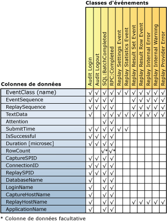

# Examiner les résultats de la relecture
[!INCLUDE[appliesto-ss-xxxx-xxxx-xxx-md](../../includes/appliesto-ss-xxxx-xxxx-xxx-md.md)]
  Une fois que la fonctionnalité [!INCLUDE[msCoName](../../includes/msconame-md.md)] [!INCLUDE[ssNoVersion](../../includes/ssnoversion-md.md)] Distributed Replay a terminé une relecture distribuée, l'activité de relecture de chaque client peut être capturée et enregistrée dans des fichiers de trace de résultats sur chaque client. Pour capturer cette activité, vous devez utiliser le paramètre **-o** quand vous exécutez l’outil d’administration avec l’option **replay**. Pour plus d’informations sur l’option replay, consultez [Option replay &#40;outil d’administration Distributed Replay&#41;](../../tools/distributed-replay/replay-option-distributed-replay-administration-tool.md).  
  
 L'emplacement où sont stockés les fichiers de trace de résultats est spécifié par l'élément XML `<ResultDirectory>` dans le fichier de configuration client, `DReplayClient.xml`, situé sur chaque client. Les fichiers de trace dans le répertoire des résultats du client sont remplacés à chaque relecture.  
  
 Pour spécifier quel type de sortie doit être capturé dans les fichiers de trace de résultats, modifiez le fichier de configuration de la relecture, `DReplay.exe.replay.config`. Vous pouvez utiliser l'élément XML `<OutputOptions>` pour spécifier si le nombre de lignes ou le contenu du jeu de résultats doit être enregistré.  
  
 Pour plus d’informations sur ces paramètres de configuration, consultez [Configurer Distributed Replay](../../tools/distributed-replay/configure-distributed-replay.md).  
  
## Classes d'événements capturées dans les fichiers de trace de résultats  
 Le tableau suivant répertorie toutes les classes d'événements capturées dans les données de trace de résultats.  
  
|Catégorie|Nom de la classe d'événements|Fréquence de capture|Point de capture|  
|--------------|---------------------|-----------------------|----------------------|  
|Événements pouvant être relus|Audit Login|Une fois pour chaque événement Audit Login dans les données de trace d'origine|Après la réussite ou l'échec de l'événement|  
||Audit Logout|Une fois pour chaque événement Audit Logout dans les données de trace d'origine|Après la réussite ou l'échec de l'événement|  
||SQL:BatchCompleted|Une fois pour chaque événement SQL:BatchStarting dans les données de trace d'origine|Après la réussite ou l'échec de l'événement|  
||RPC:Completed|Une fois pour chaque événement RPC:Starting dans les données de trace d'origine|Après la réussite ou l'échec de l'événement|  
|Statistiques et résultats|Replay Settings Event|Une fois|Premier événement de la trace de résultats|  
||Replay Statistics Event|Une fois|Dernier événement de la trace de résultats.|  
||Replay Result Set Event|Une fois pour chaque événement SQL:BatchStarting et RPC:Starting.   Uniquement capturé si la valeur de l'option `<RecordResultSet>` dans le fichier de configuration de relecture est `Yes`.||  
||Replay Result Row Event|Une fois pour chaque ligne dans le jeu de résultats des événements SQL:BatchStarting et RPC:Starting.   Uniquement capturé si la valeur de l'option `<RecordResultSet>` dans le fichier de configuration de relecture est `Yes`.||  
|Erreurs et avertissements|Replay Internal Error|Une fois pour chaque erreur interne|En cas de condition d'erreur interne|  
||Replay Provider Error|Une fois pour chaque erreur de fournisseur|En cas de condition d'erreur de fournisseur|  
  
 Notez les points suivants :  
  
-   Pour chaque événement relu avec succès sur le serveur cible, il existe une classe d'événement de sortie correspondante.  
  
-   Pour chaque échec ou annulation d'événement, plusieurs erreurs peuvent être générées.  
  
## Mappage de colonne de la classe d'événements  
 La figure suivante répertorie les colonnes de trace de résultats disponibles pour chaque type de classe d'événements capturée lors de la relecture.  
  
   
  
## Descriptions des colonnes de la trace de résultats  
 Le tableau suivant décrit les colonnes des données de la trace de résultats.  
  
|Nom de la colonne de données|Type de données|Description|ID de la colonne|  
|----------------------|---------------|-----------------|---------------|  
|EventClass|**nvarchar**|Nom de la classe d'événement.| 1|  
|EventSequence|**bigint**|Pour les erreurs de fournisseur, les erreurs internes et les avertissements, il s'agit de la séquence de l'événement de capture qui correspond à l'erreur ou à l'avertissement.   Pour toutes les autres classes d'événements, il s'agit de la séquence de l'événement dans les données de trace d'origine.|2|  
|ReplaySequence|**bigint**|Pour les erreurs de fournisseur, les erreurs internes et les avertissements, il s'agit de la séquence de l'événement de relecture qui correspond à l'erreur ou à l'avertissement.   Pour toutes les autres classes d'événements, il s'agit de la séquence de l'événement affecté pendant la relecture.|3|  
|TextData|**ntext**|Le contenu de TextData dépend de l'EventClass.   Pour Audit Login et ExistingConnection, il s'agit des options définies pour la connexion.   Pour SQL:BatchStarting, il s'agit du corps de la requête de lots.   Pour RPC:Starting, c'est la procédure stockée appelée.   Pour les événements de paramètres de relecture, cette colonne contient les paramètres définis dans le fichier de configuration de relecture.   Pour l'événement de statistiques de relecture, TexData contient les informations suivantes :   -serveur SQL cible de la relecture ;   -nombre total d’événements pouvant être relus ;   -nombre d’erreurs de fournisseur ;   -nombre d’erreurs internes ;   -avertissements internes ;   -nombre total d’erreurs ;   -taux global de réussite ;   -heure de relecture (HH:MM:SS:MMM).   Pour l'événement de jeu de résultats de relecture, il affiche la liste des en-têtes de colonne de résultats retournés.   Pour l'événement de ligne de résultats de relecture, il affiche la valeur de retour de toutes les colonnes de cette ligne.   Pour l'avertissement interne de relecture et l'erreur de fournisseur de relecture, cette colonne contient les avertissements ou les erreurs de fournisseur.|4|  
|Attention|**bigint**|Durée (en microsecondes) de l'avertissement pour l'événement. Elle est calculée à partir de l'événement d'avertissement de la trace de capture. Si aucun délai de requête n'a été spécifié pour l'événement, cette colonne n'est pas remplie (Null).|5|  
|SubmitTime|**datetime**|Heure à laquelle l'événement a été soumis à [!INCLUDE[ssNoVersion](../../includes/ssnoversion-md.md)].|6|  
|IsSuccessful|**Int**|Indicateur booléen qui indique si un événement particulier a été exécuté avec succès et si les jeux de résultats ont été retournés au côté client.   Un événement qui génère un avertissement (comme lorsqu'un événement est annulé en raison d'un événement Attention ou d'un délai d'expiration spécifié par l'utilisateur) est considéré comme réussi.   IsSuccessful peut prendre l'une des valeurs suivantes :   1 = Réussi   0 = Échec|7|  
|Durée [microsec]|**bigint**|Durée de temps de réponse (en microsecondes) pour l'événement. Le temps est mesuré à partir du moment où l'événement d'ouverture de session/de fermeture de session/RPC/Langage a été soumis à [!INCLUDE[ssNoVersion](../../includes/ssnoversion-md.md)].   Si l'événement réussit, la mesure se termine lorsque le jeu de résultats complet a été consommé.   Si l'événement ne réussit pas, la mesure se termine au moment de l'échec ou de l'annulation de l'événement.|8|  
|RowCount|**bigint**|Rempli selon la valeur de `<RecordRowCount>` dans le fichier de configuration de relecture :   Si `<RecordRowCount>` est égal à Oui, cette cellule contient le nombre de lignes dans le jeu de résultats retournées par [!INCLUDE[ssNoVersion](../../includes/ssnoversion-md.md)].   Si `<RecordRowCount>` est égal à Non, cette cellule n'est pas remplie (Null).|9|  
|CaptureSPID|**Int**|ID de la session de capture de l'événement.|10|  
|ConnectionID|**Int**|ID de la connexion de capture de l'événement.|11|  
|ReplaySPID|**Int**|ID de la session de relecture de l'événement.|12|  
|DatabaseName|**nvarchar**|Nom de la base de données dans laquelle l'instruction de l'utilisateur est exécutée.|13|  
|LoginName|**nvarchar**|Nom de connexion de l'utilisateur. Il peut s’agir soit d’une connexion de sécurité [!INCLUDE[ssNoVersion](../../includes/ssnoversion-md.md)] , soit des informations d’identification de connexion Microsoft Windows, au format *nom_domaine*\\*nom_utilisateur*.|14|  
|CaptureHostName|**nvarchar**|Nom de l'ordinateur sur lequel s'exécute le service client lors de la capture.|15|  
|ReplayHostName|**nvarchar**|Nom de l'ordinateur sur lequel s'exécute le client lors de la relecture.|16|  
|ApplicationName|**nvarchar**|Nom de l'application cliente qui a créé la connexion [!INCLUDE[ssNoVersion](../../includes/ssnoversion-md.md)] lors de la capture.|17|  
  
##  Voir aussi  
 [SQL Server Distributed Replay](../../tools/distributed-replay/sql-server-distributed-replay.md)   
 [Distributed Replay Requirements](../../tools/distributed-replay/distributed-replay-requirements.md)   
 [Options de ligne de commande de l’outil d’administration &#40;Distributed Replay Utility&#41;](../../tools/distributed-replay/administration-tool-command-line-options-distributed-replay-utility.md)   
 [Configurer Distributed Replay](../../tools/distributed-replay/configure-distributed-replay.md)  
  
  
