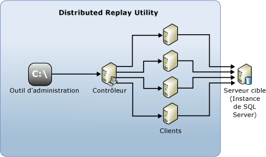

# SQL Server Distributed Replay
[!INCLUDE[appliesto-ss-xxxx-xxxx-xxx-md](../../includes/appliesto-ss-xxxx-xxxx-xxx-md.md)]
  La fonctionnalité [!INCLUDE[msCoName](../../includes/msconame-md.md)] [!INCLUDE[ssNoVersion](../../includes/ssnoversion-md.md)] Distributed Replay vous aide à évaluer l’impact de futures mises à niveau de [!INCLUDE[ssNoVersion](../../includes/ssnoversion-md.md)] . Vous pouvez également l’utiliser pour évaluer l’impact des mises à niveau du matériel et du système d’exploitation, ainsi que des paramétrages de [!INCLUDE[ssNoVersion](../../includes/ssnoversion-md.md)] .  
  
## Avantages de Distributed Replay  
 Comme avec le [!INCLUDE[ssSqlProfiler](../../includes/sssqlprofiler-md.md)], vous pouvez utiliser Distributed Replay pour relire une trace capturée sur un environnement de test mis à niveau. Contrairement au [!INCLUDE[ssSqlProfiler](../../includes/sssqlprofiler-md.md)], Distributed Replay n'est pas limité à la relecture de la charge de travail d'un seul ordinateur.  
  
 Distributed Replay offre une solution plus évolutive que le [!INCLUDE[ssSqlProfiler](../../includes/sssqlprofiler-md.md)]. Avec Distributed Replay, vous pouvez relire des charges de travail de plusieurs ordinateurs et mieux simuler une charge de travail critique.  
  
 La fonctionnalité [!INCLUDE[msCoName](../../includes/msconame-md.md)] [!INCLUDE[ssNoVersion](../../includes/ssnoversion-md.md)] Distributed Replay peut utiliser plusieurs ordinateurs pour relire les données de trace et simuler les charges de travail critiques. Utilisez Distributed Replay pour tester la compatibilité des applications, tester les performances ou planifier la capacité.  
  
## Quand utiliser Distributed Replay  
 [!INCLUDE[ssSqlProfiler](../../includes/sssqlprofiler-md.md)] et Distributed Replay se chevauchent quelque peu.  
  
 Vous pouvez utiliser le [!INCLUDE[ssSqlProfiler](../../includes/sssqlprofiler-md.md)] pour relire une trace capturée sur un environnement de test mis à niveau. Vous pouvez également analyser les résultats de la relecture pour rechercher d'éventuelles incompatibilités de fonctions et de performances. Toutefois, le [!INCLUDE[ssSqlProfiler](../../includes/sssqlprofiler-md.md)] ne peut relire une charge de travail qu’à partir d’un seul ordinateur. Lors de la relecture d’une application OLTP intensive ayant de nombreuses connexions simultanées actives ou un débit élevé, le [!INCLUDE[ssSqlProfiler](../../includes/sssqlprofiler-md.md)] peut devenir un goulot d’étranglement des ressources.  
  
 Distributed Replay offre une solution plus évolutive que le [!INCLUDE[ssSqlProfiler](../../includes/sssqlprofiler-md.md)]. Utilisez-le pour relire une charge de travail depuis plusieurs ordinateurs et mieux simuler des charges de travail critiques.  
  
 Le tableau suivant explique à quel moment utiliser chacun des outils.  
  
|Outil|Cas d'utilisation|  
|----------|---------------|  
|[!INCLUDE[ssSqlProfiler](../../includes/sssqlprofiler-md.md)]|Vous souhaitez utiliser le mécanisme de relecture classique sur un ordinateur unique. En particulier, vous avez besoin de fonctions de débogage ligne par ligne, telles que les commandes **Étape**, **Exécuter jusqu’au curseur**et **Basculer le point d’arrêt** .   Vous souhaitez relire une trace [!INCLUDE[ssASnoversion](../../includes/ssasnoversion-md.md)] .|  
|Distributed Replay|Vous souhaitez évaluer la compatibilité des applications. Par exemple, vous souhaitez tester des scénarios de mise à niveau de [!INCLUDE[ssNoVersion](../../includes/ssnoversion-md.md)] et du système d'exploitation, des mises à niveau du matériel ou des paramétrages d'index.   La simultanéité des accès de la trace capturée est si élevée qu'un seul client de relecture ne suffit pas à le simuler.|  
  
## Concepts de Distributed Replay  
 Les composants suivants constituent l'environnement de Distributed Replay :  
  
-   **Outil d’administration Distributed Replay**: une application console, **DReplay.exe**, utilisée pour communiquer avec le contrôleur de relecture distribuée. Utilisez l'outil d'administration pour contrôler la relecture distribuée.  
  
-   **Contrôleur Distributed Replay**: un ordinateur exécutant le service Windows nommé contrôleur Distributed Replay de [!INCLUDE[ssNoVersion](../../includes/ssnoversion-md.md)] . Le contrôleur Distributed Replay orchestre les actions des clients de relecture distribuée. Chaque environnement Distributed Replay ne doit contenir qu'une seule instance de contrôleur.  
  
-   **Clients Distributed Replay**: un ou plusieurs ordinateurs (physiques ou virtuels) qui exécutent le service Windows nommé client Distributed Replay de [!INCLUDE[ssNoVersion](../../includes/ssnoversion-md.md)] . Les clients Distributed Replay fonctionnent ensemble pour simuler des charges de travail sur une instance de [!INCLUDE[ssNoVersion](../../includes/ssnoversion-md.md)]. Chaque environnement Distributed Replay peut contenir un ou plusieurs clients.  
  
-   **Serveur cible**: une instance de [!INCLUDE[ssNoVersion](../../includes/ssnoversion-md.md)] que les clients Distributed Replay peuvent utiliser pour relire les données de trace. Nous conseillons de placer le serveur cible dans un environnement de test.  
  
 L'outil d'administration Distributed Replay, le contrôleur et le client peuvent être installés sur différents ordinateurs ou sur le même ordinateur. Il ne peut exister qu'une instance du contrôleur Distributed Replay ou du service client en cours d'exécution sur le même ordinateur.  
  
 L'illustration suivante montre l'architecture physique Distributed Replay de [!INCLUDE[ssNoVersion](../../includes/ssnoversion-md.md)] :  
  
   
  
## Tâches relatives à Distributed Replay  
  
|Description de la tâche|Rubrique|  
|----------------------|-----------|  
|Explique comment configurer Distributed Replay.|[Configurer Distributed Replay](../../tools/distributed-replay/configure-distributed-replay.md)|  
|Explique comment préparer les données de trace d'entrée.|[Préparer les données de trace d'entrée](../../tools/distributed-replay/prepare-the-input-trace-data.md)|  
|Explique comment relire les données de trace.|[Relire les données de trace](../../tools/distributed-replay/replay-trace-data.md)|  
|Décrit comment examiner les résultats des données de trace de Distributed Replay.|[Examiner les résultats de la relecture](../../tools/distributed-replay/review-the-replay-results.md)|  
|Décrit comment utiliser l’outil d’administration pour lancer, surveiller et annuler des opérations sur le contrôleur.|[Options de ligne de commande de l’outil d’administration &#40;Distributed Replay Utility&#41;](../../tools/distributed-replay/administration-tool-command-line-options-distributed-replay-utility.md)|  
  
##  Voir aussi  
 [Forum de SQL Server Distributed Replay](http://social.technet.microsoft.com/Forums/sl/sqldru/)   
 [Utilisation de Distributed Replay pour le test de charge de SQL Server – Partie 2](http://blogs.msdn.com/b/mspfe/archive/2012/11/14/using-distributed-replay-to-load-test-your-sql-server-part-2.aspx)   
 [Utilisation de Distributed Replay pour le test de charge de SQL Server – Partie 1](http://blogs.msdn.com/b/mspfe/archive/2012/11/08/using-distributed-replay-to-load-test-your-sql-server-part-1.aspx)  
  
  
