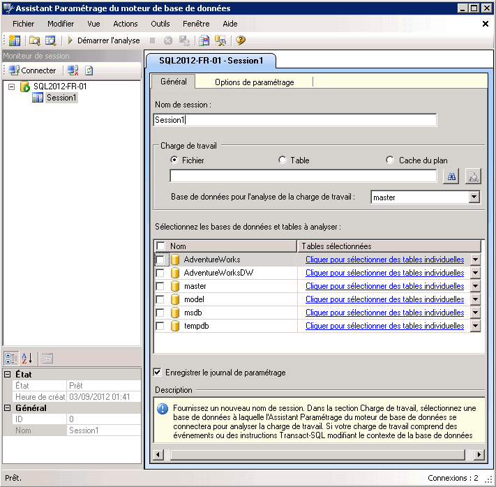

# Leçon 1-1 : Lancement de l’Assistant Paramétrage du moteur de base de données
[!INCLUDE[appliesto-ss-xxxx-xxxx-xxx-md](../../includes/appliesto-ss-xxxx-xxxx-xxx-md.md)]
Pour commencer, ouvrez l'interface utilisateur graphique de l'Assistant Paramétrage du moteur de base de données. Pour la première utilisation, un membre du rôle serveur fixe **sysadmin** doit lancer l’Assistant Paramétrage du moteur de base de données pour initialiser l’application. Après l’initialisation, les membres du rôle de base de données fixe **db_owner** peuvent utiliser l’Assistant Paramétrage du moteur de base de données pour paramétrer les bases de données dont ils sont propriétaires. Pour plus d’informations sur l’initialisation de l’Assistant Paramétrage du moteur de base de données, consultez [Démarrer et utiliser l’Assistant Paramétrage du moteur de base de données](../../relational-databases/performance/start-and-use-the-database-engine-tuning-advisor.md).  
  
### Ouverture de l'interface utilisateur graphique de l'Assistant Paramétrage du moteur de base de données  
  
1.  Dans le menu **Démarrer** de Windows, pointez sur **Tous les programmes**, sur [!INCLUDE[ssCurrentUI](../../includes/sscurrentui-md.md)], sur **Outils de performances**, puis cliquez sur **Assistant Paramétrage du moteur de base de données**.  
  
2.  Dans la boîte de dialogue **Se connecter à un serveur** , vérifiez les paramètres par défaut, puis cliquez sur **Se connecter**.  
  
Par défaut, l'Assistant Paramétrage du moteur de base de données s'ouvre avec la configuration représentée dans l'illustration suivante :  
  
  
  
> [!NOTE]  
> L’onglet et la zone **Nom de session** affichent le nom de votre ordinateur et de l’instance à laquelle vous êtes connecté. L'onglet et la zone affichent également la date et l'heure actuelles.  
  
Lorsque l'Assistant Paramétrage du moteur de base de données s'ouvre pour la première fois, deux volets principaux s'affichent.  
  
-   Le volet gauche contient le moniteur de session qui présente la liste de toutes les sessions de paramétrage réalisées sur cette instance de [!INCLUDE[msCoName](../../includes/msconame-md.md)] [!INCLUDE[ssNoVersion](../../includes/ssnoversion-md.md)] . Lorsque vous ouvrez l'Assistant Paramétrage du moteur de base de données, il affiche une nouvelle session en haut du volet. Vous pouvez attribuer un nom à cette session dans le volet voisin. Au départ, seule une session par défaut figure dans la liste. Il s'agit de la session par défaut que l'Assistant Paramétrage du moteur de base de données crée automatiquement pour vous. Une fois les bases de données paramétrées, toutes les sessions de paramétrage réalisées pour l'instance [!INCLUDE[ssNoVersion](../../includes/ssnoversion-md.md)] à laquelle vous êtes connecté sont indiquées sous la nouvelle session. Vous pouvez cliquer avec le bouton droit sur une session de paramétrage pour la renommer, la fermer, la supprimer ou la dupliquer. Si vous cliquez avec le bouton droit dans la liste, vous pouvez trier les sessions sur le nom, l'état, l'heure de création ou créer une nouvelle session. La section inférieure de ce volet présente des informations détaillées sur la session de paramétrage sélectionnée. Vous pouvez choisir d’afficher ces informations par catégorie en utilisant le bouton **Par catégorie** , ou vous pouvez les afficher par ordre alphabétique au moyen du bouton **Alphabétique** . Vous pouvez également masquer le moniteur de session en faisant glisser le bord du volet droit sur le côté gauche de la fenêtre. Pour le faire réapparaître, faites glisser le bord du volet vers la droite. Le moniteur de session permet d'afficher les sessions de paramétrage précédentes ou de les utiliser pour créer de nouvelles sessions avec des définitions similaires. Vous pouvez également utiliser le moniteur de session pour étudier les recommandations de paramétrage. Pour plus d’informations, consultez [Afficher et utiliser la sortie de l’Assistant Paramétrage du moteur de base de données](../../relational-databases/performance/view-and-work-with-the-output-from-the-database-engine-tuning-advisor.md). Utilisez le bouton **Précédent** de votre navigateur pour revenir au didacticiel.  
  
-   Le volet droit contient les onglets **Général** et **Options de paramétrage** . Ces onglets permettent de définir votre session de paramétrage du moteur de base de données. Sous l’onglet **Général** , vous pouvez taper le nom de votre session de paramétrage, spécifier le fichier de charge de travail ou la table à utiliser, et sélectionner les bases de données et les tables à paramétrer au cours de cette session. Une charge de travail est un ensemble d'instructions [!INCLUDE[tsql](../../includes/tsql-md.md)] qui s'exécute sur une ou plusieurs bases de données que vous souhaitez paramétrer. L'Assistant Paramétrage du moteur de base de données utilise des fichiers de trace et des tables de trace, des scripts [!INCLUDE[tsql](../../includes/tsql-md.md)] ou des fichiers XML comme entrée de charge de travail pour le paramétrage des bases de données. Sous l’onglet **Options de paramétrage** , vous pouvez sélectionner les structures de création de base de données physiques (index ou vues indexées) et la stratégie de partitionnement que l’Assistant Paramétrage du moteur de base de données doit prendre en compte au cours de son analyse. Dans cet onglet, vous pouvez également spécifier la durée maximale pendant laquelle l'Assistant Paramétrage du moteur de base de données paramètre une charge de travail. La durée par défaut est d'une heure.  
  
> [!NOTE]  
> L’Assistant Paramétrage du moteur de base de données peut accepter les fichiers XML comme entrée quand un script [!INCLUDE[tsql](../../includes/tsql-md.md)] est importé à partir de l’Éditeur de requête [!INCLUDE[msCoName](../../includes/msconame-md.md)][!INCLUDE[ssManStudioFull](../../includes/ssmanstudiofull-md.md)] . Pour plus d’informations, consultez la section sur le lancement de l’Assistant Paramétrage du moteur de base de données à partir de l’Éditeur de requête [!INCLUDE[ssManStudioFull](../../includes/ssmanstudiofull-md.md)] dans [Démarrer et utiliser l’Assistant Paramétrage du moteur de base de données](../../relational-databases/performance/start-and-use-the-database-engine-tuning-advisor.md).  
  
## Tâche suivante de la leçon  
[Définition des options du menu Outils et de la disposition](../../tools/dta/lesson-1-2-setting-tool-options-and-layout.md)  
  
  
  
