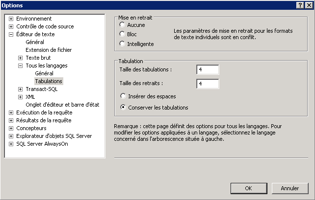

# Ajout d&#39;une mise en retrait
L'Éditeur de requête vous permet de mettre en retrait de grandes sections de code en une seule étape et de modifier la longueur de mise en retrait.  
  
## Mise en retrait du code  
  
#### Pour mettre en retrait plusieurs lignes de code  
  
1.  Dans la barre d'outils, cliquez sur **Nouvelle requête**.  
  
2.  Créez une deuxième requête qui sélectionne les colonnes **BusinessEntityID**, FirstName, **MiddleName**, et **LastName** dans la table **Person** du schéma **Person** . Placez chaque colonne sur une ligne distincte afin que le code ressemble à ce qui suit :  
  
    ```  
    -- Search for a contact  
    SELECT   
    BusinessEntityID,  
    FirstName,   
    MiddleName,   
    LastName  
    FROM Person.Person  
    WHERE LastName = 'Sanchez';  
    GO  
    ```  
  
3.  Sélectionnez tout le texte de `BusinessEntityID` à `LastName`.  
  
4.  Dans la barre d'outils **Éditeur SQL** , cliquez sur **Augmenter le retrait** pour mettre en retrait toutes les lignes en même temps.  
  
#### Pour modifier la mise en retrait par défaut  
  
1.  Dans le menu **Outils** , cliquez sur **Options**.  
  
2.  Développez **Éditeur de texte**, développez **Tous les langages**, cliquez sur **Tabulations** et définissez les valeurs de mise en retrait qui conviennent. Notez que vous pouvez modifier la valeur des mises en retrait ainsi que celle des tabulations. Vous pouvez également convertir ou non les tabulations en espaces.  
  
      
  
3.  Cliquez sur **OK**.  
  
## Tâche suivante de la leçon  
[Agrandissement de l'Éditeur de requête](../../tools/sql-server-management-studio/maximizing-query-editor.md)  
  
  
  
