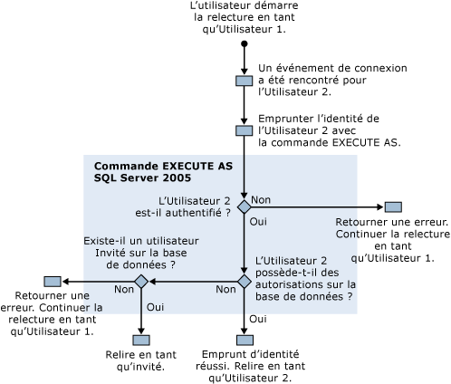

# Autorisations nécessaires pour exécuter SQL Server Profiler
[!INCLUDE[appliesto-ss-xxxx-xxxx-xxx-md](../../includes/appliesto-ss-xxxx-xxxx-xxx-md.md)]
  Par défaut, l'exécution du [!INCLUDE[ssSqlProfiler](../../includes/sssqlprofiler-md.md)] exige les mêmes autorisations utilisateur que les procédures stockées Transact-SQL utilisées pour créer des traces. Pour exécuter le [!INCLUDE[ssSqlProfiler](../../includes/sssqlprofiler-md.md)], les utilisateurs doivent disposer de l'autorisation ALTER TRACE. Pour plus d’informations, consultez [Autorisations de serveur GRANT &#40;Transact-SQL&#41;](../../t-sql/statements/grant-server-permissions-transact-sql.md).  
  
> [!IMPORTANT]  
>  Les utilisateurs qui disposent des autorisations SHOWPLAN, ALTER TRACE ou VIEW SERVER STATE peuvent afficher les requêtes capturées dans une sortie Showplan. Ces requêtes peuvent contenir des informations critiques telles que les mots de passe. C'est pourquoi, il est recommandé de n'accorder ces autorisations qu'aux utilisateurs qui sont autorisés à afficher les informations critiques, tels que les membres du rôle de base de données fixe db_owner ou les membres du rôle serveur fixe sysadmin. Il est également recommandé d'enregistrer les fichiers Showplan ou de trace qui contiennent des événements Showplan uniquement sur un emplacement qui utilise le système de fichiers NTFS et que vous limitiez l'accès aux utilisateurs qui sont autorisés à afficher les informations critiques.  
  
## Autorisations utilisées pour relire des traces  
 La relecture de traces exige également que l'utilisateur qui effectue cette opération dispose de l'autorisation ALTER TRACE.  
  
 Cependant, lors de la relecture, [!INCLUDE[ssSqlProfiler](../../includes/sssqlprofiler-md.md)] utilise la commande EXECUTE AS si un événement Audit Login est rencontré dans la trace en cours de relecture. [!INCLUDE[ssSqlProfiler](../../includes/sssqlprofiler-md.md)] utilise la commande EXECUTE AS pour emprunter l’identité de l’utilisateur associé à l’événement de connexion.  
  
 Si [!INCLUDE[ssSqlProfiler](../../includes/sssqlprofiler-md.md)] rencontre un événement de connexion dans la trace en cours de relecture, les contrôles des autorisations suivants sont effectués :  
  
1.  Utilisateur1, qui dispose de l'autorisation ALTER TRACE, lance la relecture d'une trace.  
  
2.  Un événement de connexion pour Utilisateur2 est rencontré dans la trace relue.  
  
3.  [!INCLUDE[ssSqlProfiler](../../includes/sssqlprofiler-md.md)] utilise la commande EXECUTE AS pour emprunter l’identité de l’Utilisateur2.  
  
4.  [!INCLUDE[ssNoVersion](../../includes/ssnoversion-md.md)] tente d’authentifier l’Utilisateur2, et selon les résultats, une des actions suivantes se produit :  
  
    1.  Si l'Utilisateur2 ne peut pas être authentifié, le [!INCLUDE[ssSqlProfiler](../../includes/sssqlprofiler-md.md)] retourne une erreur et poursuit la relecture de la trace en tant qu'Utilisateur1.  
  
    2.  Si l'Utilisateur2 est correctement authentifié, la relecture de la trace en tant qu'Utilisateur2 se poursuit.  
  
5.  Les autorisations de l'Utilisateur2 sont vérifiées sur la base de données cible et selon les résultats, une des actions suivantes se produit :  
  
    1.  Si l'Utilisateur2 dispose d'autorisations sur la base de données cible, l'emprunt d'identité a réussi et la trace est relue en tant qu'Utilisateur2.  
  
    2.  Si l'Utilisateur2 ne dispose pas d'autorisations sur la base de données cible, le serveur recherche un utilisateur Invité sur cette base de données.  
  
6.  Une vérification de l'existence d'un utilisateur Invité s'effectue sur la base de données et selon les résultats, une des actions suivantes se produit :  
  
    1.  S'il existe un compte Invité, la trace est relue en tant que compte Invité.  
  
    2.  Si aucun compte Invité n'existe sur la base de données cible, une erreur est retournée et la trace est relue en tant qu'Utilisateur1.  
  
 Le schéma suivant illustre ce processus de vérification de l'autorisation lors de la relecture de traces :  
  
   
  
##  Voir aussi  
 [Procédures stockées de SQL Server Profiler &#40;Transact-SQL&#41;](../../relational-databases/system-stored-procedures/sql-server-profiler-stored-procedures-transact-sql.md)   
 [Relire des traces](../../tools/sql-server-profiler/replay-traces.md)   
 [Créer une trace &#40;SQL Server Profiler&#41;](../../tools/sql-server-profiler/create-a-trace-sql-server-profiler.md)   
 [Relire une table de trace &#40;SQL Server Profiler&#41;](../../tools/sql-server-profiler/replay-a-trace-table-sql-server-profiler.md)   
 [Relire un fichier de trace &#40;SQL Server Profiler&#41;](../../tools/sql-server-profiler/replay-a-trace-file-sql-server-profiler.md)  
  
  
